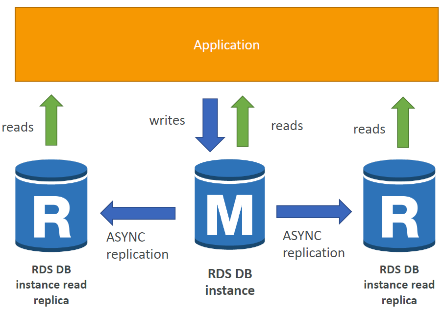
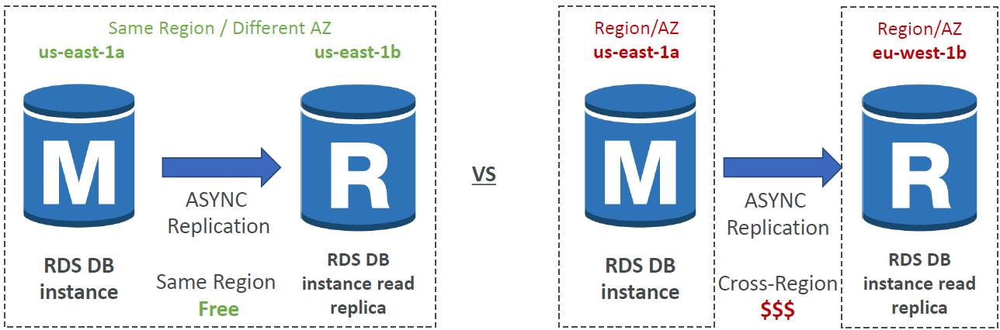
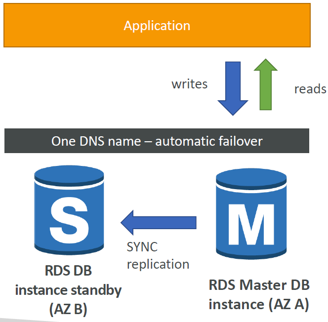
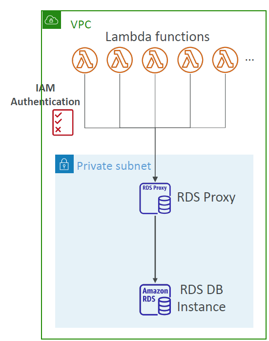
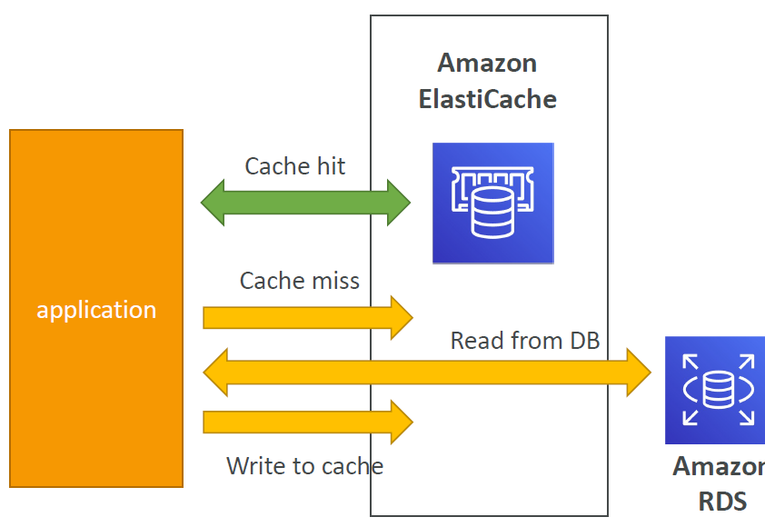
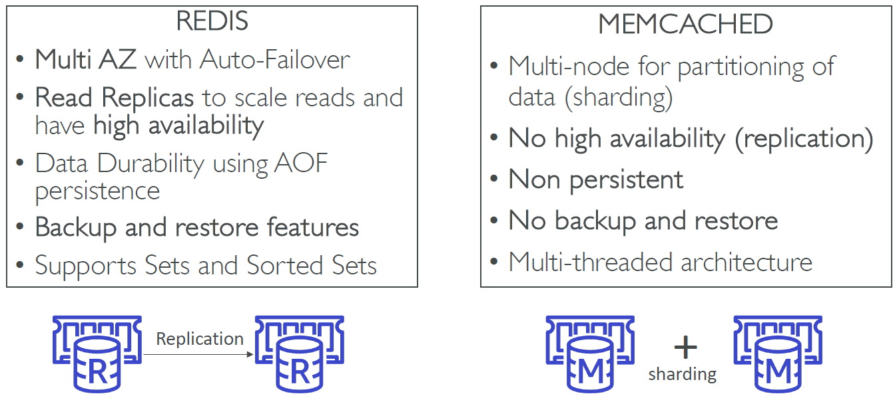

<!-- START doctoc generated TOC please keep comment here to allow auto update -->
<!-- DON'T EDIT THIS SECTION, INSTEAD RE-RUN doctoc TO UPDATE -->
**Table of Contents**

<!-- END doctoc generated TOC please keep comment here to allow auto update -->

## RDS + Aurora + Elasticache

### RDS
* RDS = Relational Database Service
* Is a managed DB service for Databases that use SQL as a query language.
* It allows you to create databases in the cloud that are managed by AWS
    - Postgres
    - MySQL
    - MariaDB
    - Oracle
    - Microsoft SQL Server
    - IBM DB2
    - Aurora (AWS Proprietary database)

### Advantage over using RDS versus deploying DB on EC2
* RDS is a managed service:
    - Automated provisioning, OS patching
    - Continuous backups and restore to specific timestamp (Point in Time Restore)!
    - Monitoring dashboards
    - Read replicas for improved read performance
    - Multi AZ setup for DR (Disaster Recovery)
    - Maintenance windows for upgrades
    - Scaling capability (vertical and horizontal)
    - Storage backed by EBS
* BUT you can’t SSH into your instances

### RDS – Storage Auto Scaling
* Helps you increase storage on your RDS DB instance dynamically
* When RDS detects you are running out of free database storage, it scales automatically
* Avoid manually scaling your database storage
* You have to set Maximum Storage Threshold (maximum limit for DB storage)
* Automatically modify storage if:
    - Free storage is less than 10% of allocated storage
    - Low-storage lasts at least 5 minutes
    - 6 hours have passed since last modification


* Useful for applications with unpredictable workloads
* Supports all RDS database engines

### RDS Read Replicas for read scalability
* Up to 15 Read Replicas --> helps to scale reads from DB
* Within AZ, Cross AZ or Cross Region
* Replication is ASYNC, so reads are eventually consistent
* Replicas can be promoted to their own DB (can become DBs on their own)
* If the primary database fails, read replicas cannot automatically become the primary database (though they can be promoted manually).
* Applications must update the connection string to leverage read replicas, read replicas add new endpoints with their own DNS name --> We need to change our application to reference them individually to balance the read load.



#### RDS Read Replicas – Use Cases
* You have a production database that is taking on normal load
* You want to run a reporting application to run some analytics
* You create a Read Replica to run the new workload there
* The production application is unaffected
* Read replicas are used for SELECT (=read) only kind of statements (not INSERT, UPDATE, DELETE)


#### RDS Read Replicas – Network Cost
* In AWS there’s a network cost when data goes from one AZ to another
* For RDS Read Replicas within the same region, you don’t pay that fee



### RDS Multi AZ (Disaster Recovery)
* SYNC replication
* One DNS name – automatic app failover to standby. Multi-AZ keeps the same connection string regardless of which database is up.
* Increase availability
* Failover in case of loss of AZ, loss of network, instance or storage failure
* No manual intervention in apps
* Not used for scaling
* The standby replica is a hot standby (not readable), and replication is synchronous.
* If the primary instance fails, the standby is automatically promoted to primary.
*  For critical transactional databases where availability is crucial, a Multi-AZ setup ensures automatic failover to minimize downtime.
* Note: The Read Replicas be setup as Multi AZ for Disaster Recovery (DR)



### Differences Read Replicas vs. Multi-AZ
  
It is possible to set up both:
* Set up Multi-AZ for high availability and disaster recovery.
* Add Read Replicas to scale read workloads.

### RDS – From Single-AZ to Multi-AZ
* Zero downtime operation (no need to stop the DB)
* Just click on “modify” for the database
* The following happens internally:
    - A snapshot is taken
    - A new DB is restored from the snapshot in a new AZ
    - Synchronization is established between the two databases


### Aurora
* Aurora is a proprietary technology from AWS (not open sourced)
* Postgres and MySQL are both supported as Aurora DB (that means your drivers will work as if Aurora was a Postgres or MySQL database)
* Aurora is “AWS cloud optimized” and claims 5x performance improvement over MySQL on RDS, over 3x the performance of Postgres on RDS
* Aurora storage automatically grows in increments of 10GB, up to 128 TB.
* Aurora can have up to 15 replicas and the replication process is faster than MySQL (sub 10 ms replica lag)
* Failover in Aurora is instantaneous. It’s HA (High Availability) native.
* Aurora costs more than RDS (20% more) – but is more efficient.

#### Aurora High Availability and Read Scaling
* 6 copies of your data across 3 AZ:
    - 4 copies out of 6 needed for writes
    - 3 copies out of 6 need for reads
    - Self healing with peer-to-peer replication
    - Storage is striped across 100s of volumes
* One Aurora Instance takes writes (master)
* Automated failover for master in less than 30 seconds
* Master + up to 15 Aurora Read Replicas serve reads
* Support for Cross Region Replication


#### Features of Aurora
* Automatic fail-over
* Backup and Recovery
* Isolation and security
* Industry compliance
* Push-button scaling
* Automated Patching with Zero Downtime
* Advanced Monitoring
* Routine Maintenance
* Backtrack: restore data at any point of time without using backups

### RDS & Aurora Security
* At-rest encryption:
    - Database master & replicas encryption using AWS KMS – must be defined at launch time
    - If the master is not encrypted, the read replicas cannot be encrypted
    - To encrypt an un-encrypted database, go through a DB snapshot & restore as encrypted
* In-flight encryption: TLS-ready by default, use the AWS TLS root certificates client-side
* IAM Authentication: IAM roles to connect to your database (instead of username/pw)
* Security Groups: Control Network access to your RDS / Aurora DB
* No SSH available except on RDS Custom
* Audit Logs can be enabled and sent to CloudWatch Logs for longer retention

### Amazon RDS Proxy
* Fully managed database proxy for RDS
* Allows apps to pool and share DB connections established with the database
* Improving database efficiency by reducing the stress on database resources (e.g., CPU, RAM) and minimize open connections (and timeouts)
* Serverless, autoscaling, highly available (multi-AZ)
* Reduced RDS & Aurora failover time by up 66%
* Supports RDS (MySQL, PostgreSQL, MariaDB, MS SQL Server) and Aurora (MySQL, PostgreSQL)
* No code changes required for most apps
* Enforce IAM Authentication for DB, and securely store credentials in AWS Secrets Manager
* RDS Proxy is never publicly accessible (must be accessed from VPC)



### Amazon ElastiCache Overview
* The same way RDS is to get managed Relational Databases…
* ElastiCache is to get managed Redis or Memcached
* Caches are in-memory databases with really high performance, low
  latency
* Helps reduce load off of databases for read intensive workloads
* Helps make your application stateless
* AWS takes care of OS maintenance / patching, optimizations, setup, configuration, monitoring, failure recovery and backups
* Using ElastiCache involves heavy application code changes

#### ElastiCache Solution Architecture - DB Cache
* Applications queries ElastiCache, if not available, get from RDS
  and store in ElastiCache.
* Helps relieve load in RDS
* Cache must have an invalidation strategy to make sure only the most current data is used in there.



#### ElastiCache Solution Architecture – User Session Store
* User logs into any of the application
* The application writes the session data into ElastiCache
* The user hits another instance of our application
* The instance retrieves the data and the user is already logged in
* Storing Session Data in ElastiCache is a common pattern to ensuring different EC2 instances can retrieve your user's state if needed.


#### ElastiCache – Redis vs Memcached



#### Caching Implementation Considerations
* Read more at: https://aws.amazon.com/caching/implementationconsiderations/
* Is it safe to cache data? Data may be out of date, eventually consistent
* Is caching effective for that data?
    - Pattern: data changing slowly, few keys are frequently needed
    - Anti patterns: data changing rapidly, all large key space frequently needed
* Is data structured well for caching?
    - example: key value caching, or caching of aggregations results
* The maximum number of Read Replicas you can add in an ElastiCache Redis Cluster with Cluster-Mode Disabled is 5.

#### 1st strategy: Lazy Loading / Cache-Aside / Lazy Population
* Pros
    - Only requested data is cached (the cache isn’t filled up with unused data)
    - Node failures are not fatal (just increased latency to warm the cache)
* Cons
    - Cache miss penalty that results in 3 round trips, noticeable delay for that request
    - Stale data: data can be updated in the database and outdated in the cache


Python pseudocode:
```Python
def get_user(user_id):
  # check cache
  record = cache.get(user_id)

  if record is None:
    # run a db query
    record = db.query("select * from users where id = ?", user_id)
    # Populate the cache
    cache.set(user_id, record)
    return record
  else:
    return record

# app code
user = get_user(17)
```

#### 2nd strategy: Write Through – Add or Update cache when database is updated
* Pros:
    - Data in cache is never stale, reads are quick
    - Write penalty vs Read penalty (each write requires 2 calls) (user expects writing to take longer than reading)
* Cons:
    - Missing Data until it is added / updated in the DB. Mitigation is to implement Lazy Loading strategy as well
    - Cache churn – a lot of the data will never be read


Python pseudocode:
```Python
def save_user(user_id, values):
    # save to db
    record = db.query("update users ... where id = ?", user_id, values)

    # push into cache
    cache.set(user_id, record)
    
    return record

# app code
user = save_user(17, {"name": "Nate Dogg"})
```

#### Cache Evictions and Time-to-live (TTL)
* Cache eviction can occur in three ways:
    - You delete the item explicitly in the cache
    - Item is evicted because the memory is full and it’s not recently used (LRU)
    - You set an item time-to-live (or TTL)
* TTL are helpful for any kind of data:
    - Leaderboards
    - Comments
    - Activity streams
* TTL can range from few seconds to hours or days
* If too many evictions happen due to memory, you should scale up or out --> making cache bigger

### Final words of wisdom
* Lazy Loading / Cache aside is easy to implement and works for many situations as a foundation, especially on the read side
* Write-through is usually combined with Lazy Loading as targeted for the queries or workloads that benefit from this optimization
* Setting a TTL is usually not a bad idea, except when you’re using Write Through. Set it to a sensible value for your application
* Only cache the data that makes sense (user profiles, blogs, etc…)
* Quote: There are only two hard things in Computer Science: cache invalidation and naming things

### Amazon MemoryDB for Redis
* Redis-compatible, durable, in-memory database service
* Ultra-fast performance with over 160 million requests/second
* Durable in-memory data storage with Multi-AZ transactional log
* Scale seamlessly from 10s GBs to 100s TBs of storage
* Use cases: web and mobile apps, online gaming, media streaming, …

