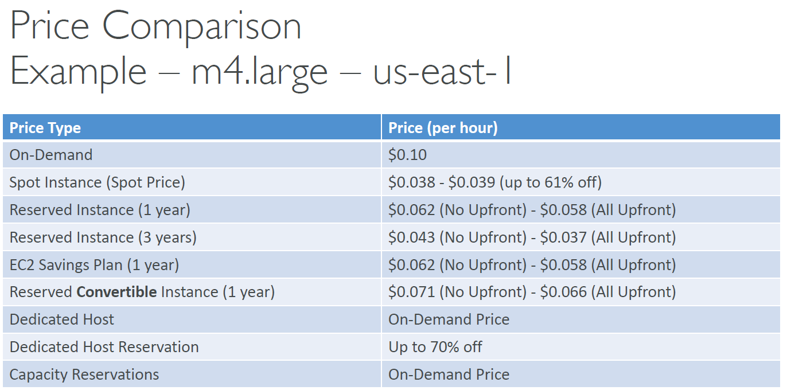

<!-- START doctoc generated TOC please keep comment here to allow auto update -->
<!-- DON'T EDIT THIS SECTION, INSTEAD RE-RUN doctoc TO UPDATE -->
**Table of Contents**

- [EC2](#ec2)
  - [Sizing & configuration options](#sizing--configuration-options)
  - [User Data](#user-data)
  - [Instance Types](#instance-types)
  - [EC2 Instances Purchasing Options](#ec2-instances-purchasing-options)
  - [Which purchasing option is right for me?](#which-purchasing-option-is-right-for-me)

<!-- END doctoc generated TOC please keep comment here to allow auto update -->

## EC2
* EC2 is one of the most popular of AWS' offering
* EC2 = Elastic Compute Cloud = Infrastructure as a Service
* It mainly consists in the capability of :
    - Renting virtual machines (EC2)
    - Storing data on virtual drives (EBS)
    - Distributing load across machines (ELB)
    - Scaling the services using an auto-scaling group (ASG)

### Sizing & configuration options
* Operating System (OS): Linux, Windows or Mac OS
* An AMI is a template that contains the software configuration (operating system, application server, and applications) required to launch your instance.
* How much compute power & cores (CPU)
* How much random-access memory (RAM)
* How much storage space:
    - Network-attached (EBS & EFS)
    - Hardware (EC2 Instance Store)
* Network card: speed of the card, Public IP address
* Firewall rules: security group
* Bootstrap script (configure at first launch): EC2 User Data (EC2 User Data is used to bootstrap your EC2 instances using a bash script. This script can contain commands such as installing software/packages, download files from the Internet, or anything you want.)

### User Data
* It is possible to bootstrap our instances using an EC2 User data script.
* Bootstrapping means launching commands when a machine starts
* That script is only run once at the instance first start
* EC2 user data is used to automate boot tasks such as:
    - Installing updates
    - Installing software
    - Downloading common files from the internet
    - Anything you can think of
      • The EC2 User Data Script runs with the root user

### Instance Types
* naming convention: `m5.2xlarge`
    - `m`: instance class
    - `5`: generation
    - `2xlarge`: size within the instance class
* Example:
  
* **General Purpose (`T`)**: Great for a diversity of workloads such as web servers or code repositories. Balance between:
    - Compute
    - Memory
    - Networking
* **Compute Optimized (`C`)**: Great for compute-intensive tasks that require high performance processors:
    - Batch processing workloads
    - Media transcoding
    - High performance web servers
    - High performance computing (HPC)
    - Scientific modeling & machine learning
    - Dedicated gaming servers
* **Memory Optimized (`R`, `X1`, `z1`)**: Fast performance for workloads that process large data sets in memory:
    - High performance, relational/non-relational databases
    - Distributed web scale cache stores
    - In-memory databases optimized for BI (business intelligence)
    - Applications performing real-time processing of big unstructured data
* **Storage Optimized (`I3`, `D`, `H`)**: Great for storage-intensive tasks that require high, sequential read and write access to large data sets on local storage:
    - High frequency online transaction processing (OLTP) systems
    - Relational & NoSQL databases
    - Cache for in-memory databases (for example, Redis)
    - Data warehousing applications
    - Distributed file systems

### EC2 Instances Purchasing Options
* On-Demand Instances – short workload, predictable pricing, pay by second
* Reserved (1 & 3 years)
    - Reserved Instances – long workloads
    - Convertible Reserved Instances – long workloads with flexible instances
* Savings Plans (1 & 3 years) –commitment to an amount of usage, long workload
* Spot Instances – short workloads, cheap, can lose instances (less reliable)
* Dedicated Hosts – book an entire physical server, control instance placement
* Dedicated Instances – no other customers will share your hardware
* Capacity Reservations – reserve capacity in a specific AZ for any duration

#### EC2 on Demand
* Pay for what you use:
    - Linux or Windows - billing per second, after the first minute
    - All other operating systems - billing per hour
* Has the highest cost but no upfront payment
* No long-term commitment
* Recommended for short-term and un-interrupted workloads, where
  you can't predict how the application will behave

#### EC2 Reserved Instances
* Up to 72% discount compared to On-demand
* You reserve a specific instance attributes (Instance Type, Region, Tenancy, OS)
* Reservation Period – 1 year (+discount) or 3 years (+++discount) (nothing in between)
* Payment Options – No Upfront (+), Partial Upfront (++), All Upfront (+++)
* Reserved Instance’s Scope – Regional or Zonal (reserve capacity in an AZ)
* Recommended for steady-state usage applications (think database)
* You can buy and sell in the Reserved Instance Marketplace (e.g. if you don't it any more)
* Convertible Reserved Instance (specific type of reserved instance)
    - Can change the EC2 instance type, instance family, OS, scope and tenancy
    - Up to 66% discount

#### EC2 Savings Plans
* Get a discount based on long-term usage (up to 72% - same as RIs)
* Commit to a certain type of usage ($10/hour for 1 or 3 years)
* Usage beyond EC2 Savings Plans is billed at the On-Demand price
* Locked to a specific instance family & AWS region (e.g., M5 in us-east-1)
* Flexible across:
    - Instance Size (e.g., m5.xlarge, m5.2xlarge)
    - OS (e.g., Linux, Windows)
    - Tenancy (Host, Dedicated, Default)

#### EC2 Spot Instances
* Can get a discount of up to 90% compared to On-demand
* Instances that you can “lose” at any point of time if your max price is less than the
  current spot price
* The MOST cost-efficient instances in AWS
* Useful for workloads that are resilient to failure
    - Batch jobs
    - Data analysis
    - Image processing
    - Any distributed workloads
    - Workloads with a flexible start and end time
* Not suitable for critical jobs or databases

#### EC2 Dedicated Hosts
* A physical server with EC2 instance capacity fully dedicated to your use
* Allows you address compliance requirements and use your existing serverbound software licenses (per-socket, per-core, per-VM software licenses)
* Purchasing Options:
    - On-demand – pay per second for active Dedicated Host
    - Reserved - 1 or 3 years (No Upfront, Partial Upfront, All Upfront)
* The most expensive option
* Useful for software that have complicated licensing model (BYOL – Bring Your Own License)
* Or for companies that have strong regulatory or compliance needs

#### EC2 Dedicated Instances
* Instances run on hardware that’s dedicated to you
* May share hardware with other instances in same account
* No control over instance placement (can move hardware after Stop / Start)

#### EC2 Capacity Reservations
* Reserve On-Demand instances capacity in a specific AZ for any
  duration
* You always have access to EC2 capacity when you need it
* No time commitment (create/cancel anytime), no billing discounts
* Combine with Regional Reserved Instances and Savings Plans to benefit
  from billing discounts
* You’re charged at On-Demand rate whether you run instances or not
* Suitable for short-term, uninterrupted workloads that needs to be in a
  specific AZ

### Which purchasing option is right for me?
* On demand: coming and staying in resort whenever we like, we pay the full price
* Reserved: like planning ahead and if we plan to stay for a long time, we may get a good discount.
* Savings Plans: pay a certain amount per hour for certain period and stay in any room type (e.g. King, Suite, Sea View, …)
* Spot instances: the hotel allows people to bid for the empty rooms and the highest bidder keeps the rooms. You can get kicked out at any time
* Dedicated Hosts: We book an entire building of the resort
* Capacity Reservations: you book a room for a period with full price even you don’t stay in it

