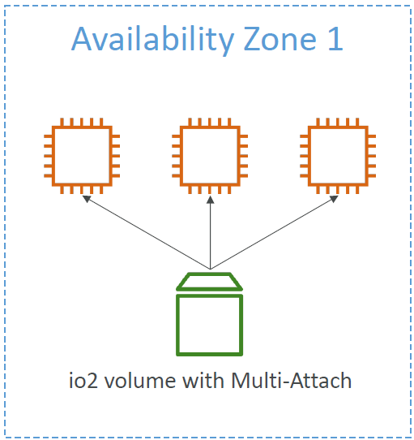

<!-- START doctoc generated TOC please keep comment here to allow auto update -->
<!-- DON'T EDIT THIS SECTION, INSTEAD RE-RUN doctoc TO UPDATE -->
**Table of Contents**

- [Security groups](#security-groups)
  - [Security groups on EC2 instances](#security-groups-on-ec2-instances)
  - [Classic ports to know](#classic-ports-to-know)
  - [How to connect to our servers?](#how-to-connect-to-our-servers)
    - [SSH for Windows](#ssh-for-windows)
    - [SSH for Linux/Mac](#ssh-for-linuxmac)
  - [EC2 Instance Connect](#ec2-instance-connect)
  - [EC2 Instance Storage](#ec2-instance-storage)
    - [EBS Volume](#ebs-volume)
    - [EBS Snapshots](#ebs-snapshots)
    - [AMI (Amazon Machine Image)](#ami-amazon-machine-image)
    - [AMI Process (from an EC2 instance)](#ami-process-from-an-ec2-instance)
    - [EC2 Instance Store](#ec2-instance-store)
    - [EBS Volume Types](#ebs-volume-types)
    - [EBS Volume Types Use cases:](#ebs-volume-types-use-cases)
      - [- General Purpose SSD](#--general-purpose-ssd)
      - [- Provisioned IOPS (PIOPS) SSD](#--provisioned-iops-piops-ssd)
      - [- Hard Disk Drives (HDD)](#--hard-disk-drives-hdd)
    - [EBS Volume Types Summary](#ebs-volume-types-summary)
    - [EBS Multi-Attach – io1/io2 family](#ebs-multi-attach--io1io2-family)
    - [Amazon EFS – Elastic File System](#amazon-efs--elastic-file-system)
    - [EFS – Performance & Storage Classes](#efs--performance--storage-classes)
    - [EFS – Storage Classes](#efs--storage-classes)
    - [EBS vs. EFS](#ebs-vs-efs)

<!-- END doctoc generated TOC please keep comment here to allow auto update -->

## Security groups
* Security Groups are the fundamental of network security in AWS.
* They control how traffic is allowed into or out of our EC2 Instances.
* Security groups only contain **allow** rules.
* Security groups rules can reference by IP or by security group.
* Can be attached to multiple instances.  
  Also, one instance can have multiple security groups.
* Locked down to a region / VPC combination (Security Groups can be attached to multiple EC2 instances within the same AWS Region/VPC.)
* Does live “outside” the EC2 – if traffic is blocked, the EC2 instance won’t see it.
* It’s good to maintain one separate security group for SSH access.
* If your application is not accessible (time out), then it’s a security group issue.
* If your application gives a “connection refused“ error, then it’s an application error or it’s not launched.
* All inbound traffic is blocked by default.
* All outbound traffic is authorised by default.

### Security groups on EC2 instances TEST3
* Security groups are acting as a “firewall” on EC2 instances
* They regulate:
    - Access to Ports
    - Authorised IP ranges – IPv4 and IPv6
    - Control of inbound network (from other to the instance)
    - Control of outbound network (from the instance to other)
* Whenever there is a timeout, it is because of an EC2 security group. It might also be a firewall issue --> use "EC2 Instance Connect" in such a case.
* An EC2 instance can have many security groups attached to it.

### Classic ports to know
* 22 = SSH (Secure Shell) - log into a Linux instance
* 21 = FTP (File Transfer Protocol) – upload files into a file share
* 22 = SFTP (Secure File Transfer Protocol) – upload files using SSH
* 80 = HTTP – access unsecured websites
* 443 = HTTPS – access secured websites
* 3389 = RDP (Remote Desktop Protocol) – log into a Windows instance

### How to connect to our servers?
* **SSH** (Secure Shell): CLI that can be used on Mac, Linux and Windows >= 10. SSH allows you to control a remote machine with the CLI.
* **PuTTY**: Valid for any version of Windows, allows to use SSH protocol
* **EC2** Instance Connect: Webbrowser to connect to EC2 instance

#### SSH for Windows
PowerShell: cd into directory where key (`AndreasKeys.pem`) is located, then:  `ssh -i <key>@<public-ip-address-of-ec2-instance>` (e.g. `ssh -i AndreasKeys.pem ec2-user@18.192.116.89`)

#### SSH for Linux/Mac

### EC2 Instance Connect
* Browser-based session into EC2 instance. Check EC2 instance and click 2x `Connect`.
* No need to use your key file that was downloaded. The “magic” is that a temporary key is uploaded onto EC2 by AWS.
* Never enter "AWS Access Key ID" and/or "AWS Secret Access Key" into EC2 Instance Connect --> Anyone could use who logs into this instance!
* Attach IAM Role to EC2 Instance Connect: `Actions` --> `Security` --> `Modify IAM Role`

### EC2 Instance Storage

#### EBS Volume
* An EBS (Elastic Block Store) Volume is a network drive (i.e. not a physical drive) you can attach to your instances while they run
    - It uses the network to communicate to the instance, which means there might be a bit of latency
    - It can be detached from an EC2 instance and attached to another one quickly
* It allows your instances to persist data, even after their termination
* They can only be mounted to one instance at a time (at the CCP level). But there can be several EBS Volumes attached to an instance.
  
* They can be unattached.
* They are bound to a specific availability zone (AZ)
    - An EBS Volume in `us-east-1a` cannot be attached to `us-east-1b`
    - To move a volume across, you first need to snapshot it
* They have a provisioned capacity (size in GBs, and IOPS)
    - You get billed for all the provisioned capacity
    - You can increase the capacity of the drive over time
* Analogy: Think of them as a “network USB stick” (attached through the network)
* Free tier: 30 GB of free EBS storage of type General Purpose (SSD) or Magnetic per month
* Delete on Termination attribute
  
    - Controls the EBS behaviour when an EC2 instance terminates
        - By default, the root EBS volume is deleted (attribute enabled)
        - By default, any other attached EBS volume is not deleted (attribute disabled)
    - This can be controlled by the AWS console / AWS CLI
    - Use case: preserve root volume when instance is terminated

#### EBS Snapshots
* Make a backup (snapshot) of your EBS volume at a point in time
* Not necessary to detach volume to do snapshot, but recommended
* Can copy snapshots across AZ or Region  
  
* EBS Snapshot Archive
    - Move a Snapshot to an ”archive tier” that is
      75% cheaper
    - Takes within 24 to 72 hours for restoring the
      archive
* Recycle Bin for EBS Snapshots
    - Setup rules to retain deleted snapshots so you
      can recover them after an accidental deletion
    - Specify retention (from 1 day to 1 year)
* Fast Snapshot Restore (FSR)
    - Force full initialization of snapshot to have no
      latency on the first use ($$$)
* Possible to (re)create a volume from snapshot

#### AMI (Amazon Machine Image)
* AMI are a customization of an EC2 instance
    - You add your own software, configuration, operating system, monitoring…
    - Faster boot / configuration time because all your software is pre-packaged
* AMI are built for a specific region (and can be copied across regions)
* You can launch EC2 instances from:
    - A Public AMI: AWS provided
    - Your own AMI: you make and maintain them yourself
    - An AWS Marketplace AMI: an AMI someone else made (and potentially sells)

#### AMI Process (from an EC2 instance)
* Start an EC2 instance and customize it
* Stop the instance (for data integrity)
* Build an AMI – this will also create EBS snapshots
* Launch instances from other AMIs
  
* AMIs are built for a specific AWS Region, they're unique for each AWS Region. You can't launch an EC2 instance using an AMI in another AWS Region, but you can copy the AMI to the target AWS Region and then use it to create your EC2 instances.

#### EC2 Instance Store
* EBS volumes are network drives with good but “limited” performance
* If you need a high-performance hardware disk, use EC2 Instance
  Store
* Better I/O performance (better than EBS and EFS!; > 256,000 IOPS)
* EC2 Instance Store lose their storage if they’re stopped (ephemeral) (= kurzlebig)
* Good for buffer / cache / scratch data / temporary content
* Risk of data loss if hardware fails
* Backups and Replication are your responsibility

#### EBS Volume Types
* EBS Volumes come in 6 types
    - gp2 / gp3 (SSD): General purpose SSD volume that balances price and performance for
      a wide variety of workloads
    - io1 / io2 Block Express (SSD): Highest-performance SSD volume for mission-critical
      low-latency or high-throughput workloads
    - st1 (HDD): Low cost HDD volume designed for frequently accessed, throughput intensive workloads
    - sc1 (HDD): Lowest cost HDD volume designed for less frequently accessed workloads
* EBS Volumes are characterized in Size | Throughput | IOPS (I/O Ops Per Sec)
* Only gp2/gp3 and io1/io2 Block Express can be used as boot volumes (IMPORTANT!)

#### EBS Volume Types Use cases:

##### - General Purpose SSD
* Cost-effective storage, low-latency
* System boot volumes, Virtual desktops, Development and test environments
* 1 GiB - 16 TiB
* gp3:
    - Baseline of 3,000 IOPS and throughput of 125 MiB/s
    - Can increase IOPS up to 16,000 and throughput up to 1000 MiB/s independently
    - Set independently IOPS and throughput
* gp2 (older version):
    - Small gp2 volumes can burst IOPS to 3,000
    - Size of the volume and IOPS are linked, max IOPS is 16,000
    - 3 IOPS per GB, means at 5,334 GB we are at the max IOPS

##### - Provisioned IOPS (PIOPS) SSD
* Critical business applications with sustained IOPS performance
* Or applications that need more than 16,000 IOPS
* Great for databases workloads (sensitive to storage perf and consistency)
* io1 (4 GiB - 16 TiB):
    - Max PIOPS: 64,000 for Nitro EC2 instances & 32,000 for other
    - Can increase PIOPS independently from storage size
* io2 Block Express (4 GiB – 64 TiB):
    - Sub-millisecond latency
    - Max PIOPS: 256,000 with an IOPS:GiB ratio of 1,000:1
* Supports EBS Multi-attach

##### - Hard Disk Drives (HDD)
* Cannot be a boot volume
* 125 GiB to 16 TiB
* Throughput Optimized HDD (st1)
    - Big Data, Data Warehouses, Log Processing
    - Max throughput 500 MiB/s – max IOPS 500
* Cold HDD (sc1):
    - For data that is infrequently accessed
    - Scenarios where lowest cost is important
    - Max throughput 250 MiB/s – max IOPS 250

#### EBS Volume Types Summary
**SSD**

**HDD**

#### EBS Multi-Attach – io1/io2 family
* Attach the same EBS volume to multiple EC2 instances in the same AZ (IMPORTANT!)
  
* Each instance has full read & write permissions to the high-performance volume
* Use case:
    - Achieve higher application availability in clustered Linux applications (ex: Teradata)
    - Applications must manage concurrent write operations
* Up to 16 EC2 Instances at a time (IMPORTANT!)
* Must use a file system that’s cluster-aware (not XFS, EXT4, etc…)

#### Amazon EFS – Elastic File System
* Managed NFS (network file system) that can be mounted on many EC2
* EFS works with EC2 instances in multi-AZ
* Highly available, scalable, expensive (3x gp2), pay per use
  
* Use cases: content management, web serving, data sharing, Wordpress
* Uses NFSv4.1 protocol
* Uses security group to control access to EFS
* Compatible with Linux based AMI (not Windows)
* Encryption at rest using KMS
* POSIX file system (~Linux) that has a standard file API
* File system scales automatically, pay-per-use, no capacity planning!

#### EFS – Performance & Storage Classes
* EFS Scale
    - 1000s of concurrent NFS clients, 10 GB+ /s throughput
    - Grow to Petabyte-scale network file system, automatically
* Performance Mode (set at EFS creation time)
    - General Purpose (default) – latency-sensitive use cases (web server, CMS, etc…)
    - Max I/O – higher latency, throughput, highly parallel (big data, media processing)
* Throughput Mode
    - Bursting – 1 TB = 50MiB/s + burst of up to 100MiB/s
    - Provisioned – set your throughput regardless of storage size, ex: 1 GiB/s for 1 TB storage
    - Elastic – automatically scales throughput up or down based on your workloads
        - Up to 3GiB/s for reads and 1GiB/s for writes
        - Used for unpredictable workloads

#### EFS – Storage Classes
* Storage Tiers (lifecycle management feature – move file after N days)
    - Standard: for frequently accessed files
    - Infrequent access (EFS-IA): cost to retrieve files, lower price to store.
    - Archive: rarely accessed data (few times each year), 50% cheaper
    - Implement lifecycle policies to move files between storage tiers
* Availability and durability
    - Standard: Multi-AZ, great for prod
    - One Zone: One AZ, great for dev, backup enabled by default, compatible with IA (EFS One Zone-IA)
* Over 90% in cost savings

#### EBS vs. EFS
* EBS (Elastic Block Storage) volumes…
    - one instance (except multi-attach io1/io2)
    - are locked at the Availability Zone (AZ) level
    - gp2: IO increases if the disk size increases
    - gp3 & io1: can increase IO independently
      
* To migrate an EBS volume across AZ
    - Take a snapshot
    - Restore the snapshot to another AZ
    - EBS backups use IO and you shouldn't run them while your application is handling a lot of traffic
* Root EBS Volumes of instances get terminated by default if the EC2 instance gets terminated. (you can disable that)
* EFS (Elastic File System)
    - Mounting 100s of instances across AZ
    - EFS share website files (WordPress)
      
    - Only for Linux Instances (POSIX)
    - EFS has a higher price point than EBS
    - Can leverage Storage Tiers for cost savings
* Remember: EFS vs EBS vs Instance Store
