<!-- START doctoc generated TOC please keep comment here to allow auto update -->
<!-- DON'T EDIT THIS SECTION, INSTEAD RE-RUN doctoc TO UPDATE -->
**Table of Contents**

- [Scalability and High Availability](#scalability-and-high-availability)
  - [Vertical Scalability](#vertical-scalability)
  - [Horizontal Scalability](#horizontal-scalability)
  - [High Availability](#high-availability)
  - [High Availability & Scalability For EC2](#high-availability--scalability-for-ec2)
  - [What is load balancing?](#what-is-load-balancing)
    - [Why use a load balancer?](#why-use-a-load-balancer)
    - [Why use an Elastic Load Balancer?](#why-use-an-elastic-load-balancer)
    - [Health Checks](#health-checks)
    - [Types of load balancer on AWS](#types-of-load-balancer-on-aws)
    - [Load Balancer Security Groups](#load-balancer-security-groups)
    - [Classic Load Balancers (v1)](#classic-load-balancers-v1)
    - [Application Load Balancer (v2)](#application-load-balancer-v2)
    - [Application Load Balancer - Target Groups](#application-load-balancer---target-groups)
    - [Network Load Balancer (v2)](#network-load-balancer-v2)
    - [Network Load Balancer: Target Groups](#network-load-balancer-target-groups)
    - [Gateway Load Balancer](#gateway-load-balancer)
    - [Gateway Load Balancer: Target Groups](#gateway-load-balancer-target-groups)
    - [Sticky Sessions (Session Affinity)](#sticky-sessions-session-affinity)
    - [Sticky Sessions – Cookie Names](#sticky-sessions--cookie-names)
    - [Cross-Zone Load Balancing](#cross-zone-load-balancing)
    - [SSL/TLS - Basics](#ssltls---basics)
    - [Load Balancer - SSL Certificates](#load-balancer---ssl-certificates)
    - [SSL – Server Name Indication (SNI)](#ssl--server-name-indication-sni)
  - [Elastic Load Balancers – SSL Certificates](#elastic-load-balancers--ssl-certificates)
    - [Connection Draining / Deregistration Delay](#connection-draining--deregistration-delay)
  - [What’s an Auto Scaling Group?](#whats-an-auto-scaling-group)
    - [Auto Scaling Group Attributes](#auto-scaling-group-attributes)
    - [Auto Scaling - CloudWatch Alarms & Scaling](#auto-scaling---cloudwatch-alarms--scaling)
    - [Auto Scaling Groups – Scaling Policies](#auto-scaling-groups--scaling-policies)
    - [Good metrics to scale on](#good-metrics-to-scale-on)
    - [Auto Scaling Groups - Scaling Cooldowns](#auto-scaling-groups---scaling-cooldowns)
    - [Auto Scaling – Instance Refresh](#auto-scaling--instance-refresh)

<!-- END doctoc generated TOC please keep comment here to allow auto update -->

## Scalability and High Availability

* Scalability means that an application / system can handle greater loads by adapting.
* There are two kinds of scalability:
    - Vertical Scalability
    - Horizontal Scalability (= elasticity)
* Scalability is linked but different to High Availability

### Vertical Scalability
* Vertically scalability means increasing the size of the instance
    - For example, your application runs on a t2.micro
    - Scaling that application vertically means running it on a t2.large
      
* Vertical scalability is very common for non-distributed systems, such as a database.  
  RDS, ElastiCache are services that can scale vertically.
* There’s usually a limit to how much you can vertically scale (hardware limit)

### Horizontal Scalability
* Horizontal Scalability means increasing the number of instances / systems for your application
  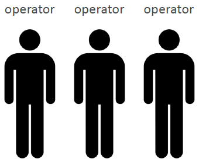
* Horizontal scaling implies distributed systems.
* This is very common for web applications / modern applications
* It’s easy to horizontally scale thanks to cloud offerings such as Amazon EC2

### High Availability
* High Availability usually goes hand in hand with horizontal scaling
* High availability means running your application / system in at least 2 data centers (== Availability Zones)
  
* The goal of high availability is to survive a data center loss
* The high availability can be passive (for RDS Multi AZ for example)
* The high availability can be active (for horizontal scaling)

### High Availability & Scalability For EC2
* Vertical Scaling: Increase instance size (= scale up / down)
    - From: t2.nano - 0.5G of RAM, 1 vCPU
    - To: u-12tb1.metal – 12.3 TB of RAM, 448 vCPUs
* Horizontal Scaling: Increase number of instances (= scale out / in)
    - Auto Scaling Group
    - Load Balancer
* High Availability: Run instances for the same application across multi AZ
    - Auto Scaling Group multi AZ
    - Load Balancer multi AZ

### What is load balancing?
* Load Balancers are servers that forward traffic to multiple servers (e.g., EC2 instances) downstream
  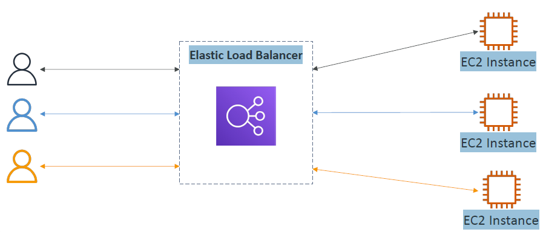
* The more users I have, the more the load is going to be balanced.

#### Why use a load balancer?
* Spread load across multiple downstream instances
* Expose a single point of access (DNS) to your application
* Seamlessly handle failures of downstream instances
* Do regular health checks to your instances
* Provide SSL termination (HTTPS) for your websites
* Enforce stickiness with cookies
* High availability across zones
* Separate public traffic from private traffic

#### Why use an Elastic Load Balancer?
* An Elastic Load Balancer is a managed load balancer
    - AWS guarantees that it will be working
    - AWS takes care of upgrades, maintenance, high availability
    - AWS provides only a few configuration knobs
* It costs less to setup your own load balancer but it will be a lot more effort on your end
* It is integrated with many AWS offerings / services
    - EC2, EC2 Auto Scaling Groups, Amazon ECS
    - AWS Certificate Manager (ACM), CloudWatch
    - Route 53, AWS WAF, AWS Global Accelerator

#### Health Checks
* Health Checks are crucial for Load Balancers
* They enable the load balancer to know if instances it forwards traffic to are available to reply to requests
* The health check is done on a port and a route (/health is common)
  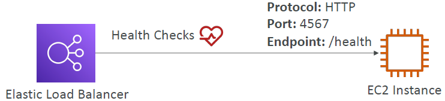
* If the response is not 200 (OK), then the instance is unhealthy
* When you enable ELB Health Checks, your ELB won't send traffic to unhealthy (crashed) EC2 instances.

#### Types of load balancer on AWS
* AWS has 4 kinds of managed Load Balancers
    - Classic Load Balancer (v1 - old generation) – 2009 – CLB
        * HTTP, HTTPS, TCP, SSL (secure TCP)
    - Application Load Balancer (v2 - new generation) – 2016 – ALB
        * HTTP, HTTPS, WebSocket
    - Network Load Balancer (v2 - new generation) – 2017 – NLB
      *TCP, TLS (secure TCP), UDP
    - Gateway Load Balancer – 2020 – GWLB
        * Operates at layer 3 (Network layer) – IP Protocol
* Overall, it is recommended to use the newer generation load balancers as they provide more features
* Some load balancers can be setup as internal (private) or external (public) ELBs
* Only Network Load Balancer provides both static DNS name and static IP. While an Application Load Balancer provides a static DNS name but it does NOT provide a static IP. The reason being that AWS wants your Elastic Load Balancer to be accessible using a static endpoint, even if the underlying infrastructure that AWS manages changes.

#### Load Balancer Security Groups
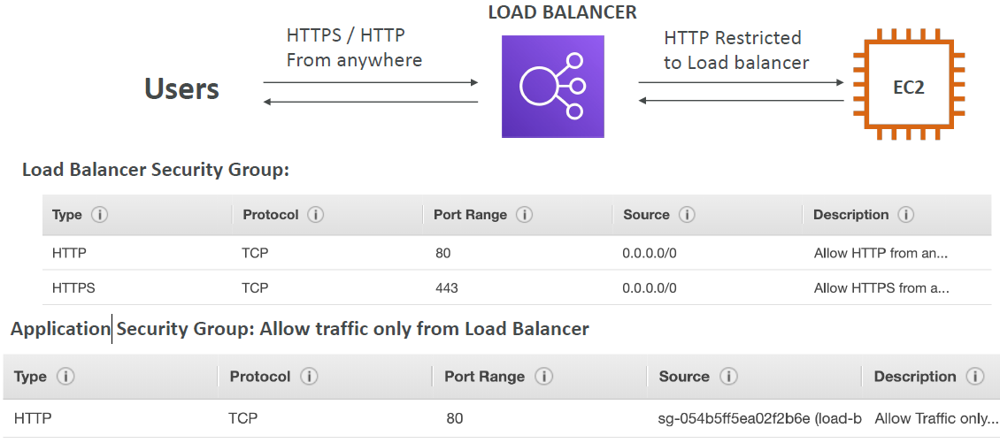
* Application Security Group: Source is not an IP range, but a security group --> link security group of EC2 instance to security group of load balancer.

#### Classic Load Balancers (v1)
* Supports TCP (Layer 4), HTTP & HTTPS (Layer 7)
* Health checks are TCP or HTTP based
* Fixed hostname  
  `XXX.region.elb.amazonaws.com`
  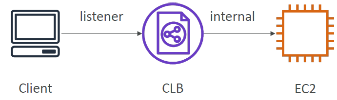

#### Application Load Balancer (v2)
* Application load balancers is Layer 7 (HTTP)
* Load balancing to multiple HTTP applications across machines (target groups)
* Load balancing to multiple applications on the same machine (ex: containers)
* Support for HTTP/2 and WebSocket
* Support redirects (from HTTP to HTTPS for example)
* Routing tables to different target groups:
    - Routing based on path in URL (example.com/users & example.com/posts)
    - Routing based on hostname in URL (one.example.com & other.example.com)
    - Routing based on Query String, Headers (example.com/users?id=123&order=false)
      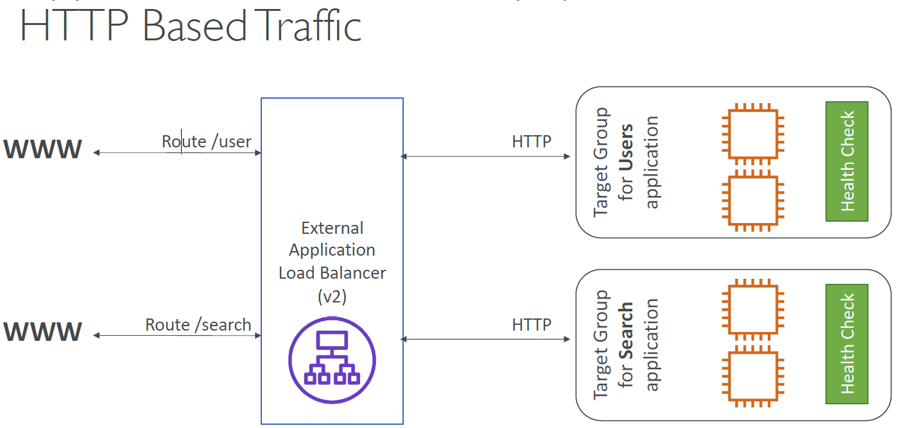
    - In general: ALBs can route traffic to different Target Groups based on URL Path, Hostname, HTTP Headers, and Query Strings. But NOT the client's location.
* ALB are a great fit for microservices & container-based application
  (example: Docker & Amazon ECS)
* Has a port mapping feature to redirect to a dynamic port in ECS
* In comparison, we’d need multiple Classic Load Balancer per application
* Fixed hostname (`XXX.region.elb.amazonaws.com`)
* The application servers don’t see the IP of the client directly
    - The true IP of the client is inserted in the header `X-Forwarded-For`
    - We can also get Port (`X-Forwarded-Port`) and proto (`X-Forwarded-Proto`)
      

#### Application Load Balancer - Target Groups
* EC2 instances (can be managed by an Auto Scaling Group) – HTTP
* ECS tasks (managed by ECS itself) – HTTP
* Lambda functions – HTTP request is translated into a JSON event
* IP Addresses – must be private IPs
* ALB can route to multiple target groups
  
* Registered targets in a Target Groups for an Application Load Balancer can be one of the following: Lambda functions, private IP addresses, EC2 instances. It can NOT be Network Load Balancer.
* Health checks are at the target group level

#### Network Load Balancer (v2)
* Network load balancers (Layer 4) allow to:
    - Forward TCP & UDP traffic to your instances [UDP --> Network Load Balancer!]
    - Handle millions of request per seconds
    - Less latency ~100 ms (vs 400 ms for ALB)
* NLB has one static IP per AZ, and supports assigning Elastic IP  
  (helpful for whitelisting specific IP)
* NLB are used for extreme performance, TCP or UDP traffic
* Not included in the AWS free tier

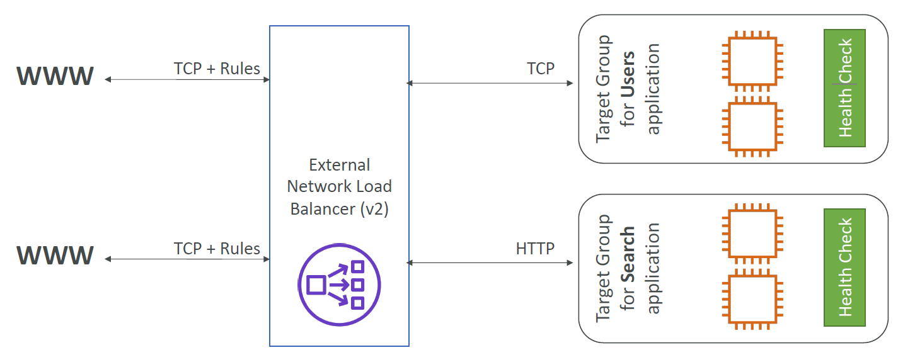

#### Network Load Balancer: Target Groups
* EC2 instances
* IP Addresses – must be private IPs
* Application Load Balancer
* Health Checks support the TCP, HTTP and HTTPS Protocols

#### Gateway Load Balancer
* Analyze network traffic
* Deploy, scale, and manage a fleet of 3rd party network virtual appliances in AWS
* Example: Firewalls, Intrusion Detection and Prevention Systems, Deep Packet Inspection Systems, payload manipulation, …
* Operates at Layer 3 (Network Layer) – IP Packets
* Combines the following functions:
    - Transparent Network Gateway – single entry/exit for all traffic
    - Load Balancer – distributes traffic to your virtual appliances
* Uses the GENEVE protocol on port 6081

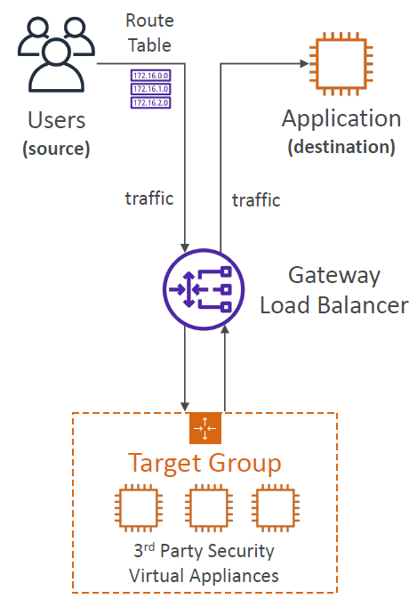

#### Gateway Load Balancer: Target Groups
* EC2 instances
* IP Addresses – must be private IPs

#### Sticky Sessions (Session Affinity)
* It is possible to implement stickiness so that the same client is always redirected to the same instance behind a load balancer
* This works for Classic Load Balancer, Application Load Balancer, and Network Load Balancer
* For both CLB & ALB, the “cookie” used for stickiness has an expiration date you control (though NLB works without cookies)
* Use case: make sure the user doesn’t lose his session data. ELB Sticky Session feature ensures traffic for the same client is always redirected to the same target (e.g., EC2 instance). This helps that the client does not lose his session data (does not have to log in again and again).
* Enabling stickiness may bring imbalance to the load over the backend EC2 instances

#### Sticky Sessions – Cookie Names
* Application-based Cookies
    - Custom cookie
        - Generated by the target
        - Can include any custom attributes required by the application
        - Cookie name must be specified individually for each target group
        - Don’t use AWSALB, AWSALBAPP, or AWSALBTG (reserved for use by the ELB)
    - Application cookie
        - Generated by the load balancer
        - Cookie name is AWSALBAPP
* Duration-based Cookies
    - Cookie generated by the load balancer
    - Cookie name is AWSALB for ALB, AWSELB for CLB

#### Cross-Zone Load Balancing

* Application Load Balancer
    - Enabled by default (can be disabled at the Target Group level)
    - No charges for inter AZ data
* Network Load Balancer & Gateway Load Balancer
    - Disabled by default
    - You pay charges ($) for inter AZ data if enabled
* Classic Load Balancer
    - Disabled by default
    - No charges for inter AZ data if enabled

#### SSL/TLS - Basics
* An SSL Certificate allows traffic between your clients and your load balancer to be encrypted in transit (in-flight encryption)
* SSL refers to Secure Sockets Layer, used to encrypt connections
* TLS refers to Transport Layer Security, which is a newer version
* Nowadays, TLS certificates are mainly used, but people still refer as SSL
* Public SSL certificates are issued by Certificate Authorities (CA)
* Comodo, Symantec, GoDaddy, GlobalSign, Digicert, Letsencrypt, etc…
* SSL certificates have an expiration date (you set) and must be renewed

#### Load Balancer - SSL Certificates
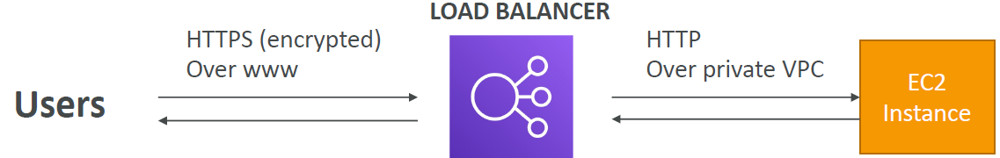
* The load balancer uses an X.509 certificate (SSL/TLS server certificate)
* You can manage certificates using ACM (AWS Certificate Manager)
* You can create upload your own certificates alternatively
* HTTPS listener:
    - You must specify a default certificate
    - You can add an optional list of certs to support multiple domains
    - Clients can use SNI (Server Name Indication) to specify the hostname they reach
    - Ability to specify a security policy to support older versions of SSL / TLS (legacy clients)
* Application Load Balancers support the following protocols: HTTP, HTTPS, WebSocket. They do NOT support TCP.  
  Network Load Balancers support both TCP und UDP protocols.

#### SSL – Server Name Indication (SNI)
* SNI solves the problem of loading multiple SSL certificates onto one web server (to serve multiple websites)
* It’s a “newer” protocol, and requires the client to indicate the hostname of the target server in the initial SSL handshake
* The server will then find the correct certificate, or return the default one  
  
* Allows you to expose multiple HTTPS applications each with its own SSL certificate on the same listener. Read more here: https://aws.amazon.com/blogs/aws/new-application-load-balancer-sni/

Note:
* Only works for ALB & NLB (newer generation), CloudFront
* Does not work for CLB (older gen)

### Elastic Load Balancers – SSL Certificates
* Classic Load Balancer (v1)
    - Support only one SSL certificate
    - Must use multiple CLB for multiple hostname with multiple SSL certificates
* Application Load Balancer (v2)
    - Supports multiple listeners with multiple SSL certificates
    - Uses Server Name Indication (SNI) to make it work
* Network Load Balancer (v2)
    - Supports multiple listeners with multiple SSL certificates
    - Uses Server Name Indication (SNI) to make it work

#### Connection Draining / Deregistration Delay
* Feature naming
    - Connection Draining – for CLB
    - Deregistration Delay – for ALB & NLB
* Time to complete “in-flight requests” while the instance is de-registering or unhealthy
* Stops sending new requests to the EC2 instance which is de-registering, establishes new connections with other EC2 instances
* Between 1 and 3600 seconds (default: 300 seconds)
* Can be disabled (set value to 0)
* Set to a low value if your requests are short
  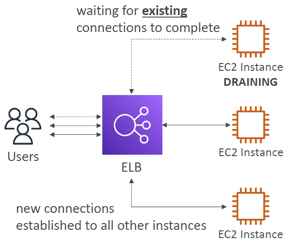

### What’s an Auto Scaling Group?
* In real-life, the load on your websites and application can change
* In the cloud, you can create and get rid of servers very quickly
* The goal of an Auto Scaling Group (ASG) is to:
    - Scale out (add EC2 instances) to match an increased load
    - Scale in (remove EC2 instances) to match a decreased load
    - Ensure we have a minimum and a maximum number of EC2 instances running
    - Automatically register new instances to a load balancer
    - Re-create an EC2 instance in case a previous one is terminated (ex: if unhealthy)
* ASG are free (you only pay for the underlying EC2 instances)

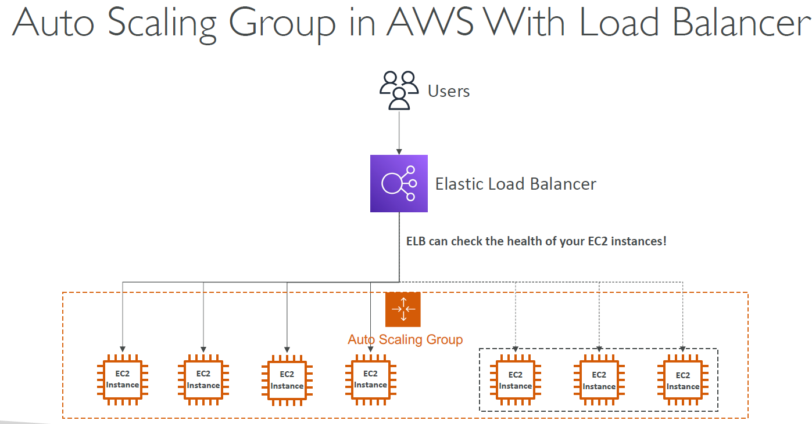

#### Auto Scaling Group Attributes
* A Launch Template (older “Launch Configurations” are deprecated)
    - AMI + Instance Type
    - EC2 User Data
    - EBS Volumes
    - Security Groups
    - SSH Key Pair
    - IAM Roles for your EC2 Instances
    - Network + Subnets Information
    - Load Balancer Information
* Min Size / Max Size / Initial Capacity
* Scaling Policies

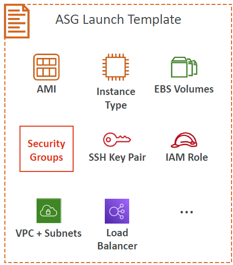

#### Auto Scaling - CloudWatch Alarms & Scaling
* It is possible to scale an ASG based on CloudWatch alarms
* An alarm monitors a metric (such as Average CPU, or a custom metric)
* Metrics such as Average CPU are computed for the overall ASG instances
* Based on the alarm:
    - We can create scale-out policies (increase the number of instances)
    - We can create scale-in policies (decrease the number of instances)

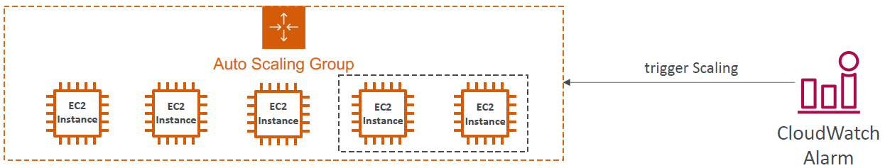

#### Auto Scaling Groups – Scaling Policies
* Dynamic Scaling
    - Target Tracking Scaling
        - Simple to set-up
        - Example: I want the average ASG CPU to stay at around 40%
    - Simple / Step Scaling
        - When a CloudWatch alarm is triggered (example CPU > 70%), then add 2 units
        - When a CloudWatch alarm is triggered (example CPU < 30%), then remove 1
* Scheduled Scaling
    - Anticipate a scaling based on known usage patterns
    - Example: increase the min capacity to 10 at 5 pm on Fridays
* Predictive scaling: continuously forecast load and schedule scaling ahead

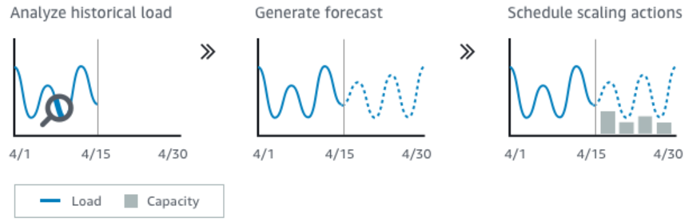

#### Good metrics to scale on
* CPUUtilization: Average CPU utilization across your instances
* RequestCountPerTarget: to make sure the number of requests per EC2 instances is stable
* Average Network In / Out (if you’re application is network bound)
* Any custom metric (that you push using CloudWatch)

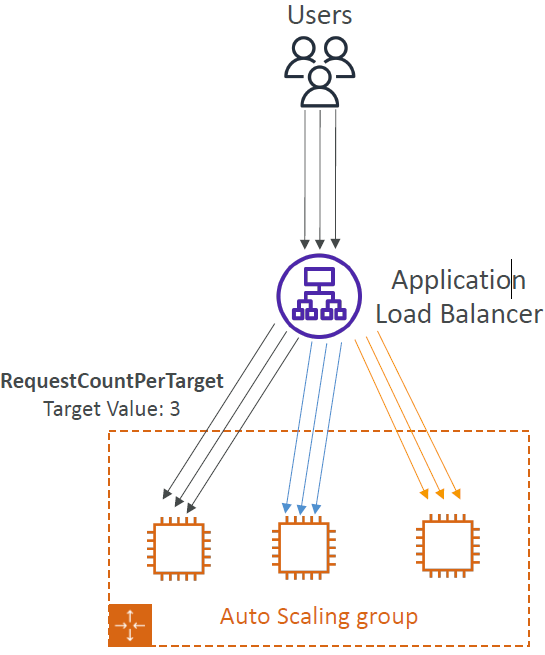

#### Auto Scaling Groups - Scaling Cooldowns
* After a scaling activity happens, you are in the cooldown period (default 300 seconds = 5 min)
* During the cooldown period, the ASG will not launch or terminate additional instances (to allow for metrics to stabilize)
* Advice: Use a ready-to-use AMI to reduce configuration time in order to be serving request faster and reduce the cooldown period

#### Auto Scaling – Instance Refresh
* Goal: update launch template and then re-creating all EC2 instances
* For this we can use the native feature of Instance Refresh
* Setting of minimum healthy percentage
* Specify warm-up time (how long until the instance is ready to use)

