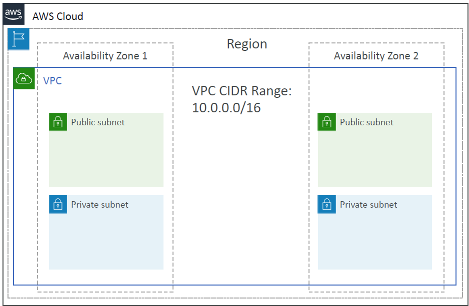
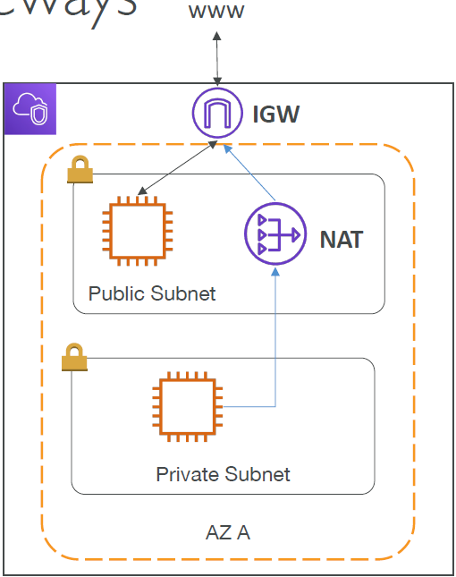
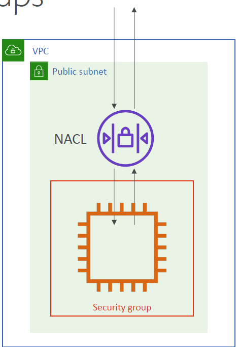
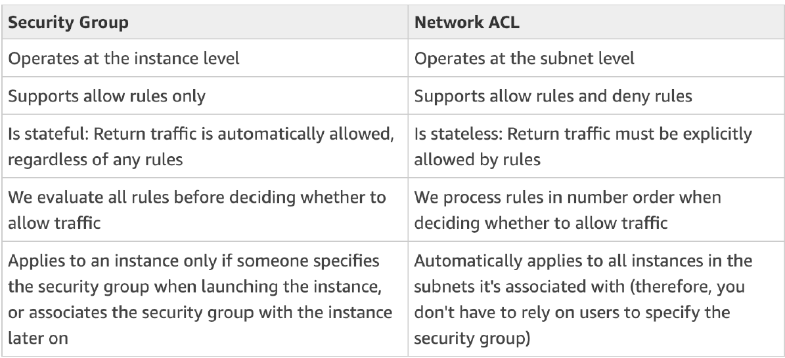
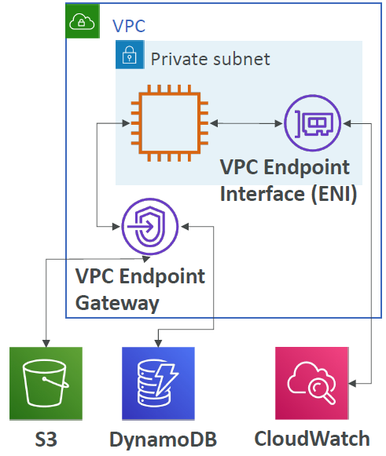
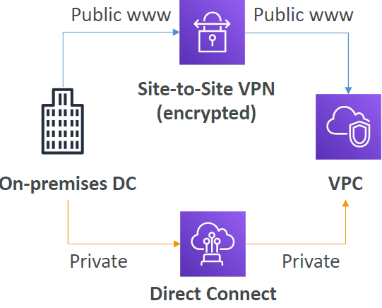

<!-- START doctoc generated TOC please keep comment here to allow auto update -->
<!-- DON'T EDIT THIS SECTION, INSTEAD RE-RUN doctoc TO UPDATE -->
**Table of Contents**

- [Amazon VPC](#amazon-vpc)
  - [VPC & Subnets](#vpc--subnets)
  - [VPC Diagram](#vpc-diagram)
  - [Internet Gateway & NAT Gateways](#internet-gateway--nat-gateways)
  - [Network ACL & Security Groups](#network-acl--security-groups)
  - [Network ACLs vs Security Groups](#network-acls-vs-security-groups)
  - [VPC Flow Logs (information about the traffic flowing through VPC)](#vpc-flow-logs-information-about-the-traffic-flowing-through-vpc)
  - [VPC Peering](#vpc-peering)
  - [VPC Endpoints](#vpc-endpoints)
  - [Site to Site VPN & Direct Connect](#site-to-site-vpn--direct-connect)
  - [VPC Closing Comments](#vpc-closing-comments)
  - [Typical 3 tier solution architecture](#typical-3-tier-solution-architecture)
  - [LAMP Stack on EC2](#lamp-stack-on-ec2)
  - [WordPress on AWS](#wordpress-on-aws)

<!-- END doctoc generated TOC please keep comment here to allow auto update -->

## Amazon VPC

### VPC & Subnets
* **VPC**: private network to deploy your resources (regional resource)
* **Subnets** allow you to partition your network inside your VPC (Availability Zone resource)
* A **public subnet** is a subnet that is accessible from the internet
* A **private subnet** is a subnet that is not accessible from the internet
* To define access to the internet and between subnets, we use **Route Tables**.
  

### VPC Diagram

### Internet Gateway & NAT Gateways
* Internet Gateways helps our VPC instances connect with the internet
* Public Subnets have a route to the internet gateway.
* NAT Gateways (AWS-managed) & NAT Instances (self-managed) allow your instances in your Private Subnets to access the internet while remaining private.
  

### Network ACL & Security Groups
* NACL (Network Access Control Lists)
    - A firewall which controls traffic from and to subnet
    - Can have ALLOW and DENY rules
    - Are attached at the Subnet level
    - Rules only include IP addresses
* Security Groups
    - A firewall that controls traffic to and from an ENI (Elastic Network Interface) / an EC2 Instance
    - Can have only ALLOW rules
    - Rules include IP addresses and other security groups
      

### Network ACLs vs Security Groups

### VPC Flow Logs (information about the traffic flowing through VPC)
* Capture information about IP traffic going into your interfaces:
    - VPC Flow Logs
    - Subnet Flow Logs
    - Elastic Network Interface Flow Logs
* Helps to monitor & troubleshoot connectivity issues. Example:
    - Subnets to internet
    - Subnets to subnets
    - Internet to subnets
* Captures network information from AWS managed interfaces too: Elastic Load Balancers, ElastiCache, RDS, Aurora, etc…
* VPC Flow logs data can go to S3, CloudWatch Logs, and Kinesis Data Firehose.

### VPC Peering
* Connect two VPC, privately using AWS’ network
* Make them behave as if they were in the same network
* Must not have overlapping CIDR (IP address range)
* VPC Peering connection is not transitive (must be established for each VPC that need to communicate with one another)
  

### VPC Endpoints
* Endpoints allow you to connect to AWS Services using a private network instead of the public www network
* This gives you enhanced security and lower latency to access AWS services
* VPC Endpoint Gateway: S3 & DynamoDB (these are the only AWS services that have a Gateway VPC Endpoint available!)
* VPC Endpoint Interface powered by a private link (private IP): the rest of the AWS services
* Only used within your VPC
* **Connecting privately to an AWS service: Always through VPC**
  

### Site to Site VPN & Direct Connect
* Site to Site VPN
    - Connect an on-premises VPN to AWS
    - The connection is automatically encrypted
    - Goes over the public internet
* Direct Connect (DX)
    - Establish a physical connection between on-premises and AWS
    - The connection is private, secure and fast
    - Goes over a private network
    - Takes at least a month to establish

### VPC Closing Comments
* VPC: Virtual Private Cloud
* Subnets: Tied to an AZ, network partition of the VPC
* Internet Gateway: at the VPC level, provide Internet Access
* NAT Gateway / Instances: give internet access to private subnets
* NACL: Stateless, subnet rules for inbound and outbound
* Security Groups: Stateful, operate at the EC2 instance level or ENI. Security groups are stateful and if traffic can go out, then it can go back in.  
  To configure an EC2 instance security group to ensure only the ALB can access them on port 80 --> add an inbound rule with port 80 and ALB's Security Group as the source. This is the most secure way of ensuring only the ALB can access the EC2 instances.
* VPC Peering: Connect two VPC with non overlapping IP ranges, non-transitive
* VPC Endpoints: Provide private access to AWS Services within VPC
* VPC Flow Logs: network traffic logs
* Site to Site VPN: VPN over public internet between on-premises DC and AWS
* Direct Connect: direct private connection to AWS

### Typical 3 tier solution architecture

### LAMP Stack on EC2
* **L**inux: OS for EC2 instances
* **A**pache: Web Server that run on Linux (EC2)
* **M**ySQL: database on RDS
* **P**HP: Application logic (running on EC2)
* Can add Redis / Memcached (ElastiCache) to include a caching tech
* To store local application data & software: EBS drive (root)

### WordPress on AWS
