<!-- START doctoc generated TOC please keep comment here to allow auto update -->
<!-- DON'T EDIT THIS SECTION, INSTEAD RE-RUN doctoc TO UPDATE -->
**Table of Contents**

- [S3](#s3)
  - [S3 Use cases](#s3-use-cases)
  - [S3 - Buckets](#s3---buckets)
  - [S3 - Objects](#s3---objects)
  - [S3 – Security](#s3--security)
  - [S3 Bucket Policies](#s3-bucket-policies)
  - [Examples](#examples)
  - [Bucket settings for Block Public Access](#bucket-settings-for-block-public-access)
  - [S3 – Static Website Hosting](#s3--static-website-hosting)
  - [S3 - Versioning](#s3---versioning)
  - [S3 – Replication (CRR & SRR)](#s3--replication-crr--srr)
  - [S3 – Replication (Notes)](#s3--replication-notes)
  - [S3 Storage Classes](#s3-storage-classes)
- [AWS CLI, SDK, IAM Roles & Policies](#aws-cli-sdk-iam-roles--policies)
  - [EC2 Instance Metadata (IMDS)](#ec2-instance-metadata-imds)
  - [MFA with CLI](#mfa-with-cli)
  - [AWS SDK Overview](#aws-sdk-overview)
  - [AWS Limits (Quotas)](#aws-limits-quotas)
  - [AWS CLI Credentials Provider Chain](#aws-cli-credentials-provider-chain)
  - [Signing AWS API requests](#signing-aws-api-requests)
- [S3 - Advanced](#s3---advanced)
  - [Amazon S3 – Moving between Storage Classes](#amazon-s3--moving-between-storage-classes)
  - [Lifecycle Rules](#lifecycle-rules)
  - [S3 Event Notifications](#s3-event-notifications)
  - [S3 – Baseline Performance](#s3--baseline-performance)
  - [S3 User-Defined Object Metadata & S3 Object Tags](#s3-user-defined-object-metadata--s3-object-tags)
- [S3 - Security](#s3---security)
  - [S3 – Object Encryption](#s3--object-encryption)
  - [S3 – Encryption in transit (SSL/TLS)](#s3--encryption-in-transit-ssltls)
  - [S3 – Default Encryption vs. Bucket Policies](#s3--default-encryption-vs-bucket-policies)
  - [What is CORS?](#what-is-cors)
  - [S3 – MFA Delete](#s3--mfa-delete)
  - [S3 Access Logs](#s3-access-logs)
  - [S3 – Pre-Signed URLs](#s3--pre-signed-urls)
  - [S3 – Access Points](#s3--access-points)
  - [S3 Object Lambda](#s3-object-lambda)

<!-- END doctoc generated TOC please keep comment here to allow auto update -->

## S3

* Amazon S3 is one of the main building blocks of AWS
* It’s advertised as ”infinitely scaling” storage
* Many websites use Amazon S3 as a backbone
* Many AWS services use Amazon S3 as an integration as well
  • We’ll have a step-by-step approach to S3

### S3 Use cases
* Backup and storage
* Disaster Recovery
* Archive
* Hybrid Cloud storage
* Application hosting
* Media hosting
* Data lakes & big data analytics
* Software delivery
* Static website

### S3 - Buckets
* Amazon S3 allows people to store objects (files) in “buckets” (directories)
* Buckets must have a globally unique name (across all regions all accounts)
* Buckets are defined at the region level
* S3 looks like a global service but buckets are created in a region
* Naming convention
    - No uppercase, No underscore
    - 3-63 characters long
    - Not an IP
    - Must start with lowercase letter or number
    - Must NOT start with the prefix xn--
    - Must NOT end with the suffix -s3alias

### S3 - Objects
* Objects (files) have a Key
* The key is the FULL path:
    - s3://my-bucket/my_file.txt
    - s3://my-bucket/my_folder1/another_folder/my_file.txt
* The key is composed of prefix + object name
    - s3://my-bucket/my_folder1/another_folder/my_file.txt
* There’s no concept of “directories” within buckets (although the UI will trick you to think otherwise)
* Just keys with very long names that contain slashes (“/”)
* Object values are the content of the body:
    - Max. Object Size is 5TB (5000GB)
    - If uploading more than 5GB, must use “multi-part upload” (recommended as soon as the file is > 100 MB)
* Metadata (list of text key / value pairs – system or user metadata)
* Tags (Unicode key / value pair – up to 10) – useful for security / lifecycle
* Version ID (if versioning is enabled)

### S3 – Security
* User-Based
    - IAM Policies – which API calls should be allowed for a specific user from IAM
* Resource-Based
    - Bucket Policies – bucket wide rules from the S3 console - allows cross account
    - Object Access Control List (ACL) – finer grain (can be disabled)
    - Bucket Access Control List (ACL) – less common (can be disabled)
* Note: an IAM principal can access an S3 object if
    - The user IAM permissions ALLOW it OR the resource policy ALLOWS it
    - AND there’s no explicit DENY (explicit DENY in an IAM Policy takes precedence over an S3 bucket policy)
* Encryption: encrypt objects in Amazon S3 using encryption keys

### S3 Bucket Policies
* JSON based policies
    - Resources: buckets and objects (star * is for every object)
    - Effect: Allow / Deny (Actions)
    - Actions: Set of API to Allow or Deny
    - Principal: The account or user to apply the policy to (star * allows anyone)
      
* Use S3 bucket for policy to:
    - Grant public access to the bucket
    - Force objects to be encrypted at upload
    - Grant access to another account (Cross Account)

### Examples

#### Public Access - Use Bucket Policy

#### User Access to S3 – IAM permissions

#### EC2 instance access - Use IAM Roles
Not user, but role!

#### Advanced: Cross-Account Access – Use Bucket Policy
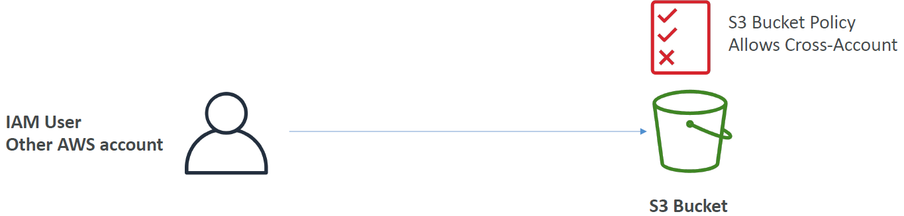

### Bucket settings for Block Public Access

* These settings were created to prevent company data leaks
* If you know your bucket should never be public, leave these on
* Can be set at the account level

### S3 – Static Website Hosting
* S3 can host static websites and have them accessible on the Internet
* The website URL will be (depending on the region): http://bucket-name.s3-website-aws-region.amazonaws.com
* If you get a 403 Forbidden error, make sure the bucket policy allows public reads!

### S3 - Versioning
* You can version your files in Amazon S3
* It is enabled at the bucket level
* Same key overwrite will change the “version”: 1, 2, 3….
* It is best practice to version your buckets
    - Protect against unintended deletes (ability to restore a version)
    - Easy roll back to previous version
* Notes:
    - Any file that is not versioned prior to enabling versioning will have version “null”
    - Suspending versioning does not delete the previous versions

### S3 – Replication (CRR & SRR)
* Must enable Versioning in source and destination buckets
* Cross-Region Replication (CRR)
* Same-Region Replication (SRR)
* Buckets can be in different AWS accounts
* Copying is asynchronous
* Must give proper IAM permissions to S3
* Use cases:
    - CRR – compliance, lower latency access, replication across accounts
      
    - SRR – log aggregation, live replication between production and test accounts

### S3 – Replication (Notes)
* After you enable Replication, only new objects are replicated
* Optionally, you can replicate existing objects using **S3 Batch Replication**
    - Replicates existing objects and objects that failed replication
* For DELETE operations
    - Can replicate delete markers from source to target (optional setting, default is false)
    - Deletions with a version ID are not replicated (to avoid malicious deletes) --> permanent delete in original bucket is not deleted in replica
* There is no “chaining” of replication
    - If bucket 1 has replication into bucket 2, which has replication into bucket 3
    - Then objects created in bucket 1 are not replicated to bucket 3

### S3 Storage Classes
* Amazon S3 Standard - General Purpose
* Amazon S3 Standard-Infrequent Access (IA)
* Amazon S3 One Zone-Infrequent Access
* Amazon S3 Glacier Instant Retrieval
* Amazon S3 Glacier Flexible Retrieval
* Amazon S3 Glacier Deep Archive
* Amazon S3 Intelligent Tiering
* Can move between classes manually or using S3 Lifecycle configurations

#### S3 Durability and Availability
* Durability:
    - High durability (99.999999999%, 11 9’s) of objects across multiple AZ
    - If you store 10,000,000 objects with Amazon S3, you can on average expect to incur a loss of a single object once every 10,000 years
    - Same for all storage classes
* Availability:
    - Measures how readily available a service is
    - Varies depending on storage class
    - Example: S3 standard has 99.99% availability = not available 53 minutes a year

#### S3 Standard – General Purpose
* 99.99% Availability
* Used for frequently accessed data
* Low latency and high throughput
* Sustain 2 concurrent facility failures
* Use Cases: Big Data analytics, mobile & gaming applications, content distribution…

#### S3 Storage Classes – Infrequent Access
* For data that is less frequently accessed, but requires rapid access when needed
* Lower cost than S3 Standard
* Amazon S3 Standard-Infrequent Access (S3 Standard-IA)
    - 99.9% Availability
    - Use cases: Disaster Recovery, backups
* Amazon S3 One Zone-Infrequent Access (S3 One Zone-IA)
    - High durability (99.999999999%) in a single AZ; data lost when AZ is destroyed
    - 99.5% Availability
    - Use Cases: Storing secondary backup copies of on-premises data, or data you can recreate

#### Amazon S3 Glacier Storage Classes
* Low-cost object storage meant for archiving / backup
* Pricing: price for storage + object retrieval cost
* Amazon S3 Glacier Instant Retrieval
    - Millisecond retrieval, great for data accessed once a quarter
    - Minimum storage duration of 90 days
* Amazon S3 Glacier Flexible Retrieval (formerly Amazon S3 Glacier):
    - Expedited (1 to 5 minutes), Standard (3 to 5 hours), Bulk (5 to 12 hours) – free
    - Minimum storage duration of 90 days
* Amazon S3 Glacier Deep Archive – for long term storage:
    - Standard (12 hours), Bulk (48 hours)
    - Minimum storage duration of 180 days

#### S3 Intelligent-Tiering
* Small monthly monitoring and auto-tiering fee
* Moves objects automatically between Access Tiers based on usage
* There are no retrieval charges in S3 Intelligent-Tiering

* *Frequent Access tier (automatic)*: default tier
* *Infrequent Access tier (automatic)*: objects not accessed for 30 days
* *Archive Instant Access tier (automatic)*: objects not accessed for 90 days
* *Archive Access tier (optional)*: configurable from 90 days to 700+ days
* *Deep Archive Access tier (optional)*: config. from 180 days to 700+ days

#### S3 Storage Classes Comparison
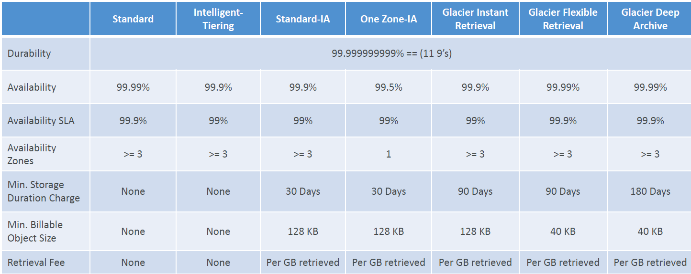

Specific example (us-east-1):
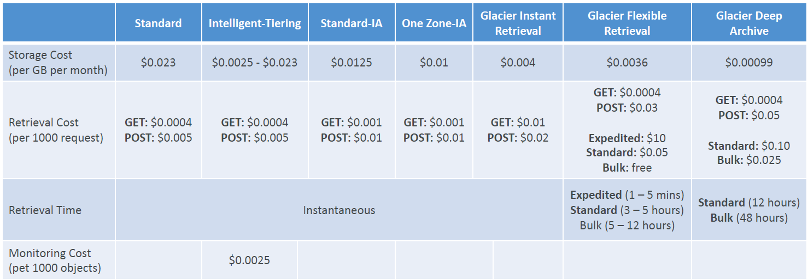

Switch between classes is done with a lifecycle rule on the bucket.

## AWS CLI, SDK, IAM Roles & Policies

### EC2 Instance Metadata (IMDS)
* AWS EC2 Instance Metadata (IMDS) is powerful but one of the least known features to developers
* It allows AWS EC2 instances to ”learn about themselves” without using an IAM Role for that purpose.
* The URL is http://169.254.169.254/latest/meta-data
* You can retrieve the IAM Role name from the metadata, but you CANNOT retrieve the IAM Policy.
* Metadata = Info about the EC2 instance
* Userdata = launch script of the EC2 instance

#### IMDSv2 vs. IMDSv1

* IMDSv1 is accessing http://169.254.169.254/latest/meta-data directly
* IMDSv2 is more secure and is done in two steps:
    1. Login with EC2 Instance Connect.
    2. Get Session Token (limited validity) – using headers & PUT:  
       $ TOKEN=`curl -X PUT "http://169.254.169.254/latest/api/token" -H "X-aws-ec2-metadata-token-ttl-seconds: 21600"`
    2. Use Session Token in IMDSv2 calls – using headers:  
       \$ curl http://169.254.169.254/latest/meta-data/profile -H "X-aws-ec2-metadata-token: $TOKEN"

### MFA with CLI
* To use MFA with the CLI, you must create a temporary session
* To do so, you must run the STS GetSessionToken API call
* aws sts get-session-token --serial-number arn-of-the-mfa-device --token-code
  code-from-token --duration-seconds 3600  
  (e.g. `aws sts get-session-token --serial-number arn:aws:iam::387124123361:mfa/stephane --token-code 828463 --duration-seconds 3600  `)

### AWS SDK Overview
* What if you want to perform actions on AWS directly from your applications code (without using the CLI)?  --> You can use an SDK (software development kit)!
* Official SDKs are:
    - Java
    - .NET
    - Node.js
    - PHP
    - Python (named boto3 / botocore)
    - Go
    - Ruby
    - C++

#### AWS SDK Overview
* We have to use the AWS SDK when coding against AWS Services such as DynamoDB or S3.
* Fun fact: the AWS CLI uses the Python SDK (boto3)
* The exam expects you to know when you should use an SDK
* We’ll practice the AWS SDK when we get to the Lambda functions
* Good to know: if you don’t specify or configure a default region, then us-east-1 will be chosen by default

### AWS Limits (Quotas)
* API Rate Limits
    - DescribeInstances API for EC2 has a limit of 100 calls per seconds
    - GetObject on S3 has a limit of 5500 GET per second per prefix
    - For Intermittent Errors: implement Exponential Backoff
    - For Consistent Errors: request an API throttling limit increase
* Service Quotas (Service Limits)
    - Running On-Demand Standard Instances: 1152 vCPU (virtual CPU)
    - You can request a service limit increase by opening a ticket
    - You can request a service quota increase by using the Service Quotas API

#### Exponential Backoff (any AWS service)
* If you get ThrottlingException intermittently, use exponential backoff
* Retry mechanism already included in AWS SDK API calls
* Must implement yourself if using the AWS API as-is or in specific cases
    - Must only implement the retries on 5xx server errors and throttling
    - Do not implement on 4xx client errors
      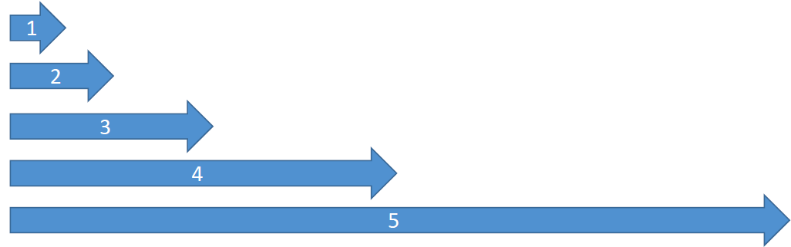
      The more we retry, the more we wait: 1st retry 1s, 2nd retry 2s, 3rd retry 4s, 4th retry 8s, 5h retry 16s.
    - --> Less and less load on server, allowing the server to serve as many answers as possible.

### AWS CLI Credentials Provider Chain
The CLI will look for credentials in this order
1. Command line options – --region, --output, and --profile
2. Environment variables – AWS_ACCESS_KEY_ID,AWS_SECRET_ACCESS_KEY,
   and AWS_SESSION_TOKEN
3. CLI credentials file –aws configure  
   ~/.aws/credentials on Linux / Mac & C:\Users\user\.aws\credentials on Windows
4. CLI configuration file – aws configure  
   ~/.aws/config on Linux / macOS & C:\Users\USERNAME\.aws\config on Windows
5. Container credentials – for ECS tasks
6. Instance profile credentials – for EC2 Instance Profiles

#### AWS SDK Default Credentials Provider Chain
The Java SDK (example) will look for credentials in this order
1. Java system properties – aws.accessKeyId and aws.secretKey
2. Environment variables –  
   AWS_ACCESS_KEY_ID and AWS_SECRET_ACCESS_KEY
3. The default credential profiles file –  
   ex at: ~/.aws/credentials, shared by many SDKs
4. Amazon ECS container credentials – for ECS containers
5. Instance profile credentials– used on EC2 instances

#### AWS Credentials Scenario
* An application deployed on an EC2 instance is using environment variables with credentials from an IAM user to call the Amazon S3 API.
* The IAM user has S3FullAccess permissions.
* The application only uses one S3 bucket, so according to best practices:
    - An IAM Role & EC2 Instance Profile was created for the EC2 instance
    - The Role was assigned the minimum permissions to access that one S3 bucket
* The IAM Instance Profile was assigned to the EC2 instance, but it still had access to all S3 buckets. Why? The credentials chain is still giving priorities to the environment variables!

#### AWS Credentials Best Practices
* Overall, NEVER EVER STORE AWS CREDENTIALS IN YOUR CODE
* Best practice is for credentials to be inherited from the credentials chain
* If using working within AWS, use IAM Roles
    - => EC2 Instances Roles for EC2 Instances
    - => ECS Roles for ECS tasks
    - => Lambda Roles for Lambda functions
* If working outside of AWS, use environment variables / named profiles

### Signing AWS API requests
* When you call the AWS HTTP API, you sign the request so that AWS can identify you, using your AWS credentials (access key & secret key)
* Note: some requests to Amazon S3 don’t need to be signed
* If you use the SDK or CLI, the HTTP requests are signed for you
* You should sign an AWS HTTP request using Signature v4 (SigV4)
  

#### SigV4 Request examples
* HTTP Header option (signature in Authorization header)
  
* Query String option, ex: S3 pre-signed URLs (signature in X-Amz-Signature)
  

## S3 - Advanced

### Amazon S3 – Moving between Storage Classes
* You can transition objects between storage classes
* For infrequently accessed object, move them to Standard IA
* For archive objects that you don’t need fast access to, move them to Glacier or Glacier Deep Archive
* Moving objects can be automated using a Lifecycle Rules

### Lifecycle Rules
* **Transition Actions** – configure objects to transition to another storage class
    - Move objects to Standard IA class 60 days after creation
    - Move to Glacier for archiving after 6 months
* **Expiration actions** – configure objects to expire (delete) after some time
    - Access log files can be set to delete after a 365 days
    - Can be used to delete old versions of files (if versioning is enabled)
    - Can be used to delete incomplete Multi-Part uploads
* Rules can be created for a certain prefix (example: s3://mybucket/mp3/*)
* Rules can be created for certain objects Tags (example: Department: Finance)

#### Lifecycle Rules (Scenario 1)
* Your application on EC2 creates images thumbnails after profile photos are uploaded to Amazon S3. These thumbnails can be easily recreated, and only need to be kept for 60 days. The source images should be able to be immediately retrieved for these 60 days, and afterwards, the user can wait up to 6 hours. How would you design this?
* S3 source images can be on Standard, with a lifecycle configuration to transition them to Glacier after 60 days
* S3 thumbnails can be on One-Zone IA, with a lifecycle configuration to expire them (delete them) after 60 days

#### Lifecycle Rules (Scenario 2)
* A rule in your company states that you should be able to recover your deleted S3 objects immediately for 30 days, although this may happen rarely. After this time, and for up to 365 days, deleted objects should be recoverable within 48 hours.
* Enable S3 Versioning in order to have object versions, so that “deleted objects” are in fact hidden by a “delete marker” and can be recovered
* Transition the “noncurrent versions” of the object to Standard IA
* Transition afterwards the “noncurrent versions” to Glacier Deep Archive

#### S3 Analytics – Storage Class Analysis
* Help you decide when to transition objects to the right storage class
    * Recommendations for Standard and Standard IA
      

  Does NOT work for One-Zone IA or Glacier
* Report is updated daily
* 24 to 48 hours to start seeing data analysis
* Good first step to put together Lifecycle Rules (or improve them)!

### S3 Event Notifications
* S3:ObjectCreated, S3:ObjectRemoved, S3:ObjectRestore, S3:Replication…
* Object name filtering possible (*.jpg)
  
* Use case: generate thumbnails of images uploaded to S3
* Can create as many “S3 events” as desired
* S3 event notifications typically deliver events in seconds but can sometimes take a minute or longer

#### S3 Event Notifications – IAM Permissions
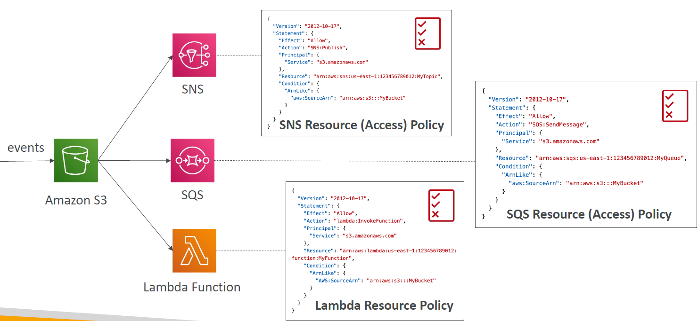

#### S3 Event Notifications with Amazon EventBridge

* Advanced filtering options with JSON rules (metadata, object size, name...)
* Multiple Destinations – ex Step Functions, Kinesis Streams / Firehose…
* EventBridge Capabilities – Archive, Replay Events, Reliable delivery

### S3 – Baseline Performance
* Amazon S3 automatically scales to high request rates, latency 100-200 ms
* Your application can achieve at least 3,500 PUT/COPY/POST/DELETE or 5,500 GET/HEAD requests per second per prefix in a bucket.
* There are no limits to the number of prefixes in a bucket.
* Example (object path => prefix):
    - bucket/folder1/sub1/file => /folder1/sub1/
    - bucket/folder1/sub2/file => /folder1/sub2/
    - bucket/1/file => /1/
    - bucket/2/file => /2/
* If you spread reads across all four prefixes evenly, you can achieve 22,000 requests per second for GET and HEAD

#### Performance: Multi-Part upload
* recommended for files > 100MB, must use for files > 5GB
* Can help parallelize uploads (speed up transfers)
  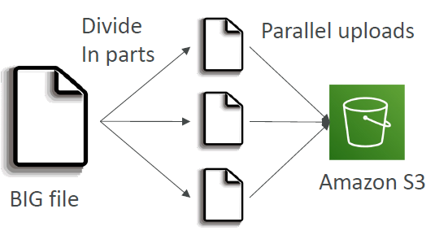

#### Performance: S3 Transfer Acceleration
* Increase transfer speed by transferring file to an AWS edge location (more than 200) which will forward the data to the S3 bucket in the target region (is called transfer acceleration).
* Compatible with multi-part upload
  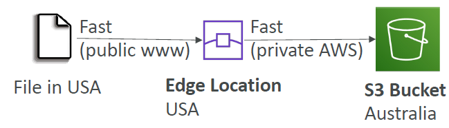

#### Performance – S3 Byte-Range Fetches
* Parallelize GETs by requesting specific byte ranges
* Better resilience in case of failures
* Can be used to speed up downloads
  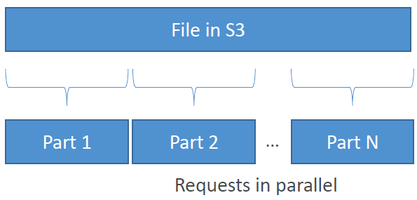
* Can be used to retrieve only partial data (for example the head of a file)
  

### S3 User-Defined Object Metadata & S3 Object Tags
* S3 User-Defined Object Metadata
    - When uploading an object, you can also assign metadata
    - Name-value (key-value) pairs
    - User-defined metadata names must begin with "x-amz-meta-”
    - Amazon S3 stores user-defined metadata keys in lowercase
    - Metadata can be retrieved while retrieving the object
* S3 Object Tags
    - Key-value pairs for objects in Amazon S3
    - Useful for fine-grained permissions (only access specific objects with specific tags)
    - Useful for analytics purposes (using S3 Analytics to group by tags)
      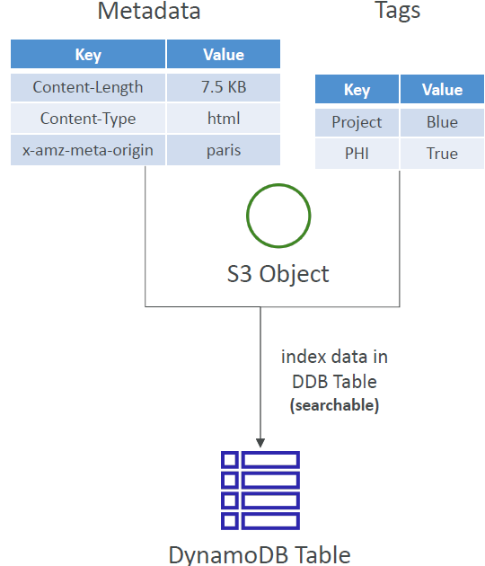
* You cannot search in S3 the object metadata or object tags!
* Instead, you must use an external DB as a search index such as DynamoDB.

## S3 - Security

### S3 – Object Encryption
* You can encrypt objects in S3 buckets using one of 4 methods
* Server-Side Encryption (SSE)
    - Server-Side Encryption with Amazon S3-Managed Keys (SSE-S3) – Enabled by Default
        - Encrypts S3 objects using keys handled, managed, and owned by AWS
    - Server-Side Encryption with KMS Keys stored in AWS KMS (SSE-KMS)
        - Leverage AWS Key Management Service (AWS KMS) to manage encryption keys
    - Server-Side Encryption with Customer-Provided Keys (SSE-C)
        - When you want to manage your own encryption keys
* Client-Side Encryption
* It’s important to understand which ones are for which situation for the exam

#### Amazon S3 Encryption – SSE-S3
* Encryption using keys handled, managed, and owned by AWS
* Object is encrypted server-side
* Encryption type is AES-256
* Must set header "x-amz-server-side-encryption": "AES256"
* Enabled by default for new buckets & new objects
  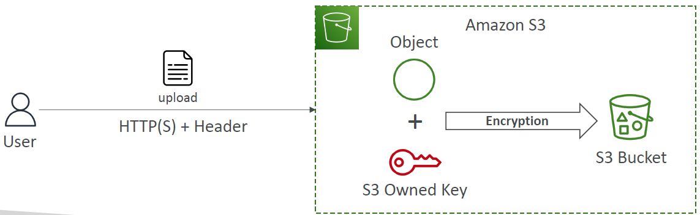

#### Amazon S3 Encryption – SSE-KMS
* Encryption using keys handled and managed by AWS KMS (Key Management Service)
* KMS advantages: user control + audit key usage using CloudTrail + full control over the rotation policy of the encryption key
* Object is encrypted server side
* Must set header "x-amz-server-side-encryption": "aws:kms"
  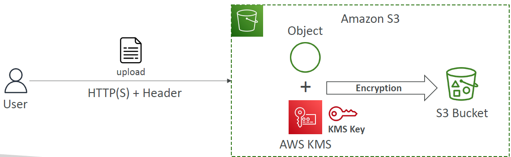
* Since 06/2023: new encryption option DSSE-KMS (Dual-layer server-side encryption with AWS Key Management System = double encryption based on KMS)

##### SSE-KMS Limitation
* If you use SSE-KMS, you may be impacted by the KMS limits
* When you upload, it calls the GenerateDataKey KMS API
* When you download, it calls the Decrypt KMS API
  
* Count towards the KMS quota per second (5500, 10000, 30000 req/s based on region)
* You can request a quota increase using the Service Quotas Console

#### Amazon S3 Encryption – SSE-C
* Server-Side Encryption using keys fully managed by the customer outside of AWS
* Amazon S3 does NOT store the encryption key you provide
* HTTPS must be used
* Encryption key must be provided in HTTP headers for every HTTP request made.
* Only possible to be done from CLI, not from the Console/AWS UI
  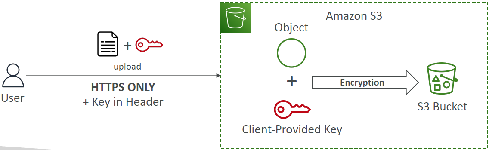

#### S3 Encryption – Client-Side Encryption
* Use client libraries such as Amazon S3 Client-Side Encryption Library
* Clients must encrypt data themselves before sending to Amazon S3
* Clients must decrypt data themselves when retrieving from Amazon S3
* Customer fully manages the keys and encryption cycle
* Not to be done from the Console/AWS UI
  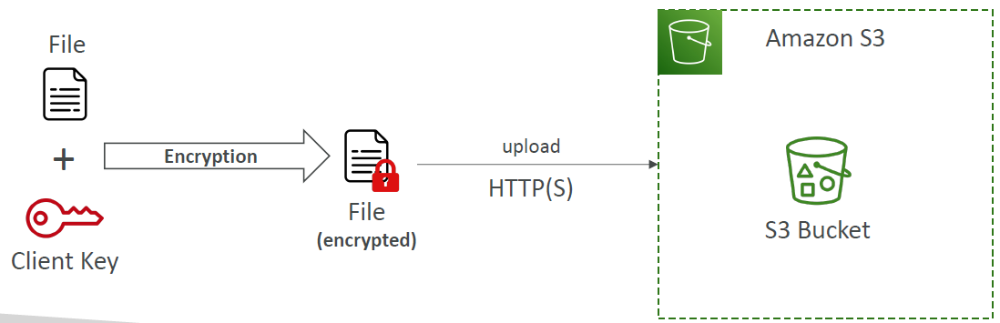

### S3 – Encryption in transit (SSL/TLS)
* Encryption in flight is also called SSL/TLS
* Amazon S3 exposes two endpoints:
    - HTTP Endpoint – non encrypted
    - HTTPS Endpoint – encryption in flight
* HTTPS is recommended
* HTTPS is mandatory for SSE-C
* Most clients would use the HTTPS endpoint by default

#### Amazon S3 – Force Encryption in Transit aws:SecureTransport
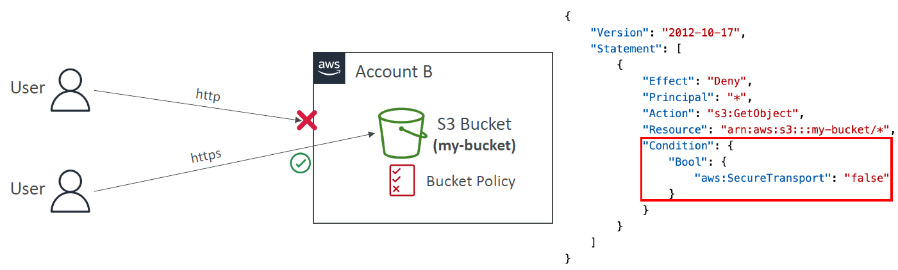
SecureTransport = HTTPS. If not HTTPS: Deny GetObject.

### S3 – Default Encryption vs. Bucket Policies
* SSE-S3 encryption is automatically applied to new objects stored in S3 bucket
* Optionally, you can “force encryption” using a bucket policy and refuse any API call to PUT an S3 object without encryption headers (SSE-KMS or SSE-C)
  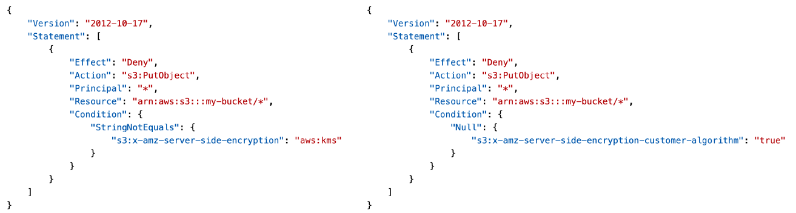
* Note: Bucket Policies are evaluated before “Default Encryption”

### What is CORS?
* Cross-Origin Resource Sharing (CORS)
* CORS defines a way for client web applications that are loaded in one domain to interact with resources in a different domain.  
  Other explanation: Web Browser based mechanism to allow requests to other origins while visiting the main origin
* Origin = scheme (protocol) + host (domain) + port
    - example: https://www.example.com (implied port is 443 for HTTPS, 80 for HTTP)
* Same origin: http://example.com/app1 & http://example.com/app2
* Different origins: http://www.example.com & http://other.example.com
* The requests won’t be fulfilled unless the other origin allows for the requests, using CORS Headers (example: Access-Control-Allow-Origin)

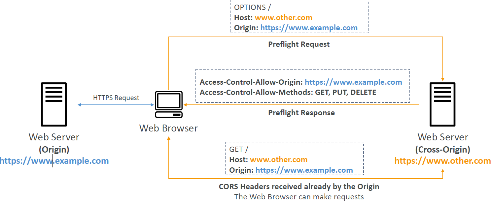

* If a client makes a cross-origin request on our S3 bucket, we need to enable the correct CORS headers
* It’s a popular exam question
* You can allow for a specific origin or for * (all origins)

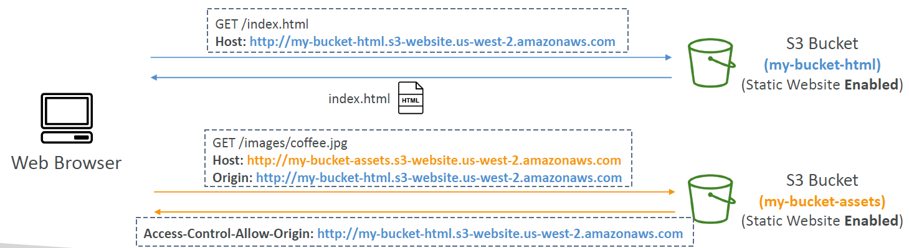

### S3 – MFA Delete
* MFA (Multi-Factor Authentication) – force users to generate a code on a device (usually a mobile phone or hardware) before doing important operations on S3. It's an extra level of security to prevent accidental deletions.
* MFA will be required to:
    - Permanently delete an object version
    - Suspend Versioning on the bucket
* MFA won’t be required to:
    - Enable Versioning
    - List deleted versions
* To use MFA Delete, versioning must be enabled on the bucket
* Only the bucket owner (root account) can enable/disable MFA Delete

### S3 Access Logs
* For audit purpose, you may want to log all access to S3 buckets
* Any request made to S3, from any account, authorized or denied, will be logged into another S3 bucket
* That data can be analyzed using data analysis tools…
* The target logging bucket must be in the same AWS region
* The log format is at: https://docs.aws.amazon.com/AmazonS3/latest/userguide/LogFormat.html
* **Warning**:
    - Do not set your logging bucket to be the monitored bucket!
    - It will create a logging loop, and your bucket will grow exponentially
      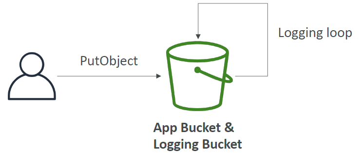

### S3 – Pre-Signed URLs
* Generate pre-signed URLs using the S3 Console, AWS CLI or SDK
* URL Expiration
    - S3 Console – 1 min up to 720 mins (12 hours)
    - AWS CLI – configure expiration with --expires-in parameter in seconds (default 3600 secs, max. 604800 secs ~ 168 hours)
* Users given a pre-signed URL inherit the permissions of the user that generated the URL for GET / PUT
  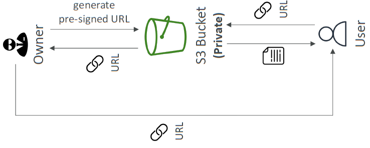
* Examples:
    - Allow only logged-in users to download a premium video from your S3 bucket
    - Allow an ever-changing list of users to download files by generating URLs dynamically
    - Allow temporarily a user to upload a file to a precise location in your S3 bucket

### S3 – Access Points
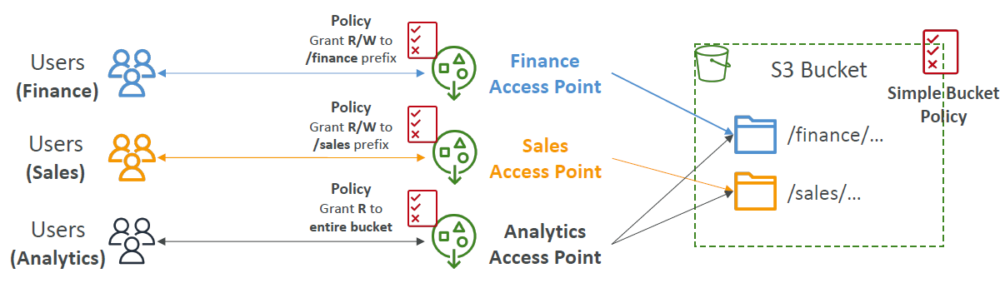
* Access Points simplify security management for S3 Buckets
* Each Access Point has:
    - its own DNS name (Internet Origin or VPC Origin)
    - an access point policy (similar to bucket policy) – manage security at scale

#### S3 – Access Points – VPC Origin
* We can define the access point to be accessible only from within the VPC
* You must create a VPC Endpoint to access the Access Point (Gateway or Interface Endpoint)
* The VPC Endpoint Policy must allow access to the target bucket and Access Point
  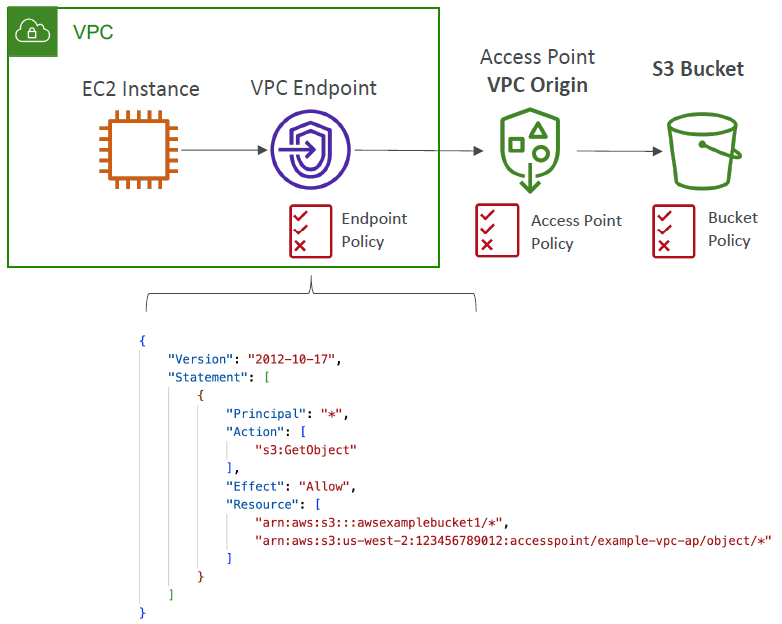

### S3 Object Lambda
* Use AWS Lambda Functions to change the object before it is retrieved by the caller application
* Only one S3 bucket is needed, on top of which we create S3 Access Point and S3 Object Lambda Access Points.
  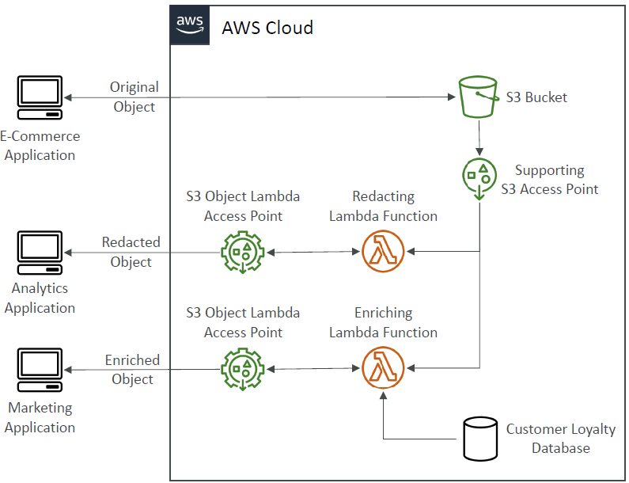
* Use Cases:
    - Redacting personally identifiable information for analytics or nonproduction environments.
    - Converting across data formats, such as converting XML to JSON.
    - Resizing and watermarking images on the fly using caller-specific details, such as the user who requested the object.