<!-- START doctoc generated TOC please keep comment here to allow auto update -->
<!-- DON'T EDIT THIS SECTION, INSTEAD RE-RUN doctoc TO UPDATE -->
**Table of Contents**

- [CloudFront](#cloudfront)
  - [Origins](#origins)
  - [CloudFront at a high level](#cloudfront-at-a-high-level)
  - [CloudFront – S3 as an Origin](#cloudfront--s3-as-an-origin)
  - [CloudFront vs S3 Cross Region Replication](#cloudfront-vs-s3-cross-region-replication)
  - [CloudFront Caching](#cloudfront-caching)
  - [What is CloudFront Cache Key?](#what-is-cloudfront-cache-key)
  - [CloudFront Policies – Cache Policy](#cloudfront-policies--cache-policy)
  - [CloudFront – Cache Invalidations](#cloudfront--cache-invalidations)
  - [CloudFront – Cache Behaviors](#cloudfront--cache-behaviors)
  - [CloudFront – ALB or EC2 as an origin](#cloudfront--alb-or-ec2-as-an-origin)
  - [CloudFront Geo Restriction](#cloudfront-geo-restriction)
  - [CloudFront Signed URL / Signed Cookies](#cloudfront-signed-url--signed-cookies)
  - [CloudFront Signed URL vs S3 Pre-Signed URL](#cloudfront-signed-url-vs-s3-pre-signed-url)
  - [CloudFront - Pricing](#cloudfront---pricing)
  - [CloudFront – Multiple Origin](#cloudfront--multiple-origin)
  - [CloudFront – Origin Groups](#cloudfront--origin-groups)
  - [CloudFront – Field Level Encryption](#cloudfront--field-level-encryption)
  - [CloudFront – Real Time Logs](#cloudfront--real-time-logs)

<!-- END doctoc generated TOC please keep comment here to allow auto update -->

## CloudFront

* Content Delivery Network (CDN)
* Improves read performance, content is cached at the edge
* Improves users experience (lower latency)
* 216 Point of Presence globally (edge locations)
* DDoS protection (because worldwide), integration with Shield, AWS Web Application Firewall
  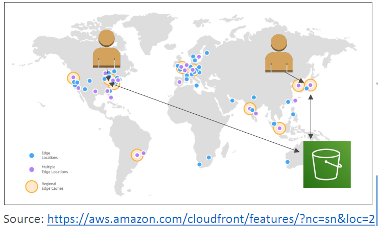

### Origins
* S3 bucket
    - For distributing files and caching them at the edge
    - Enhanced security with CloudFront Origin Access Control (OAC)
    - OAC is replacing Origin Access Identity (OAI)
    - CloudFront can be used as an ingress (to upload files to S3)
* Custom Origin (HTTP)
    - Application Load Balancer
    - EC2 instance
    - S3 website (must first enable the bucket as a static S3 website)
    - Any HTTP backend you want

### CloudFront at a high level
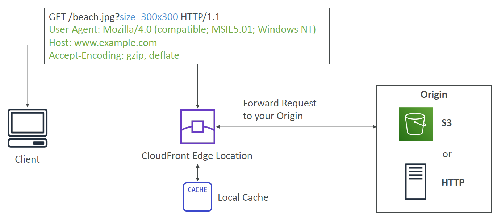

### CloudFront – S3 as an Origin
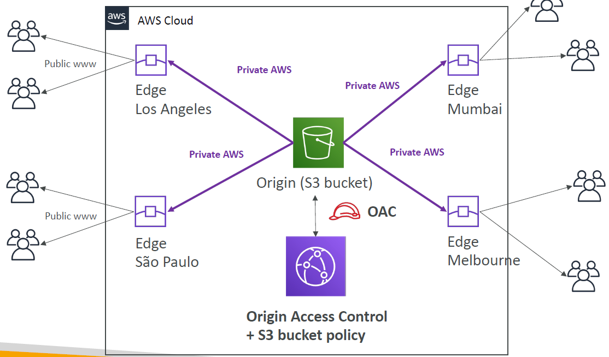
Origin Access Control secures S3 bucket.

### CloudFront vs S3 Cross Region Replication
* CloudFront:
    - Global Edge network
    - Files are cached for a TTL (maybe a day)
    - Great for static content that must be available everywhere
* S3 Cross Region Replication:
    - Must be setup for each region you want replication to happen
    - Files are updated in near real-time
    - Read only
    - Great for dynamic content that needs to be available at low-latency in few regions

### CloudFront Caching
* The cache lives at each CloudFront Edge Location
* CloudFront identifies each object in the cache using the Cache Key (see next slide)
* You want to maximize the Cache Hit ratio to minimize requests to the origin
* You can invalidate part of the cache using the CreateInvalidation API
  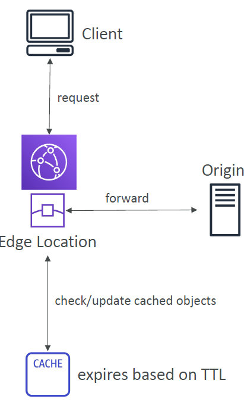

### What is CloudFront Cache Key?
* A unique identifier for every object in the cache
* By default, consists of hostname + resource portion of the URL
* If you have an application that serves up content that varies based on user, device, language, location…
* You can add other elements (HTTP headers, cookies, query strings) to the Cache Key using CloudFront Cache Policies
  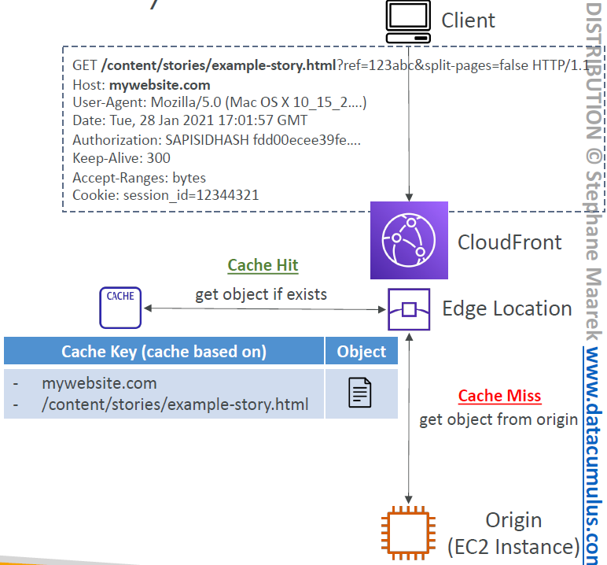

### CloudFront Policies – Cache Policy
* Cache based on:
    - HTTP Headers: None – Whitelist
    - Cookies: None – Whitelist – Include All-Except – All
    - Query Strings: None – Whitelist – Include All-Except – All
* Control the TTL (0 seconds to 1 year), can be set by the origin using the Cache-Control header, Expires header…
* Create your own policy or use Predefined Managed Policies
* All HTTP headers, cookies, and query strings that you include in the Cache Key are automatically included in origin requests

#### CloudFront Caching – Cache Policy HTTP Headers
* None:
    - Don’t include any headers in the Cache Key (except default)
    - Headers are not forwarded (except default)
    - Best caching performance
* Whitelist:
    - only specified headers included in the Cache Key
    - Specified headers are also forwarded to Origin
      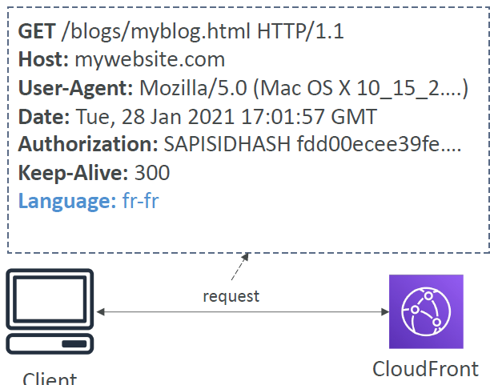

#### CloudFront Cache – Cache Policy Query Strings
* None
    - Don’t include any query strings in the Cache Key
    - Query strings are not forwarded
* Whitelist
    - Only specified query strings included in the Cache Key
    - Only specified query strings are forwarded
* Include All-Except
    - Include all query strings in the Cache Key except the specified list
    -
    - All query strings are forwarded except the specified list
* All
    - Include all query strings in the Cache Key
    - All query strings are forwarded
    - Worst caching performance
      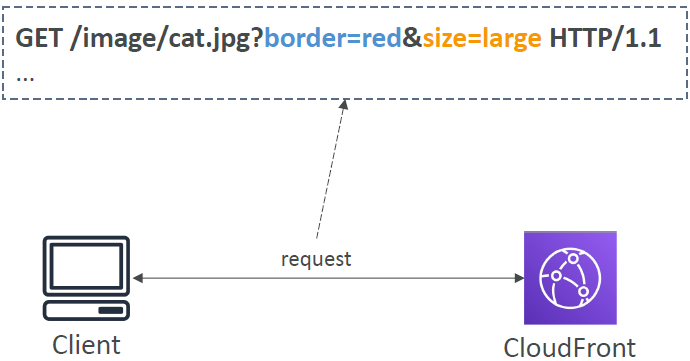

#### CloudFront Policies – Origin Request Policy
* Specify values that you want to include in origin requests without including them in the Cache Key (no duplicated cached content)
* You can include:
    - HTTP headers: None – Whitelist – All viewer headers options
    - Cookies: None – Whitelist – All
    - Query Strings: None – Whitelist – All
* Ability to add CloudFront HTTP headers and Custom Headers to an origin request that were not included in the viewer request
* Create your own policy or use Predefined Managed Policies

#### Cache Policy vs. Origin Request Policy
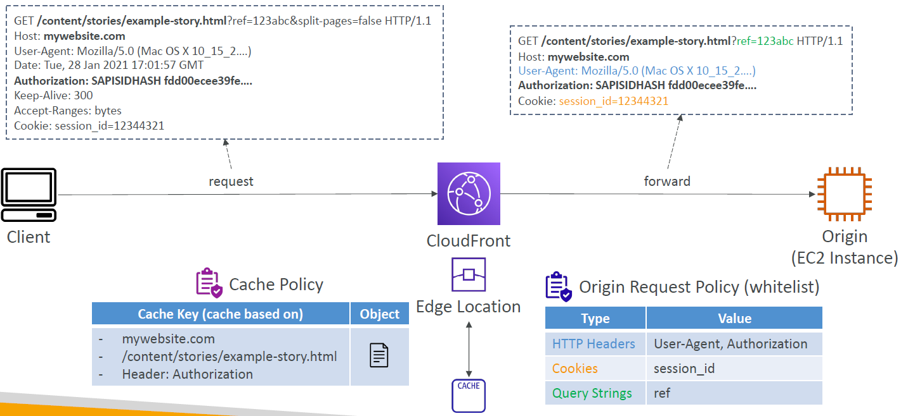
Caching is based on caching policy, but origin may need more information than that --> enhance request to origin.

### CloudFront – Cache Invalidations
* In case you update the back-end origin, CloudFront doesn’t know about it and will only get the refreshed content after the TTL has expired
* However, you can force an entire or partial cache refresh (thus bypassing the TTL) by performing a CloudFront Invalidation
* You can invalidate all files (*) or a special path (/images/*)
  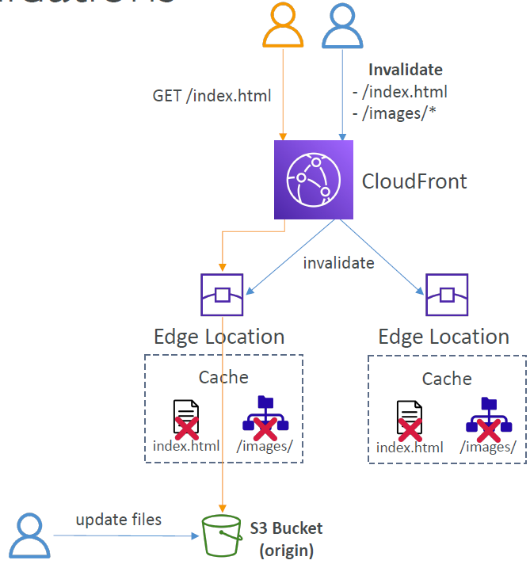

### CloudFront – Cache Behaviors
* Configure different settings for a given URL path pattern
* Example: one specific cache behavior to images/*.jpg files on your origin web server
* Route to different kind of origins/origin groups based on the content type or path pattern
    - /images/*
    - /api/*
    - /* (default cache behavior)
* When adding additional Cache Behaviors, the Default Cache Behavior is always the last to be processed and is always /*

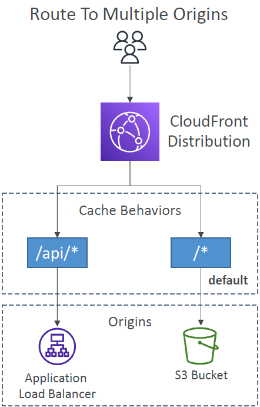

#### CloudFront – Cache Behaviors – Sign In Page
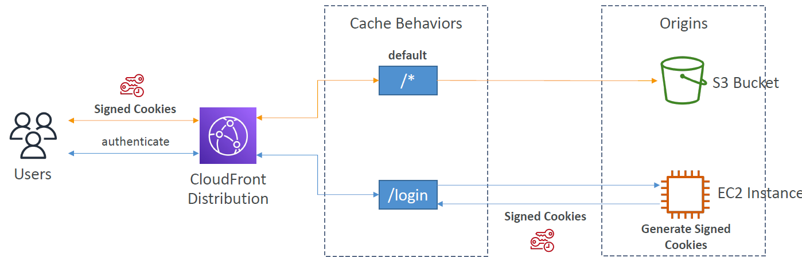

#### CloudFront – Maximize cache hits by separating static and dynamic distributions
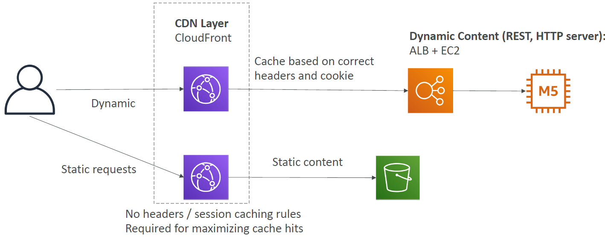

### CloudFront – ALB or EC2 as an origin
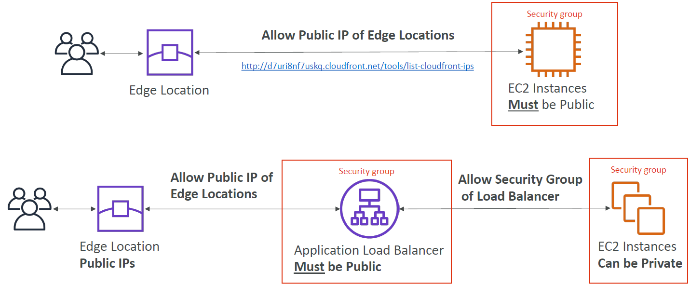

### CloudFront Geo Restriction
* You can restrict who can access your distribution
  -Allowlist: Allow your users to access your content only if they're in one of the countries on a list of approved countries.
    - Blocklist: Prevent your users from accessing your content if they're in one of the countries on a list of banned countries.
* The “country” is determined using a 3rd party Geo-IP database
* Use case: Copyright Laws to control access to content

### CloudFront Signed URL / Signed Cookies
* You want to distribute paid shared content to premium users over the world
* We can use CloudFront Signed URL / Cookie. We attach a policy with:
    - Includes URL expiration
    - Includes IP ranges to access the data from
    - Trusted signers (which AWS accounts can create signed URLs)
* How long should the URL be valid for?
    - Shared content (movie, music): make it short (a few minutes)
    - Private content (private to the user): you can make it last for years
* Signed URL = access to individual files (one signed URL per file)
* Signed Cookies = access to multiple files (one signed cookie for many files)

#### CloudFront Signed URL Diagram
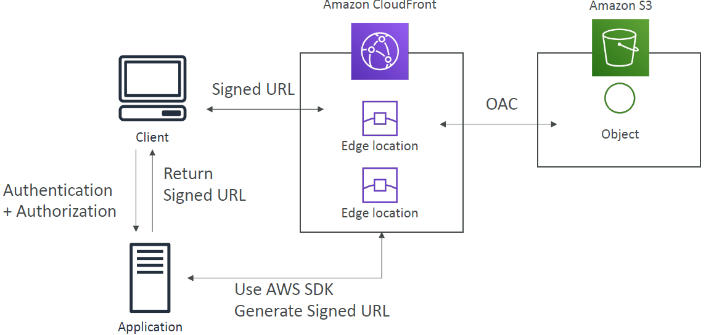

### CloudFront Signed URL vs S3 Pre-Signed URL
* CloudFront Signed URL:
    - Allow access to a path, no matter the origin (not just as s3, but also HTTP etc.)
    - Account wide key-pair, only the root can manage it
    - Can filter by IP, path, date, expiration
    - Can leverage caching features
      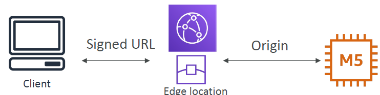
* S3 Pre-Signed URL:
    - Issue a request as the person who pre-signed the URL
    - Uses the IAM key of the signing IAM principal --> person who has that URL has the same rights as signing person
    - Limited lifetime
    - Client can access directly S3 bucket using the pre-signed URL
      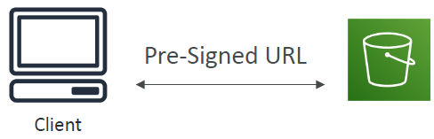

#### CloudFront Signed URL Process
* Two types of signers:
    - Either a trusted key group (recommended)
        - Can leverage APIs to create and rotate keys (and IAM for API security)
    - An AWS Account that contains a CloudFront Key Pair
        - Need to manage keys using the root account and the AWS console
        - Not recommended because you shouldn’t use the root account for this
* In your CloudFront distribution, create one or more trusted key groups
* You generate your own public / private key
    - The private key is used by your applications (e.g. EC2) to sign URLs
    - The public key (uploaded) is used by CloudFront to verify URLs

### CloudFront - Pricing
* CloudFront Edge locations are all around the world
* The cost of data out per edge location varies
  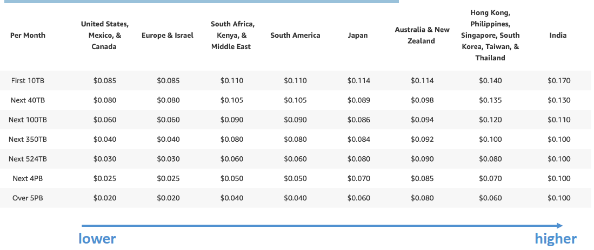

#### CloudFront – Price Classes
* You can reduce the number of edge locations for cost reduction
* Three price classes:
    1. Price Class All: all regions – best performance
    2. Price Class 200: most regions, but excludes the most expensive regions
    3. Price Class 100: only the least expensive regions

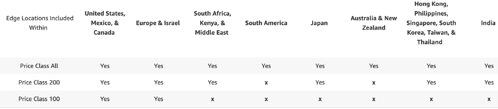

### CloudFront – Multiple Origin
* To route to different kind of origins based on the content type
* Based on path pattern:
    - /images/*
    - /api/*
    - /*

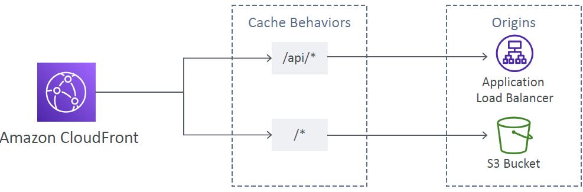

### CloudFront – Origin Groups
* To increase high-availability and do failover
* Origin Group: one primary and one secondary origin
* If the primary origin fails, the second one is used

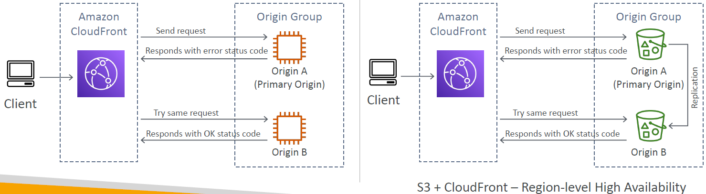

### CloudFront – Field Level Encryption
* Protect user sensitive information through application stack
* Adds an additional layer of security along with HTTPS
* Sensitive information encrypted at the edge close to user
* Uses asymmetric encryption
  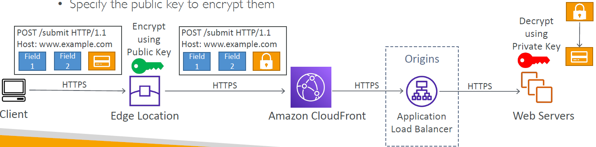
* Usage:
    - Specify set of fields in POST requests that you want to be encrypted (up to 10 fields)
    - Specify the public key to encrypt them

### CloudFront – Real Time Logs
* Get real-time requests received by CloudFront sent to Kinesis Data Streams
* Monitor, analyze, and take actions based on content delivery performance
* Allows you to choose:
    - Sampling Rate – percentage of requests for which you want to receive
    - Specific fields and specific Cache Behaviors (path patterns)

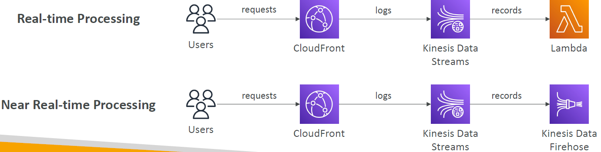