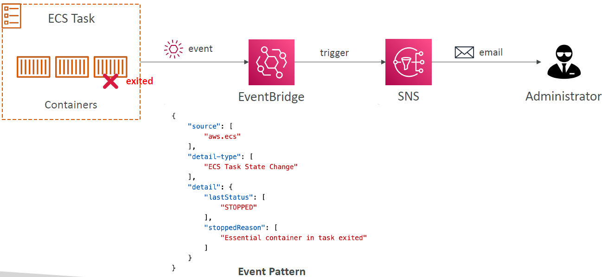

<!-- START doctoc generated TOC please keep comment here to allow auto update -->
<!-- DON'T EDIT THIS SECTION, INSTEAD RE-RUN doctoc TO UPDATE -->
**Table of Contents**

<!-- END doctoc generated TOC please keep comment here to allow auto update -->

## Containers on AWS

### What is Docker?
* Docker is a software development platform to deploy apps
* Apps are packaged in containers that can be run on any OS
* Apps run the same, regardless of where they’re run
    - Any machine
    - No compatibility issues
    - Predictable behavior
    - Less work
    - Easier to maintain and deploy
    - Works with any language, any OS, any technology
* Use cases: microservices architecture, lift-and-shift apps from onpremises to the AWS cloud, …

#### Docker on an OS

#### Where are Docker images stored?
* Docker images are stored in Docker Repositories
* Docker Hub (https://hub.docker.com)
    - Public repository
    - Find base images for many technologies or OS (e.g., Ubuntu, MySQL, …)
* Amazon ECR (Amazon Elastic Container Registry)
    - Private repository
    - Public repository (Amazon ECR Public Gallery https://gallery.ecr.aws)

#### Docker vs. Virtual Machines
* Docker is ”sort of” a virtualization technology, but not exactly
* Resources are shared with the host => many containers on one server

#### Getting Started with Docker

#### Docker Containers Management on AWS
* Amazon Elastic Container Service (Amazon ECS): Amazon’s own container platform
* Amazon Elastic Kubernetes Service (Amazon EKS): Amazon’s managed Kubernetes (open source)
* AWS Fargate
    - Amazon’s own Serverless container platform
    - Works with ECS and with EKS
* Amazon ECR: Store container images

### Amazon ECS - EC2 Launch Type
* ECS = Elastic Container Service
* Launch Docker containers on AWS = Launch ECS Tasks on ECS Clusters
* EC2 Launch Type: you must provision & maintain the infrastructure (the EC2 instances)
* 'Essential container': if it fails and gets killed, all the tasks are going to be stopped. If not essential, then the container can be stopped, and the tasks will continue.

* Each EC2 Instance must run the ECS Agent to register in the ECS Cluster
* AWS takes care of starting / stopping containers
* Security Groups do not matter when an EC2 instance registers with the ECS service. By default, Security Groups allow all outbound traffic.

### Amazon ECS – Fargate Launch Type
* Launch Docker containers on AWS
* You do not provision the infrastructure (no EC2 instances to manage)
* It’s all Serverless!
* You just create task definitions

* 
* AWS just runs ECS Tasks for you based on the CPU / RAM you need
* To scale, just increase the number of tasks. Simple - no more EC2 instances.

#### Amazon ECS – IAM Roles for ECS
* Enable IAM roles for ECS tasks to make API requests to AWS services in `/etc/ecs/ecs.config`: `ECS_ENABLE_TASK_IAM_ROLE`
* EC2 Instance Profile (EC2 Launch Type only):
    - Used by the ECS agent
    - Makes API calls to ECS service
    - Send container logs to CloudWatch Logs
    - Pull Docker image from ECR
    - Reference sensitive data in Secrets Manager or SSM Parameter Store
* ECS Task Role:
    - Allows each task to have a specific role
    - Use different roles for the different ECS Services you run
    - Task Role is defined in the task definition (of ECS service)

#### Amazon ECS – Load Balancer Integrations
* Application Load Balancer supported and works for most use cases
* Network Load Balancer recommended only for high throughput / high performance use cases, or to pair it with AWS Private Link
* Classic Load Balancer supported but not recommended (no advanced features – no Fargate)

#### Amazon ECS – Data Volumes (EFS)
* Mount EFS file systems onto ECS tasks
* Works for both EC2 and Fargate launch types
* Can be shared between different EC2 instances and different ECS Tasks
* Tasks running in any AZ will share the same data in the EFS file system
* Fargate + EFS = Serverless
* Use cases: persistent multi-AZ shared storage for your containers
* Note: Amazon S3 cannot be mounted as a file system

#### ECS Service Auto Scaling
* Automatically increase/decrease the desired number of ECS tasks
* Amazon ECS Auto Scaling uses AWS Application Auto Scaling
    - ECS Service Average CPU Utilization
    - ECS Service Average Memory Utilization - Scale on RAM
    - ALB Request Count Per Target – metric coming from the ALB
* Target Tracking – scale based on target value for a specific CloudWatch metric
* Step Scaling – scale based on a specified CloudWatch Alarm
* Scheduled Scaling – scale based on a specified date/time (predictable changes)
* ECS Service Auto Scaling (task level) ≠ EC2 Auto Scaling (EC2 instance level)
* Fargate Auto Scaling is much easier to setup (because Serverless)

#### EC2 Launch Type – Auto Scaling EC2 Instances
* Accommodate ECS Service Scaling by adding underlying EC2 Instances
* Auto Scaling Group Scaling
    - Scale your ASG based on CPU Utilization
    - Add EC2 instances over time
* ECS Cluster Capacity Provider (newer)
    - Used to automatically provision and scale the infrastructure for your ECS Tasks
    - Capacity Provider paired with an Auto Scaling Group
    - Add EC2 Instances when you’re missing capacity (CPU, RAM…)

#### ECS Rolling Updates
* When updating from v1 to v2, we can control how many tasks can be started and stopped, and in which order
  
  

##### ECS Rolling Update – Min 50%, Max 100%
* Starting number of tasks: 4
  

##### ECS Rolling Update – Min 100%, Max 150%
* Starting number of tasks: 4
  

##### ECS tasks invoked by Event Bridge

##### ECS tasks invoked by Event Bridge Schedule

##### ECS – SQS Queue Example

##### ECS – Intercept Stopped Tasks using EventBridge

#### Amazon ECS – Task Definitions
* Task definitions are metadata in JSON form to tell ECS how to run a Docker container
* It contains crucial information, such as:
    - Image Name
    - Port Binding for Container and Host
    - Memory and CPU required
    - Environment variables
    - Networking information
    - IAM Role
    - Logging configuration (ex CloudWatch)
* Can define up to 10 containers in a Task Definition

#### Amazon ECS – Load Balancing (EC2 Launch Type)
* We get a Dynamic Host Port Mapping if you define only the container port in the task definition
* The ALB finds the right port on your EC2 Instances (does not work with a Classic Load Balancer)
* You must allow on the EC2 instance’s Security Group any port from the ALB’s Security Group
* To enable random host port, set host port=0 (or empty) which allows multiple containers of the same type to launch on the same EC2 container instance. Otherwise, only the first container in an EC2 instance will start, the others not.

#### Amazon ECS – Load Balancing (Fargate)
* Each task has a unique private IP (through an Elastic Network Interface (ENI))
* Only define the container port (host port is not applicable)
* Example
    - ECS ENI Security Group: Allow port 80 from the ALB
    - ALB Security Group: Allow port 80/443 (443: SSL) from web

#### Amazon ECS - One IAM Role per Task Definition
* The role is defined at the task definition level (not at the service level). This way, each task in the ECS service inherits the task role.
*

#### Amazon ECS – Environment Variables
* Environment Variable
    - Hardcoded – e.g., URLs
    - SSM Parameter Store – sensitive variables (e.g., API keys, shared configs)
    - Secrets Manager – sensitive variables (e.g., DB passwords)
* Environment Files (bulk) – Amazon S3

#### Amazon ECS – Data Volumes (Bind Mounts)
* Share data between multiple containers in the same Task Definition
* Works for both EC2 and Fargate tasks
* EC2 Tasks – using EC2 instance storage
    - Data are tied to the lifecycle of the EC2 instance
* Fargate Tasks – using ephemeral storage
    - Data are tied to the container(s) using them
    - 20 GiB – 200 GiB (default 20 GiB)

* Use cases:
    - Share ephemeral data between multiple containers
    - “Sidecar” container pattern, where the “sidecar” container used to send metrics/logs to other destinations (separation of concerns)

#### Amazon ECS – Task Placement
* When an ECS task is started with EC2 Launch Type, ECS must determine where to place it, with the constraints of CPU and memory (RAM)
* Similarly, when a service scales in, ECS needs to determine which task to terminate
* You can define:
    - Task Placement Strategy
    - Task Placement Constraints
* Note: only for ECS Tasks with EC2 Launch Type (Fargate not supported since Fargate does this by itself - fully managed)

##### Amazon ECS – Task Placement Process
* Task Placement Strategies are a best effort
* When Amazon ECS places a task, it uses the following process to select the appropriate EC2 Container instance:
    1. Identify which instances that satisfy the CPU, memory, and port requirements
    2. Identify which instances that satisfy the Task Placement Constraints
    3. Identify which instances that satisfy best the Task Placement Strategies
    4. Select the instances and place task there

##### Amazon ECS – Task Placement Strategies
* Binpack (packs all the containers together)
    - Tasks are placed on the least available amount of CPU and Memory
    - When it can't put any more containers on an EC2 instance, it will create a new one and place the container there
    - Minimizes the number of EC2 instances in use (cost savings)
      
* Random
    - Tasks are placed randomly
      
* Spread
    - Tasks are placed evenly based on the specified value
    - Example: instanceId, attribute:ecs.availability-zone, …
      
* The strategies can be mixed together
  

##### Amazon ECS – Task Placement Constraints
* distinctInstance: Tasks are placed on a different EC2 instance
  
* memberOf
    - Tasks are placed on EC2 instances that satisfy a specified expression
    - Uses the Cluster Query Language (advanced)
      

### Amazon ECR
* ECR = Elastic Container Registry
* Store and manage Docker images on AWS
* Private and Public repository (Amazon ECR Public Gallery https://gallery.ecr.aws)
* Fully integrated with ECS, backed by Amazon S3
* Access is controlled through IAM (permission errors => policy)
* Supports image vulnerability scanning, versioning, image tags, image lifecycle, …

#### ECR – Using AWS CLI
* Login Command
    - AWS CLI v2: `aws ecr get-login-password --region region | docker login --username AWS --password-stdin aws_account_id.dkr.ecr.region.amazonaws.com`
* Docker Commands
    - Push: `docker push aws_account_id.dkr-ecr.region.amazonaws.com/demo:latest`
    - Pull `docker pull aws_account_id.dkr.ecr.region.amazonaws.com/demo:latest`
* In case an EC2 instance (or you) can’t pull a Docker image, check IAM
  permissions

### AWS Copilot
* CLI tool to build, release, and operate production-ready containerized apps
* Run your apps on AppRunner, ECS, and Fargate
* Helps you focus on building apps rather than setting up infrastructure
* Provisions all required infrastructure for containerized apps (ECS, VPC, ELB, ECR…)
* Automated deployments with one command using CodePipeline
* Deploy to multiple environments
* Troubleshooting, logs, health status…
  

### Amazon EKS Overview
* Amazon EKS = Amazon Elastic Kubernetes Service
* It is a way to launch managed Kubernetes clusters on AWS
  • Kubernetes is an open-source system for automatic deployment, scaling and management of containerized (usually Docker) application
* It’s an alternative to ECS, similar goal but different API
* EKS supports EC2 if you want to deploy worker nodes or Fargate to deploy serverless containers
* Use case: if your company is already using Kubernetes on-premises or in another cloud, and wants to migrate to AWS using Kubernetes
* Kubernetes is cloud-agnostic (can be used in any cloud – Azure, GCP…)
* For multiple regions, deploy one EKS cluster per region
* Collect logs and metrics using CloudWatch Container Insights
  
* EKS nodes are similar to EC2 instances
* EKS Pods are similar to ECS Tasks

#### EKS – Node Types
* Managed Node Groups
    - Creates and manages Nodes (EC2 instances) for you
    - Nodes are part of an ASG managed by EKS
    - Supports On-Demand or Spot Instances
* Self-Managed Nodes
    - Nodes created by you and registered to the EKS cluster and managed by an ASG
    - You can use prebuilt AMI: Amazon EKS Optimized AMI (Amazon Machine Image)
    - Supports On-Demand or Spot Instances
* AWS Fargate
    - No maintenance required; no nodes managed

#### EKS – Data Volumes
* Need to specify StorageClass manifest on your EKS cluster
* Leverages a Container Storage Interface (CSI) compliant driver
* Support for…
    - Amazon EBS
    - Amazon EFS (works with Fargate)
    - Amazon FSx for Lustre
    - Amazon FSx for NetApp ONTAP
