<!-- START doctoc generated TOC please keep comment here to allow auto update -->
<!-- DON'T EDIT THIS SECTION, INSTEAD RE-RUN doctoc TO UPDATE -->
**Table of Contents**

- [AWS CloudFormation](#aws-cloudformation)
  - [CloudFormation – Template Example](#cloudformation--template-example)
  - [Benefits of AWS CloudFormation](#benefits-of-aws-cloudformation)
  - [How CloudFormation Works](#how-cloudformation-works)
  - [Deploying CloudFormation Templates](#deploying-cloudformation-templates)
  - [CloudFormation – Building Blocks](#cloudformation--building-blocks)
  - [Introductory Example](#introductory-example)
  - [YAML Crash Course](#yaml-crash-course)
  - [CloudFormation – Resources](#cloudformation--resources)
  - [CloudFormation – Resources FAQ](#cloudformation--resources-faq)
  - [CloudFormation – Parameters](#cloudformation--parameters)
    - [When should you use a Parameter?](#when-should-you-use-a-parameter)
    - [CloudFormation – Parameters Settings](#cloudformation--parameters-settings)
    - [How to Reference a Parameter?](#how-to-reference-a-parameter)
    - [CloudFormation – Pseudo Parameters](#cloudformation--pseudo-parameters)
    - [CloudFormation – Mappings](#cloudformation--mappings)
    - [Accessing Mapping Values (Fn::FindInMap)](#accessing-mapping-values-fnfindinmap)
    - [When would you use Mappings vs. Parameters?](#when-would-you-use-mappings-vs-parameters)
  - [CloudFormation – Outputs](#cloudformation--outputs)
    - [CloudFormation – Outputs Cross-Stack Reference](#cloudformation--outputs-cross-stack-reference)
  - [CloudFormation – Conditions](#cloudformation--conditions)
    - [How to define a Condition](#how-to-define-a-condition)
    - [How to use a Condition](#how-to-use-a-condition)
  - [CloudFormation – Intrinsic Functions](#cloudformation--intrinsic-functions)
    - [Intrinsic Functions – Fn::Ref](#intrinsic-functions--fnref)
    - [Intrinsic Functions – Fn::GetAtt](#intrinsic-functions--fngetatt)
    - [Intrinsic Functions – Fn::FindInMap](#intrinsic-functions--fnfindinmap)
    - [Intrinsic Functions – Fn::ImportValue](#intrinsic-functions--fnimportvalue)
    - [Intrinsic Functions – Fn::Base64](#intrinsic-functions--fnbase64)
    - [Intrinsic Functions – Condition Functions](#intrinsic-functions--condition-functions)
  - [CloudFormation – Rollbacks](#cloudformation--rollbacks)
  - [CloudFormation – Service Role](#cloudformation--service-role)
  - [CloudFormation Capabilities](#cloudformation-capabilities)
  - [CloudFormation – DeletionPolicies](#cloudformation--deletionpolicies)
    - [CloudFormation – DeletionPolicy Delete](#cloudformation--deletionpolicy-delete)
    - [CloudFormation – DeletionPolicy Retain](#cloudformation--deletionpolicy-retain)
    - [CloudFormation – DeletionPolicy Snapshot](#cloudformation--deletionpolicy-snapshot)
  - [CloudFormation – Stack Policies](#cloudformation--stack-policies)
  - [CloudFormation – Termination Protection](#cloudformation--termination-protection)
  - [CloudFormation – Custom Resources](#cloudformation--custom-resources)
    - [How to define a Custom Resource?](#how-to-define-a-custom-resource)
  - [Use Case – Delete content from an S3 bucket](#use-case--delete-content-from-an-s3-bucket)
  - [CloudFormation – StackSets](#cloudformation--stacksets)

<!-- END doctoc generated TOC please keep comment here to allow auto update -->

## AWS CloudFormation
Managing your infrastructure as code

* CloudFormation is a declarative way of outlining your AWS Infrastructure, for any resources (most of them are supported)
* For example, within a CloudFormation template, you say:
    - I want a security group
    - I want two EC2 instances using this security group
    - I want two Elastic IPs for these EC2 instances
    - I want an S3 bucket
    - I want a load balancer (ELB) in front of these EC2 instances
* Then CloudFormation creates those for you, in the right order, with the exact configuration that you specify

### CloudFormation – Template Example
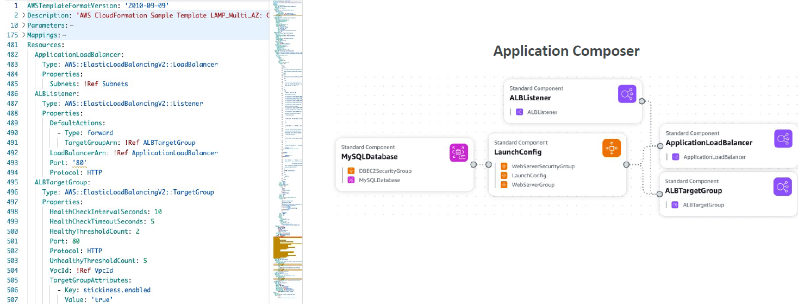

### Benefits of AWS CloudFormation
* Infrastructure as code
    - No resources are manually created, which is excellent for control
    - The code can be version controlled for example using Git
    - Changes to the infrastructure are reviewed through code
* Cost
    - Each resource within the stack is tagged with an identifier so you can easily see how much a stack costs you
    - You can estimate the costs of your resources using the CloudFormation template
    - Savings strategy: In Dev, you could automate deletion of templates at 5 PM and recreated at 8 AM, safely
* Productivity
    - Ability to destroy and re-create an infrastructure on the cloud on the fly
    - Automated generation of Diagram for your templates!
    - Declarative programming (no need to figure out ordering and orchestration)
* Separation of concern: create many stacks for many apps, and many layers. Ex:
    - VPC stacks
    - Network stacks
    - App stacks
* Don’t re-invent the wheel
    - Leverage existing templates on the web!
    - Leverage the documentation

### How CloudFormation Works
* Templates must be uploaded in S3 and then referenced in CloudFormation. If you upload the template from the AWS console it gets uploaded to S3 behind the scenes, and CloudFormation references that template from there.
  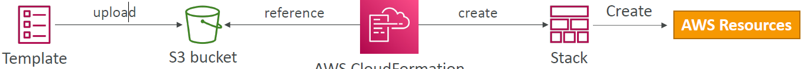
* Then a stack is created. A stack ist made of AWS resources. Stacks are identified by a name.
* To update a template, we can’t edit previous ones. We have to reupload a new version of the template to AWS
* Deleting a stack deletes every single artifact that was created by CloudFormation.
* Q: When you write a CloudFormation template, you must specify the order in which CloudFormation should create your resources.  
  A: False

### Deploying CloudFormation Templates
• Manual way
- Editing templates in Application Composer or code editor
- Using the console to input parameters, etc…
- We’ll mostly do this way in the course for learning purposes
  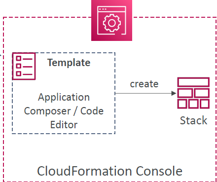
* Automated way
    - Editing templates in a YAML file
    - Using the AWS CLI (Command Line Interface) to deploy the templates, or using a Continuous Delivery (CD) tool
    - Recommended way when you fully want to automate your flow
      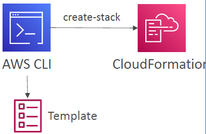

### CloudFormation – Building Blocks
* Template’s Components
    - AWSTemplateFormatVersion – identifies the capabilities of the template “2010-09-09”
    - Description – comments about the template
    - Resources (MANDATORY) – your AWS resources declared in the template
    - Parameters – the dynamic inputs for your template
    - Mappings – the static variables for your template
    - Outputs – references to what has been created
    - Conditionals – list of conditions to perform resource creation
* Template’s Helpers
    - References
    - Functions

### Introductory Example
• We’re going to create a simple EC2 instance
• And we’re going to add security group to it
• For now, forget about the code syntax
• We’ll look at the structure of the files later
• We’ll see how in no-time, we are able to get started
with CloudFormation!

### YAML Crash Course
* YAML and JSON are the languages you can use for CloudFormation
* JSON is horrible for CF
* YAML is great in so many ways
* Let’s learn a bit about it!
* Key value Pairs
* Nested objects
* Support Arrays
* Multi line strings
* Can include comments!

### CloudFormation – Resources
* Resources are the core of your CloudFormation template (MANDATORY)
* They represent the different AWS Components that will be created and configured
* Resources are declared and can reference each other
* AWS figures out creation, updates and deletes of resources for us
* There are over 700 types of resources (!)
* Resource types identifiers are of the form: `service-provider::service-name::data-type-name` (e.g. `AWS::EC2::Instance`)
* All the resources can be found here:
  https://docs.aws.amazon.com/AWSCloudFormation/latest/UserGuide/aws-template-resource-type-ref.html  
  Example here (for an EC2 instance): https://docs.aws.amazon.com/AWSCloudFormation/latest/UserGuide/aws-resource-ec2-instance.html

### CloudFormation – Resources FAQ
* Can I create a dynamic number of resources?
    - Yes, you can by using CloudFormation Macros and Transform
    - It is not in the scope of this course
* Is every AWS Service supported?
    - Almost. Only a select few niches are not there yet
    - You can work around that using CloudFormation Custom Resources

### CloudFormation – Parameters
* Parameters are a way to provide inputs to your AWS CloudFormation template
* They’re important to know about if:
    - You want to reuse your templates across the company
    - Some inputs can not be determined ahead of time
* Parameters are extremely powerful, controlled, and can prevent errors from happening in your templates, thanks to types

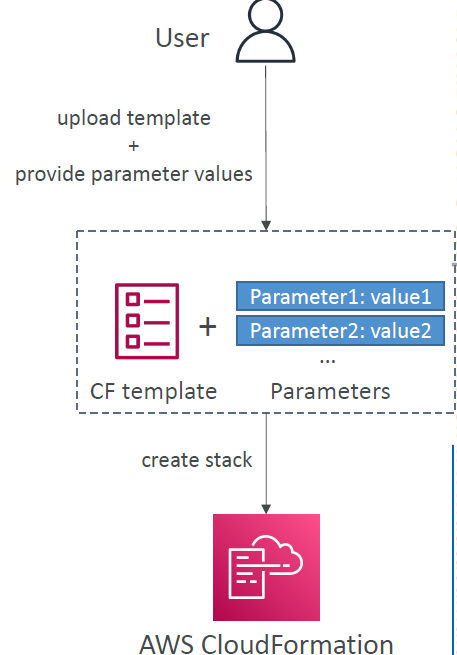

#### When should you use a Parameter?
```yaml
Parameters:
  SecurityGroupDescription:
    Description: Security Group Description
    Type: String
```
* Ask yourself this:
    - Is this CloudFormation resource configuration likely to change in the future?
    - If so, make it a parameter
* You won’t have to re-upload a template to change its content

#### CloudFormation – Parameters Settings
Parameters can be controlled by all these settings:
* Type:
    - String
    - Number
    - CommaDelimitedList
    - List<Number>
    - AWS-Specific Parameter (to help catch invalid values – match against existing values in the AWS account)
    - List<AWS-Specific Parameter>
    - SSM Parameter (get parameter value from SSM Parameter store)
* Description
* ConstraintDescription (String)
* Min/MaxLength
* Min/MaxValue
* Default
* AllowedValues (array)
* AllowedPattern (regex)
* NoEcho (Boolean)

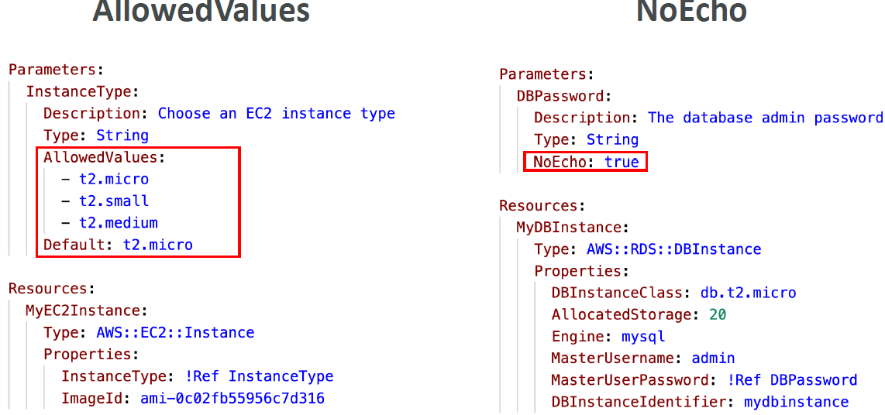

#### How to Reference a Parameter?
```yaml
Resources:
  DBSubnet1:
    Type: AWS::EC2::Subnet
    Properties:
      VpcId: !Ref  MyVPC
```
* The Fn::Ref function can be leveraged to reference parameters
* Parameters can be used anywhere in a template
* The shorthand for this in YAML is !Ref
* The function can also reference other elements within the template, e.g. Resources --> Parameters should not have the same name as Resources!
* Conditions cannot be references with `!Ref`

#### CloudFormation – Pseudo Parameters
* AWS offers us Pseudo Parameters in any CloudFormation template
* These can be used at any time and are enabled by default
* Important pseudo parameters:
  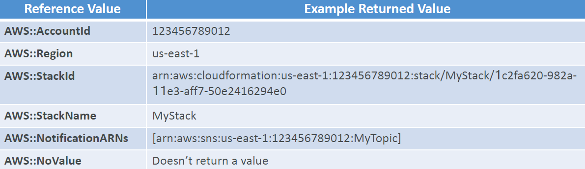
  `AWS::AccountId` will be your accountId, etc.

#### CloudFormation – Mappings
* Mappings are fixed variables within your CloudFormation template
* They’re very handy to differentiate between different environments (dev vs prod), regions (AWS regions), AMI types…
* All the values are hardcoded within the template
  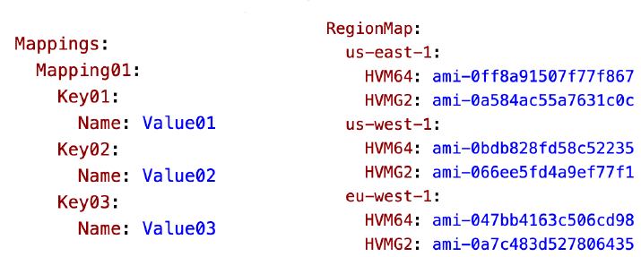

#### Accessing Mapping Values (Fn::FindInMap)
* We use Fn::FindInMap to return a named value from a specific key
* !FindInMap [ MapName, TopLevelKey, SecondLevelKey ]
  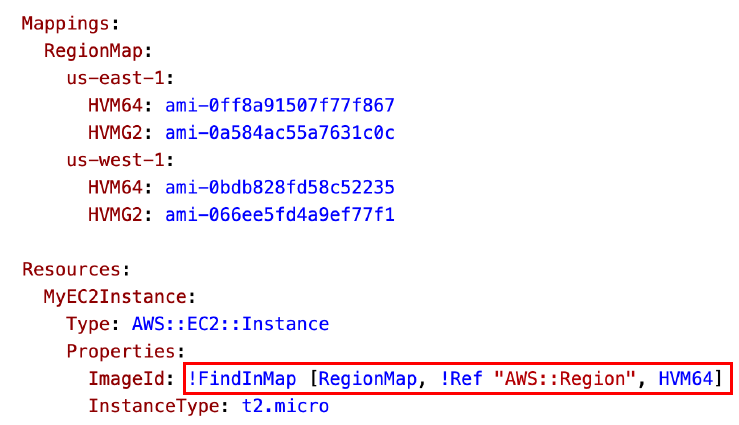
* Mappings work great for AMIs because AMIs are region-specific!

#### When would you use Mappings vs. Parameters?
* Mappings are great when you know in advance all the values that can be taken and that they can be deduced from variables such as
    - Region
    - Availability Zone
    - AWS Account
    - Environment (dev vs prod)
    - etc…
* They allow safer control over the template
* Use parameters when the values are really user specific

### CloudFormation – Outputs
* The Outputs section declares *optional* outputs values that we can import into other stacks (if you export them first)!

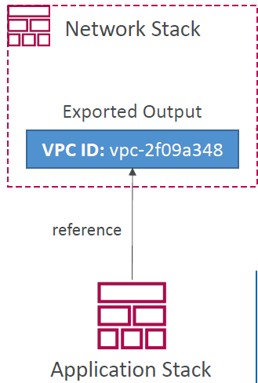
* You can also view the outputs in the AWS Console or in using the AWS CLI
* They’re very useful for example if you define a network CloudFormation, and output the variables such as VPC ID and your Subnet IDs
* It’s the best way to perform some collaboration cross stack, as you let expert handle their own part of the stack
* Creating a SSH Security Group as part of one template
* We create an output that references that security group
  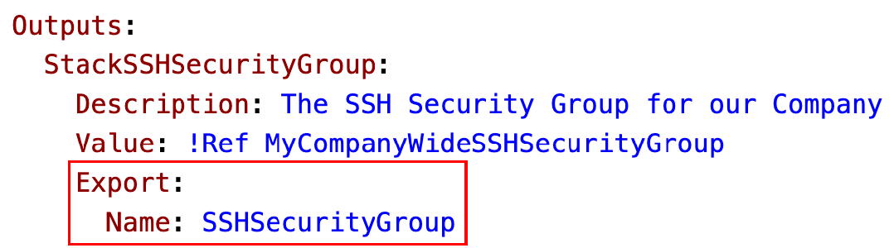

#### CloudFormation – Outputs Cross-Stack Reference
* We then create a second template that leverages that security group
* For this, we use the Fn::ImportValue function
* You can’t delete the underlying stack until all the references are deleted
  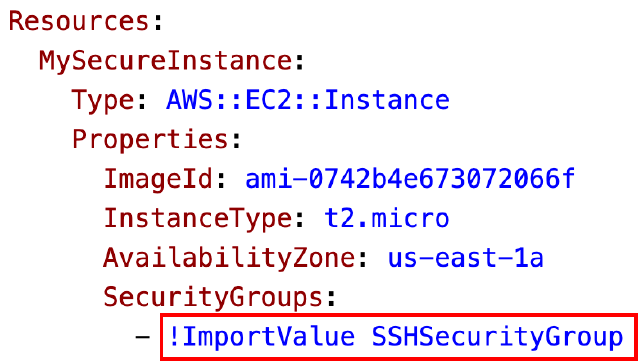
* Q: You have 2 CloudFormation templates. Template A contains the networking components (VPC, Subnets, SGs, ...) and template B contains the application infrastructure (EC2 instances, ALB, EBS, ...). You want to attach the SGs in template A to the EC2 instances in template B. How would you achieve this task?  
  A: Export the SG IDs in the Outputs section from template A, then import exported values in template B using `Fn::ImportValue`.

### CloudFormation – Conditions
* Conditions are used to control the creation of resources or outputs based on a condition
* Conditions can be whatever you want them to be, but common ones are:
    - Environment (dev / test / prod)
    - AWS Region
    - Any parameter value
* Each condition can reference another condition, parameter value or mapping
  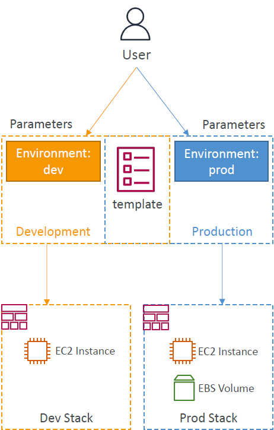

#### How to define a Condition
```yaml
Conditions:
  CreateProdResources: !Equals [ !Ref EnvType, prod ]
```
* The logical ID is for you to choose. It’s how you name condition
* The intrinsic function (logical) can be any of the following:
    - Fn::And
    - Fn::Equals
    - Fn::If
    - Fn::Not
    - Fn::Or

#### How to use a Condition
* Conditions can be applied to resources / outputs / etc…
```yaml
Resources:
  MountPoint:
    Type: AWS::EC2::VolumeAttachment
    Condition: CreateProdResources
```

### CloudFormation – Intrinsic Functions
* Ref
* Fn::GetAtt
* Fn::FindInMap
* Fn::ImportValue
* Fn::Join
* Fn::Sub
* Fn::ForEach
* Fn::ToJsonString
* Fn::Base64
* Fn::Cidr
* Fn::GetAZs
* Fn::Select
* Fn::Split
* Fn::Transform
* Fn::Length
* Condition Functions (Fn::If, Fn::Not, Fn::Equals, etc…)

#### Intrinsic Functions – Fn::Ref
* The Fn::Ref function can be leveraged to reference
* Parameters – returns the value of the parameter
* Resources – returns the physical ID of the underlying resource (e.g., EC2 ID)
* The shorthand for this in YAML is !Ref
```yaml
Resources:
  DBSubnet1:
    Type: AWS::EC2::Subnet
    Properties:
      VpcId: !Ref MyVPC
```
* Ref returns the instance ID

#### Intrinsic Functions – Fn::GetAtt
* Attributes are attached to any resources you create
* To know the attributes of your resources, the best place to look at is the documentation
* Example: the AZ of an EC2 instance!
  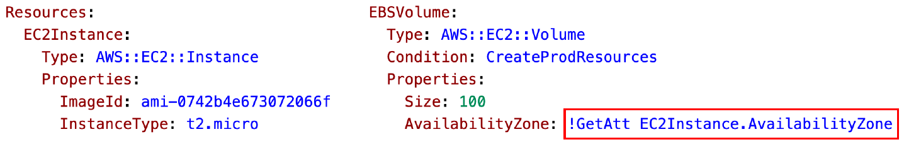
* Could also be e.g. the `PrivateDnsName` or `PublicIp`

#### Intrinsic Functions – Fn::FindInMap
* We use Fn::FindInMap to return a named value from a specific key
* !FindInMap [ MapName, TopLevelKey, SecondLevelKey ]
  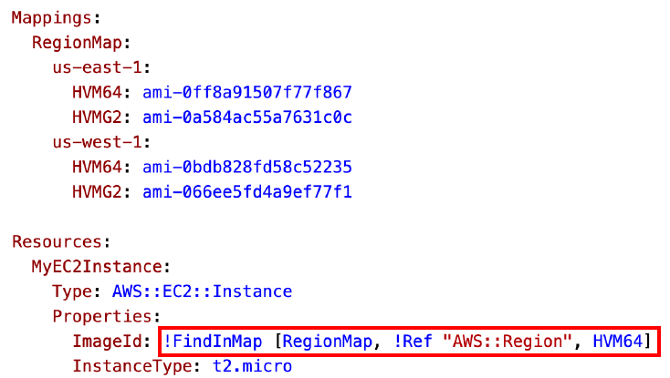

#### Intrinsic Functions – Fn::ImportValue
* Import values that are exported in other stacks
* For this, we use the Fn::ImportValue function
  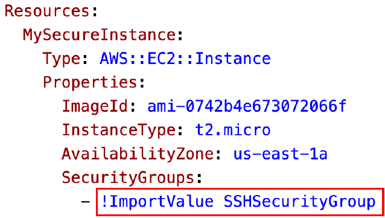

#### Intrinsic Functions – Fn::Base64
* Convert String to it’s Base64 representation
```yaml
!Base64 "ValueToEncode"
```
* Example: pass encoded data to EC2 Instance’s UserData property
  

#### Intrinsic Functions – Condition Functions
```yaml
Conditions:
  CreateProdResources: !Equals [ !Ref EnvType, prod ]
```
* The logical ID is for you to choose. It’s how you name condition
* The intrinsic function (logical) can be any of the following:
    - Fn::And
    - Fn::Equals
    - Fn::If
    - Fn::Not
    - Fn::Or

### CloudFormation – Rollbacks
* Stack Creation Fails:
    - Default: everything rolls back (gets deleted). We can look at the log (but not the resources).
    - Option to disable rollback and troubleshoot what happened
* Stack Update Fails:
    - The stack automatically rolls back to the previous known working state
    - Ability to see in the log what happened and error messages
* Rollback Failure?  
  --> Fix resources manually (through Console or API)  
  --> then issue ContinueUpdateRollback API from Console (try rolling back again)  
  --> Or from the CLI using continue-update-rollback API call
* Q: An Administrator created an AWS CloudFormation template for the first time. The stack failed with a status of ROLLBACK_COMPLETE. The Administrator identified and resolved the template issue that caused the failure. How should the Administrator continue with the stack deployment?  
  A: Delete the failed stack and create a new stack

### CloudFormation – Service Role
* IAM role that allows CloudFormation to create/update/delete stack resources on your behalf
* Give ability to users to create/update/delete the stack resources even if they don’t have permissions to work with the resources in the stack
* Use cases:
    - You want to achieve the least privilege principle
    - But you don’t want to give the user all the required permissions to create the stack resources (but only the permissions to invoke a service role on CloudFormation)
* User must have iam:PassRole permissions (necessary permission to give a role to a specific service in AWS)
  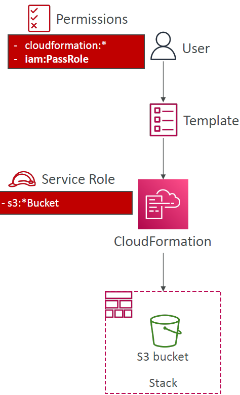

### CloudFormation Capabilities
* CAPABILITY_NAMED_IAM and CAPABILITY_IAM
    - Necessary to enable when your CloudFormation template is creating or updating IAM resources (IAM User, Role, Group, Policy, Access Keys, Instance Profile…)
    - Specify CAPABILITY_NAMED_IAM if the resources are named
    - Otherwise CAPABILITY_IAM
* CAPABILITY_AUTO_EXPAND
    - Necessary when your CloudFormation template includes Macros or Nested Stacks (stacks within stacks) to perform dynamic transformations
    - You’re acknowledging that your template may change before deploying
* InsufficientCapabilitiesException
    - Exception that will be thrown by CloudFormation if the capabilities haven’t been acknowledged when deploying a template (security measure)

### CloudFormation – DeletionPolicies

#### CloudFormation – DeletionPolicy Delete
* DeletionPolicy:
    - Control what happens when the CloudFormation template is deleted or when a resource is removed from a CloudFormation template
    - Extra safety measure to preserve and backup resources
* Default DeletionPolicy=Delete
    - Instance will be deleted whenever the CloudFormation stack is deleted.
    - ⚠ Delete won’t work on an S3 bucket if the bucket is not empty. --> implement custom resource to delete everything within the S3 bucket before automatically having the S3 bucket go away.
      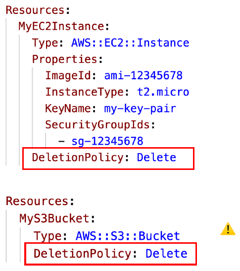

#### CloudFormation – DeletionPolicy Retain
* DeletionPolicy=Retain:
    - Specify on resources to preserve in case of CloudFormation deletes
* Works with any resources
  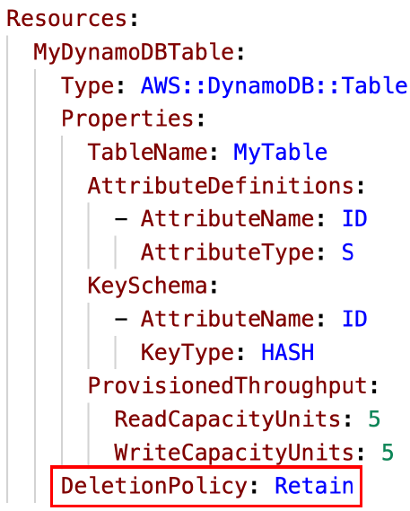

#### CloudFormation – DeletionPolicy Snapshot
* DeletionPolicy=Snapshot
* Create one final snapshot before deleting the resource
* Examples of supported resources:
    - EBS Volume, ElastiCache Cluster, ElastiCache ReplicationGroup
    - RDS DBInstance, RDS DBCluster, Redshift Cluster, Neptune DBCluster, DocumentDB DBCluster
      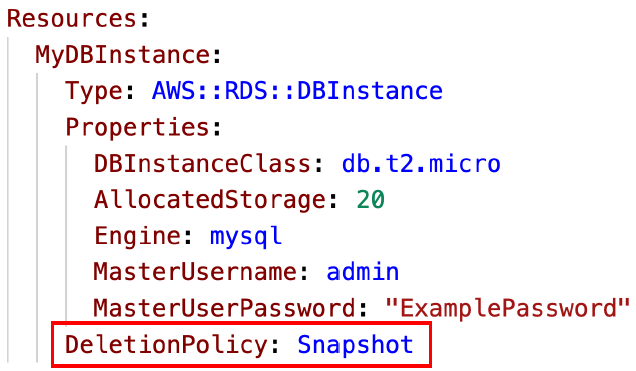

### CloudFormation – Stack Policies
* During a CloudFormation Stack update, all update actions are allowed on all resources (default)
* A Stack Policy is a JSON document that defines the update actions that are allowed on specific resources during Stack updates
* Protect resources from unintentional updates
* When you set a Stack Policy, all resources in the Stack are protected by default
* Specify an explicit ALLOW for the resources you want to be allowed to be updated
  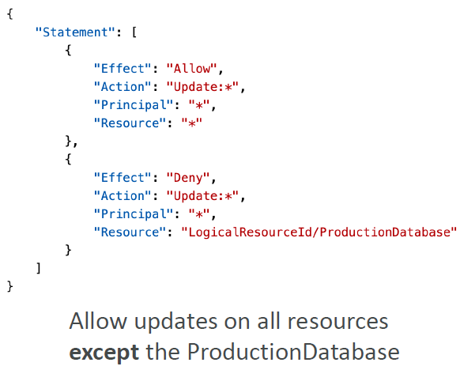
* Q: Your AWS infrastructure created with CloudFormation evolve over time. What should you do to update a CloudFormation stack?  
  A: Update your CloudFormation template locally, then upload and apply it in the CloudFormation console.

### CloudFormation – Termination Protection
* To prevent accidental deletes of CloudFormation Stacks, use `TerminationProtection`.

### CloudFormation – Custom Resources
* Used to
    - define resources not yet supported by CloudFormation
    - define custom provisioning logic for resources can that be outside of CloudFormation (on-premises resources, 3rd party resources…)
    - have custom scripts run during create / update / delete through Lambda functions (running a Lambda function to empty an S3 bucket before being deleted)
* Defined in the template using `AWS::CloudFormation::CustomResource` or `Custom::MyCustomResourceTypeName` (recommended)
* Backed by a Lambda function (most common) or an SNS topic

#### How to define a Custom Resource?
* ServiceToken specifies where CloudFormation sends requests to, such as Lambda ARN or SNS ARN (required & must be in the same region)
* Input data parameters (optional)
  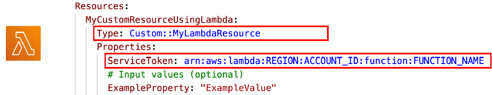

### Use Case – Delete content from an S3 bucket
* You can’t delete a non-empty S3 bucket
* To delete a non-empty S3 bucket, you must first delete all the objects inside it
* We can use a custom resource to empty an S3 bucket before it gets deleted by CloudFormation
  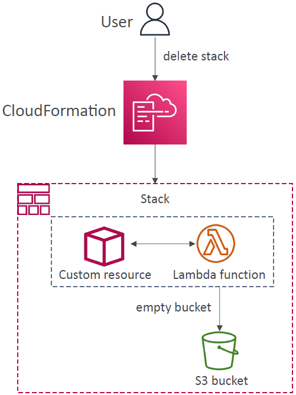

### CloudFormation – StackSets
* Create, update, or delete stacks across multiple accounts and regions with a single operation/template
* Target accounts to create, update, delete stack instances from StackSets
  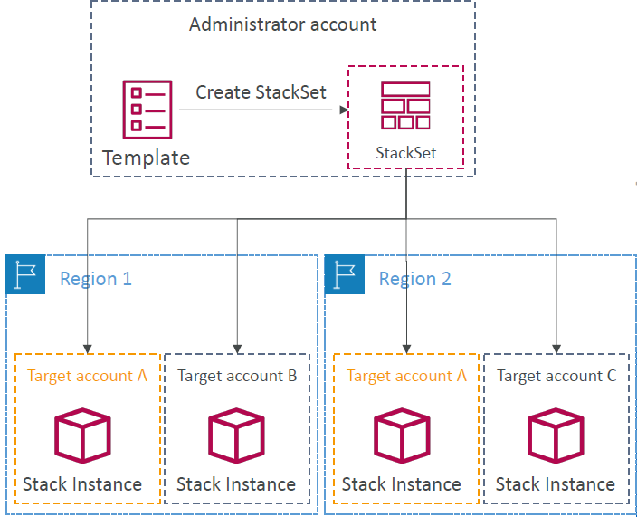
* When you update a stack set, all associated stack instances are updated throughout all accounts and
  regions
* Can be applied into all accounts of an AWS Organization
* Only Administrator account (or Delegated Administrator) can create StackSets
