<!-- START doctoc generated TOC please keep comment here to allow auto update -->
<!-- DON'T EDIT THIS SECTION, INSTEAD RE-RUN doctoc TO UPDATE -->
**Table of Contents**

- [Kinesis Overview](#kinesis-overview)
  - [Kinesis Data Streams](#kinesis-data-streams)
  - [Kinesis Data Streams – Capacity Modes](#kinesis-data-streams--capacity-modes)
  - [Kinesis Data Streams Security](#kinesis-data-streams-security)
  - [Kinesis Producers](#kinesis-producers)
  - [Kinesis - ProvisionedThroughputExceeded](#kinesis---provisionedthroughputexceeded)
  - [Kinesis Data Streams Consumers](#kinesis-data-streams-consumers)
  - [Kinesis Consumers – Custom Consumer](#kinesis-consumers--custom-consumer)
    - [Kinesis Consumers Types](#kinesis-consumers-types)
    - [Kinesis Consumers – AWS Lambda](#kinesis-consumers--aws-lambda)
  - [Kinesis Client Library (KCL)](#kinesis-client-library-kcl)
    - [KCL Example: 4 shards](#kcl-example-4-shards)
    - [KCL Example: 4 shards, Scaling KCL App](#kcl-example-4-shards-scaling-kcl-app)
    - [KCL Example: 6 shards, Scaling Kinesis](#kcl-example-6-shards-scaling-kinesis)
    - [KCL Example: 6 shards, Scaling KCL App](#kcl-example-6-shards-scaling-kcl-app)
  - [Kinesis Operation](#kinesis-operation)
    - [Kinesis Operation – Shard Splitting](#kinesis-operation--shard-splitting)
    - [Kinesis Operation – Merging Shards](#kinesis-operation--merging-shards)
- [Amazon Data Firehose](#amazon-data-firehose)
- [Kinesis Data Streams vs Amazon Data Firehose](#kinesis-data-streams-vs-amazon-data-firehose)
- [Amazon Managed Service for Apache Flink](#amazon-managed-service-for-apache-flink)
- [SQS vs SNS vs Kinesis](#sqs-vs-sns-vs-kinesis)

<!-- END doctoc generated TOC please keep comment here to allow auto update -->

## Kinesis Overview
* Makes it easy to collect, process, and analyze streaming data in real-time
* Ingest real-time data such as: Application logs, Metrics, Website clickstreams, IoT telemetry data…
* Kinesis Data Streams: capture, process, and store data streams
* Kinesis Data Firehose: load data streams into AWS data stores
* Kinesis Data Analytics: analyze data streams with SQL or Apache Flink
* Kinesis Video Streams: capture, process, and store video streams

### Kinesis Data Streams
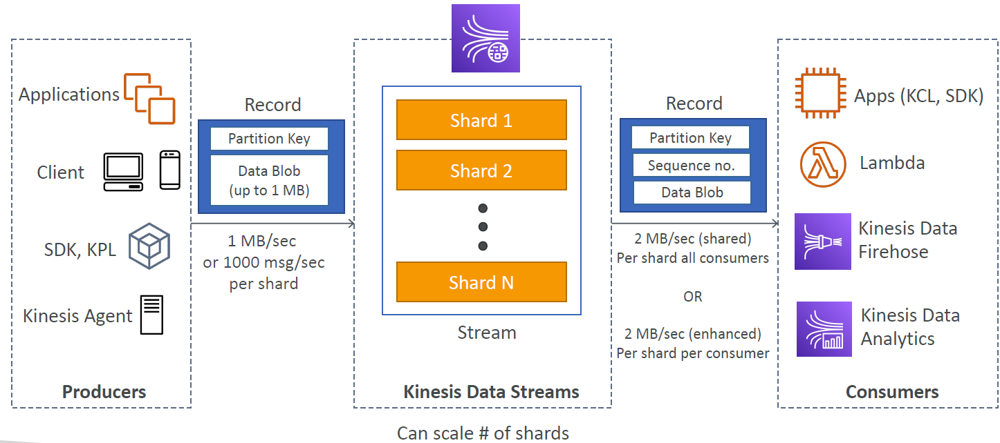
* Retention between 1 day to 365 days
* Ability to reprocess (replay) data
* Once data is inserted in Kinesis, it can’t be deleted (immutability)
* Data up to 1 MB (typical use case  is a lot of "small" real-time data)
* Data that shares the same partition goes to the same shard (ordering)
* Producers: AWS SDK, Kinesis Producer Library (KPL), Kinesis Agent
* Consumers:
    - Write your own: Kinesis Client Library (KCL), AWS SDK
    - Managed: AWS Lambda, Kinesis Data Firehose, Kinesis Data Analytics,

### Kinesis Data Streams – Capacity Modes
* Provisioned mode:
    - You choose the number of shards provisioned, scale manually or using API
    - Each shard gets 1MB/s in (or 1000 records per second)
    - Each shard gets 2MB/s out (classic or enhanced fan-out consumer)
    - You pay per shard provisioned per hour
* On-demand mode:
    - No need to provision or manage the capacity
    - Default capacity provisioned (4 MB/s in or 4000 records per second)
    - Scales automatically based on observed throughput peak during the last 30 days
    - Pay per stream per hour & data in/out per GB

### Kinesis Data Streams Security
* Control access / authorization using IAM policies
* Encryption in flight using HTTPS endpoints
* Encryption at rest using KMS
* You can implement encryption/decryption of data on client side (harder)
* VPC Endpoints available for Kinesis to access within VPC
* Monitor API calls using CloudTrail
  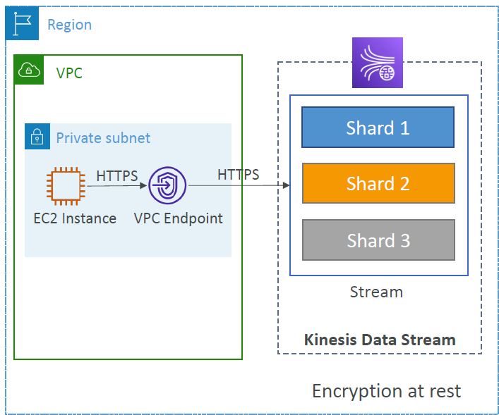

### Kinesis Producers
* Puts data records into data streams
* Data record consists of:
    - Sequence number (unique per partition-key within shard)
    - Partition key (must specify while put records into stream)
    - Data blob (up to 1 MB)
* Producers:
    - AWS SDK: simple producer
    - Kinesis Producer Library (KPL): C++, Java, batch, compression, retries
    - Kinesis Agent: monitor log files
* Write throughput: 1 MB/sec or 1000 records/sec per shard
* PutRecord API
* Use batching with PutRecords API to reduce costs & increase throughput
  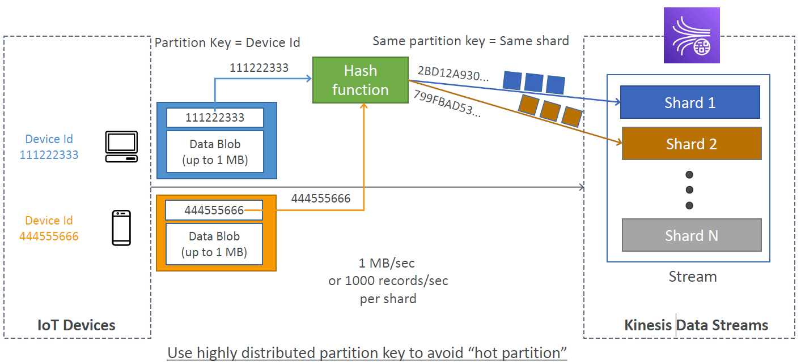

### Kinesis - ProvisionedThroughputExceeded
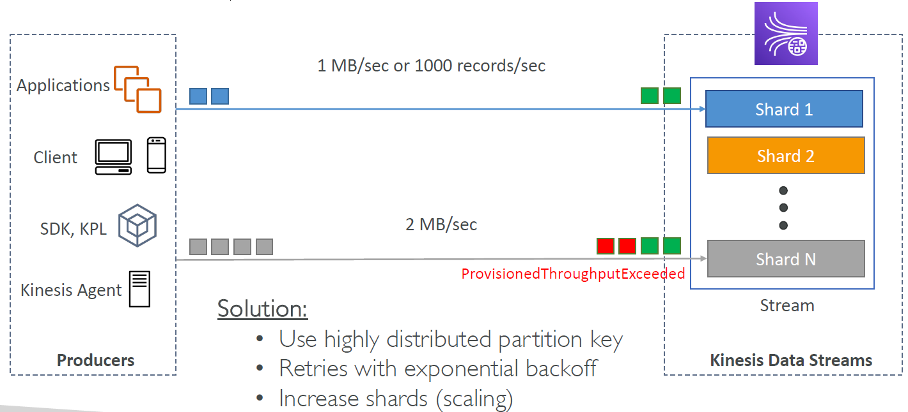

Q: You have a Kinesis Data Stream where you intermittently get a ProvisionedThroughputExceededException exception in your producers' applications. The following can be used to resolve the error:
A: 1.) Use a highly distributes partition key, 2.) Retry with exponential backoff, 3.) Add more shards

### Kinesis Data Streams Consumers
* Get data records from data streams and process them
* AWS Lambda
* Kinesis Data Analytics
* Kinesis Data Firehose
* Custom Consumer (AWS SDK) – Classic or Enhanced Fan-Out
* Kinesis Client Library (KCL): library to simplify reading from data stream

### Kinesis Consumers – Custom Consumer
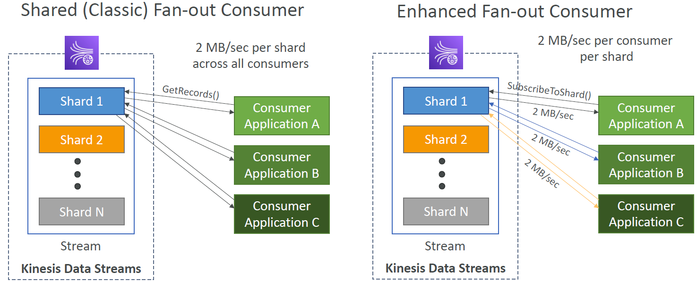

#### Kinesis Consumers Types
**Shared (Classic) Fan-out Consumer - pull**
* Low number of consuming applications
* Read throughput: 2 MB/sec per shard across all consumers
* Max. 5 GetRecords API calls/sec
* Latency ~200 ms
* Minimize cost ($)
* Consumers poll data from Kinesis using GetRecords API call
* Returns up to 10 MB (then throttle for 5 seconds) or up to 10000 records

**Enhanced Fan-out Consumer - push**
* Multiple consuming applications for the same stream
* 2 MB/sec per consumer per shard
* Latency ~70 ms
* Higher costs ($$$)
* Kinesis pushes data to consumers over HTTP/2 (SubscribeToShard API)
* Soft limit of 5 consumer applications (KCL) per data stream (default)

#### Kinesis Consumers – AWS Lambda
* Supports Classic & Enhanced fan-out consumers
* Read records in batches
* Can configure batch size and batch window
* If error occurs, Lambda retries until succeeds or data expired
* Can process up to 10 batches per shard simultaneously
  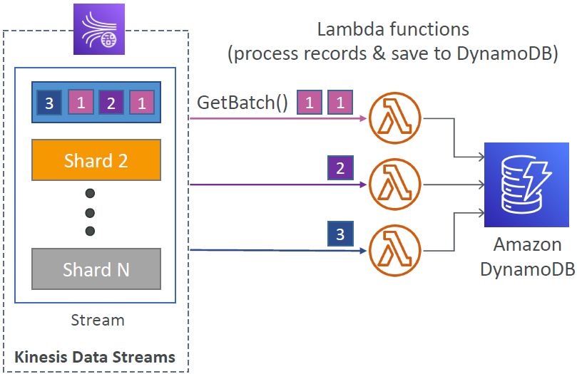

### Kinesis Client Library (KCL)
* A Java library that helps read record from a Kinesis Data Stream with distributed applications sharing the read workload
* Each shard is to be read by only one KCL instance
    - 4 shards = max. 4 KCL instances
    - 6 shards = max. 6 KCL instances
* Progress is checkpointed into DynamoDB (needs IAM access)
* Track other workers and share the work amongst shards using DynamoDB
* KCL can run on EC2, Elastic Beanstalk, and on-premises
* Records are read in order at the shard level.
* When using KCL, each shard is to be read-only by one KCL instance. If you have 10 shards for instance, the maximum KCL instances you can have is 10.
* Versions:
    - KCL 1.x (supports shared consumer)
    - KCL 2.x (supports shared & enhanced fan-out consumer)

#### KCL Example: 4 shards
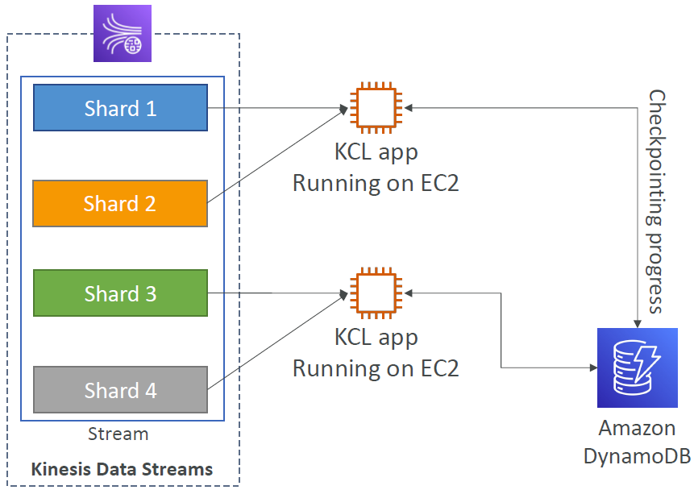

#### KCL Example: 4 shards, Scaling KCL App
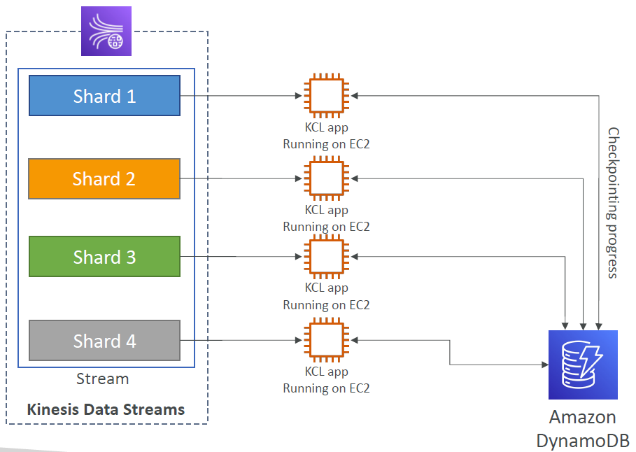

#### KCL Example: 6 shards, Scaling Kinesis
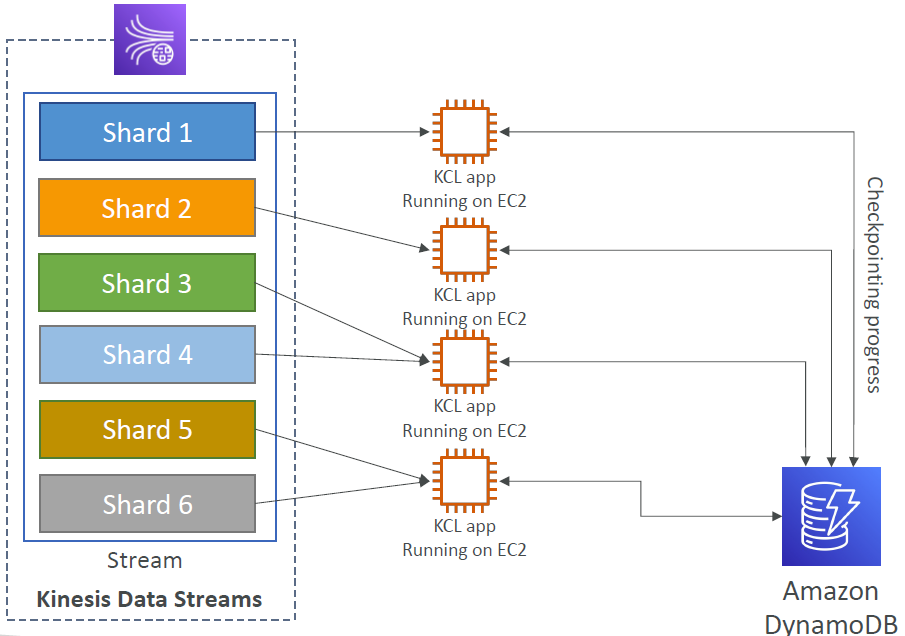

#### KCL Example: 6 shards, Scaling KCL App
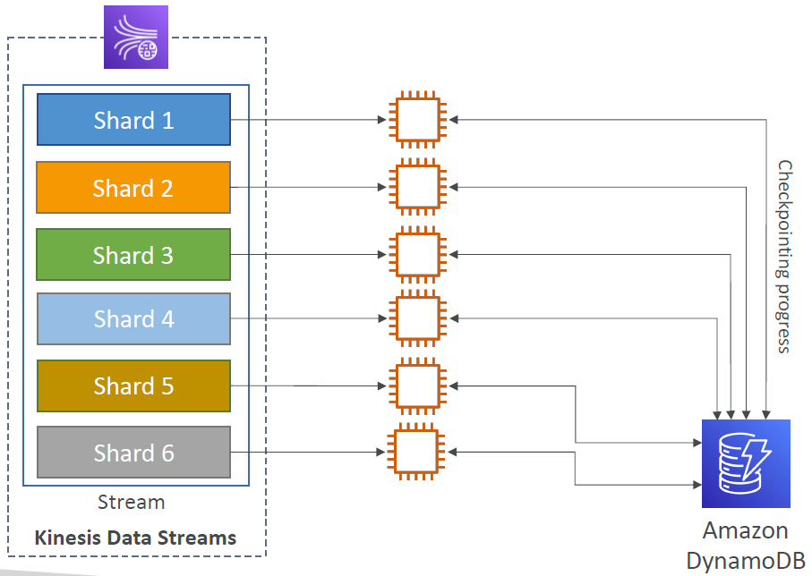

### Kinesis Operation

#### Kinesis Operation – Shard Splitting
* Used to increase the Stream capacity (1 MB/s data in per shard)
* Used to divide a “hot shard”
* The old shard is closed and will be deleted once the data is expired
* No automatic scaling (manually increase/decrease capacity)
* Can’t split into more than two shards in a single operation
  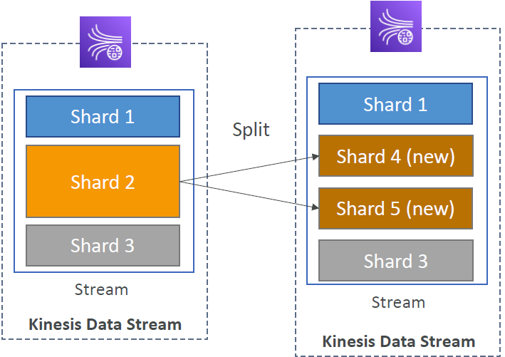

#### Kinesis Operation – Merging Shards
* Decrease the Stream capacity and save costs
* Can be used to group two shards with low traffic (cold shards)
* Old shards are closed and will be deleted once the data is expired
* Can’t merge more than two shards in a single operation
  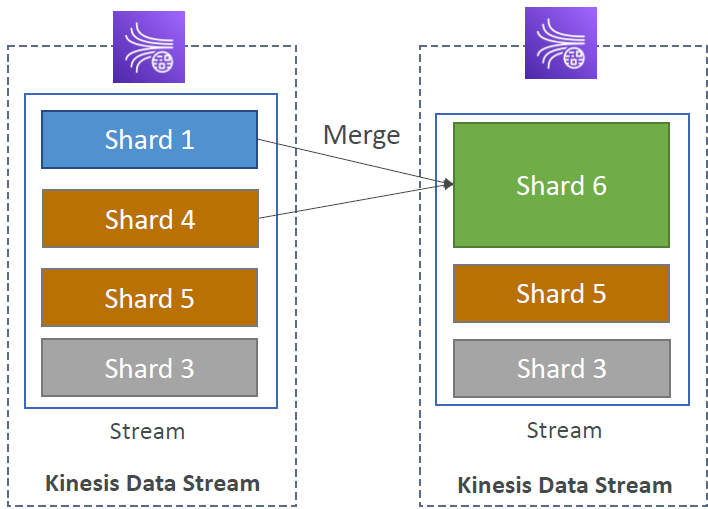

## Amazon Data Firehose
* Send data from sources to target destinations

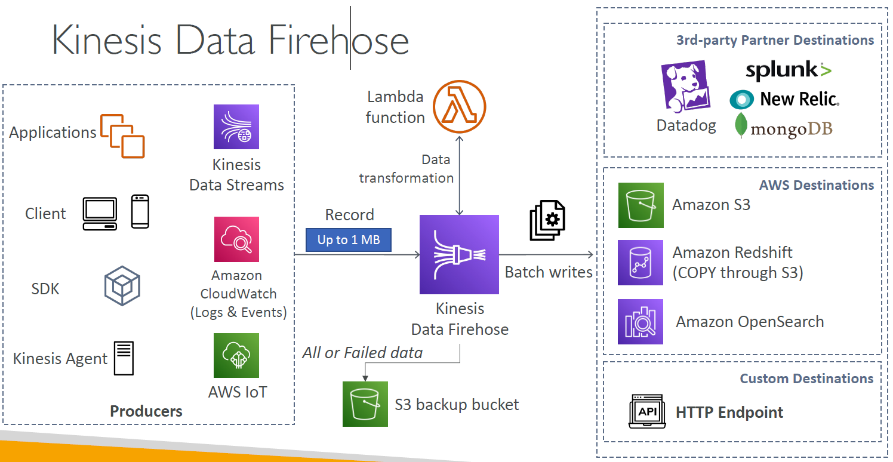
* Used to be called "Kinesis Data Firehose"
* Fully Managed Service, no administration, automatic scaling, serverless
    - AWS: Redshift / Amazon S3 / OpenSearch
    - 3rd party partner: Splunk / MongoDB / DataDog / NewRelic / …
    - Custom HTTP endpoint
* Pay for data going through Firehose
* Near Real Time with buffering capability based on size/time
* Supports CSV, JSON, Parquet, Avro, Raw Text, Binary data
* Conversions to Parquet / ORC, compressions with gzip / snappy
* Custom data transformations using AWS Lambda (ex: CSV to JSON)

## Kinesis Data Streams vs Amazon Data Firehose
**Kinesis Data Streams**
* Streaming data collection
* Producer & consumer code
* Real-time (~200 ms)
* Provisioned / On-Demand mode
* Data storage up to 365 days
* Replay capability

**Kinesis Data Firehose**
* Load streaming data into S3 / Redshift / OpenSearch / 3rd party / custom HTTP
* Fully managed
* Near real-time
* Automatic scaling
* No data storage
* Doesn’t support replay capability

Q: You are running an application that produces a large amount of real-time data that you want to load into S3 and Redshift. Also, these data need to be transformed before being delivered to their destination. What is the best architecture would you choose?  
A: Kinesis Data Streams & Kinesis Data Firehose are a perfect combo of technology for loading near real-time data into S3 and Redshift. Kinesis Data Firehose supports custom data transformation using AWS Lambda.

## Amazon Managed Service for Apache Flink
* Previously named: Kinesis Data Analytics for Apache Flink
* Flink (Java, Scala or SQL) is a framework for processing data streams
  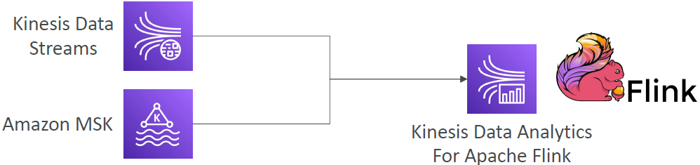
* Run any Apache Flink application on a managed cluster on AWS
    - Provisioned compute resources, parallel computation, automatic scaling
    - Application backups (implemented as checkpoints and snapshots)
    - Use any Apache Flink programming features to transform data
    - Important: Flink does not read from Amazon Data Firehose

## SQS vs SNS vs Kinesis

