<!-- START doctoc generated TOC please keep comment here to allow auto update -->
<!-- DON'T EDIT THIS SECTION, INSTEAD RE-RUN doctoc TO UPDATE -->
**Table of Contents**

- [AWS Monitoring, Troubleshooting & Audit - CloudWatch, X-Ray and CloudTrail](#aws-monitoring-troubleshooting--audit---cloudwatch-x-ray-and-cloudtrail)
  - [Why Monitoring is Important](#why-monitoring-is-important)
  - [Monitoring in AWS](#monitoring-in-aws)
  - [AWS CloudWatch Metrics](#aws-cloudwatch-metrics)
  - [CloudWatch Logs for EC2](#cloudwatch-logs-for-ec2)

<!-- END doctoc generated TOC please keep comment here to allow auto update -->

# AWS Monitoring, Troubleshooting & Audit - CloudWatch, X-Ray and CloudTrail

## Why Monitoring is Important
* We know how to deploy applications
    - Safely
    - Automatically
    - Using Infrastructure as Code
    - Leveraging the best AWS components!
* Our applications are deployed, and our users don’t care how we did it…
* Our users only care that the application is working!
    - Application latency: will it increase over time?
    - Application outages: customer experience should not be degraded
    - Users contacting the IT department or complaining is not a good outcome
    - Troubleshooting and remediation
* Internal monitoring:
    - Can we prevent issues before they happen?
    - Performance and Cost
    - Trends (scaling patterns)
    - Learning and Improvement

## Monitoring in AWS
* AWS CloudWatch:
    - Metrics: Collect and track key metrics
    - Logs: Collect, monitor, analyze and store log files
    - Events: Send notifications when certain events happen in your AWS
    - Alarms: React in real-time to metrics / events
* AWS X-Ray:
    - Troubleshooting application performance and errors
    - Distributed tracing of microservices
* AWS CloudTrail:
    - Internal monitoring of API calls being made
    - Audit changes to AWS Resources by your users

## AWS CloudWatch Metrics
* CloudWatch provides metrics for *every* service in AWS
* Metric is a variable to monitor (CPUUtilization, NetworkIn…)
* Metrics belong to namespaces
* Dimension is an attribute of a metric (instance id, environment, etc…).
* Up to 30 dimensions per metric
* Metrics have timestamps
* Can create CloudWatch dashboards of metrics

### EC2 Detailed monitoring
* EC2 instance metrics have metrics “every 5 minutes”
* With detailed monitoring (for a cost), you get data “every 1 minute”
* Use detailed monitoring if you want to scale faster for your ASG!
* The AWS Free Tier allows us to have 10 detailed monitoring metrics
* Note: EC2 Memory usage is by default not pushed (must be pushed from inside the instance as a custom metric)

## CloudWatch Custom Metrics
* Possibility to define and send your own custom metrics to CloudWatch
* Example: memory (RAM) usage, disk space, number of logged in users …
* Use API call PutMetricData
* Ability to use dimensions (attributes) to segment metrics
    - Instance.id
    - Environment.name
* Metric resolution (StorageResolution API parameter – two possible value):
    - Standard: 1 minute (60 seconds)
    - High Resolution: 1/5/10/30 second(s) – Higher cost
* Important: Accepts metric data points two weeks in the past and two hours in the future (make sure to configure your EC2 instance time correctly)

## CloudWatch Logs
* Log groups: arbitrary name, usually representing an application
* Log stream: instances within application / log files / containers
* Can define log expiration policies (never expire, 1 day to 10 years…)
* CloudWatch Logs can send logs to:
    - Amazon S3 (exports)
    - Kinesis Data Streams
    - Kinesis Data Firehose
    - AWS Lambda
    - OpenSearch
* Logs are encrypted by default
* Can setup KMS-based encryption with your own keys

### CloudWatch Logs - Sources
* SDK, CloudWatch Logs Agent, CloudWatch Unified Agent
* Elastic Beanstalk: collection of logs from application
* ECS: collection from containers
* AWS Lambda: collection from function logs
* VPC Flow Logs: VPC specific logs
* API Gateway
* CloudTrail based on filter
* Route53: Log DNS queries

### CloudWatch Logs Insights
* Search and analyze log data stored in CloudWatch Logs
* Example: find a specific IP inside a log, count occurrences of “ERROR” in your logs…
* Provides a purpose-built query language
    - Automatically discovers fields from AWS services and JSON log events
    - Fetch desired event fields, filter based on conditions, calculate aggregate statistics, sort events, limit number of events…
    - Can save queries and add them to CloudWatch Dashboards
* Can query multiple Log Groups in different AWS accounts
* It’s a query engine, not a real-time engine
  
  

### CloudWatch Logs – S3 Export

* Log data can take up to 12 hours to become available for export
* The API call is CreateExportTask
* Not near-real time or real-time… use Logs Subscriptions instead

### CloudWatch Logs Subscriptions

* Get a real-time log events from CloudWatch Logs for processing and analysis
* Send to Kinesis Data Streams, Kinesis Data Firehose, or Lambda
* Subscription Filter – filter which logs are events delivered to your destination

### CloudWatch Logs Aggregation Multi-Account & Multi Region

### CloudWatch Logs Subscriptions
* Cross-Account Subscription – send log events to resources in a different AWS account (KDS, KDF)
  

## CloudWatch Logs for EC2
* By default, no logs from your EC2 machine will go to CloudWatch
* You need to run a CloudWatch agent on EC2 to push the log files you want
* Make sure IAM permissions are correct
* The CloudWatch log agent can be setup on-premises too
  

### CloudWatch Logs Agent & Unified Agent
* For virtual servers (EC2 instances, on-premise servers…)
* CloudWatch Logs Agent (only sends logs)
    - Old version of the agent
    - Can only send to CloudWatch Logs
* CloudWatch Unified Agent (sends logs and metrics)
    - Collect additional system-level metrics such as RAM, processes, etc…
    - Collect logs to send to CloudWatch Logs
    - Centralized configuration using SSM Parameter Store

### CloudWatch Unified Agent – Metrics
* Collected directly on your Linux server / EC2 instance
* CPU (active, guest, idle, system, user, steal)
* Disk metrics (free, used, total), Disk IO (writes, reads, bytes, iops)
* RAM (free, inactive, used, total, cached)
* Netstat (number of TCP and UDP connections, net packets, bytes)
* Processes (total, dead, bloqued, idle, running, sleep)
* Swap Space (free, used, used %)
* Reminder: out-of-the box metrics for EC2 – disk, CPU, network (high level)

### CloudWatch Logs Metric Filter
* CloudWatch Logs can use filter expressions
    - For example, find a specific IP inside a log
    - Or count occurrences of “ERROR” in your logs
    - Metric filters can be used to trigger alarms
* Filters do not retroactively filter data. Filters only publish the metric data points for events that happen after the filter was created.
* Ability to specify up to 3 Dimensions for the Metric Filter (optional)
  

## CloudWatch Alarms
* Alarms are used to trigger notifications for any metric
* Various options (sampling, %, max, min, etc…)
* Alarm States:
  - OK
  - INSUFFICIENT_DATA
  - ALARM
* Period:
  - Length of time in seconds to evaluate the metric
  - High resolution custom metrics: 10 sec, 30 sec or multiples of 60 sec

### CloudWatch Alarm Targets
* Stop, Terminate, Reboot, or Recover an EC2 Instance
* Trigger Auto Scaling Action
* Send notification to SNS (from which you can do pretty much anything)
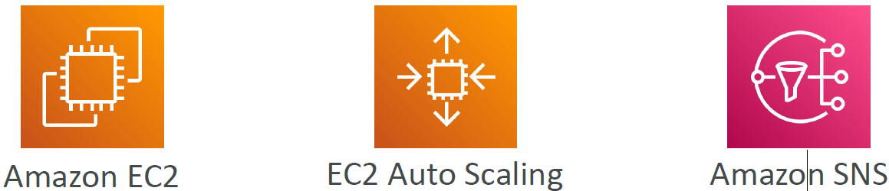

### CloudWatch Alarms – Composite Alarms
* CloudWatch Alarms are on a single metric
* Composite Alarms are monitoring the states of multiple other alarms
* AND and OR conditions
* Helpful to reduce “alarm noise” by creating complex composite alarms
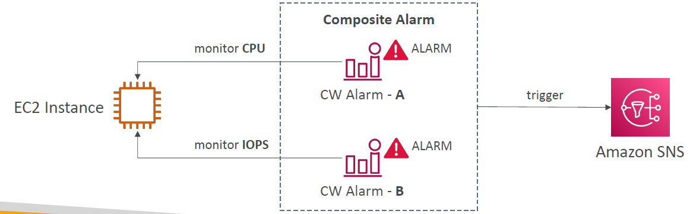

### EC2 Instance Recovery
* Status Check:
  - Instance status = check the EC2 VM
  - System status = check the underlying hardware
  - Attached EBS status = check attached EBS volumes
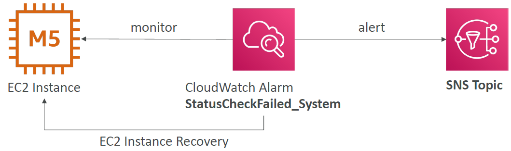
* Recovery: Same Private, Public, Elastic IP, metadata, placement group

## CloudWatch Alarm: good to know
* Alarms can be created based on CloudWatch Logs Metrics Filters
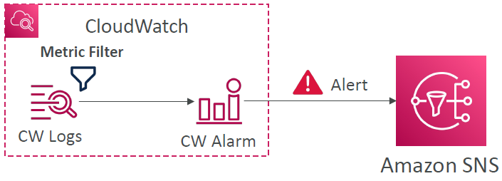
* To test alarms and notifications, set the alarm state to Alarm using CLI
`aws cloudwatch set-alarm-state --alarm-name "myalarm" --state-value
ALARM --state-reason "testing purposes"`

## CloudWatch Synthetics

### CloudWatch Synthetics Canary
* Configurable script that monitor your APIs, URLs, Websites, …
* Reproduce what your customers do programmatically to find issues before customers are impacted
* Checks the availability and latency of your endpoints and can store load time data and screenshots of the UI
* Integration with CloudWatch Alarms
* Scripts written in Node.js or Python
* Programmatic access to a headless Google Chrome browser
* Can run once or on a regular schedule
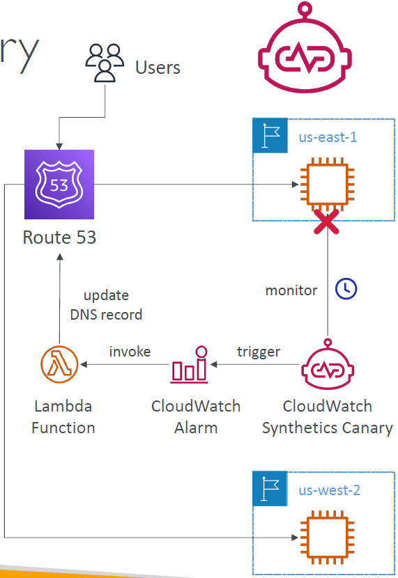

### CloudWatch Synthetics Canary Blueprints
* Heartbeat Monitor – load URL, store screenshot and an HTTP archive file
* API Canary – test basic read and write functions of REST APIs
* Broken Link Checker – check all links inside the URL that you are testing
* Visual Monitoring – compare a screenshot taken during a canary run with a baseline screenshot
* Canary Recorder – used with CloudWatch Synthetics Recorder (record your actions on a website and automatically generates a script for that)
* GUI Workflow Builder – verifies that actions can be taken on your webpage (e.g., test a webpage with a login form)

## Amazon EventBridge
(formerly CloudWatch Events)
* Schedule: Cron jobs (scheduled scripts)
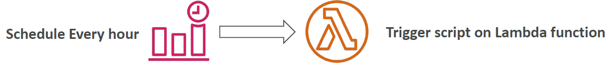
* Event Pattern: Event rules to react to a service doing something
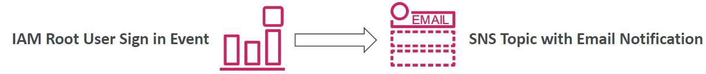
* Trigger Lambda functions, send SQS/SNS messages…

### Amazon EventBridge Rules
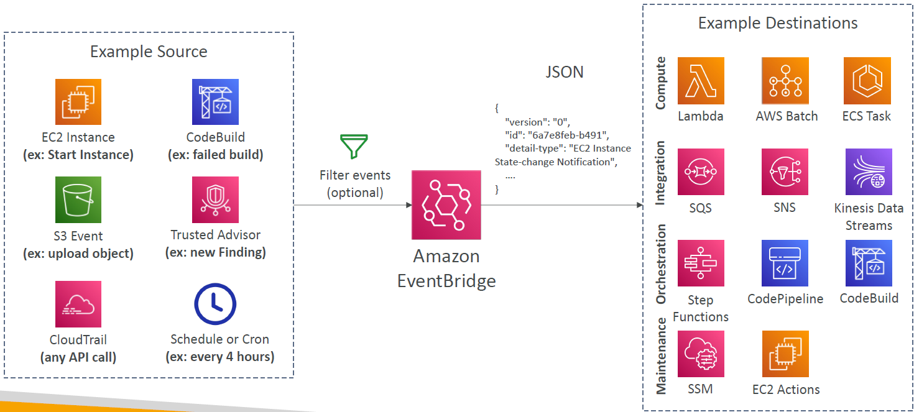

### Amazon EventBridge

* Event buses can be accessed by other AWS accounts using Resource-based Policies
* You can archive events (all/filter) sent to an event bus (indefinitely or set period)
* Ability to replay archived events

### Amazon EventBridge – Schema Registry
* EventBridge can analyze the events in your bus and infer the schema
* The Schema Registry allows you to generate code for your application, that will know in advance how data is structured in the event bus
* Schema can be versioned
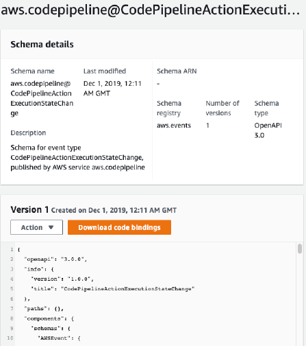

### Amazon EventBridge – Resource-based Policy
* Manage permissions for a specific Event Bus
* Example: allow/deny events from another AWS account or AWS region
* Use case: aggregate all events from your AWS Organization in a single AWS account or AWS region
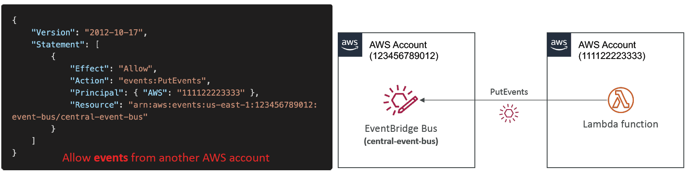

### EventBridge – Multi-account Aggregation
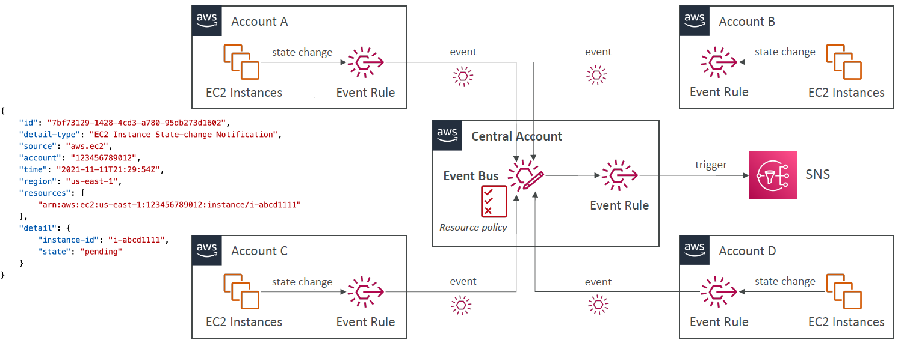

## AWS X-Ray
* Debugging in Production, the good old way:
  - Test locally
  - Add log statements everywhere
  - Re-deploy in production
* Log formats differ across applications using CloudWatch and analytics is hard.
* Debugging: monolith “easy”, distributed services “hard”
* No common views of your entire architecture!

### AWS X-Ray - Visual analysis of our applications
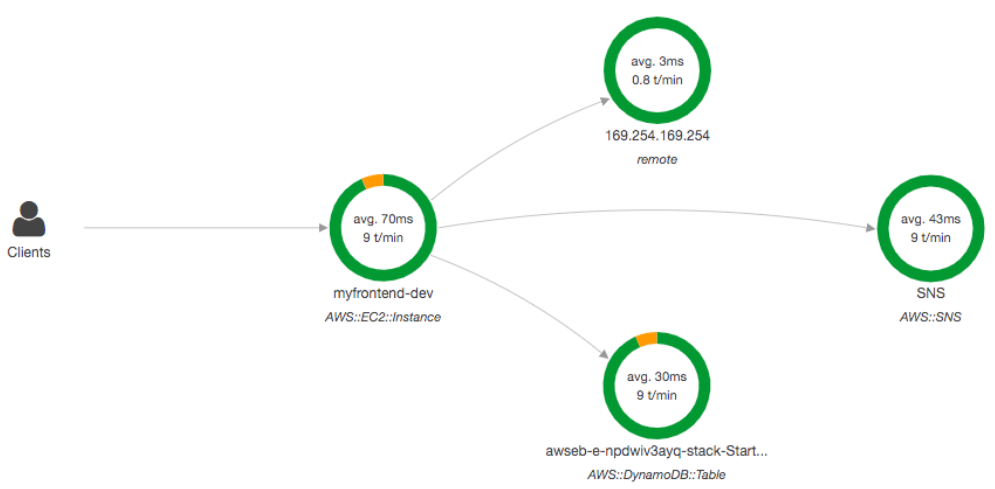

### AWS X-Ray advantages
* Troubleshooting performance (bottlenecks)
* Understand dependencies in a microservice architecture
* Pinpoint service issues
* Review request behavior
* Find errors and exceptions
* Are we meeting time SLA?
* Where I am throttled?
* Identify users that are impacted

### X-Ray compatibility
* AWS Lambda
* Elastic Beanstalk
* ECS
* ELB
* API Gateway
* EC2 Instances or any application server (even on premise)

### AWS X-Ray Leverages Tracing
* Tracing is an end to end way to following a “request”
* Each component dealing with the request adds its own “trace”
* Tracing is made of segments (+ sub segments)
* Annotations can be added to traces to provide extra-information
* Ability to trace:
  - Every request
  - Sample request (as a % for example or a rate per minute)
* X-Ray Security:
  - IAM for authorization
  - KMS for encryption at rest

### AWS X-Ray - How to enable it?
I) Your code (Java, Python, Go, Node.js, .NET) must import the AWS X-Ray SDK
* Very little code modification needed
* The application SDK will then capture:
  - Calls to AWS services
  - HTTP / HTTPS requests
  - Database Calls (MySQL, PostgreSQL, DynamoDB)
  - Queue calls (SQS)
2) Install the X-Ray daemon or enable X-Ray AWS Integration
* X-Ray daemon works as a low level UDP packet interceptor (Linux / Windows / Mac…)
* AWS Lambda / other AWS services already run the X-Ray daemon for you
* Each application must have the IAM rights to write data to X-Ray
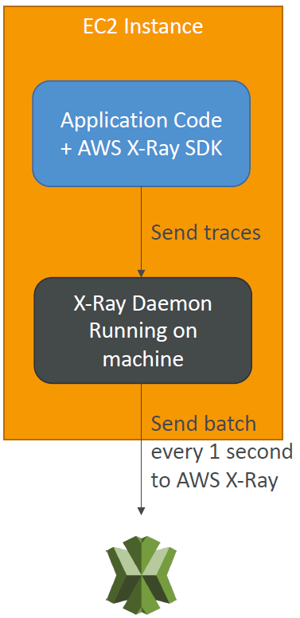

### The X-Ray magic
* X-Ray service collects data from all the different services
* Service map is computed from all the segments and traces
* X-Ray is graphical, so even non-technical people can help troubleshoot

### AWS X-Ray Troubleshooting
* If X-Ray is not working on EC2
  - Ensure the EC2 IAM Role has the proper permissions
  - Ensure the EC2 instance is running the X-Ray Daemon
* To enable on AWS Lambda:
  - Ensure it has an IAM execution role with proper policy (AWSX-RayWriteOnlyAccess)
  - Ensure that X-Ray is imported in the code
  - Enable Lambda X-Ray Active Tracing

### X-Ray Instrumentation in your code
* Instrumentation means the measure of product’s performance, diagnose errors, and to write trace information.
* To instrument your application code, you use the X-Ray SDK
* Many SDK require only configuration changes
* You can modify your application code to customize and annotation the data that the SDK sends to XRay, using interceptors, filters, handlers, middleware…
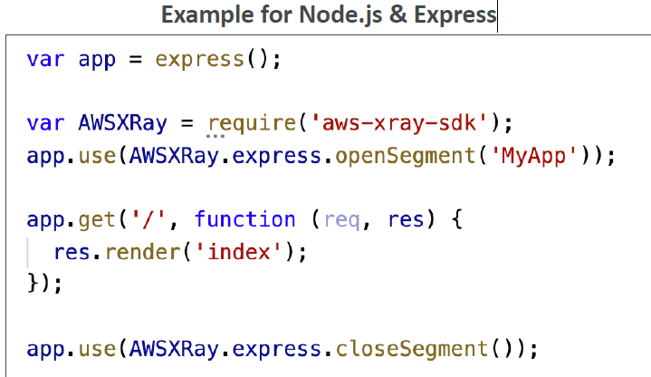

### X-Ray Concepts
* Segments: each application / service will send them
* Subsegments: if you need more details in your segment
* Trace: segments collected together to form an end-to-end trace
* Sampling: decrease the amount of requests sent to X-Ray, reduce cost
* Annotations: Key Value pairs used to index traces and use with filters
* Metadata: Key Value pairs, not indexed, not used for searching
* The X-Ray daemon / agent has a config to send traces cross account:
  - make sure the IAM permissions are correct – the agent will assume the role
  - This allows to have a central account for all your application tracing

#### X-Ray Sampling Rules
* With sampling rules, you control the amount of data that you record
* You can modify sampling rules without changing your code
* By default, the X-Ray SDK records the first request each second, and five percent of any additional requests.
* One request per second is the reservoir, which ensures that at least one trace is recorded each second as long the service is serving requests.
* Five percent is the rate at which additional requests beyond the reservoir size are sampled.

#### X-Ray Custom Sampling Rules
• You can create your own rules with the reservoir and rate
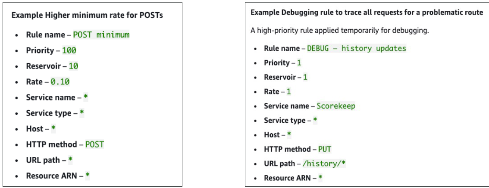

### X-Ray Write APIs (used by the X-Ray daemon)
* PutTraceSegments: Uploads segment documents to AWS X-Ray
* PutTelemetryRecords: Used by the AWS X-Ray daemon to upload telemetry.
  - SegmentsReceivedCount, SegmentsRejectedCounts, BackendConnectionErrors…
* GetSamplingRules: Retrieve all sampling rules (to know what/when to send)
* GetSamplingTargets & GetSamplingStatisticSummaries: advanced
* The X-Ray daemon needs to have an IAM policy authorizing the correct API calls to function correctly
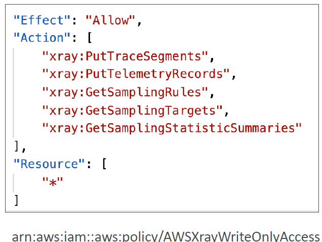

### X-Ray Read APIs
* GetServiceGraph: main graph
* BatchGetTraces: Retrieves a list of traces specified by ID. Each trace is a collection of segment documents that originates from a single request.
* GetTraceSummaries: Retrieves IDs and annotations for traces available for a specified time frame using an optional filter. To get the full traces, pass the trace IDs to BatchGetTraces.
* GetTraceGraph: Retrieves a service graph for one or more specific trace IDs.
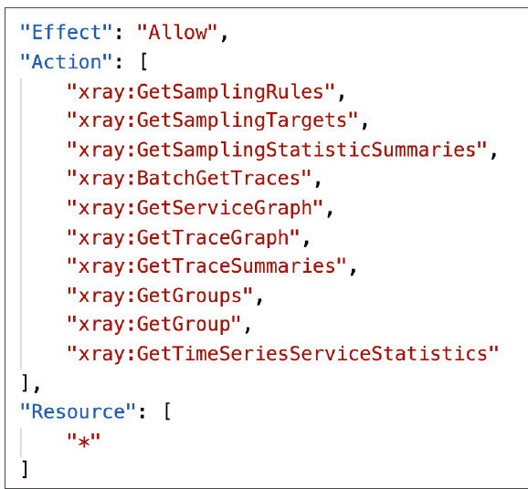

