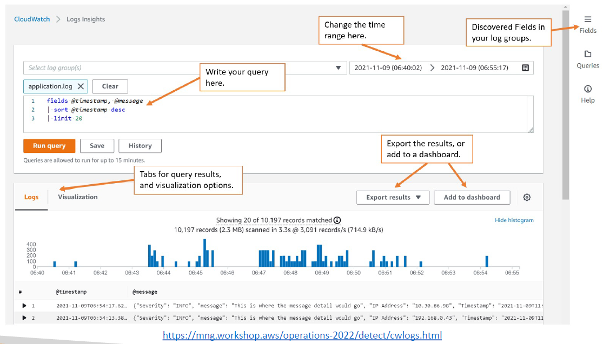
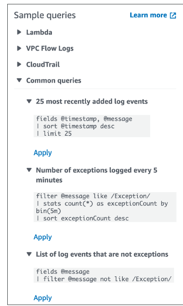
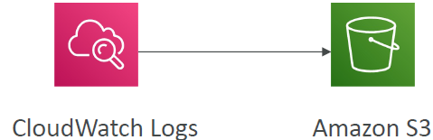
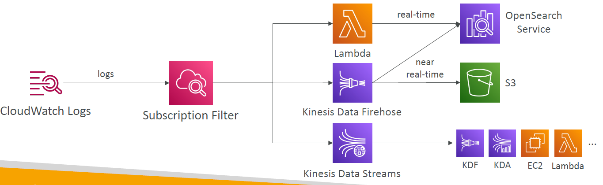
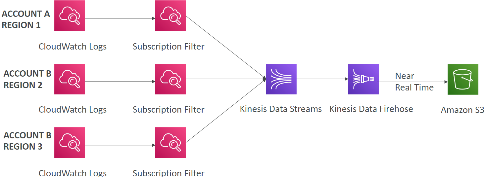
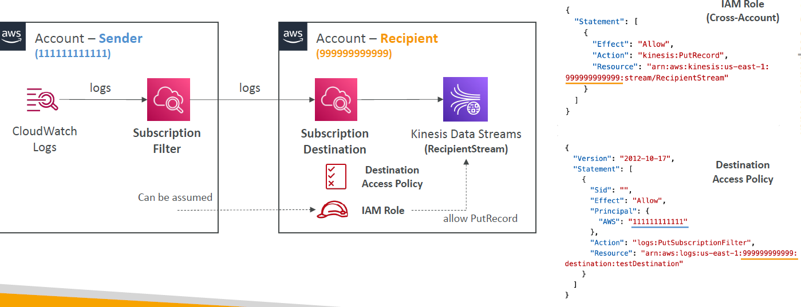
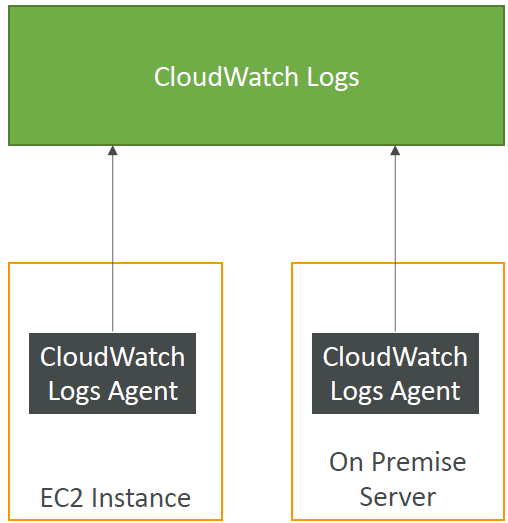
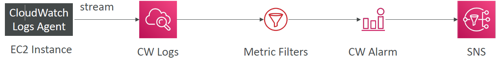

<!-- START doctoc generated TOC please keep comment here to allow auto update -->
<!-- DON'T EDIT THIS SECTION, INSTEAD RE-RUN doctoc TO UPDATE -->
**Table of Contents**

- [AWS Monitoring, Troubleshooting & Audit - CloudWatch, X-Ray and CloudTrail](#aws-monitoring-troubleshooting--audit---cloudwatch-x-ray-and-cloudtrail)
  - [Why Monitoring is Important](#why-monitoring-is-important)
  - [Monitoring in AWS](#monitoring-in-aws)
  - [AWS CloudWatch Metrics](#aws-cloudwatch-metrics)
    - [EC2 Detailed monitoring](#ec2-detailed-monitoring)
    - [CloudWatch Custom Metrics](#cloudwatch-custom-metrics)
    - [CloudWatch Logs](#cloudwatch-logs)
    - [CloudWatch Logs - Sources](#cloudwatch-logs---sources)
    - [CloudWatch Logs Insights](#cloudwatch-logs-insights)
    - [CloudWatch Logs – S3 Export](#cloudwatch-logs--s3-export)
    - [CloudWatch Logs Subscriptions](#cloudwatch-logs-subscriptions)
    - [CloudWatch Logs Aggregation Multi-Account & Multi Region](#cloudwatch-logs-aggregation-multi-account--multi-region)
    - [CloudWatch Logs Subscriptions](#cloudwatch-logs-subscriptions-1)
  - [CloudWatch Logs for EC2](#cloudwatch-logs-for-ec2)
    - [CloudWatch Logs Agent & Unified Agent](#cloudwatch-logs-agent--unified-agent)
    - [CloudWatch Unified Agent – Metrics](#cloudwatch-unified-agent--metrics)
    - [CloudWatch Logs Metric Filter](#cloudwatch-logs-metric-filter)

<!-- END doctoc generated TOC please keep comment here to allow auto update -->

## AWS Monitoring, Troubleshooting & Audit - CloudWatch, X-Ray and CloudTrail

### Why Monitoring is Important
* We know how to deploy applications
    - Safely
    - Automatically
    - Using Infrastructure as Code
    - Leveraging the best AWS components!
* Our applications are deployed, and our users don’t care how we did it…
* Our users only care that the application is working!
    - Application latency: will it increase over time?
    - Application outages: customer experience should not be degraded
    - Users contacting the IT department or complaining is not a good outcome
    - Troubleshooting and remediation
* Internal monitoring:
    - Can we prevent issues before they happen?
    - Performance and Cost
    - Trends (scaling patterns)
    - Learning and Improvement

### Monitoring in AWS
* AWS CloudWatch:
    - Metrics: Collect and track key metrics
    - Logs: Collect, monitor, analyze and store log files
    - Events: Send notifications when certain events happen in your AWS
    - Alarms: React in real-time to metrics / events
* AWS X-Ray:
    - Troubleshooting application performance and errors
    - Distributed tracing of microservices
* AWS CloudTrail:
    - Internal monitoring of API calls being made
    - Audit changes to AWS Resources by your users

### AWS CloudWatch Metrics
* CloudWatch provides metrics for *every* service in AWS
* Metric is a variable to monitor (CPUUtilization, NetworkIn…)
* Metrics belong to namespaces
* Dimension is an attribute of a metric (instance id, environment, etc…).
* Up to 30 dimensions per metric
* Metrics have timestamps
* Can create CloudWatch dashboards of metrics

#### EC2 Detailed monitoring
* EC2 instance metrics have metrics “every 5 minutes”
* With detailed monitoring (for a cost), you get data “every 1 minute”
* Use detailed monitoring if you want to scale faster for your ASG!
* The AWS Free Tier allows us to have 10 detailed monitoring metrics
* Note: EC2 Memory usage is by default not pushed (must be pushed from inside the instance as a custom metric)

#### CloudWatch Custom Metrics
* Possibility to define and send your own custom metrics to CloudWatch
* Example: memory (RAM) usage, disk space, number of logged in users …
* Use API call PutMetricData
* Ability to use dimensions (attributes) to segment metrics
    - Instance.id
    - Environment.name
* Metric resolution (StorageResolution API parameter – two possible value):
    - Standard: 1 minute (60 seconds)
    - High Resolution: 1/5/10/30 second(s) – Higher cost
* Important: Accepts metric data points two weeks in the past and two hours in the future (make sure to configure your EC2 instance time correctly)

#### CloudWatch Logs
* Log groups: arbitrary name, usually representing an application
* Log stream: instances within application / log files / containers
* Can define log expiration policies (never expire, 1 day to 10 years…)
* CloudWatch Logs can send logs to:
    - Amazon S3 (exports)
    - Kinesis Data Streams
    - Kinesis Data Firehose
    - AWS Lambda
    - OpenSearch
* Logs are encrypted by default
* Can setup KMS-based encryption with your own keys

#### CloudWatch Logs - Sources
* SDK, CloudWatch Logs Agent, CloudWatch Unified Agent
* Elastic Beanstalk: collection of logs from application
* ECS: collection from containers
* AWS Lambda: collection from function logs
* VPC Flow Logs: VPC specific logs
* API Gateway
* CloudTrail based on filter
* Route53: Log DNS queries

#### CloudWatch Logs Insights
* Search and analyze log data stored in CloudWatch Logs
* Example: find a specific IP inside a log, count occurrences of “ERROR” in your logs…
* Provides a purpose-built query language
    - Automatically discovers fields from AWS services and JSON log events
    - Fetch desired event fields, filter based on conditions, calculate aggregate statistics, sort events, limit number of events…
    - Can save queries and add them to CloudWatch Dashboards
* Can query multiple Log Groups in different AWS accounts
* It’s a query engine, not a real-time engine
  
  

#### CloudWatch Logs – S3 Export

* Log data can take up to 12 hours to become available for export
* The API call is CreateExportTask
* Not near-real time or real-time… use Logs Subscriptions instead

#### CloudWatch Logs Subscriptions

* Get a real-time log events from CloudWatch Logs for processing and analysis
* Send to Kinesis Data Streams, Kinesis Data Firehose, or Lambda
* Subscription Filter – filter which logs are events delivered to your destination

#### CloudWatch Logs Aggregation Multi-Account & Multi Region

#### CloudWatch Logs Subscriptions
* Cross-Account Subscription – send log events to resources in a different AWS account (KDS, KDF)
  

### CloudWatch Logs for EC2
* By default, no logs from your EC2 machine will go to CloudWatch
* You need to run a CloudWatch agent on EC2 to push the log files you want
* Make sure IAM permissions are correct
* The CloudWatch log agent can be setup on-premises too
  

#### CloudWatch Logs Agent & Unified Agent
* For virtual servers (EC2 instances, on-premise servers…)
* CloudWatch Logs Agent (only sends logs)
    - Old version of the agent
    - Can only send to CloudWatch Logs
* CloudWatch Unified Agent (sends logs and metrics)
    - Collect additional system-level metrics such as RAM, processes, etc…
    - Collect logs to send to CloudWatch Logs
    - Centralized configuration using SSM Parameter Store

#### CloudWatch Unified Agent – Metrics
* Collected directly on your Linux server / EC2 instance
* CPU (active, guest, idle, system, user, steal)
* Disk metrics (free, used, total), Disk IO (writes, reads, bytes, iops)
* RAM (free, inactive, used, total, cached)
* Netstat (number of TCP and UDP connections, net packets, bytes)
* Processes (total, dead, bloqued, idle, running, sleep)
* Swap Space (free, used, used %)
* Reminder: out-of-the box metrics for EC2 – disk, CPU, network (high level)

#### CloudWatch Logs Metric Filter
* CloudWatch Logs can use filter expressions
    - For example, find a specific IP inside of a log
    - Or count occurrences of “ERROR” in your logs
    - Metric filters can be used to trigger alarms
* Filters do not retroactively filter data. Filters only publish the metric data points for events that happen after the filter was created.
* Ability to specify up to 3 Dimensions for the Metric Filter (optional)
  