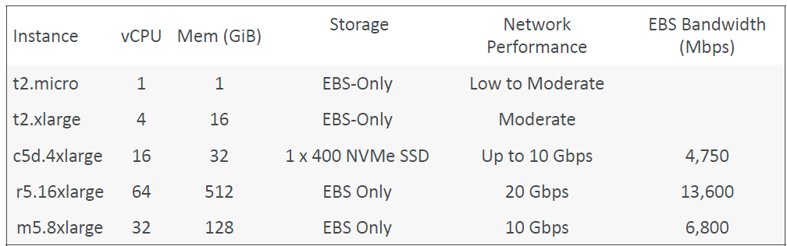
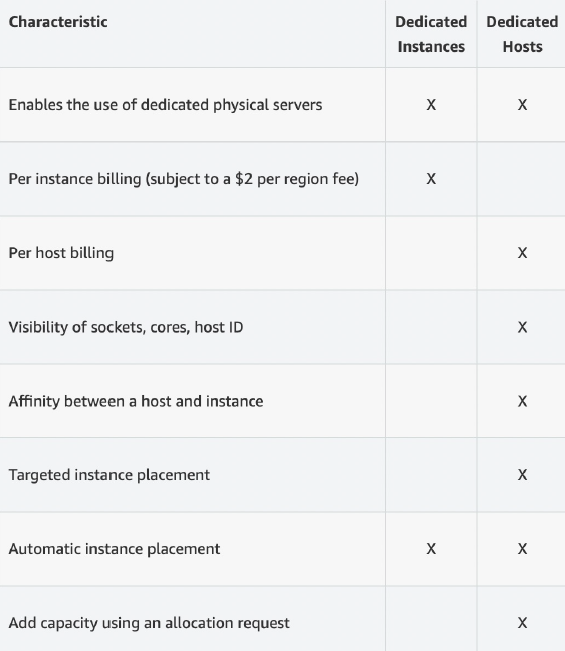

# AWS Certified Developer - Associate

## AWS
* Amazon Web Services
* Provides servers and services that can be used on demand and that scale easily.

## Abbreviations
| Abbreviation | Stands for                     |
|--------------|--------------------------------|
| AMI          | Amazon Machine Learning Image  |
| arn          | Amazon Resource Name           |
| ASG          | Auto-Scaling Group             |
| AZ           | Availability Zone              |
| EBS          | Elastic Block Store            |
| EC2          | Elastic Compute Cloud          |
| ELB          | Elastic Load Balancer          |
| FTP          | File Transfer Protocol         |
| IAM          | Identity and Access Management |
| RI           | Reserved Instance              |
| RDP          | Remote Desktop Protocol        |
| SFTP         | Secure File Transfer Protocol  |
| SSH          | Secure Shell                   |


## Usecases
e.g.
* Enterprise IT
* Backup & Storage
* Big Data analytics
* Website hosting
* Mobile & social apps
* Gaming

## Global infrastructure
* AWS Regions
* AWS Availability Zones
* AWS Data Centers
* AWS Edge Locations / Points of Presence

### Region (e.g. `eu-central-1`)
* Cluster of datacenters
* Compliance with data governance and legal requirements: data never leaves a region without explicit permission
* Proximity to customers: reduced latency
* New services and new features aren't available in every region
* Pricing: pricing varies region to region and is transparent in the service pricing page

### AWS Availability Zones (AZ) (e.g. `eu-central-1a`)
* Each region has many availability zones (usually 3, min is 3, max is 6). Example:  
  - ap-southeast-2a
  - ap-southeast-2b
  - ap-southeast-2c  
* Each availability zone is one or more discrete data centers with redundant power,
networking, and connectivity
* They’re separate from each other, so that they’re isolated from disasters
* They’re connected with high bandwidth, ultra-low latency networking

### AWS Points of Presence (Edge Locations)
* Amazon has 400+ Points of Presence (400+ Edge Locations & 10+ Regional Caches) in 90+ cities across 40+ countries
* Content is delivered to end users with lower latency
* Points of Presence (PoPs): General term used to describe AWS locations where AWS services are accessed. They include both edge locations and regional edge caches.
* Edge Locations: These are specific locations where AWS deploys its content delivery and caching services. They are used primarily by Amazon CloudFront for distributing content and reducing latency for users.
* Regional Edge Caches: These are a subset of edge locations that act as intermediate caches for CloudFront to reduce latency for frequently accessed content.

### Global Services
* Identity and Access Management (IAM)
* Route 53 (DNS service)
* CloudFront (Content Delivery Network)
* WAF (Web Application Firewall)

### Region-scoped
* Amazon EC2 (Infrastructure as a Service)
* Elastic Beanstalk (Platform as a Service)
* Lambda (Function as a Service)
* Rekognition (Software as a Service)
* Region Table: https://aws.amazon.com/about-aws/global-infrastructure/regional-product-services

## IAM: Users & Groups
* IAM = Identity and Access Management, Global service
* Root account created by default, shouldn’t be used or shared
* Users are people within your organization, and can be grouped. 1 person = 1 user.
* Groups (e.g. `admins`, `developers`, ...) only contain users, not other groups.
* Users don’t have to belong to a group (though this is not best practice), and user can belong to multiple groups.

### IAM: Permissions
* Users or Groups can be assigned JSON documents called policies
  ```json
  {
    "Version": "2012-10-17",
    "Statement": [
      {
        "Effect": "Allow",
        "Action": "ec2:Describe*",
        "Resource": "*"
      },
      {
        "Effect": "Allow",
        "Action": "elasticloadbalancing:Describe*",
        "Resource": "*"
      },
      {
        "Effect": "Allow",
        "Action": [
          "cloudwatch:ListMetrics",
          "cloudwatch:GetMetricStatistics",
          "cloudwatch:Describe*"
        ],
        "Resource": "*"
      }
    ]
  }
  ```
* These policies define the permissions of the users
* In AWS you apply the **least privilege principle**: don’t give more permissions than a user needs.
* An IAM user is an identity with long-term credentials that is used to interact with AWS in an account.
* If you attach a policy at the group level --> policy gets applied to every group member.
*  **Inline policy**: Policy only attached to a user

### IAM Policies structure
  ```json
  {
    "Version": "2012-10-17",
    "Id": "S3-Account-Permissions",
    "Statement": [
      {
        "Sid": "1",
        "Effect": "Allow",
        "Principal": {
          "AWS": ["arn:aws:iam::123456789012:root"]
        },
        "Action": [
          "s3:GetObject",
          "s3:PutObject"
        ],
        "Resource": ["arn:aws:s3:::mybucket/*"]
      }
    ]
  }
  ```
Consists of
* Version: policy language version, always include “2012-10-17”
* Id (optional): an identifier for the policy
* Statement: one or more individual statements (required)

Statements consists of
* Sid (statement ID, optional): an identifier for the statement
* Effect: whether the statement allows or denies access (Allow, Deny)
* Principal: account/user/role to which this policy applied to
* Action: list of actions this policy allows or denies (`<service>:<api-call>`, can also be e.g. `ìam:Get*` --> all Get-commands are authorized)
* Resource: list of resources to which the actions apply to. If all resources are allowed --> `"Resource": "*"`
* Condition (optional): conditions for when this policy is in effect


### IAM Roles for Services
* Some AWS service will need to perform actions on your behalf. E.g. Create an EC2 instance (virtual server) --> wants to perform actions on AWS --> EC2 needs permissions
* To do so, we will assign permissions to AWS services with IAM Roles
* Common roles:
  - EC2 Instance Roles
  - Lambda Function Roles
  - Roles for CloudFormation
* IAM --> Roles: `Create role`, Select trusted entity `AWS service` --> choose a service --> add permission --> enter role name and description --> verify trusted entities and permissions --> `Create role`


### Security
* In AWS, you can set up a password policy (in IAM `Account settings`):
  - Set a minimum password length
  - Require specific character types (uppercase, lowercase, numbers, non-alphanumeric characters)
  - Allow all IAM users to change their own passwords
  - Require users to change their password after some time (password expiration)
  - Prevent password re-use
* You can also set up MFA (Google Authenticator, Authy, YubiKey, Hardware Key Fob MFA Device, ...) (click on user in top right --> `Security credentials`)
* IAM Credentials Report (account-level): a report that lists all your account's users and the status of their various credentials (click on `Credential report` in the IAM menu)
* IAM Access Advisor (user-level) (go to `user` and click on `Access Advisor`)
  - Access advisor shows the service permissions granted to a user and when those services were last accessed.
  - You can use this information to revise your policies.


### IAM Guidelines and Best Practices
* One physical user = One AWS user
* Assign users to groups and assign permissions to groups
* Create a strong password policy
* Use and enforce the use of Multi Factor Authentication (MFA)
* Create and use roles for giving permissions to AWS services
* Use Access Keys for Programmatic Access (CLI / SDK)
* Audit permissions of your account using IAM Credentials Report & IAM Access Advisor
* Never share IAM users & Access Keys


### Shared Responsibility Model for IAM
* AWS --> responsible for infrastructure
  - Infrastructure (global network security)
  - Configuration and vulnerability analysis
  - Compliance validation
* I / user --> responsible for how this infrastructure is used
  - Users, Groups, Roles, Policies management and monitoring
  - Enable MFA on all accounts
  - Rotate all your keys often
  - Use IAM tools to apply appropriate permissions
  - Analyze access patterns & review permissions

### IAM commands
* List users: `aws iam list-users`

### IAM Section – Summary
* Users: mapped to a physical user, has a password for AWS Console
* Groups: contains users only
* Policies: JSON document that outlines permissions for users or groups
* Roles: for EC2 instances or AWS services
* Security: MFA + Password Policy
* AWS CLI: manage your AWS services using the command-line
* AWS SDK: manage your AWS services using a programming language
* Access Keys: access AWS using the CLI or SDK
* Audit: IAM Credential Reports & IAM Access Advisor


## How can users access AWS ?
To access AWS, you have three options:
* AWS Management Console (protected by password + MFA) (Best for users who prefer a graphical interface, need to perform manual tasks, or are exploring AWS services.)
* AWS Command Line Interface (CLI): protected by access keys 
* AWS Software Development Kit (SDK) - for code: protected by access keys (Best for developers who need to automate AWS interactions, build applications, or integrate AWS services into their software. It requires programming knowledge and is suitable for more complex, automated, or large-scale tasks.)  
Access Keys are generated through the AWS Console. Users manage their own access keys


### AWS CLI & SDK
* Every command begins with `aws`
* AWS SDK is a set of libraries, enables to access and manage AWS services, and is embedded within my application
* Example: AWS CLI is built on AWS SDK for Python (boto)

### Create access keys
* Click on your user --> `Security credentials` --> `Create access key`
* CLI `aws configure` --> enter access key + default region name + default output format (no necessity to enter anything)

### AWS CloudShell
* CLI in the cloud of AWS


## EC2
* EC2 is one of the most popular of AWS' offering
* EC2 = Elastic Compute Cloud = Infrastructure as a Service
* It mainly consists in the capability of :
  - Renting virtual machines (EC2)
  - Storing data on virtual drives (EBS)
  - Distributing load across machines (ELB)
  - Scaling the services using an auto-scaling group (ASG)

### Sizing & configuration options
* Operating System (OS): Linux, Windows or Mac OS
* An AMI is a template that contains the software configuration (operating system, application server, and applications) required to launch your instance.
* How much compute power & cores (CPU)
* How much random-access memory (RAM)
* How much storage space:
  - Network-attached (EBS & EFS)
  - Hardware (EC2 Instance Store)
* Network card: speed of the card, Public IP address
* Firewall rules: security group
* Bootstrap script (configure at first launch): EC2 User Data (EC2 User Data is used to bootstrap your EC2 instances using a bash script. This script can contain commands such as installing software/packages, download files from the Internet, or anything you want.)

### User Data
* It is possible to bootstrap our instances using an EC2 User data script.
* Bootstrapping means launching commands when a machine starts
* That script is only run once at the instance first start
* EC2 user data is used to automate boot tasks such as:
  - Installing updates
  - Installing software
  - Downloading common files from the internet
  - Anything you can think of
• The EC2 User Data Script runs with the root user

### Instance Types
* naming convention: `m5.2xlarge`
  - `m`: instance class
  - `5`: generation
  - `2xlarge`: size within the instance class
* Example:
  
* **General Purpose (`T`)**: Great for a diversity of workloads such as web servers or code repositories. Balance between:
  - Compute
  - Memory
  - Networking
* **Compute Optimized (`C`)**: Great for compute-intensive tasks that require high performance processors:
  - Batch processing workloads
  - Media transcoding
  - High performance web servers
  - High performance computing (HPC)
  - Scientific modeling & machine learning
  - Dedicated gaming servers
* **Memory Optimized (`R`, `X1`, `z1`)**: Fast performance for workloads that process large data sets in memory:
  - High performance, relational/non-relational databases
  - Distributed web scale cache stores
  - In-memory databases optimized for BI (business intelligence)
  - Applications performing real-time processing of big unstructured data
* **Storage Optimized (`I3`, `D`, `H`)**: Great for storage-intensive tasks that require high, sequential read and write access to large data sets on local storage:
  - High frequency online transaction processing (OLTP) systems
  - Relational & NoSQL databases
  - Cache for in-memory databases (for example, Redis)
  - Data warehousing applications
  - Distributed file systems

### EC2 Instances Purchasing Options
* On-Demand Instances – short workload, predictable pricing, pay by second
* Reserved (1 & 3 years)
  - Reserved Instances – long workloads
  - Convertible Reserved Instances – long workloads with flexible instances
* Savings Plans (1 & 3 years) –commitment to an amount of usage, long workload
* Spot Instances – short workloads, cheap, can lose instances (less reliable)
* Dedicated Hosts – book an entire physical server, control instance placement
* Dedicated Instances – no other customers will share your hardware
* Capacity Reservations – reserve capacity in a specific AZ for any duration

#### EC2 on Demand
* Pay for what you use:
  - Linux or Windows - billing per second, after the first minute
  - All other operating systems - billing per hour
* Has the highest cost but no upfront payment
* No long-term commitment
* Recommended for short-term and un-interrupted workloads, where
you can't predict how the application will behave

#### EC2 Reserved Instances
* Up to 72% discount compared to On-demand
* You reserve a specific instance attributes (Instance Type, Region, Tenancy, OS)
* Reservation Period – 1 year (+discount) or 3 years (+++discount) (nothing in between)
* Payment Options – No Upfront (+), Partial Upfront (++), All Upfront (+++)
* Reserved Instance’s Scope – Regional or Zonal (reserve capacity in an AZ)
* Recommended for steady-state usage applications (think database)
* You can buy and sell in the Reserved Instance Marketplace (e.g. if you don't it any more)
* Convertible Reserved Instance (specific type of reserved instance)
  - Can change the EC2 instance type, instance family, OS, scope and tenancy
  - Up to 66% discount

#### EC2 Savings Plans
* Get a discount based on long-term usage (up to 72% - same as RIs)
* Commit to a certain type of usage ($10/hour for 1 or 3 years)
* Usage beyond EC2 Savings Plans is billed at the On-Demand price
* Locked to a specific instance family & AWS region (e.g., M5 in us-east-1)
* Flexible across:
  - Instance Size (e.g., m5.xlarge, m5.2xlarge)
  - OS (e.g., Linux, Windows)
  - Tenancy (Host, Dedicated, Default)

#### EC2 Spot Instances
* Can get a discount of up to 90% compared to On-demand
* Instances that you can “lose” at any point of time if your max price is less than the
current spot price
* The MOST cost-efficient instances in AWS
* Useful for workloads that are resilient to failure
  - Batch jobs
  - Data analysis
  - Image processing
  - Any distributed workloads
  - Workloads with a flexible start and end time
* Not suitable for critical jobs or databases

#### EC2 Dedicated Hosts
* A physical server with EC2 instance capacity fully dedicated to your use
* Allows you address compliance requirements and use your existing serverbound software licenses (per-socket, per-core, per-VM software licenses)
* Purchasing Options:
  - On-demand – pay per second for active Dedicated Host
  - Reserved - 1 or 3 years (No Upfront, Partial Upfront, All Upfront)
* The most expensive option
* Useful for software that have complicated licensing model (BYOL – Bring Your Own License)
* Or for companies that have strong regulatory or compliance needs



#### EC2 Dedicated Instances
* Instances run on hardware that’s dedicated to you 
* May share hardware with other instances in same account
* No control over instance placement (can move hardware after Stop / Start)

#### EC2 Capacity Reservations
* Reserve On-Demand instances capacity in a specific AZ for any
duration
* You always have access to EC2 capacity when you need it
* No time commitment (create/cancel anytime), no billing discounts
* Combine with Regional Reserved Instances and Savings Plans to benefit
from billing discounts
* You’re charged at On-Demand rate whether you run instances or not
* Suitable for short-term, uninterrupted workloads that needs to be in a
specific AZ

### Which purchasing option is right for me?
* On demand: coming and staying in resort whenever we like, we pay the full price
* Reserved: like planning ahead and if we plan to stay for a long time, we may get a good discount.
* Savings Plans: pay a certain amount per hour for certain period and stay in any room type (e.g. King, Suite, Sea View, …)
* Spot instances: the hotel allows people to bid for the empty rooms and the highest bidder keeps the rooms. You can get kicked out at any time
* Dedicated Hosts: We book an entire building of the resort
* Capacity Reservations: you book a room for a period with full price even you don’t stay in it


## Security groups
* Security Groups are the fundamental of network security in AWS.
* They control how traffic is allowed into or out of our EC2 Instances.
* Security groups only contain **allow** rules.
* Security groups rules can reference by IP or by security group.
* Can be attached to multiple instances.  
  Also, one instance can have multiple security groups.
* Locked down to a region / VPC combination (Security Groups can be attached to multiple EC2 instances within the same AWS Region/VPC.)
* Does live “outside” the EC2 – if traffic is blocked, the EC2 instance won’t see it.
* It’s good to maintain one separate security group for SSH access.
* If your application is not accessible (time out), then it’s a security group issue.
* If your application gives a “connection refused“ error, then it’s an application error or it’s not launched.
* All inbound traffic is blocked by default.
* All outbound traffic is authorised by default.

### Security groups on EC2 instances
* Security groups are acting as a “firewall” on EC2 instances
* They regulate:
  - Access to Ports
  - Authorised IP ranges – IPv4 and IPv6
  - Control of inbound network (from other to the instance)
  - Control of outbound network (from the instance to other)
* Whenever there is a timeout, it is because of an EC2 security group. It might also be a firewall issue --> use "EC2 Instance Connect" in such a case.
* An EC2 instance can have many security groups attached to it.

### Classic ports to know
* 22 = SSH (Secure Shell) - log into a Linux instance
* 21 = FTP (File Transfer Protocol) – upload files into a file share
* 22 = SFTP (Secure File Transfer Protocol) – upload files using SSH
* 80 = HTTP – access unsecured websites
* 443 = HTTPS – access secured websites
* 3389 = RDP (Remote Desktop Protocol) – log into a Windows instance

### How to connect to our servers?
* **SSH** (Secure Shell): CLI that can be used on Mac, Linux and Windows >= 10. SSH allows you to control a remote machine with the CLI.  
* **PuTTY**: Valid for any version of Windows, allows to use SSH protocol
* **EC2** Instance Connect: Webbrowser to connect to EC2 instance

#### SSH for Windows
PowerShell: cd into directory where key (`AndreasKeys.pem`) is located, then:  `ssh -i <key>@<public-ip-address-of-ec2-instance>` (e.g. `ssh -i AndreasKeys.pem ec2-user@18.192.116.89`)

#### SSH for Linux/Mac

### EC2 Instance Connect
* Browser-based session into EC2 instance. Check EC2 instance and click 2x `Connect`.
* No need to use your key file that was downloaded. The “magic” is that a temporary key is uploaded onto EC2 by AWS.
* Never enter "AWS Access Key ID" and/or "AWS Secret Access Key" into EC2 Instance Connect --> Anyone could use who logs into this instance!
* Attach IAM Role to EC2 Instance Connect: `Actions` --> `Security` --> `Modify IAM Role`
