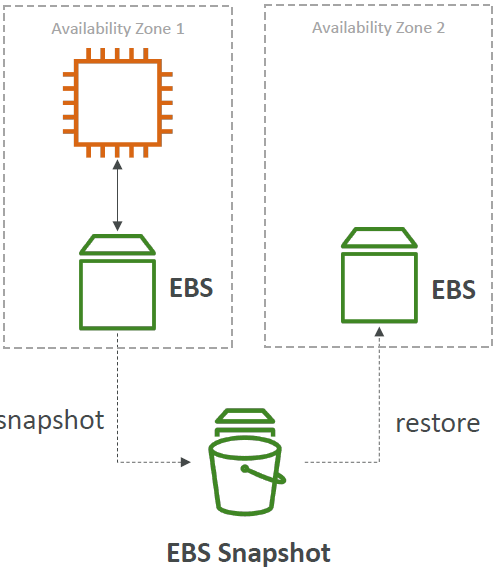

<!-- START doctoc generated TOC please keep comment here to allow auto update -->
<!-- DON'T EDIT THIS SECTION, INSTEAD RE-RUN doctoc TO UPDATE -->
**Table of Contents**

- [AWS Certified Developer - Associate](#aws-certified-developer---associate)
  - [AWS](#aws)
  - [Abbreviations](#abbreviations)
  - [Usecases](#usecases)
  - [Global infrastructure](#global-infrastructure)
    - [Region (e.g. `eu-central-1`)](#region-eg-eu-central-1)
    - [AWS Availability Zones (AZ) (e.g. `eu-central-1a`)](#aws-availability-zones-az-eg-eu-central-1a)
    - [AWS Points of Presence (Edge Locations)](#aws-points-of-presence-edge-locations)
    - [Global Services](#global-services)
    - [Region-scoped](#region-scoped)
  - [IAM: Users & Groups](#iam-users--groups)
    - [IAM: Permissions](#iam-permissions)
    - [IAM Policies structure](#iam-policies-structure)
    - [IAM Roles for Services](#iam-roles-for-services)
    - [Security](#security)
    - [IAM Guidelines and Best Practices](#iam-guidelines-and-best-practices)
    - [Shared Responsibility Model for IAM](#shared-responsibility-model-for-iam)
    - [IAM commands](#iam-commands)
    - [IAM Section – Summary](#iam-section--summary)
  - [How can users access AWS ?](#how-can-users-access-aws-)
    - [AWS CLI & SDK](#aws-cli--sdk)
    - [Create access keys](#create-access-keys)
    - [AWS CloudShell](#aws-cloudshell)
  - [EC2](#ec2)
    - [Sizing & configuration options](#sizing--configuration-options)
    - [User Data](#user-data)
    - [Instance Types](#instance-types)
    - [EC2 Instances Purchasing Options](#ec2-instances-purchasing-options)
    - [Which purchasing option is right for me?](#which-purchasing-option-is-right-for-me)
  - [Security groups](#security-groups)
    - [Security groups on EC2 instances](#security-groups-on-ec2-instances)
    - [Classic ports to know](#classic-ports-to-know)
    - [How to connect to our servers?](#how-to-connect-to-our-servers)
    - [EC2 Instance Connect](#ec2-instance-connect)
    - [EC2 Instance Storage](#ec2-instance-storage)
  - [Scalability and High Availability](#scalability-and-high-availability)
    - [Vertical Scalability](#vertical-scalability)
    - [Horizontal Scalability](#horizontal-scalability)
    - [High Availability](#high-availability)
    - [High Availability & Scalability For EC2](#high-availability--scalability-for-ec2)
    - [What is load balancing?](#what-is-load-balancing)

<!-- END doctoc generated TOC please keep comment here to allow auto update -->

# AWS Certified Developer - Associate

## AWS
* Amazon Web Services
* Provides servers and services that can be used on demand and that scale easily.

## Abbreviations
| Abbreviation | Stands for                         |
|--------------|------------------------------------|
| ACM          | AWS Certificate Manager            |
| ALB          | Application Load Balancer          |
| AMI          | Amazon Machine Image               |
| arn          | Amazon Resource Name               |
| ASG          | Auto-Scaling Group                 |
| AZ           | Availability Zone                  |
| CCP          | Certified Cloud Practitioner       |
| CLB          | Classic Load Balancer              |
| EBS          | Elastic Block Storage              |
| EC2          | Elastic Compute Cloud              |
| EFS          | Elastic File System                |
| ELB          | Elastic Load Balancer              |
| FTP          | File Transfer Protocol             |
| GWLB         | Gateway Load Balancer              |
| IA           | Infrequent Access                  |
| IAM          | Identity and Access Management     |
| IOPS         | Input/Output Operations per Second |
| NLB          | Network Load Balancer              |
| NFS          | Network File System                |
| RI           | Reserved Instance                  |
| RDP          | Remote Desktop Protocol            |
| SFTP         | Secure File Transfer Protocol      |
| SSH          | Secure Shell                       |


## Usecases
e.g.
* Enterprise IT
* Backup & Storage
* Big Data analytics
* Website hosting
* Mobile & social apps
* Gaming

## Global infrastructure
* AWS Regions
* AWS Availability Zones
* AWS Data Centers
* AWS Edge Locations / Points of Presence

### Region (e.g. `eu-central-1`)
* Cluster of datacenters
* Compliance with data governance and legal requirements: data never leaves a region without explicit permission
* Proximity to customers: reduced latency
* New services and new features aren't available in every region
* Pricing: pricing varies region to region and is transparent in the service pricing page

### AWS Availability Zones (AZ) (e.g. `eu-central-1a`)
* Each region has many availability zones (usually 3, min is 3, max is 6). Example:  
  - ap-southeast-2a
  - ap-southeast-2b
  - ap-southeast-2c  
* Each availability zone is one or more discrete data centers with redundant power,
networking, and connectivity
* They’re separate from each other, so that they’re isolated from disasters
* They’re connected with high bandwidth, ultra-low latency networking

### AWS Points of Presence (Edge Locations)
* Amazon has 400+ Points of Presence (400+ Edge Locations & 10+ Regional Caches) in 90+ cities across 40+ countries
* Content is delivered to end users with lower latency
* Points of Presence (PoPs): General term used to describe AWS locations where AWS services are accessed. They include both edge locations and regional edge caches.
* Edge Locations: These are specific locations where AWS deploys its content delivery and caching services. They are used primarily by Amazon CloudFront for distributing content and reducing latency for users.
* Regional Edge Caches: These are a subset of edge locations that act as intermediate caches for CloudFront to reduce latency for frequently accessed content.

### Global Services
* Identity and Access Management (IAM)
* Route 53 (DNS service)
* CloudFront (Content Delivery Network)
* WAF (Web Application Firewall)

### Region-scoped
* Amazon EC2 (Infrastructure as a Service)
* Elastic Beanstalk (Platform as a Service)
* Lambda (Function as a Service)
* Rekognition (Software as a Service)
* Region Table: https://aws.amazon.com/about-aws/global-infrastructure/regional-product-services

## IAM: Users & Groups
* IAM = Identity and Access Management, Global service
* Root account created by default, shouldn’t be used or shared
* Users are people within your organization, and can be grouped. 1 person = 1 user.
* Groups (e.g. `admins`, `developers`, ...) only contain users, not other groups.
* Users don’t have to belong to a group (though this is not best practice), and user can belong to multiple groups.

### IAM: Permissions
* Users or Groups can be assigned JSON documents called policies
  ```json
  {
    "Version": "2012-10-17",
    "Statement": [
      {
        "Effect": "Allow",
        "Action": "ec2:Describe*",
        "Resource": "*"
      },
      {
        "Effect": "Allow",
        "Action": "elasticloadbalancing:Describe*",
        "Resource": "*"
      },
      {
        "Effect": "Allow",
        "Action": [
          "cloudwatch:ListMetrics",
          "cloudwatch:GetMetricStatistics",
          "cloudwatch:Describe*"
        ],
        "Resource": "*"
      }
    ]
  }
  ```
* These policies define the permissions of the users
* In AWS you apply the **least privilege principle**: don’t give more permissions than a user needs.
* An IAM user is an identity with long-term credentials that is used to interact with AWS in an account.
* If you attach a policy at the group level --> policy gets applied to every group member.
*  **Inline policy**: Policy only attached to a user

### IAM Policies structure
  ```json
  {
    "Version": "2012-10-17",
    "Id": "S3-Account-Permissions",
    "Statement": [
      {
        "Sid": "1",
        "Effect": "Allow",
        "Principal": {
          "AWS": ["arn:aws:iam::123456789012:root"]
        },
        "Action": [
          "s3:GetObject",
          "s3:PutObject"
        ],
        "Resource": ["arn:aws:s3:::mybucket/*"]
      }
    ]
  }
  ```
Consists of
* Version: policy language version, always include “2012-10-17”
* Id (optional): an identifier for the policy
* Statement: one or more individual statements (required)

Statements consists of
* Sid (statement ID, optional): an identifier for the statement
* Effect: whether the statement allows or denies access (Allow, Deny)
* Principal: account/user/role to which this policy applied to
* Action: list of actions this policy allows or denies (`<service>:<api-call>`, can also be e.g. `ìam:Get*` --> all Get-commands are authorized)
* Resource: list of resources to which the actions apply to. If all resources are allowed --> `"Resource": "*"`
* Condition (optional): conditions for when this policy is in effect


### IAM Roles for Services
* Some AWS service will need to perform actions on your behalf. E.g. Create an EC2 instance (virtual server) --> wants to perform actions on AWS --> EC2 needs permissions
* To do so, we will assign permissions to AWS services with IAM Roles
* Common roles:
  - EC2 Instance Roles
  - Lambda Function Roles
  - Roles for CloudFormation
* IAM --> Roles: `Create role`, Select trusted entity `AWS service` --> choose a service --> add permission --> enter role name and description --> verify trusted entities and permissions --> `Create role`


### Security
* In AWS, you can set up a password policy (in IAM `Account settings`):
  - Set a minimum password length
  - Require specific character types (uppercase, lowercase, numbers, non-alphanumeric characters)
  - Allow all IAM users to change their own passwords
  - Require users to change their password after some time (password expiration)
  - Prevent password re-use
* You can also set up MFA (Google Authenticator, Authy, YubiKey, Hardware Key Fob MFA Device, ...) (click on user in top right --> `Security credentials`)
* IAM Credentials Report (account-level): a report that lists all your account's users and the status of their various credentials (click on `Credential report` in the IAM menu)
* IAM Access Advisor (user-level) (go to `user` and click on `Access Advisor`)
  - Access advisor shows the service permissions granted to a user and when those services were last accessed.
  - You can use this information to revise your policies.


### IAM Guidelines and Best Practices
* One physical user = One AWS user
* Assign users to groups and assign permissions to groups
* Create a strong password policy
* Use and enforce the use of Multi Factor Authentication (MFA)
* Create and use roles for giving permissions to AWS services
* Use Access Keys for Programmatic Access (CLI / SDK)
* Audit permissions of your account using IAM Credentials Report & IAM Access Advisor
* Never share IAM users & Access Keys


### Shared Responsibility Model for IAM
* AWS --> responsible for infrastructure
  - Infrastructure (global network security)
  - Configuration and vulnerability analysis
  - Compliance validation
* I / user --> responsible for how this infrastructure is used
  - Users, Groups, Roles, Policies management and monitoring
  - Enable MFA on all accounts
  - Rotate all your keys often
  - Use IAM tools to apply appropriate permissions
  - Analyze access patterns & review permissions

### IAM commands
* List users: `aws iam list-users`

### IAM Section – Summary
* Users: mapped to a physical user, has a password for AWS Console
* Groups: contains users only
* Policies: JSON document that outlines permissions for users or groups
* Roles: for EC2 instances or AWS services
* Security: MFA + Password Policy
* AWS CLI: manage your AWS services using the command-line
* AWS SDK: manage your AWS services using a programming language
* Access Keys: access AWS using the CLI or SDK
* Audit: IAM Credential Reports & IAM Access Advisor


## How can users access AWS ?
To access AWS, you have three options:
* AWS Management Console (protected by password + MFA) (Best for users who prefer a graphical interface, need to perform manual tasks, or are exploring AWS services.)
* AWS Command Line Interface (CLI): protected by access keys 
* AWS Software Development Kit (SDK) - for code: protected by access keys (Best for developers who need to automate AWS interactions, build applications, or integrate AWS services into their software. It requires programming knowledge and is suitable for more complex, automated, or large-scale tasks.)  
Access Keys are generated through the AWS Console. Users manage their own access keys


### AWS CLI & SDK
* Every command begins with `aws`
* AWS SDK is a set of libraries, enables to access and manage AWS services, and is embedded within my application
* Example: AWS CLI is built on AWS SDK for Python (boto)

### Create access keys
* Click on your user --> `Security credentials` --> `Create access key`
* CLI `aws configure` --> enter access key + default region name + default output format (no necessity to enter anything)

### AWS CloudShell
* CLI in the cloud of AWS


## EC2
* EC2 is one of the most popular of AWS' offering
* EC2 = Elastic Compute Cloud = Infrastructure as a Service
* It mainly consists in the capability of :
  - Renting virtual machines (EC2)
  - Storing data on virtual drives (EBS)
  - Distributing load across machines (ELB)
  - Scaling the services using an auto-scaling group (ASG)

### Sizing & configuration options
* Operating System (OS): Linux, Windows or Mac OS
* An AMI is a template that contains the software configuration (operating system, application server, and applications) required to launch your instance.
* How much compute power & cores (CPU)
* How much random-access memory (RAM)
* How much storage space:
  - Network-attached (EBS & EFS)
  - Hardware (EC2 Instance Store)
* Network card: speed of the card, Public IP address
* Firewall rules: security group
* Bootstrap script (configure at first launch): EC2 User Data (EC2 User Data is used to bootstrap your EC2 instances using a bash script. This script can contain commands such as installing software/packages, download files from the Internet, or anything you want.)

### User Data
* It is possible to bootstrap our instances using an EC2 User data script.
* Bootstrapping means launching commands when a machine starts
* That script is only run once at the instance first start
* EC2 user data is used to automate boot tasks such as:
  - Installing updates
  - Installing software
  - Downloading common files from the internet
  - Anything you can think of
• The EC2 User Data Script runs with the root user

### Instance Types
* naming convention: `m5.2xlarge`
  - `m`: instance class
  - `5`: generation
  - `2xlarge`: size within the instance class
* Example:
  
* **General Purpose (`T`)**: Great for a diversity of workloads such as web servers or code repositories. Balance between:
  - Compute
  - Memory
  - Networking
* **Compute Optimized (`C`)**: Great for compute-intensive tasks that require high performance processors:
  - Batch processing workloads
  - Media transcoding
  - High performance web servers
  - High performance computing (HPC)
  - Scientific modeling & machine learning
  - Dedicated gaming servers
* **Memory Optimized (`R`, `X1`, `z1`)**: Fast performance for workloads that process large data sets in memory:
  - High performance, relational/non-relational databases
  - Distributed web scale cache stores
  - In-memory databases optimized for BI (business intelligence)
  - Applications performing real-time processing of big unstructured data
* **Storage Optimized (`I3`, `D`, `H`)**: Great for storage-intensive tasks that require high, sequential read and write access to large data sets on local storage:
  - High frequency online transaction processing (OLTP) systems
  - Relational & NoSQL databases
  - Cache for in-memory databases (for example, Redis)
  - Data warehousing applications
  - Distributed file systems

### EC2 Instances Purchasing Options
* On-Demand Instances – short workload, predictable pricing, pay by second
* Reserved (1 & 3 years)
  - Reserved Instances – long workloads
  - Convertible Reserved Instances – long workloads with flexible instances
* Savings Plans (1 & 3 years) –commitment to an amount of usage, long workload
* Spot Instances – short workloads, cheap, can lose instances (less reliable)
* Dedicated Hosts – book an entire physical server, control instance placement
* Dedicated Instances – no other customers will share your hardware
* Capacity Reservations – reserve capacity in a specific AZ for any duration

#### EC2 on Demand
* Pay for what you use:
  - Linux or Windows - billing per second, after the first minute
  - All other operating systems - billing per hour
* Has the highest cost but no upfront payment
* No long-term commitment
* Recommended for short-term and un-interrupted workloads, where
you can't predict how the application will behave

#### EC2 Reserved Instances
* Up to 72% discount compared to On-demand
* You reserve a specific instance attributes (Instance Type, Region, Tenancy, OS)
* Reservation Period – 1 year (+discount) or 3 years (+++discount) (nothing in between)
* Payment Options – No Upfront (+), Partial Upfront (++), All Upfront (+++)
* Reserved Instance’s Scope – Regional or Zonal (reserve capacity in an AZ)
* Recommended for steady-state usage applications (think database)
* You can buy and sell in the Reserved Instance Marketplace (e.g. if you don't it any more)
* Convertible Reserved Instance (specific type of reserved instance)
  - Can change the EC2 instance type, instance family, OS, scope and tenancy
  - Up to 66% discount

#### EC2 Savings Plans
* Get a discount based on long-term usage (up to 72% - same as RIs)
* Commit to a certain type of usage ($10/hour for 1 or 3 years)
* Usage beyond EC2 Savings Plans is billed at the On-Demand price
* Locked to a specific instance family & AWS region (e.g., M5 in us-east-1)
* Flexible across:
  - Instance Size (e.g., m5.xlarge, m5.2xlarge)
  - OS (e.g., Linux, Windows)
  - Tenancy (Host, Dedicated, Default)

#### EC2 Spot Instances
* Can get a discount of up to 90% compared to On-demand
* Instances that you can “lose” at any point of time if your max price is less than the
current spot price
* The MOST cost-efficient instances in AWS
* Useful for workloads that are resilient to failure
  - Batch jobs
  - Data analysis
  - Image processing
  - Any distributed workloads
  - Workloads with a flexible start and end time
* Not suitable for critical jobs or databases

#### EC2 Dedicated Hosts
* A physical server with EC2 instance capacity fully dedicated to your use
* Allows you address compliance requirements and use your existing serverbound software licenses (per-socket, per-core, per-VM software licenses)
* Purchasing Options:
  - On-demand – pay per second for active Dedicated Host
  - Reserved - 1 or 3 years (No Upfront, Partial Upfront, All Upfront)
* The most expensive option
* Useful for software that have complicated licensing model (BYOL – Bring Your Own License)
* Or for companies that have strong regulatory or compliance needs


#### EC2 Dedicated Instances
* Instances run on hardware that’s dedicated to you 
* May share hardware with other instances in same account
* No control over instance placement (can move hardware after Stop / Start)

#### EC2 Capacity Reservations
* Reserve On-Demand instances capacity in a specific AZ for any
duration
* You always have access to EC2 capacity when you need it
* No time commitment (create/cancel anytime), no billing discounts
* Combine with Regional Reserved Instances and Savings Plans to benefit
from billing discounts
* You’re charged at On-Demand rate whether you run instances or not
* Suitable for short-term, uninterrupted workloads that needs to be in a
specific AZ

### Which purchasing option is right for me?
* On demand: coming and staying in resort whenever we like, we pay the full price
* Reserved: like planning ahead and if we plan to stay for a long time, we may get a good discount.
* Savings Plans: pay a certain amount per hour for certain period and stay in any room type (e.g. King, Suite, Sea View, …)
* Spot instances: the hotel allows people to bid for the empty rooms and the highest bidder keeps the rooms. You can get kicked out at any time
* Dedicated Hosts: We book an entire building of the resort
* Capacity Reservations: you book a room for a period with full price even you don’t stay in it


## Security groups
* Security Groups are the fundamental of network security in AWS.
* They control how traffic is allowed into or out of our EC2 Instances.
* Security groups only contain **allow** rules.
* Security groups rules can reference by IP or by security group.
* Can be attached to multiple instances.  
  Also, one instance can have multiple security groups.
* Locked down to a region / VPC combination (Security Groups can be attached to multiple EC2 instances within the same AWS Region/VPC.)
* Does live “outside” the EC2 – if traffic is blocked, the EC2 instance won’t see it.
* It’s good to maintain one separate security group for SSH access.
* If your application is not accessible (time out), then it’s a security group issue.
* If your application gives a “connection refused“ error, then it’s an application error or it’s not launched.
* All inbound traffic is blocked by default.
* All outbound traffic is authorised by default.

### Security groups on EC2 instances
* Security groups are acting as a “firewall” on EC2 instances
* They regulate:
  - Access to Ports
  - Authorised IP ranges – IPv4 and IPv6
  - Control of inbound network (from other to the instance)
  - Control of outbound network (from the instance to other)
* Whenever there is a timeout, it is because of an EC2 security group. It might also be a firewall issue --> use "EC2 Instance Connect" in such a case.
* An EC2 instance can have many security groups attached to it.

### Classic ports to know
* 22 = SSH (Secure Shell) - log into a Linux instance
* 21 = FTP (File Transfer Protocol) – upload files into a file share
* 22 = SFTP (Secure File Transfer Protocol) – upload files using SSH
* 80 = HTTP – access unsecured websites
* 443 = HTTPS – access secured websites
* 3389 = RDP (Remote Desktop Protocol) – log into a Windows instance

### How to connect to our servers?
* **SSH** (Secure Shell): CLI that can be used on Mac, Linux and Windows >= 10. SSH allows you to control a remote machine with the CLI.  
* **PuTTY**: Valid for any version of Windows, allows to use SSH protocol
* **EC2** Instance Connect: Webbrowser to connect to EC2 instance

#### SSH for Windows
PowerShell: cd into directory where key (`AndreasKeys.pem`) is located, then:  `ssh -i <key>@<public-ip-address-of-ec2-instance>` (e.g. `ssh -i AndreasKeys.pem ec2-user@18.192.116.89`)

#### SSH for Linux/Mac

### EC2 Instance Connect
* Browser-based session into EC2 instance. Check EC2 instance and click 2x `Connect`.
* No need to use your key file that was downloaded. The “magic” is that a temporary key is uploaded onto EC2 by AWS.
* Never enter "AWS Access Key ID" and/or "AWS Secret Access Key" into EC2 Instance Connect --> Anyone could use who logs into this instance!
* Attach IAM Role to EC2 Instance Connect: `Actions` --> `Security` --> `Modify IAM Role`

### EC2 Instance Storage

#### EBS Volume
* An EBS (Elastic Block Store) Volume is a network drive (i.e. not a physical drive) you can attach to your instances while they run
  - It uses the network to communicate to the instance, which means there might be a bit of latency
  - It can be detached from an EC2 instance and attached to another one quickly
* It allows your instances to persist data, even after their termination
* They can only be mounted to one instance at a time (at the CCP level). But there can be several EBS Volumes attached to an instance.

* They can be unattached.
* They are bound to a specific availability zone (AZ)
  - An EBS Volume in `us-east-1a` cannot be attached to `us-east-1b`
  - To move a volume across, you first need to snapshot it
* They have a provisioned capacity (size in GBs, and IOPS)
  - You get billed for all the provisioned capacity
  - You can increase the capacity of the drive over time
* Analogy: Think of them as a “network USB stick” (attached through the network)
* Free tier: 30 GB of free EBS storage of type General Purpose (SSD) or Magnetic per month
* Delete on Termination attribute

  - Controls the EBS behaviour when an EC2 instance terminates
    - By default, the root EBS volume is deleted (attribute enabled)
    - By default, any other attached EBS volume is not deleted (attribute disabled)
  - This can be controlled by the AWS console / AWS CLI
  - Use case: preserve root volume when instance is terminated

#### EBS Snapshots
* Make a backup (snapshot) of your EBS volume at a point in time
* Not necessary to detach volume to do snapshot, but recommended
* Can copy snapshots across AZ or Region  
  
* EBS Snapshot Archive
  - Move a Snapshot to an ”archive tier” that is
  75% cheaper
  - Takes within 24 to 72 hours for restoring the
  archive
* Recycle Bin for EBS Snapshots
  - Setup rules to retain deleted snapshots so you
  can recover them after an accidental deletion
  - Specify retention (from 1 day to 1 year)
* Fast Snapshot Restore (FSR)
  - Force full initialization of snapshot to have no
  latency on the first use ($$$)
* Possible to (re)create a volume from snapshot


#### AMI (Amazon Machine Image)
* AMI are a customization of an EC2 instance
  - You add your own software, configuration, operating system, monitoring…
  - Faster boot / configuration time because all your software is pre-packaged
* AMI are built for a specific region (and can be copied across regions)
* You can launch EC2 instances from:
  - A Public AMI: AWS provided
  - Your own AMI: you make and maintain them yourself
  - An AWS Marketplace AMI: an AMI someone else made (and potentially sells)

#### AMI Process (from an EC2 instance)
* Start an EC2 instance and customize it
* Stop the instance (for data integrity)
* Build an AMI – this will also create EBS snapshots
* Launch instances from other AMIs

* AMIs are built for a specific AWS Region, they're unique for each AWS Region. You can't launch an EC2 instance using an AMI in another AWS Region, but you can copy the AMI to the target AWS Region and then use it to create your EC2 instances.


#### EC2 Instance Store
* EBS volumes are network drives with good but “limited” performance
* If you need a high-performance hardware disk, use EC2 Instance
Store
* Better I/O performance (better than EBS and EFS!; > 256,000 IOPS)
* EC2 Instance Store lose their storage if they’re stopped (ephemeral) (= kurzlebig)
* Good for buffer / cache / scratch data / temporary content
* Risk of data loss if hardware fails
* Backups and Replication are your responsibility

#### EBS Volume Types
* EBS Volumes come in 6 types
  - gp2 / gp3 (SSD): General purpose SSD volume that balances price and performance for
a wide variety of workloads
  - io1 / io2 Block Express (SSD): Highest-performance SSD volume for mission-critical
low-latency or high-throughput workloads
  - st1 (HDD): Low cost HDD volume designed for frequently accessed, throughput intensive workloads
  - sc1 (HDD): Lowest cost HDD volume designed for less frequently accessed workloads
* EBS Volumes are characterized in Size | Throughput | IOPS (I/O Ops Per Sec)
* Only gp2/gp3 and io1/io2 Block Express can be used as boot volumes (IMPORTANT!)

#### EBS Volume Types Use cases:

##### - General Purpose SSD
* Cost-effective storage, low-latency
* System boot volumes, Virtual desktops, Development and test environments
* 1 GiB - 16 TiB
* gp3:
  - Baseline of 3,000 IOPS and throughput of 125 MiB/s
  - Can increase IOPS up to 16,000 and throughput up to 1000 MiB/s independently
  - Set independently IOPS and throughput
* gp2 (older version):
  - Small gp2 volumes can burst IOPS to 3,000
  - Size of the volume and IOPS are linked, max IOPS is 16,000
  - 3 IOPS per GB, means at 5,334 GB we are at the max IOPS

##### - Provisioned IOPS (PIOPS) SSD
* Critical business applications with sustained IOPS performance
* Or applications that need more than 16,000 IOPS
* Great for databases workloads (sensitive to storage perf and consistency)
* io1 (4 GiB - 16 TiB):
  - Max PIOPS: 64,000 for Nitro EC2 instances & 32,000 for other
  - Can increase PIOPS independently from storage size
* io2 Block Express (4 GiB – 64 TiB):
  - Sub-millisecond latency
  - Max PIOPS: 256,000 with an IOPS:GiB ratio of 1,000:1
* Supports EBS Multi-attach

##### - Hard Disk Drives (HDD)
* Cannot be a boot volume
* 125 GiB to 16 TiB
* Throughput Optimized HDD (st1)
  - Big Data, Data Warehouses, Log Processing
  - Max throughput 500 MiB/s – max IOPS 500
* Cold HDD (sc1):
  - For data that is infrequently accessed
  - Scenarios where lowest cost is important
  - Max throughput 250 MiB/s – max IOPS 250

#### EBS Volume Types Summary
**SSD**


**HDD**


#### EBS Multi-Attach – io1/io2 family
* Attach the same EBS volume to multiple EC2 instances in the same AZ (IMPORTANT!)

* Each instance has full read & write permissions to the high-performance volume
* Use case:
  - Achieve higher application availability in clustered Linux applications (ex: Teradata)
  - Applications must manage concurrent write operations
* Up to 16 EC2 Instances at a time (IMPORTANT!)
* Must use a file system that’s cluster-aware (not XFS, EXT4, etc…)

#### Amazon EFS – Elastic File System
* Managed NFS (network file system) that can be mounted on many EC2
* EFS works with EC2 instances in multi-AZ
* Highly available, scalable, expensive (3x gp2), pay per use

* Use cases: content management, web serving, data sharing, Wordpress
* Uses NFSv4.1 protocol
* Uses security group to control access to EFS
* Compatible with Linux based AMI (not Windows)
* Encryption at rest using KMS
* POSIX file system (~Linux) that has a standard file API
* File system scales automatically, pay-per-use, no capacity planning!

#### EFS – Performance & Storage Classes
* EFS Scale
  - 1000s of concurrent NFS clients, 10 GB+ /s throughput
  - Grow to Petabyte-scale network file system, automatically
* Performance Mode (set at EFS creation time)
  - General Purpose (default) – latency-sensitive use cases (web server, CMS, etc…)
  - Max I/O – higher latency, throughput, highly parallel (big data, media processing)
* Throughput Mode
  - Bursting – 1 TB = 50MiB/s + burst of up to 100MiB/s
  - Provisioned – set your throughput regardless of storage size, ex: 1 GiB/s for 1 TB storage
  - Elastic – automatically scales throughput up or down based on your workloads
    - Up to 3GiB/s for reads and 1GiB/s for writes
    - Used for unpredictable workloads

#### EFS – Storage Classes
* Storage Tiers (lifecycle management feature – move file after N days)
  - Standard: for frequently accessed files
  - Infrequent access (EFS-IA): cost to retrieve files, lower price to store.
  - Archive: rarely accessed data (few times each year), 50% cheaper
  - Implement lifecycle policies to move files between storage tiers
* Availability and durability
  - Standard: Multi-AZ, great for prod
  - One Zone: One AZ, great for dev, backup enabled by default, compatible with IA (EFS One Zone-IA)
* Over 90% in cost savings

#### EBS vs. EFS
* EBS (Elastic Block Storage) volumes…
  - one instance (except multi-attach io1/io2)
  - are locked at the Availability Zone (AZ) level
  - gp2: IO increases if the disk size increases
  - gp3 & io1: can increase IO independently

* To migrate an EBS volume across AZ
  - Take a snapshot 
  - Restore the snapshot to another AZ 
  - EBS backups use IO and you shouldn't run them while your application is handling a lot of traffic
* Root EBS Volumes of instances get terminated by default if the EC2 instance gets terminated. (you can disable that)
* EFS (Elastic File System)
  - Mounting 100s of instances across AZ
  - EFS share website files (WordPress)
 
  - Only for Linux Instances (POSIX)
  - EFS has a higher price point than EBS
  - Can leverage Storage Tiers for cost savings
* Remember: EFS vs EBS vs Instance Store


## Scalability and High Availability
 
* Scalability means that an application / system can handle greater loads by adapting.
* There are two kinds of scalability:
  - Vertical Scalability
  - Horizontal Scalability (= elasticity)
* Scalability is linked but different to High Availability

### Vertical Scalability
* Vertically scalability means increasing the size of the instance
  - For example, your application runs on a t2.micro
  - Scaling that application vertically means running it on a t2.large

* Vertical scalability is very common for non-distributed systems, such as a database.  
  RDS, ElastiCache are services that can scale vertically.
* There’s usually a limit to how much you can vertically scale (hardware limit)

### Horizontal Scalability
* Horizontal Scalability means increasing the number of instances / systems for your application

* Horizontal scaling implies distributed systems.
* This is very common for web applications / modern applications
* It’s easy to horizontally scale thanks to cloud offerings such as Amazon EC2

### High Availability
* High Availability usually goes hand in hand with horizontal scaling 
* High availability means running your application / system in at least 2 data centers (== Availability Zones)

* The goal of high availability is to survive a data center loss
* The high availability can be passive (for RDS Multi AZ for example)
* The high availability can be active (for horizontal scaling)

### High Availability & Scalability For EC2
* Vertical Scaling: Increase instance size (= scale up / down)
  - From: t2.nano - 0.5G of RAM, 1 vCPU
  - To: u-12tb1.metal – 12.3 TB of RAM, 448 vCPUs
* Horizontal Scaling: Increase number of instances (= scale out / in)
  - Auto Scaling Group
  - Load Balancer
* High Availability: Run instances for the same application across multi AZ
  - Auto Scaling Group multi AZ
  - Load Balancer multi AZ

### What is load balancing?
* Load Balancers are servers that forward traffic to multiple servers (e.g., EC2 instances) downstream

* The more users I have, the more the load is going to be balanced.

#### Why use a load balancer?
* Spread load across multiple downstream instances
* Expose a single point of access (DNS) to your application
* Seamlessly handle failures of downstream instances
* Do regular health checks to your instances
* Provide SSL termination (HTTPS) for your websites
* Enforce stickiness with cookies
* High availability across zones
* Separate public traffic from private traffic

#### Why use an Elastic Load Balancer?
* An Elastic Load Balancer is a managed load balancer
  - AWS guarantees that it will be working
  - AWS takes care of upgrades, maintenance, high availability
  - AWS provides only a few configuration knobs
* It costs less to setup your own load balancer but it will be a lot more effort on your end
* It is integrated with many AWS offerings / services
  - EC2, EC2 Auto Scaling Groups, Amazon ECS
  - AWS Certificate Manager (ACM), CloudWatch
  - Route 53, AWS WAF, AWS Global Accelerator

#### Health Checks
* Health Checks are crucial for Load Balancers
* They enable the load balancer to know if instances it forwards traffic to are available to reply to requests
* The health check is done on a port and a route (/health is common)

* If the response is not 200 (OK), then the instance is unhealthy

#### Types of load balancer on AWS
* AWS has 4 kinds of managed Load Balancers 
  - Classic Load Balancer (v1 - old generation) – 2009 – CLB
    * HTTP, HTTPS, TCP, SSL (secure TCP)
  - Application Load Balancer (v2 - new generation) – 2016 – ALB
    * HTTP, HTTPS, WebSocket
  - Network Load Balancer (v2 - new generation) – 2017 – NLB
    *TCP, TLS (secure TCP), UDP
  - Gateway Load Balancer – 2020 – GWLB
    * Operates at layer 3 (Network layer) – IP Protocol
* Overall, it is recommended to use the newer generation load balancers as they provide more features
* Some load balancers can be setup as internal (private) or external (public) ELBs

#### Load Balancer Security Groups

* Application Security Group: Source is not an IP range, but a security group --> link security group of EC2 instance to security group of load balancer.

#### Classic Load Balancers (v1)
* Supports TCP (Layer 4), HTTP & HTTPS (Layer 7)
* Health checks are TCP or HTTP based
* Fixed hostname  
  `XXX.region.elb.amazonaws.com`


#### Application Load Balancer (v2)
* Application load balancers is Layer 7 (HTTP)
* Load balancing to multiple HTTP applications across machines (target groups)
* Load balancing to multiple applications on the same machine (ex: containers)
* Support for HTTP/2 and WebSocket
* Support redirects (from HTTP to HTTPS for example)
* Routing tables to different target groups:
  - Routing based on path in URL (example.com/users & example.com/posts)
  - Routing based on hostname in URL (one.example.com & other.example.com)
  - Routing based on Query String, Headers (example.com/users?id=123&order=false)

* ALB are a great fit for micro services & container-based application
  (example: Docker & Amazon ECS)
* Has a port mapping feature to redirect to a dynamic port in ECS
* In comparison, we’d need multiple Classic Load Balancer per application
* Fixed hostname (`XXX.region.elb.amazonaws.com`)
* The application servers don’t see the IP of the client directly
  - The true IP of the client is inserted in the header `X-Forwarded-For`
  - We can also get Port (`X-Forwarded-Port`) and proto (`X-Forwarded-Proto`)


#### Application Load Balancer - Target Groups
* EC2 instances (can be managed by an Auto Scaling Group) – HTTP
* ECS tasks (managed by ECS itself) – HTTP
* Lambda functions – HTTP request is translated into a JSON event
* IP Addresses – must be private IPs
* ALB can route to multiple target groups

* Health checks are at the target group level

#### Network Load Balancer (v2)
* Network load balancers (Layer 4) allow to:
  - Forward TCP & UDP traffic to your instances [UDP --> Network Load Balancer!]
  - Handle millions of request per seconds
  - Less latency ~100 ms (vs 400 ms for ALB)
* NLB has one static IP per AZ, and supports assigning Elastic IP  
  (helpful for whitelisting specific IP)
* NLB are used for extreme performance, TCP or UDP traffic
* Not included in the AWS free tier


#### Network Load Balancer: Target Groups
* EC2 instances
* IP Addresses – must be private IPs
* Application Load Balancer
* Health Checks support the TCP, HTTP and HTTPS Protocols


#### Gateway Load Balancer
* Analyze network traffic
* Deploy, scale, and manage a fleet of 3rd party network virtual appliances in AWS
* Example: Firewalls, Intrusion Detection and Prevention Systems, Deep Packet Inspection Systems, payload manipulation, …
* Operates at Layer 3 (Network Layer) – IP Packets
* Combines the following functions:
  - Transparent Network Gateway – single entry/exit for all traffic
  - Load Balancer – distributes traffic to your virtual appliances
* Uses the GENEVE protocol on port 6081


#### Gateway Load Balancer: Target Groups
* EC2 instances
* IP Addresses – must be private IPs


#### Sticky Sessions (Session Affinity)
* It is possible to implement stickiness so that the same client is always redirected to the same instance behind a load balancer
* This works for Classic Load Balancer, Application Load Balancer, and Network Load Balancer
* For both CLB & ALB, the “cookie” used for stickiness has an expiration date you control (though NLB works without cookies)
* Use case: make sure the user doesn’t lose his session data
* Enabling stickiness may bring imbalance to the load over the backend EC2 instances


#### Sticky Sessions – Cookie Names
* Application-based Cookies
  - Custom cookie
    - Generated by the target
    - Can include any custom attributes required by the application
    - Cookie name must be specified individually for each target group
    - Don’t use AWSALB, AWSALBAPP, or AWSALBTG (reserved for use by the ELB)
  - Application cookie
    - Generated by the load balancer
    - Cookie name is AWSALBAPP
* Duration-based Cookies
  - Cookie generated by the load balancer
  - Cookie name is AWSALB for ALB, AWSELB for CLB

