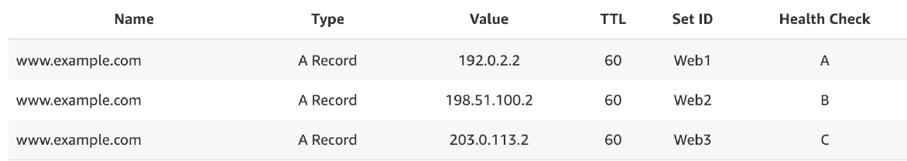
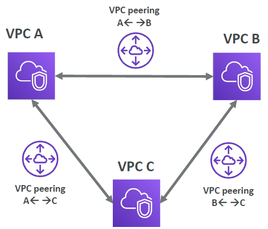
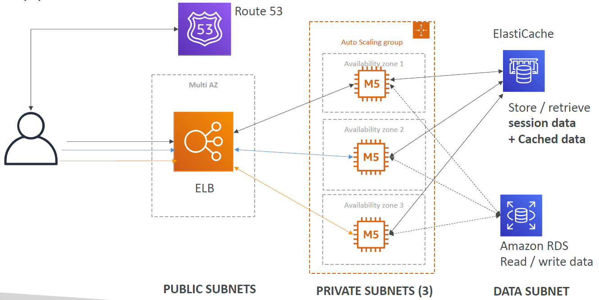

<!-- START doctoc generated TOC please keep comment here to allow auto update -->
<!-- DON'T EDIT THIS SECTION, INSTEAD RE-RUN doctoc TO UPDATE -->
**Table of Contents**

- [AWS Certified Developer - Associate](#aws-certified-developer---associate)
  - [AWS](#aws)
  - [Abbreviations](#abbreviations)
  - [Usecases](#usecases)
  - [Global infrastructure](#global-infrastructure)
    - [Region (e.g. `eu-central-1`)](#region-eg-eu-central-1)
    - [AWS Availability Zones (AZ) (e.g. `eu-central-1a`)](#aws-availability-zones-az-eg-eu-central-1a)
    - [AWS Points of Presence (Edge Locations)](#aws-points-of-presence-edge-locations)
    - [Global Services](#global-services)
    - [Region-scoped](#region-scoped)
  - [IAM: Users & Groups](#iam-users--groups)
    - [IAM: Permissions](#iam-permissions)
    - [IAM Policies structure](#iam-policies-structure)
    - [IAM Roles for Services](#iam-roles-for-services)
    - [Security](#security)
    - [IAM Guidelines and Best Practices](#iam-guidelines-and-best-practices)
    - [Shared Responsibility Model for IAM](#shared-responsibility-model-for-iam)
    - [IAM commands](#iam-commands)
    - [IAM Section – Summary](#iam-section--summary)
  - [How can users access AWS ?](#how-can-users-access-aws-)
    - [AWS CLI & SDK](#aws-cli--sdk)
    - [Create access keys](#create-access-keys)
    - [AWS CloudShell](#aws-cloudshell)
  - [EC2](#ec2)
    - [Sizing & configuration options](#sizing--configuration-options)
    - [User Data](#user-data)
    - [Instance Types](#instance-types)
    - [EC2 Instances Purchasing Options](#ec2-instances-purchasing-options)
    - [Which purchasing option is right for me?](#which-purchasing-option-is-right-for-me)
  - [Security groups](#security-groups)
    - [Security groups on EC2 instances](#security-groups-on-ec2-instances)
    - [Classic ports to know](#classic-ports-to-know)
    - [How to connect to our servers?](#how-to-connect-to-our-servers)
    - [EC2 Instance Connect](#ec2-instance-connect)
    - [EC2 Instance Storage](#ec2-instance-storage)
  - [Scalability and High Availability](#scalability-and-high-availability)
    - [Vertical Scalability](#vertical-scalability)
    - [Horizontal Scalability](#horizontal-scalability)
    - [High Availability](#high-availability)
    - [High Availability & Scalability For EC2](#high-availability--scalability-for-ec2)
    - [What is load balancing?](#what-is-load-balancing)
    - [Elastic Load Balancers – SSL Certificates](#elastic-load-balancers--ssl-certificates)
    - [What’s an Auto Scaling Group?](#whats-an-auto-scaling-group)
  - [RDS + Aurora + Elasticache](#rds--aurora--elasticache)
    - [RDS](#rds)
    - [Advantage over using RDS versus deploying DB on EC2](#advantage-over-using-rds-versus-deploying-db-on-ec2)
    - [RDS – Storage Auto Scaling](#rds--storage-auto-scaling)
    - [RDS Read Replicas for read scalability](#rds-read-replicas-for-read-scalability)
    - [RDS Multi AZ (Disaster Recovery)](#rds-multi-az-disaster-recovery)
    - [Differences Read Replicas vs. Multi-AZ](#differences-read-replicas-vs-multi-az)
    - [RDS – From Single-AZ to Multi-AZ](#rds--from-single-az-to-multi-az)
    - [Aurora](#aurora)
    - [RDS & Aurora Security](#rds--aurora-security)
    - [Amazon RDS Proxy](#amazon-rds-proxy)
    - [Amazon ElastiCache Overview](#amazon-elasticache-overview)
    - [Final words of wisdom](#final-words-of-wisdom)
    - [Amazon MemoryDB for Redis](#amazon-memorydb-for-redis)
  - [Amazon Route 53](#amazon-route-53)
    - [What is DNS?](#what-is-dns)
    - [DNS Terminologies](#dns-terminologies)
    - [How DNS works](#how-dns-works)
    - [Amazon Route 53](#amazon-route-53-1)
    - [Route 53 – Records](#route-53--records)
    - [Route 53 – Record Types](#route-53--record-types)
    - [Route 53 – Hosted Zones](#route-53--hosted-zones)
    - [Route 53 – Records TTL (Time To Live)](#route-53--records-ttl-time-to-live)
    - [CNAME vs Alias](#cname-vs-alias)
    - [Routing Policies](#routing-policies)
    - [Health Checks](#health-checks)
    - [Routing Policies – Failover (Active-Passive)](#routing-policies--failover-active-passive)
    - [Routing Policies – Geolocation](#routing-policies--geolocation)
    - [Routing Policies – Geoproximity](#routing-policies--geoproximity)
    - [Route 53 – Traffic flow](#route-53--traffic-flow)
    - [Routing Policies – IP-based Routing](#routing-policies--ip-based-routing)
    - [Routing Policies – Multi-Value](#routing-policies--multi-value)
    - [Domain Registar vs. DNS Service](#domain-registar-vs-dns-service)
  - [Amazon VPC](#amazon-vpc)
    - [VPC & Subnets](#vpc--subnets)
    - [VPC Diagram](#vpc-diagram)
    - [Internet Gateway & NAT Gateways](#internet-gateway--nat-gateways)
    - [Network ACL & Security Groups](#network-acl--security-groups)
    - [Network ACLs vs Security Groups](#network-acls-vs-security-groups)
    - [VPC Flow Logs (information about the traffic flowing through VPC)](#vpc-flow-logs-information-about-the-traffic-flowing-through-vpc)
    - [VPC Peering](#vpc-peering)
    - [VPC Endpoints](#vpc-endpoints)
    - [Site to Site VPN & Direct Connect](#site-to-site-vpn--direct-connect)
    - [VPC Closing Comments](#vpc-closing-comments)
    - [Typical 3 tier solution architecture](#typical-3-tier-solution-architecture)
    - [LAMP Stack on EC2](#lamp-stack-on-ec2)
    - [WordPress on AWS](#wordpress-on-aws)
  - [S3](#s3)
    - [S3 Use cases](#s3-use-cases)
    - [S3 - Buckets](#s3---buckets)
    - [S3 - Objects](#s3---objects)
    - [S3 – Security](#s3--security)
    - [S3 Bucket Policies](#s3-bucket-policies)
    - [Examples](#examples)
    - [Bucket settings for Block Public Access](#bucket-settings-for-block-public-access)
    - [S3 – Static Website Hosting](#s3--static-website-hosting)
    - [S3 - Versioning](#s3---versioning)
    - [S3 – Replication (CRR & SRR)](#s3--replication-crr--srr)
    - [S3 – Replication (Notes)](#s3--replication-notes)
    - [S3 Storage Classes](#s3-storage-classes)
  - [AWS CLI, SDK, IAM Roles & Policies](#aws-cli-sdk-iam-roles--policies)
    - [EC2 Instance Metadata (IMDS)](#ec2-instance-metadata-imds)
    - [MFA with CLI](#mfa-with-cli)
    - [AWS SDK Overview](#aws-sdk-overview)
    - [AWS Limits (Quotas)](#aws-limits-quotas)
    - [AWS CLI Credentials Provider Chain](#aws-cli-credentials-provider-chain)
    - [Signing AWS API requests](#signing-aws-api-requests)
  - [S3 - Advanced](#s3---advanced)
    - [Amazon S3 – Moving between Storage Classes](#amazon-s3--moving-between-storage-classes)
    - [Lifecycle Rules](#lifecycle-rules)
    - [S3 Event Notifications](#s3-event-notifications)
    - [S3 – Baseline Performance](#s3--baseline-performance)
    - [S3 User-Defined Object Metadata & S3 Object Tags](#s3-user-defined-object-metadata--s3-object-tags)

<!-- END doctoc generated TOC please keep comment here to allow auto update -->

# AWS Certified Developer - Associate

## AWS
* Amazon Web Services
* Provides servers and services that can be used on demand and that scale easily.

## Abbreviations
| Abbreviation | Stands for                                                       |
|--------------|------------------------------------------------------------------|
| ACL          | Access Control Lists                                             |
| ACM          | AWS Certificate Manager                                          |
| ALB          | Application Load Balancer                                        |
| AMI          | Amazon Machine Image                                             |
| arn          | Amazon Resource Name                                             |
| ASG          | Auto-Scaling Group                                               |
| AZ           | Availability Zone                                                |
| CCP          | Certified Cloud Practitioner                                     |
| CIDR         | Classless Inter-Domain Routing (IP address range)                |
| CLB          | Classic Load Balancer                                            |
| CORS         | Cross-Origin Resource Sharing                                    |
| CRR          | Cross-Region Replication                                         |
| CSE          | Client-Side Encryption                                           |
| DNS Domain   | Name Service                                                     |
| DR           | Disaster Recovery                                                |
| DSSE-KMS     | Dual-layer server-side encryption with AWS Key Management System |
| EBS          | Elastic Block Storage                                            |
| EC2          | Elastic Compute Cloud                                            |
| EFS          | Elastic File System                                              |
| ELB          | Elastic Load Balancer                                            |
| ENI          | Elastic Network Interface                                        |
| FTP          | File Transfer Protocol                                           |
| FQDN         | Fully Qualified Domain Name                                      |
| GWLB         | Gateway Load Balancer                                            |
| IA           | Infrequent Access                                                |
| IAM          | Identity and Access Management                                   |
| IMDS         | AWS EC2 Instance Metadata                                        |
| IOPS         | Input/Output Operations per Second                               |
| ISP          | Internet Service Provider                                        |
| KMS          | Key Management System                                            |
| LRU          | Least Recently Used                                              |
| NACL         | Network ACL                                                      |
| NLB          | Network Load Balancer                                            |
| NFS          | Network File System                                              |
| NS           | Name Server                                                      |
| RI           | Reserved Instance                                                |
| RDP          | Remote Desktop Protocol                                          |
| RDS          | Relational Database Service                                      |
| SFTP         | Secure File Transfer Protocol                                    |
| SLD          | Second Level Domain                                              | 
| SNI          | Server Name Indication                                           |
| SRR          | Same-Region Replication                                          |
| SSE          | Server-Side Encryption                                           |
| SSH          | Secure Shell                                                     |
| TLD          | Top Level Domain                                                 |
| TTL          | Time-to-live                                                     |
| vCPU         | virtual CPU                                                      |
| VPC          | Virtual Private Cloud                                            |
 | VPN          | Virtual Private Network                                          |


## Usecases
e.g.
* Enterprise IT
* Backup & Storage
* Big Data analytics
* Website hosting
* Mobile & social apps
* Gaming

## Global infrastructure
* AWS Regions
* AWS Availability Zones
* AWS Data Centers
* AWS Edge Locations / Points of Presence

### Region (e.g. `eu-central-1`)
* Cluster of datacenters
* Compliance with data governance and legal requirements: data never leaves a region without explicit permission
* Proximity to customers: reduced latency
* New services and new features aren't available in every region
* Pricing: pricing varies region to region and is transparent in the service pricing page

### AWS Availability Zones (AZ) (e.g. `eu-central-1a`)
* Each region has many availability zones (usually 3, min is 3, max is 6). Example:  
  - ap-southeast-2a
  - ap-southeast-2b
  - ap-southeast-2c  
* Each availability zone is one or more discrete data centers with redundant power,
networking, and connectivity
* They’re separate from each other, so that they’re isolated from disasters
* They’re connected with high bandwidth, ultra-low latency networking

### AWS Points of Presence (Edge Locations)
* Amazon has 400+ Points of Presence (400+ Edge Locations & 10+ Regional Caches) in 90+ cities across 40+ countries
* Content is delivered to end users with lower latency
* Points of Presence (PoPs): General term used to describe AWS locations where AWS services are accessed. They include both edge locations and regional edge caches.
* Edge Locations: These are specific locations where AWS deploys its content delivery and caching services. They are used primarily by Amazon CloudFront for distributing content and reducing latency for users.
* Regional Edge Caches: These are a subset of edge locations that act as intermediate caches for CloudFront to reduce latency for frequently accessed content.

### Global Services
* Identity and Access Management (IAM)
* Route 53 (DNS service)
* CloudFront (Content Delivery Network)
* WAF (Web Application Firewall)

### Region-scoped
* Amazon EC2 (Infrastructure as a Service)
* Elastic Beanstalk (Platform as a Service)
* Lambda (Function as a Service)
* Rekognition (Software as a Service)
* Region Table: https://aws.amazon.com/about-aws/global-infrastructure/regional-product-services

## IAM: Users & Groups
* IAM = Identity and Access Management, Global service
* Root account created by default, shouldn’t be used or shared
* Users are people within your organization, and can be grouped. 1 person = 1 user.
* Groups (e.g. `admins`, `developers`, ...) only contain users, not other groups.
* Users don’t have to belong to a group (though this is not best practice), and user can belong to multiple groups.

### IAM: Permissions
* Users or Groups can be assigned JSON documents called policies
  ```json
  {
    "Version": "2012-10-17",
    "Statement": [
      {
        "Effect": "Allow",
        "Action": "ec2:Describe*",
        "Resource": "*"
      },
      {
        "Effect": "Allow",
        "Action": "elasticloadbalancing:Describe*",
        "Resource": "*"
      },
      {
        "Effect": "Allow",
        "Action": [
          "cloudwatch:ListMetrics",
          "cloudwatch:GetMetricStatistics",
          "cloudwatch:Describe*"
        ],
        "Resource": "*"
      }
    ]
  }
  ```
* These policies define the permissions of the users
* In AWS you apply the **least privilege principle**: don’t give more permissions than a user needs.
* An IAM user is an identity with long-term credentials that is used to interact with AWS in an account.
* If you attach a policy at the group level --> policy gets applied to every group member.
*  **Inline policy**: Policy only attached to a user

### IAM Policies structure
  ```json
  {
    "Version": "2012-10-17",
    "Id": "S3-Account-Permissions",
    "Statement": [
      {
        "Sid": "1",
        "Effect": "Allow",
        "Principal": {
          "AWS": ["arn:aws:iam::123456789012:root"]
        },
        "Action": [
          "s3:GetObject",
          "s3:PutObject"
        ],
        "Resource": ["arn:aws:s3:::mybucket/*"]
      }
    ]
  }
  ```
Consists of
* Version: policy language version, always include “2012-10-17”
* Id (optional): an identifier for the policy
* Statement: one or more individual statements (required)

Statements consists of
* Sid (statement ID, optional): an identifier for the statement
* Effect: whether the statement allows or denies access (Allow, Deny)
* Principal: account/user/role to which this policy applied to
* Action: list of actions this policy allows or denies (`<service>:<api-call>`, can also be e.g. `ìam:Get*` --> all Get-commands are authorized)
* Resource: list of resources to which the actions apply to. If all resources are allowed --> `"Resource": "*"`
* Condition (optional): conditions for when this policy is in effect


### IAM Roles for Services
* Some AWS service will need to perform actions on your behalf. E.g. Create an EC2 instance (virtual server) --> wants to perform actions on AWS --> EC2 needs permissions
* To do so, we will assign permissions to AWS services with IAM Roles
* Common roles:
  - EC2 Instance Roles
  - Lambda Function Roles
  - Roles for CloudFormation
* IAM --> Roles: `Create role`, Select trusted entity `AWS service` --> choose a service --> add permission --> enter role name and description --> verify trusted entities and permissions --> `Create role`


### Security
* In AWS, you can set up a password policy (in IAM `Account settings`):
  - Set a minimum password length
  - Require specific character types (uppercase, lowercase, numbers, non-alphanumeric characters)
  - Allow all IAM users to change their own passwords
  - Require users to change their password after some time (password expiration)
  - Prevent password re-use
* You can also set up MFA (Google Authenticator, Authy, YubiKey, Hardware Key Fob MFA Device, ...) (click on user in top right --> `Security credentials`)
* IAM Credentials Report (account-level): a report that lists all your account's users and the status of their various credentials (click on `Credential report` in the IAM menu)
* IAM Access Advisor (user-level) (go to `user` and click on `Access Advisor`)
  - Access advisor shows the service permissions granted to a user and when those services were last accessed.
  - You can use this information to revise your policies.


### IAM Guidelines and Best Practices
* One physical user = One AWS user
* Assign users to groups and assign permissions to groups
* Create a strong password policy
* Use and enforce the use of Multi Factor Authentication (MFA)
* Create and use roles for giving permissions to AWS services
* Use Access Keys for Programmatic Access (CLI / SDK)
* Audit permissions of your account using IAM Credentials Report & IAM Access Advisor
* Never share IAM users & Access Keys


### Shared Responsibility Model for IAM
* AWS --> responsible for infrastructure
  - Infrastructure (global network security)
  - Configuration and vulnerability analysis
  - Compliance validation
* I / user --> responsible for how this infrastructure is used
  - Users, Groups, Roles, Policies management and monitoring
  - Enable MFA on all accounts
  - Rotate all your keys often
  - Use IAM tools to apply appropriate permissions
  - Analyze access patterns & review permissions

### IAM commands
* List users: `aws iam list-users`

### IAM Section – Summary
* Users: mapped to a physical user, has a password for AWS Console
* Groups: contains users only
* Policies: JSON document that outlines permissions for users or groups
* Roles: for EC2 instances or AWS services
* Security: MFA + Password Policy
* AWS CLI: manage your AWS services using the command-line
* AWS SDK: manage your AWS services using a programming language
* Access Keys: access AWS using the CLI or SDK
* Audit: IAM Credential Reports & IAM Access Advisor


## How can users access AWS ?
To access AWS, you have three options:
* AWS Management Console (protected by password + MFA) (Best for users who prefer a graphical interface, need to perform manual tasks, or are exploring AWS services.)
* AWS Command Line Interface (CLI): protected by access keys 
* AWS Software Development Kit (SDK) - for code: protected by access keys (Best for developers who need to automate AWS interactions, build applications, or integrate AWS services into their software. It requires programming knowledge and is suitable for more complex, automated, or large-scale tasks.)  
Access Keys are generated through the AWS Console. Users manage their own access keys


### AWS CLI & SDK
* Every command begins with `aws`
* AWS SDK is a set of libraries, enables to access and manage AWS services, and is embedded within my application
* Example: AWS CLI is built on AWS SDK for Python (boto)

### Create access keys
* Click on your user --> `Security credentials` --> `Create access key`
* CLI `aws configure` --> enter access key + default region name + default output format (no necessity to enter anything)

### AWS CloudShell
* CLI in the cloud of AWS


## EC2
* EC2 is one of the most popular of AWS' offering
* EC2 = Elastic Compute Cloud = Infrastructure as a Service
* It mainly consists in the capability of :
  - Renting virtual machines (EC2)
  - Storing data on virtual drives (EBS)
  - Distributing load across machines (ELB)
  - Scaling the services using an auto-scaling group (ASG)

### Sizing & configuration options
* Operating System (OS): Linux, Windows or Mac OS
* An AMI is a template that contains the software configuration (operating system, application server, and applications) required to launch your instance.
* How much compute power & cores (CPU)
* How much random-access memory (RAM)
* How much storage space:
  - Network-attached (EBS & EFS)
  - Hardware (EC2 Instance Store)
* Network card: speed of the card, Public IP address
* Firewall rules: security group
* Bootstrap script (configure at first launch): EC2 User Data (EC2 User Data is used to bootstrap your EC2 instances using a bash script. This script can contain commands such as installing software/packages, download files from the Internet, or anything you want.)

### User Data
* It is possible to bootstrap our instances using an EC2 User data script.
* Bootstrapping means launching commands when a machine starts
* That script is only run once at the instance first start
* EC2 user data is used to automate boot tasks such as:
  - Installing updates
  - Installing software
  - Downloading common files from the internet
  - Anything you can think of
• The EC2 User Data Script runs with the root user

### Instance Types
* naming convention: `m5.2xlarge`
  - `m`: instance class
  - `5`: generation
  - `2xlarge`: size within the instance class
* Example:
  
* **General Purpose (`T`)**: Great for a diversity of workloads such as web servers or code repositories. Balance between:
  - Compute
  - Memory
  - Networking
* **Compute Optimized (`C`)**: Great for compute-intensive tasks that require high performance processors:
  - Batch processing workloads
  - Media transcoding
  - High performance web servers
  - High performance computing (HPC)
  - Scientific modeling & machine learning
  - Dedicated gaming servers
* **Memory Optimized (`R`, `X1`, `z1`)**: Fast performance for workloads that process large data sets in memory:
  - High performance, relational/non-relational databases
  - Distributed web scale cache stores
  - In-memory databases optimized for BI (business intelligence)
  - Applications performing real-time processing of big unstructured data
* **Storage Optimized (`I3`, `D`, `H`)**: Great for storage-intensive tasks that require high, sequential read and write access to large data sets on local storage:
  - High frequency online transaction processing (OLTP) systems
  - Relational & NoSQL databases
  - Cache for in-memory databases (for example, Redis)
  - Data warehousing applications
  - Distributed file systems

### EC2 Instances Purchasing Options
* On-Demand Instances – short workload, predictable pricing, pay by second
* Reserved (1 & 3 years)
  - Reserved Instances – long workloads
  - Convertible Reserved Instances – long workloads with flexible instances
* Savings Plans (1 & 3 years) –commitment to an amount of usage, long workload
* Spot Instances – short workloads, cheap, can lose instances (less reliable)
* Dedicated Hosts – book an entire physical server, control instance placement
* Dedicated Instances – no other customers will share your hardware
* Capacity Reservations – reserve capacity in a specific AZ for any duration

#### EC2 on Demand
* Pay for what you use:
  - Linux or Windows - billing per second, after the first minute
  - All other operating systems - billing per hour
* Has the highest cost but no upfront payment
* No long-term commitment
* Recommended for short-term and un-interrupted workloads, where
you can't predict how the application will behave

#### EC2 Reserved Instances
* Up to 72% discount compared to On-demand
* You reserve a specific instance attributes (Instance Type, Region, Tenancy, OS)
* Reservation Period – 1 year (+discount) or 3 years (+++discount) (nothing in between)
* Payment Options – No Upfront (+), Partial Upfront (++), All Upfront (+++)
* Reserved Instance’s Scope – Regional or Zonal (reserve capacity in an AZ)
* Recommended for steady-state usage applications (think database)
* You can buy and sell in the Reserved Instance Marketplace (e.g. if you don't it any more)
* Convertible Reserved Instance (specific type of reserved instance)
  - Can change the EC2 instance type, instance family, OS, scope and tenancy
  - Up to 66% discount

#### EC2 Savings Plans
* Get a discount based on long-term usage (up to 72% - same as RIs)
* Commit to a certain type of usage ($10/hour for 1 or 3 years)
* Usage beyond EC2 Savings Plans is billed at the On-Demand price
* Locked to a specific instance family & AWS region (e.g., M5 in us-east-1)
* Flexible across:
  - Instance Size (e.g., m5.xlarge, m5.2xlarge)
  - OS (e.g., Linux, Windows)
  - Tenancy (Host, Dedicated, Default)

#### EC2 Spot Instances
* Can get a discount of up to 90% compared to On-demand
* Instances that you can “lose” at any point of time if your max price is less than the
current spot price
* The MOST cost-efficient instances in AWS
* Useful for workloads that are resilient to failure
  - Batch jobs
  - Data analysis
  - Image processing
  - Any distributed workloads
  - Workloads with a flexible start and end time
* Not suitable for critical jobs or databases

#### EC2 Dedicated Hosts
* A physical server with EC2 instance capacity fully dedicated to your use
* Allows you address compliance requirements and use your existing serverbound software licenses (per-socket, per-core, per-VM software licenses)
* Purchasing Options:
  - On-demand – pay per second for active Dedicated Host
  - Reserved - 1 or 3 years (No Upfront, Partial Upfront, All Upfront)
* The most expensive option
* Useful for software that have complicated licensing model (BYOL – Bring Your Own License)
* Or for companies that have strong regulatory or compliance needs


#### EC2 Dedicated Instances
* Instances run on hardware that’s dedicated to you 
* May share hardware with other instances in same account
* No control over instance placement (can move hardware after Stop / Start)

#### EC2 Capacity Reservations
* Reserve On-Demand instances capacity in a specific AZ for any
duration
* You always have access to EC2 capacity when you need it
* No time commitment (create/cancel anytime), no billing discounts
* Combine with Regional Reserved Instances and Savings Plans to benefit
from billing discounts
* You’re charged at On-Demand rate whether you run instances or not
* Suitable for short-term, uninterrupted workloads that needs to be in a
specific AZ

### Which purchasing option is right for me?
* On demand: coming and staying in resort whenever we like, we pay the full price
* Reserved: like planning ahead and if we plan to stay for a long time, we may get a good discount.
* Savings Plans: pay a certain amount per hour for certain period and stay in any room type (e.g. King, Suite, Sea View, …)
* Spot instances: the hotel allows people to bid for the empty rooms and the highest bidder keeps the rooms. You can get kicked out at any time
* Dedicated Hosts: We book an entire building of the resort
* Capacity Reservations: you book a room for a period with full price even you don’t stay in it


## Security groups
* Security Groups are the fundamental of network security in AWS.
* They control how traffic is allowed into or out of our EC2 Instances.
* Security groups only contain **allow** rules.
* Security groups rules can reference by IP or by security group.
* Can be attached to multiple instances.  
  Also, one instance can have multiple security groups.
* Locked down to a region / VPC combination (Security Groups can be attached to multiple EC2 instances within the same AWS Region/VPC.)
* Does live “outside” the EC2 – if traffic is blocked, the EC2 instance won’t see it.
* It’s good to maintain one separate security group for SSH access.
* If your application is not accessible (time out), then it’s a security group issue.
* If your application gives a “connection refused“ error, then it’s an application error or it’s not launched.
* All inbound traffic is blocked by default.
* All outbound traffic is authorised by default.

### Security groups on EC2 instances
* Security groups are acting as a “firewall” on EC2 instances
* They regulate:
  - Access to Ports
  - Authorised IP ranges – IPv4 and IPv6
  - Control of inbound network (from other to the instance)
  - Control of outbound network (from the instance to other)
* Whenever there is a timeout, it is because of an EC2 security group. It might also be a firewall issue --> use "EC2 Instance Connect" in such a case.
* An EC2 instance can have many security groups attached to it.

### Classic ports to know
* 22 = SSH (Secure Shell) - log into a Linux instance
* 21 = FTP (File Transfer Protocol) – upload files into a file share
* 22 = SFTP (Secure File Transfer Protocol) – upload files using SSH
* 80 = HTTP – access unsecured websites
* 443 = HTTPS – access secured websites
* 3389 = RDP (Remote Desktop Protocol) – log into a Windows instance

### How to connect to our servers?
* **SSH** (Secure Shell): CLI that can be used on Mac, Linux and Windows >= 10. SSH allows you to control a remote machine with the CLI.  
* **PuTTY**: Valid for any version of Windows, allows to use SSH protocol
* **EC2** Instance Connect: Webbrowser to connect to EC2 instance

#### SSH for Windows
PowerShell: cd into directory where key (`AndreasKeys.pem`) is located, then:  `ssh -i <key>@<public-ip-address-of-ec2-instance>` (e.g. `ssh -i AndreasKeys.pem ec2-user@18.192.116.89`)

#### SSH for Linux/Mac

### EC2 Instance Connect
* Browser-based session into EC2 instance. Check EC2 instance and click 2x `Connect`.
* No need to use your key file that was downloaded. The “magic” is that a temporary key is uploaded onto EC2 by AWS.
* Never enter "AWS Access Key ID" and/or "AWS Secret Access Key" into EC2 Instance Connect --> Anyone could use who logs into this instance!
* Attach IAM Role to EC2 Instance Connect: `Actions` --> `Security` --> `Modify IAM Role`

### EC2 Instance Storage

#### EBS Volume
* An EBS (Elastic Block Store) Volume is a network drive (i.e. not a physical drive) you can attach to your instances while they run
  - It uses the network to communicate to the instance, which means there might be a bit of latency
  - It can be detached from an EC2 instance and attached to another one quickly
* It allows your instances to persist data, even after their termination
* They can only be mounted to one instance at a time (at the CCP level). But there can be several EBS Volumes attached to an instance.

* They can be unattached.
* They are bound to a specific availability zone (AZ)
  - An EBS Volume in `us-east-1a` cannot be attached to `us-east-1b`
  - To move a volume across, you first need to snapshot it
* They have a provisioned capacity (size in GBs, and IOPS)
  - You get billed for all the provisioned capacity
  - You can increase the capacity of the drive over time
* Analogy: Think of them as a “network USB stick” (attached through the network)
* Free tier: 30 GB of free EBS storage of type General Purpose (SSD) or Magnetic per month
* Delete on Termination attribute

  - Controls the EBS behaviour when an EC2 instance terminates
    - By default, the root EBS volume is deleted (attribute enabled)
    - By default, any other attached EBS volume is not deleted (attribute disabled)
  - This can be controlled by the AWS console / AWS CLI
  - Use case: preserve root volume when instance is terminated

#### EBS Snapshots
* Make a backup (snapshot) of your EBS volume at a point in time
* Not necessary to detach volume to do snapshot, but recommended
* Can copy snapshots across AZ or Region  
  
* EBS Snapshot Archive
  - Move a Snapshot to an ”archive tier” that is
  75% cheaper
  - Takes within 24 to 72 hours for restoring the
  archive
* Recycle Bin for EBS Snapshots
  - Setup rules to retain deleted snapshots so you
  can recover them after an accidental deletion
  - Specify retention (from 1 day to 1 year)
* Fast Snapshot Restore (FSR)
  - Force full initialization of snapshot to have no
  latency on the first use ($$$)
* Possible to (re)create a volume from snapshot


#### AMI (Amazon Machine Image)
* AMI are a customization of an EC2 instance
  - You add your own software, configuration, operating system, monitoring…
  - Faster boot / configuration time because all your software is pre-packaged
* AMI are built for a specific region (and can be copied across regions)
* You can launch EC2 instances from:
  - A Public AMI: AWS provided
  - Your own AMI: you make and maintain them yourself
  - An AWS Marketplace AMI: an AMI someone else made (and potentially sells)

#### AMI Process (from an EC2 instance)
* Start an EC2 instance and customize it
* Stop the instance (for data integrity)
* Build an AMI – this will also create EBS snapshots
* Launch instances from other AMIs

* AMIs are built for a specific AWS Region, they're unique for each AWS Region. You can't launch an EC2 instance using an AMI in another AWS Region, but you can copy the AMI to the target AWS Region and then use it to create your EC2 instances.


#### EC2 Instance Store
* EBS volumes are network drives with good but “limited” performance
* If you need a high-performance hardware disk, use EC2 Instance
Store
* Better I/O performance (better than EBS and EFS!; > 256,000 IOPS)
* EC2 Instance Store lose their storage if they’re stopped (ephemeral) (= kurzlebig)
* Good for buffer / cache / scratch data / temporary content
* Risk of data loss if hardware fails
* Backups and Replication are your responsibility

#### EBS Volume Types
* EBS Volumes come in 6 types
  - gp2 / gp3 (SSD): General purpose SSD volume that balances price and performance for
a wide variety of workloads
  - io1 / io2 Block Express (SSD): Highest-performance SSD volume for mission-critical
low-latency or high-throughput workloads
  - st1 (HDD): Low cost HDD volume designed for frequently accessed, throughput intensive workloads
  - sc1 (HDD): Lowest cost HDD volume designed for less frequently accessed workloads
* EBS Volumes are characterized in Size | Throughput | IOPS (I/O Ops Per Sec)
* Only gp2/gp3 and io1/io2 Block Express can be used as boot volumes (IMPORTANT!)

#### EBS Volume Types Use cases:

##### - General Purpose SSD
* Cost-effective storage, low-latency
* System boot volumes, Virtual desktops, Development and test environments
* 1 GiB - 16 TiB
* gp3:
  - Baseline of 3,000 IOPS and throughput of 125 MiB/s
  - Can increase IOPS up to 16,000 and throughput up to 1000 MiB/s independently
  - Set independently IOPS and throughput
* gp2 (older version):
  - Small gp2 volumes can burst IOPS to 3,000
  - Size of the volume and IOPS are linked, max IOPS is 16,000
  - 3 IOPS per GB, means at 5,334 GB we are at the max IOPS

##### - Provisioned IOPS (PIOPS) SSD
* Critical business applications with sustained IOPS performance
* Or applications that need more than 16,000 IOPS
* Great for databases workloads (sensitive to storage perf and consistency)
* io1 (4 GiB - 16 TiB):
  - Max PIOPS: 64,000 for Nitro EC2 instances & 32,000 for other
  - Can increase PIOPS independently from storage size
* io2 Block Express (4 GiB – 64 TiB):
  - Sub-millisecond latency
  - Max PIOPS: 256,000 with an IOPS:GiB ratio of 1,000:1
* Supports EBS Multi-attach

##### - Hard Disk Drives (HDD)
* Cannot be a boot volume
* 125 GiB to 16 TiB
* Throughput Optimized HDD (st1)
  - Big Data, Data Warehouses, Log Processing
  - Max throughput 500 MiB/s – max IOPS 500
* Cold HDD (sc1):
  - For data that is infrequently accessed
  - Scenarios where lowest cost is important
  - Max throughput 250 MiB/s – max IOPS 250

#### EBS Volume Types Summary
**SSD**


**HDD**


#### EBS Multi-Attach – io1/io2 family
* Attach the same EBS volume to multiple EC2 instances in the same AZ (IMPORTANT!)

* Each instance has full read & write permissions to the high-performance volume
* Use case:
  - Achieve higher application availability in clustered Linux applications (ex: Teradata)
  - Applications must manage concurrent write operations
* Up to 16 EC2 Instances at a time (IMPORTANT!)
* Must use a file system that’s cluster-aware (not XFS, EXT4, etc…)

#### Amazon EFS – Elastic File System
* Managed NFS (network file system) that can be mounted on many EC2
* EFS works with EC2 instances in multi-AZ
* Highly available, scalable, expensive (3x gp2), pay per use

* Use cases: content management, web serving, data sharing, Wordpress
* Uses NFSv4.1 protocol
* Uses security group to control access to EFS
* Compatible with Linux based AMI (not Windows)
* Encryption at rest using KMS
* POSIX file system (~Linux) that has a standard file API
* File system scales automatically, pay-per-use, no capacity planning!

#### EFS – Performance & Storage Classes
* EFS Scale
  - 1000s of concurrent NFS clients, 10 GB+ /s throughput
  - Grow to Petabyte-scale network file system, automatically
* Performance Mode (set at EFS creation time)
  - General Purpose (default) – latency-sensitive use cases (web server, CMS, etc…)
  - Max I/O – higher latency, throughput, highly parallel (big data, media processing)
* Throughput Mode
  - Bursting – 1 TB = 50MiB/s + burst of up to 100MiB/s
  - Provisioned – set your throughput regardless of storage size, ex: 1 GiB/s for 1 TB storage
  - Elastic – automatically scales throughput up or down based on your workloads
    - Up to 3GiB/s for reads and 1GiB/s for writes
    - Used for unpredictable workloads

#### EFS – Storage Classes
* Storage Tiers (lifecycle management feature – move file after N days)
  - Standard: for frequently accessed files
  - Infrequent access (EFS-IA): cost to retrieve files, lower price to store.
  - Archive: rarely accessed data (few times each year), 50% cheaper
  - Implement lifecycle policies to move files between storage tiers
* Availability and durability
  - Standard: Multi-AZ, great for prod
  - One Zone: One AZ, great for dev, backup enabled by default, compatible with IA (EFS One Zone-IA)
* Over 90% in cost savings

#### EBS vs. EFS
* EBS (Elastic Block Storage) volumes…
  - one instance (except multi-attach io1/io2)
  - are locked at the Availability Zone (AZ) level
  - gp2: IO increases if the disk size increases
  - gp3 & io1: can increase IO independently

* To migrate an EBS volume across AZ
  - Take a snapshot 
  - Restore the snapshot to another AZ 
  - EBS backups use IO and you shouldn't run them while your application is handling a lot of traffic
* Root EBS Volumes of instances get terminated by default if the EC2 instance gets terminated. (you can disable that)
* EFS (Elastic File System)
  - Mounting 100s of instances across AZ
  - EFS share website files (WordPress)
 
  - Only for Linux Instances (POSIX)
  - EFS has a higher price point than EBS
  - Can leverage Storage Tiers for cost savings
* Remember: EFS vs EBS vs Instance Store


## Scalability and High Availability
 
* Scalability means that an application / system can handle greater loads by adapting.
* There are two kinds of scalability:
  - Vertical Scalability
  - Horizontal Scalability (= elasticity)
* Scalability is linked but different to High Availability

### Vertical Scalability
* Vertically scalability means increasing the size of the instance
  - For example, your application runs on a t2.micro
  - Scaling that application vertically means running it on a t2.large

* Vertical scalability is very common for non-distributed systems, such as a database.  
  RDS, ElastiCache are services that can scale vertically.
* There’s usually a limit to how much you can vertically scale (hardware limit)

### Horizontal Scalability
* Horizontal Scalability means increasing the number of instances / systems for your application

* Horizontal scaling implies distributed systems.
* This is very common for web applications / modern applications
* It’s easy to horizontally scale thanks to cloud offerings such as Amazon EC2

### High Availability
* High Availability usually goes hand in hand with horizontal scaling 
* High availability means running your application / system in at least 2 data centers (== Availability Zones)

* The goal of high availability is to survive a data center loss
* The high availability can be passive (for RDS Multi AZ for example)
* The high availability can be active (for horizontal scaling)

### High Availability & Scalability For EC2
* Vertical Scaling: Increase instance size (= scale up / down)
  - From: t2.nano - 0.5G of RAM, 1 vCPU
  - To: u-12tb1.metal – 12.3 TB of RAM, 448 vCPUs
* Horizontal Scaling: Increase number of instances (= scale out / in)
  - Auto Scaling Group
  - Load Balancer
* High Availability: Run instances for the same application across multi AZ
  - Auto Scaling Group multi AZ
  - Load Balancer multi AZ

### What is load balancing?
* Load Balancers are servers that forward traffic to multiple servers (e.g., EC2 instances) downstream

* The more users I have, the more the load is going to be balanced.

#### Why use a load balancer?
* Spread load across multiple downstream instances
* Expose a single point of access (DNS) to your application
* Seamlessly handle failures of downstream instances
* Do regular health checks to your instances
* Provide SSL termination (HTTPS) for your websites
* Enforce stickiness with cookies
* High availability across zones
* Separate public traffic from private traffic

#### Why use an Elastic Load Balancer?
* An Elastic Load Balancer is a managed load balancer
  - AWS guarantees that it will be working
  - AWS takes care of upgrades, maintenance, high availability
  - AWS provides only a few configuration knobs
* It costs less to setup your own load balancer but it will be a lot more effort on your end
* It is integrated with many AWS offerings / services
  - EC2, EC2 Auto Scaling Groups, Amazon ECS
  - AWS Certificate Manager (ACM), CloudWatch
  - Route 53, AWS WAF, AWS Global Accelerator

#### Health Checks
* Health Checks are crucial for Load Balancers
* They enable the load balancer to know if instances it forwards traffic to are available to reply to requests
* The health check is done on a port and a route (/health is common)

* If the response is not 200 (OK), then the instance is unhealthy
* When you enable ELB Health Checks, your ELB won't send traffic to unhealthy (crashed) EC2 instances.

#### Types of load balancer on AWS
* AWS has 4 kinds of managed Load Balancers 
  - Classic Load Balancer (v1 - old generation) – 2009 – CLB
    * HTTP, HTTPS, TCP, SSL (secure TCP)
  - Application Load Balancer (v2 - new generation) – 2016 – ALB
    * HTTP, HTTPS, WebSocket
  - Network Load Balancer (v2 - new generation) – 2017 – NLB
    *TCP, TLS (secure TCP), UDP
  - Gateway Load Balancer – 2020 – GWLB
    * Operates at layer 3 (Network layer) – IP Protocol
* Overall, it is recommended to use the newer generation load balancers as they provide more features
* Some load balancers can be setup as internal (private) or external (public) ELBs
* Only Network Load Balancer provides both static DNS name and static IP. While an Application Load Balancer provides a static DNS name but it does NOT provide a static IP. The reason being that AWS wants your Elastic Load Balancer to be accessible using a static endpoint, even if the underlying infrastructure that AWS manages changes.


#### Load Balancer Security Groups

* Application Security Group: Source is not an IP range, but a security group --> link security group of EC2 instance to security group of load balancer.

#### Classic Load Balancers (v1)
* Supports TCP (Layer 4), HTTP & HTTPS (Layer 7)
* Health checks are TCP or HTTP based
* Fixed hostname  
  `XXX.region.elb.amazonaws.com`


#### Application Load Balancer (v2)
* Application load balancers is Layer 7 (HTTP)
* Load balancing to multiple HTTP applications across machines (target groups)
* Load balancing to multiple applications on the same machine (ex: containers)
* Support for HTTP/2 and WebSocket
* Support redirects (from HTTP to HTTPS for example)
* Routing tables to different target groups:
  - Routing based on path in URL (example.com/users & example.com/posts)
  - Routing based on hostname in URL (one.example.com & other.example.com)
  - Routing based on Query String, Headers (example.com/users?id=123&order=false)

  - In general: ALBs can route traffic to different Target Groups based on URL Path, Hostname, HTTP Headers, and Query Strings. But NOT the client's location.
* ALB are a great fit for microservices & container-based application
  (example: Docker & Amazon ECS)
* Has a port mapping feature to redirect to a dynamic port in ECS
* In comparison, we’d need multiple Classic Load Balancer per application
* Fixed hostname (`XXX.region.elb.amazonaws.com`)
* The application servers don’t see the IP of the client directly
  - The true IP of the client is inserted in the header `X-Forwarded-For`
  - We can also get Port (`X-Forwarded-Port`) and proto (`X-Forwarded-Proto`)


#### Application Load Balancer - Target Groups
* EC2 instances (can be managed by an Auto Scaling Group) – HTTP
* ECS tasks (managed by ECS itself) – HTTP
* Lambda functions – HTTP request is translated into a JSON event
* IP Addresses – must be private IPs
* ALB can route to multiple target groups

* Registered targets in a Target Groups for an Application Load Balancer can be one of the following: Lambda functions, private IP addresses, EC2 instances. It can NOT be Network Load Balancer.
* Health checks are at the target group level

#### Network Load Balancer (v2)
* Network load balancers (Layer 4) allow to:
  - Forward TCP & UDP traffic to your instances [UDP --> Network Load Balancer!]
  - Handle millions of request per seconds
  - Less latency ~100 ms (vs 400 ms for ALB)
* NLB has one static IP per AZ, and supports assigning Elastic IP  
  (helpful for whitelisting specific IP)
* NLB are used for extreme performance, TCP or UDP traffic
* Not included in the AWS free tier


#### Network Load Balancer: Target Groups
* EC2 instances
* IP Addresses – must be private IPs
* Application Load Balancer
* Health Checks support the TCP, HTTP and HTTPS Protocols


#### Gateway Load Balancer
* Analyze network traffic
* Deploy, scale, and manage a fleet of 3rd party network virtual appliances in AWS
* Example: Firewalls, Intrusion Detection and Prevention Systems, Deep Packet Inspection Systems, payload manipulation, …
* Operates at Layer 3 (Network Layer) – IP Packets
* Combines the following functions:
  - Transparent Network Gateway – single entry/exit for all traffic
  - Load Balancer – distributes traffic to your virtual appliances
* Uses the GENEVE protocol on port 6081


#### Gateway Load Balancer: Target Groups
* EC2 instances
* IP Addresses – must be private IPs


#### Sticky Sessions (Session Affinity)
* It is possible to implement stickiness so that the same client is always redirected to the same instance behind a load balancer
* This works for Classic Load Balancer, Application Load Balancer, and Network Load Balancer
* For both CLB & ALB, the “cookie” used for stickiness has an expiration date you control (though NLB works without cookies)
* Use case: make sure the user doesn’t lose his session data. ELB Sticky Session feature ensures traffic for the same client is always redirected to the same target (e.g., EC2 instance). This helps that the client does not lose his session data (does not have to log in again and again).
* Enabling stickiness may bring imbalance to the load over the backend EC2 instances


#### Sticky Sessions – Cookie Names
* Application-based Cookies
  - Custom cookie
    - Generated by the target
    - Can include any custom attributes required by the application
    - Cookie name must be specified individually for each target group
    - Don’t use AWSALB, AWSALBAPP, or AWSALBTG (reserved for use by the ELB)
  - Application cookie
    - Generated by the load balancer
    - Cookie name is AWSALBAPP
* Duration-based Cookies
  - Cookie generated by the load balancer
  - Cookie name is AWSALB for ALB, AWSELB for CLB

#### Cross-Zone Load Balancing


* Application Load Balancer
  - Enabled by default (can be disabled at the Target Group level)
  - No charges for inter AZ data
* Network Load Balancer & Gateway Load Balancer
  - Disabled by default
  - You pay charges ($) for inter AZ data if enabled
* Classic Load Balancer
  - Disabled by default
  - No charges for inter AZ data if enabled

#### SSL/TLS - Basics
* An SSL Certificate allows traffic between your clients and your load balancer to be encrypted in transit (in-flight encryption)
* SSL refers to Secure Sockets Layer, used to encrypt connections
* TLS refers to Transport Layer Security, which is a newer version
* Nowadays, TLS certificates are mainly used, but people still refer as SSL
* Public SSL certificates are issued by Certificate Authorities (CA)
* Comodo, Symantec, GoDaddy, GlobalSign, Digicert, Letsencrypt, etc…
* SSL certificates have an expiration date (you set) and must be renewed

#### Load Balancer - SSL Certificates

* The load balancer uses an X.509 certificate (SSL/TLS server certificate)
* You can manage certificates using ACM (AWS Certificate Manager)
* You can create upload your own certificates alternatively
* HTTPS listener:
  - You must specify a default certificate
  - You can add an optional list of certs to support multiple domains
  - Clients can use SNI (Server Name Indication) to specify the hostname they reach
  - Ability to specify a security policy to support older versions of SSL / TLS (legacy clients)
* Application Load Balancers support the following protocols: HTTP, HTTPS, WebSocket. They do NOT support TCP.  
  Network Load Balancers support both TCP und UDP protocols.

#### SSL – Server Name Indication (SNI)
* SNI solves the problem of loading multiple SSL certificates onto one web server (to serve multiple websites)
* It’s a “newer” protocol, and requires the client to indicate the hostname of the target server in the initial SSL handshake
* The server will then find the correct certificate, or return the default one  

* Allows you to expose multiple HTTPS applications each with its own SSL certificate on the same listener. Read more here: https://aws.amazon.com/blogs/aws/new-application-load-balancer-sni/

Note:
* Only works for ALB & NLB (newer generation), CloudFront
* Does not work for CLB (older gen)

### Elastic Load Balancers – SSL Certificates
* Classic Load Balancer (v1)
  - Support only one SSL certificate
  - Must use multiple CLB for multiple hostname with multiple SSL certificates
* Application Load Balancer (v2)
  - Supports multiple listeners with multiple SSL certificates
  - Uses Server Name Indication (SNI) to make it work
* Network Load Balancer (v2)
  - Supports multiple listeners with multiple SSL certificates
  - Uses Server Name Indication (SNI) to make it work

#### Connection Draining / Deregistration Delay
* Feature naming
  - Connection Draining – for CLB
  - Deregistration Delay – for ALB & NLB
* Time to complete “in-flight requests” while the instance is de-registering or unhealthy
* Stops sending new requests to the EC2 instance which is de-registering, establishes new connections with other EC2 instances
* Between 1 and 3600 seconds (default: 300 seconds)
* Can be disabled (set value to 0)
* Set to a low value if your requests are short


### What’s an Auto Scaling Group?
* In real-life, the load on your websites and application can change
* In the cloud, you can create and get rid of servers very quickly
* The goal of an Auto Scaling Group (ASG) is to:
  - Scale out (add EC2 instances) to match an increased load
  - Scale in (remove EC2 instances) to match a decreased load
  - Ensure we have a minimum and a maximum number of EC2 instances running
  - Automatically register new instances to a load balancer
  - Re-create an EC2 instance in case a previous one is terminated (ex: if unhealthy)
* ASG are free (you only pay for the underlying EC2 instances)


#### Auto Scaling Group Attributes
* A Launch Template (older “Launch Configurations” are deprecated)
  - AMI + Instance Type
  - EC2 User Data
  - EBS Volumes
  - Security Groups
  - SSH Key Pair
  - IAM Roles for your EC2 Instances
  - Network + Subnets Information
  - Load Balancer Information
* Min Size / Max Size / Initial Capacity
* Scaling Policies


#### Auto Scaling - CloudWatch Alarms & Scaling
* It is possible to scale an ASG based on CloudWatch alarms
* An alarm monitors a metric (such as Average CPU, or a custom metric)
* Metrics such as Average CPU are computed for the overall ASG instances
* Based on the alarm:
  - We can create scale-out policies (increase the number of instances)
  - We can create scale-in policies (decrease the number of instances)


#### Auto Scaling Groups – Scaling Policies
* Dynamic Scaling
  - Target Tracking Scaling
    - Simple to set-up 
    - Example: I want the average ASG CPU to stay at around 40%
  - Simple / Step Scaling
    - When a CloudWatch alarm is triggered (example CPU > 70%), then add 2 units
    - When a CloudWatch alarm is triggered (example CPU < 30%), then remove 1
* Scheduled Scaling
  - Anticipate a scaling based on known usage patterns
  - Example: increase the min capacity to 10 at 5 pm on Fridays
* Predictive scaling: continuously forecast load and schedule scaling ahead


#### Good metrics to scale on
* CPUUtilization: Average CPU utilization across your instances
* RequestCountPerTarget: to make sure the number of requests per EC2 instances is stable
* Average Network In / Out (if you’re application is network bound)
* Any custom metric (that you push using CloudWatch)


#### Auto Scaling Groups - Scaling Cooldowns
* After a scaling activity happens, you are in the cooldown period (default 300 seconds = 5 min)
* During the cooldown period, the ASG will not launch or terminate additional instances (to allow for metrics to stabilize)
* Advice: Use a ready-to-use AMI to reduce configuration time in order to be serving request faster and reduce the cooldown period

#### Auto Scaling – Instance Refresh
* Goal: update launch template and then re-creating all EC2 instances
* For this we can use the native feature of Instance Refresh
* Setting of minimum healthy percentage
* Specify warm-up time (how long until the instance is ready to use)


## RDS + Aurora + Elasticache

### RDS
* RDS = Relational Database Service
* Is a managed DB service for Databases that use SQL as a query language.
* It allows you to create databases in the cloud that are managed by AWS
  - Postgres
  - MySQL
  - MariaDB
  - Oracle
  - Microsoft SQL Server
  - IBM DB2
  - Aurora (AWS Proprietary database)

### Advantage over using RDS versus deploying DB on EC2
* RDS is a managed service:
  - Automated provisioning, OS patching
  - Continuous backups and restore to specific timestamp (Point in Time Restore)!
  - Monitoring dashboards
  - Read replicas for improved read performance
  - Multi AZ setup for DR (Disaster Recovery)
  - Maintenance windows for upgrades
  - Scaling capability (vertical and horizontal)
  - Storage backed by EBS
* BUT you can’t SSH into your instances

### RDS – Storage Auto Scaling
* Helps you increase storage on your RDS DB instance dynamically
* When RDS detects you are running out of free database storage, it scales automatically
* Avoid manually scaling your database storage
* You have to set Maximum Storage Threshold (maximum limit for DB storage)
* Automatically modify storage if:
  - Free storage is less than 10% of allocated storage
  - Low-storage lasts at least 5 minutes
  - 6 hours have passed since last modification


* Useful for applications with unpredictable workloads
* Supports all RDS database engines

### RDS Read Replicas for read scalability
* Up to 15 Read Replicas --> helps to scale reads from DB
* Within AZ, Cross AZ or Cross Region
* Replication is ASYNC, so reads are eventually consistent
* Replicas can be promoted to their own DB (can become DBs on their own)
* If the primary database fails, read replicas cannot automatically become the primary database (though they can be promoted manually).
* Applications must update the connection string to leverage read replicas, read replicas add new endpoints with their own DNS name --> We need to change our application to reference them individually to balance the read load.


#### RDS Read Replicas – Use Cases
* You have a production database that is taking on normal load
* You want to run a reporting application to run some analytics
* You create a Read Replica to run the new workload there
* The production application is unaffected
* Read replicas are used for SELECT (=read) only kind of statements (not INSERT, UPDATE, DELETE)


#### RDS Read Replicas – Network Cost
* In AWS there’s a network cost when data goes from one AZ to another
* For RDS Read Replicas within the same region, you don’t pay that fee


### RDS Multi AZ (Disaster Recovery)
* SYNC replication
* One DNS name – automatic app failover to standby. Multi-AZ keeps the same connection string regardless of which database is up.
* Increase availability
* Failover in case of loss of AZ, loss of network, instance or storage failure
* No manual intervention in apps
* Not used for scaling
* The standby replica is a hot standby (not readable), and replication is synchronous.
* If the primary instance fails, the standby is automatically promoted to primary.
*  For critical transactional databases where availability is crucial, a Multi-AZ setup ensures automatic failover to minimize downtime.
* Note: The Read Replicas be setup as Multi AZ for Disaster Recovery (DR)


### Differences Read Replicas vs. Multi-AZ
  
It is possible to set up both:
* Set up Multi-AZ for high availability and disaster recovery.
* Add Read Replicas to scale read workloads.

### RDS – From Single-AZ to Multi-AZ
* Zero downtime operation (no need to stop the DB)
* Just click on “modify” for the database
* The following happens internally:
  - A snapshot is taken
  - A new DB is restored from the snapshot in a new AZ
  - Synchronization is established between the two databases


### Aurora
* Aurora is a proprietary technology from AWS (not open sourced)
* Postgres and MySQL are both supported as Aurora DB (that means your drivers will work as if Aurora was a Postgres or MySQL database)
* Aurora is “AWS cloud optimized” and claims 5x performance improvement over MySQL on RDS, over 3x the performance of Postgres on RDS
* Aurora storage automatically grows in increments of 10GB, up to 128 TB.
* Aurora can have up to 15 replicas and the replication process is faster than MySQL (sub 10 ms replica lag)
* Failover in Aurora is instantaneous. It’s HA (High Availability) native.
* Aurora costs more than RDS (20% more) – but is more efficient.

#### Aurora High Availability and Read Scaling
* 6 copies of your data across 3 AZ:
  - 4 copies out of 6 needed for writes
  - 3 copies out of 6 need for reads
  - Self healing with peer-to-peer replication
  - Storage is striped across 100s of volumes
* One Aurora Instance takes writes (master)
* Automated failover for master in less than 30 seconds
* Master + up to 15 Aurora Read Replicas serve reads
* Support for Cross Region Replication


#### Features of Aurora
* Automatic fail-over
* Backup and Recovery
* Isolation and security
* Industry compliance
* Push-button scaling
* Automated Patching with Zero Downtime
* Advanced Monitoring
* Routine Maintenance
* Backtrack: restore data at any point of time without using backups

### RDS & Aurora Security
* At-rest encryption:
  - Database master & replicas encryption using AWS KMS – must be defined at launch time
  - If the master is not encrypted, the read replicas cannot be encrypted
  - To encrypt an un-encrypted database, go through a DB snapshot & restore as encrypted
* In-flight encryption: TLS-ready by default, use the AWS TLS root certificates client-side
* IAM Authentication: IAM roles to connect to your database (instead of username/pw)
* Security Groups: Control Network access to your RDS / Aurora DB
* No SSH available except on RDS Custom
* Audit Logs can be enabled and sent to CloudWatch Logs for longer retention

### Amazon RDS Proxy
* Fully managed database proxy for RDS
* Allows apps to pool and share DB connections established with the database
* Improving database efficiency by reducing the stress on database resources (e.g., CPU, RAM) and minimize open connections (and timeouts)
* Serverless, autoscaling, highly available (multi-AZ)
* Reduced RDS & Aurora failover time by up 66%
* Supports RDS (MySQL, PostgreSQL, MariaDB, MS SQL Server) and Aurora (MySQL, PostgreSQL)
* No code changes required for most apps
* Enforce IAM Authentication for DB, and securely store credentials in AWS Secrets Manager
* RDS Proxy is never publicly accessible (must be accessed from VPC)


### Amazon ElastiCache Overview
* The same way RDS is to get managed Relational Databases…
* ElastiCache is to get managed Redis or Memcached
* Caches are in-memory databases with really high performance, low
latency
* Helps reduce load off of databases for read intensive workloads
* Helps make your application stateless
* AWS takes care of OS maintenance / patching, optimizations, setup, configuration, monitoring, failure recovery and backups
* Using ElastiCache involves heavy application code changes

#### ElastiCache Solution Architecture - DB Cache
* Applications queries ElastiCache, if not available, get from RDS
and store in ElastiCache.
* Helps relieve load in RDS
* Cache must have an invalidation strategy to make sure only the most current data is used in there.


#### ElastiCache Solution Architecture – User Session Store
* User logs into any of the application
* The application writes the session data into ElastiCache
* The user hits another instance of our application
* The instance retrieves the data and the user is already logged in
* Storing Session Data in ElastiCache is a common pattern to ensuring different EC2 instances can retrieve your user's state if needed.


#### ElastiCache – Redis vs Memcached


#### Caching Implementation Considerations
* Read more at: https://aws.amazon.com/caching/implementationconsiderations/
* Is it safe to cache data? Data may be out of date, eventually consistent
* Is caching effective for that data?
  - Pattern: data changing slowly, few keys are frequently needed
  - Anti patterns: data changing rapidly, all large key space frequently needed
* Is data structured well for caching?
  - example: key value caching, or caching of aggregations results
* The maximum number of Read Replicas you can add in an ElastiCache Redis Cluster with Cluster-Mode Disabled is 5.

#### 1st strategy: Lazy Loading / Cache-Aside / Lazy Population
* Pros
  - Only requested data is cached (the cache isn’t filled up with unused data)
  - Node failures are not fatal (just increased latency to warm the cache)
* Cons
  - Cache miss penalty that results in 3 round trips, noticeable delay for that request
  - Stale data: data can be updated in the database and outdated in the cache


Python pseudocode:
```Python
def get_user(user_id):
  # check cache
  record = cache.get(user_id)

  if record is None:
    # run a db query
    record = db.query("select * from users where id = ?", user_id)
    # Populate the cache
    cache.set(user_id, record)
    return record
  else:
    return record

# app code
user = get_user(17)
```

#### 2nd strategy: Write Through – Add or Update cache when database is updated
* Pros:
  - Data in cache is never stale, reads are quick
  - Write penalty vs Read penalty (each write requires 2 calls) (user expects writing to take longer than reading)
* Cons:
  - Missing Data until it is added / updated in the DB. Mitigation is to implement Lazy Loading strategy as well
  - Cache churn – a lot of the data will never be read


Python pseudocode:
```Python
def save_user(user_id, values):
    # save to db
    record = db.query("update users ... where id = ?", user_id, values)

    # push into cache
    cache.set(user_id, record)
    
    return record

# app code
user = save_user(17, {"name": "Nate Dogg"})
```

#### Cache Evictions and Time-to-live (TTL)
* Cache eviction can occur in three ways:
  - You delete the item explicitly in the cache
  - Item is evicted because the memory is full and it’s not recently used (LRU)
  - You set an item time-to-live (or TTL)
* TTL are helpful for any kind of data:
  - Leaderboards
  - Comments
  - Activity streams
* TTL can range from few seconds to hours or days
* If too many evictions happen due to memory, you should scale up or out --> making cache bigger

### Final words of wisdom
* Lazy Loading / Cache aside is easy to implement and works for many situations as a foundation, especially on the read side
* Write-through is usually combined with Lazy Loading as targeted for the queries or workloads that benefit from this optimization
* Setting a TTL is usually not a bad idea, except when you’re using Write Through. Set it to a sensible value for your application
* Only cache the data that makes sense (user profiles, blogs, etc…)
* Quote: There are only two hard things in Computer Science: cache invalidation and naming things

### Amazon MemoryDB for Redis
* Redis-compatible, durable, in-memory database service
* Ultra-fast performance with over 160 million requests/second
* Durable in-memory data storage with Multi-AZ transactional log
* Scale seamlessly from 10s GBs to 100s TBs of storage
* Use cases: web and mobile apps, online gaming, media streaming, …


## Amazon Route 53

### What is DNS?
* Domain Name System which translates the human friendly hostnames into the machine IP addresses
* www.google.com => 172.217.18.36
* DNS is the backbone of the internet
* DNS uses hierarchical naming structure  
              .com  
       example.com  
   www.example.com  
   api.example.com  

### DNS Terminologies
* Domain Registrar: Amazon Route 53, GoDaddy, …
* DNS Records: `A`, `AAAA`, `CNAME`, `NS`, …
* Zone File: contains DNS records
* Name Server: resolves DNS queries (Authoritative or Non-Authoritative)
* Top Level Domain (TLD): `.com`, `.us`, `.in`, `.gov`, `.org`, …
* Second Level Domain (SLD): `amazon.com`, `google.com` , …
* Sub Domain: `www.example.com`
* Fully Qualified Domain Name (FQDN): `api.www.example.com`
* Protocol: `http`
* URL: `http://api.www.example.com`


### How DNS works


### Amazon Route 53
* A highly available, scalable, fully managed and Authoritative DNS
  - Authoritative = the customer (you) can update the DNS records
* Route 53 is also a Domain Registrar
* Ability to check the health of your resources
* The only AWS service which provides 100% availability SLA
* Why Route 53? 53 is a reference to the traditional DNS port used by DNS services


### Route 53 – Records
* How you want to route traffic for a domain
* Each record contains:
  - Domain/subdomain Name – e.g., example.com
  - Record Type – e.g., A or AAAA
  - Value – e.g., 12.34.56.78
  - Routing Policy – how Route 53 responds to queries
  - TTL – amount of time the record cached at DNS Resolvers
* Route 53 supports the following DNS record types:
  - (must know) A / AAAA / CNAME / NS
  - (advanced) CAA / DS / MX / NAPTR / PTR / SOA / TXT / SPF / SRV

### Route 53 – Record Types
* A – maps a hostname to IPv4
* AAAA – maps a hostname to IPv6
* CNAME – maps a hostname to another hostname
  - The target is a domain name which must have an A or AAAA record
  - Can’t create a CNAME record for the top node of a DNS namespace (Zone Apex)
  - Example: you can’t create for example.com, but you can create for www.example.com
* NS – Name Servers for the Hosted Zone
  - Control how traffic is routed for a domain

### Route 53 – Hosted Zones
* A container for records that define how to route traffic to a domain and its subdomains
* Public Hosted Zones – contains records that specify how to route traffic on the Internet (public domain names)  
`application1.mypublicdomain.com`
* Private Hosted Zones – contain records that specify how you route traffic within one or more VPCs (private domain names)  
`application1.company.internal`
* You pay $0.50 per month per hosted zone

#### Route 53 – Public vs. Private Hosted Zones


### Route 53 – Records TTL (Time To Live)
* High TTL – e.g., 24 hr
  - Less traffic on Route 53
  - Possibly outdated records
* Low TTL – e.g., 60 sec.
  - More traffic on Route 53 ($$)
  - Records are outdated for less time
  - Easy to change records
* Except for Alias records, TTL is mandatory for each DNS record


### CNAME vs Alias
* AWS Resources (Load Balancer, CloudFront...) expose an AWS hostname:  
  `lb1-1234.us-east-2.elb.amazonaws.com and you want myapp.mydomain.com`
* CNAME:
  - Points a hostname to any other hostname. (app.mydomain.com => blabla.anything.com)
  - ONLY FOR NON ROOT DOMAIN (aka. something.mydomain.com)
* Alias:
  - Points a hostname to an AWS Resource (app.mydomain.com => blabla.amazonaws.com)
  - Works for ROOT DOMAIN and NON ROOT DOMAIN (aka mydomain.com)
  - Free of charge
  - Native health check

#### Alias Records
* Maps a hostname to an AWS resource
* An extension to DNS functionality
* Automatically recognizes changes in the resource’s IP addresses
* Unlike CNAME, it can be used for the top node of a DNS namespace (Zone Apex), e.g.: `example.com`
* Alias Record is always of type A/AAAA for AWS resources (IPv4 / IPv6)
* You can’t set the TTL  


#### Alias Records Targets
* Elastic Load Balancers
* CloudFront Distributions
* API Gateway
* Elastic Beanstalk environments
* S3 Websites (not buckets!)
* VPC Interface Endpoints
* Global Accelerator
* Route 53 record in the same hosted zone
* You cannot set an ALIAS record for an EC2 DNS name!


### Routing Policies
* Define how Route 53 responds to DNS queries
* Don’t get confused by the word “Routing”
  - It’s not the same as Load balancer routing which routes the traffic
  - DNS does not route any traffic, it only responds to the DNS queries
* Route 53 Supports the following Routing Policies
  - Simple
  - Weighted
  - Failover
  - Latency based
  - Geolocation
  - Multi-Value Answer
  - Geoproximity (using Route 53 Traffic Flow feature)

#### Routing Policies – Simple
* Typically, route traffic to a single resource

* Can specify multiple values in the same record
* If multiple values are returned, a random one is chosen by the client


* When Alias enabled, specify only one AWS resource
* Can’t be associated with Health Checks

#### Routing Policies – Weighted
* Control the % of the requests that go to each specific resource
* Assign each record a relative weight:
  - traffic (%) = Weight for a specific record / Sum of all the weights for all records
  - Weights don’t need to sum up to 100
  - Common use case: send part of traffic to a new version of my application


* DNS records must have the same name and type
* Can be associated with Health Checks
* Use cases: load balancing between regions, testing new application versions…
* Assign a weight of 0 to a record to stop sending traffic to a resource
* If all records have weight of 0, then all records will be returned equally

#### Routing Policies – Latency-based
* Redirect to the resource that has the least latency close to us

* Super helpful when latency for users is a priority
* Latency is based on traffic between users and AWS Regions
* Germany users may be directed to the US (if that’s the lowest latency)
* Can be associated with Health Checks (has a failover capability)

### Health Checks
* HTTP Health Checks are only for public resources
* Health Check => Automated DNS Failover:
  1. Health checks that monitor an endpoint (application, server, other AWS resource)
  2. Health checks that monitor other health checks (Calculated Health Checks)
  3. Health checks that monitor CloudWatch Alarms (full control !!) – e.g., throttles of DynamoDB, alarms on RDS, custom metrics, … (helpful for private resources)
* Health Checks are integrated with CW metrics


#### Health Checks – Monitor an Endpoint
* About 15 global health checkers will check the endpoint health
  - Healthy/Unhealthy Threshold – 3 (default)
  - Interval – 30 sec (can set to 10 sec – higher cost)
  - Supported protocol: HTTP, HTTPS and TCP
  - If > 18% of health checkers report the endpoint is healthy, Route 53 considers it Healthy. Otherwise, it’s Unhealthy
  - Ability to choose which locations you want Route 53 to use
* Health Checks pass only when the endpoint responds with the 2xx and 3xx status codes
* Health Checks can be setup to pass / fail based on the text in the first 5120 bytes of the response
* Configure your router/firewall to allow incoming requests from Route 53 Health Checkers


#### Calculated Health Checks
* Combine the results of multiple Health Checks into a single Health Check
* You can use OR, AND, or NOT
* Can monitor up to 256 Child Health Checks
* Specify how many of the health checks need to pass to make the parent pass
* Usage: perform maintenance to your website without causing all health checks to fail


#### Health Checks – Private Hosted Zones
* Route 53 health checkers are outside the VPC
* They can’t access private endpoints (private VPC or on-premises resource)
* You can create a CloudWatch Metric and associate a CloudWatch Alarm, then create a Health Check that checks the alarm itself.


### Routing Policies – Failover (Active-Passive)


### Routing Policies – Geolocation
* Different from Latency-based!
* This routing is based on user location
* Specify location by Continent, Country or by US State (if there’s overlapping, most precise location selected)
* Should create a “Default” record (in case there’s no match on location)
* Use cases: website localization, restrict content distribution, load balancing, …
* Can be associated with Health Checks


### Routing Policies – Geoproximity
* Route traffic to your resources based on the geographic location of users and resources

* Ability to shift more traffic to resources based on the defined bias
* To change the size of the geographic region, specify bias values:
  - To expand (1 to 99) – more traffic to the resource
  - To shrink (-1 to -99) – less traffic to the resource

* Resources can be:
  - AWS resources (specify AWS region)
  - Non-AWS resources (specify Latitude and Longitude)
* You must use Route 53 Traffic Flow to use this feature

### Route 53 – Traffic flow
* Simplify the process of creating and maintaining records in large and complex configurations
* Visual editor to manage complex routing decision trees
* Configurations can be saved as Traffic Flow Policy
* Can be applied to different Route 53 Hosted Zones (different domain names)
* Supports versioning

### Routing Policies – IP-based Routing
* Routing is based on clients’ IP addresses
* You provide a list of CIDRs for your clients and the corresponding endpoints/locations (user-IP-to-endpoint mappings)
* Use cases: Optimize performance, reduce network costs…
* Example: route end users from a particular ISP to a specific endpoint


### Routing Policies – Multi-Value
* Use when routing traffic to multiple resources
* Route 53 return multiple values/resources
* Can be associated with Health Checks (return only values for healthy resources)
* Up to 8 healthy records are returned for each Multi-Value query
* Multi-Value is not a substitute for having an ELB. The idea is a client-side load balancing.


### Domain Registar vs. DNS Service
* You buy or register your domain name with a Domain Registrar typically by paying annual charges (e.g., GoDaddy, Amazon Registrar Inc., …)
* The Domain Registrar usually provides you with a DNS service to manage your DNS records
* But you can use another DNS service to manage your DNS records
* Example: purchase the domain from GoDaddy and use Route 53 to manage your DNS records


#### GoDaddy as Registrar & Route 53 as DNS Service


#### 3rd Party Registrar with Amazon Route 53
* If you buy your domain on a 3rd party registrar, you can still use Route 53 as the DNS Service provider
  1. Create a public Hosted Zone in Route 53
  2. Update NS Records on 3rd party website (e.g. GoDaddy) to use Route 53 Name
   Servers
* Domain Registrar != DNS Service
* But every Domain Registrar usually comes with some DNS features


## Amazon VPC

### VPC & Subnets
* **VPC**: private network to deploy your resources (regional resource)
* **Subnets** allow you to partition your network inside your VPC (Availability Zone resource)
* A **public subnet** is a subnet that is accessible from the internet
* A **private subnet** is a subnet that is not accessible from the internet
* To define access to the internet and between subnets, we use **Route Tables**.


### VPC Diagram


### Internet Gateway & NAT Gateways
* Internet Gateways helps our VPC instances connect with the internet
* Public Subnets have a route to the internet gateway.
* NAT Gateways (AWS-managed) & NAT Instances (self-managed) allow your instances in your Private Subnets to access the internet while remaining private.


### Network ACL & Security Groups
* NACL (Network Access Control Lists)
  - A firewall which controls traffic from and to subnet
  - Can have ALLOW and DENY rules
  - Are attached at the Subnet level
  - Rules only include IP addresses
* Security Groups
  - A firewall that controls traffic to and from an ENI (Elastic Network Interface) / an EC2 Instance
  - Can have only ALLOW rules
  - Rules include IP addresses and other security groups


### Network ACLs vs Security Groups


### VPC Flow Logs (information about the traffic flowing through VPC)
* Capture information about IP traffic going into your interfaces:
  - VPC Flow Logs
  - Subnet Flow Logs
  - Elastic Network Interface Flow Logs
* Helps to monitor & troubleshoot connectivity issues. Example:
  - Subnets to internet
  - Subnets to subnets
  - Internet to subnets
* Captures network information from AWS managed interfaces too: Elastic Load Balancers, ElastiCache, RDS, Aurora, etc…
* VPC Flow logs data can go to S3, CloudWatch Logs, and Kinesis Data Firehose.

### VPC Peering
* Connect two VPC, privately using AWS’ network
* Make them behave as if they were in the same network
* Must not have overlapping CIDR (IP address range)
* VPC Peering connection is not transitive (must be established for each VPC that need to communicate with one another)


### VPC Endpoints
* Endpoints allow you to connect to AWS Services using a private network instead of the public www network
* This gives you enhanced security and lower latency to access AWS services
* VPC Endpoint Gateway: S3 & DynamoDB (these are the only AWS services that have a Gateway VPC Endpoint available!)
* VPC Endpoint Interface powered by a private link (private IP): the rest of the AWS services
* Only used within your VPC
* **Connecting privately to an AWS service: Always through VPC**


### Site to Site VPN & Direct Connect
* Site to Site VPN
  - Connect an on-premises VPN to AWS
  - The connection is automatically encrypted
  - Goes over the public internet
* Direct Connect (DX)
  - Establish a physical connection between on-premises and AWS
  - The connection is private, secure and fast
  - Goes over a private network
  - Takes at least a month to establish


### VPC Closing Comments
* VPC: Virtual Private Cloud
* Subnets: Tied to an AZ, network partition of the VPC
* Internet Gateway: at the VPC level, provide Internet Access
* NAT Gateway / Instances: give internet access to private subnets
* NACL: Stateless, subnet rules for inbound and outbound
* Security Groups: Stateful, operate at the EC2 instance level or ENI. Security groups are stateful and if traffic can go out, then it can go back in.  
 To configure an EC2 instance security group to ensure only the ALB can access them on port 80 --> add an inbound rule with port 80 and ALB's Security Group as the source. This is the most secure way of ensuring only the ALB can access the EC2 instances.
* VPC Peering: Connect two VPC with non overlapping IP ranges, non-transitive
* VPC Endpoints: Provide private access to AWS Services within VPC
* VPC Flow Logs: network traffic logs
* Site to Site VPN: VPN over public internet between on-premises DC and AWS
* Direct Connect: direct private connection to AWS

### Typical 3 tier solution architecture


### LAMP Stack on EC2
* **L**inux: OS for EC2 instances
* **A**pache: Web Server that run on Linux (EC2)
* **M**ySQL: database on RDS
* **P**HP: Application logic (running on EC2)
* Can add Redis / Memcached (ElastiCache) to include a caching tech
* To store local application data & software: EBS drive (root)

### WordPress on AWS


## S3

* Amazon S3 is one of the main building blocks of AWS
* It’s advertised as ”infinitely scaling” storage
* Many websites use Amazon S3 as a backbone
* Many AWS services use Amazon S3 as an integration as well
• We’ll have a step-by-step approach to S3

### S3 Use cases
* Backup and storage
* Disaster Recovery
* Archive
* Hybrid Cloud storage
* Application hosting
* Media hosting
* Data lakes & big data analytics
* Software delivery
* Static website

### S3 - Buckets
* Amazon S3 allows people to store objects (files) in “buckets” (directories)
* Buckets must have a globally unique name (across all regions all accounts)
* Buckets are defined at the region level
* S3 looks like a global service but buckets are created in a region
* Naming convention
  - No uppercase, No underscore
  - 3-63 characters long
  - Not an IP
  - Must start with lowercase letter or number
  - Must NOT start with the prefix xn--
  - Must NOT end with the suffix -s3alias

### S3 - Objects
* Objects (files) have a Key
* The key is the FULL path:
  - s3://my-bucket/my_file.txt
  - s3://my-bucket/my_folder1/another_folder/my_file.txt
* The key is composed of prefix + object name
  - s3://my-bucket/my_folder1/another_folder/my_file.txt
* There’s no concept of “directories” within buckets (although the UI will trick you to think otherwise)
* Just keys with very long names that contain slashes (“/”)
* Object values are the content of the body:
  - Max. Object Size is 5TB (5000GB)
  - If uploading more than 5GB, must use “multi-part upload” (recommended as soon as the file is > 100 MB)
* Metadata (list of text key / value pairs – system or user metadata)
* Tags (Unicode key / value pair – up to 10) – useful for security / lifecycle
* Version ID (if versioning is enabled)

### S3 – Security
* User-Based
  - IAM Policies – which API calls should be allowed for a specific user from IAM
* Resource-Based
  - Bucket Policies – bucket wide rules from the S3 console - allows cross account
  - Object Access Control List (ACL) – finer grain (can be disabled)
  - Bucket Access Control List (ACL) – less common (can be disabled)
* Note: an IAM principal can access an S3 object if
  - The user IAM permissions ALLOW it OR the resource policy ALLOWS it
  - AND there’s no explicit DENY (explicit DENY in an IAM Policy takes precedence over an S3 bucket policy)
* Encryption: encrypt objects in Amazon S3 using encryption keys

### S3 Bucket Policies
* JSON based policies
  - Resources: buckets and objects (star * is for every object)
  - Effect: Allow / Deny (Actions)
  - Actions: Set of API to Allow or Deny
  - Principal: The account or user to apply the policy to (star * allows anyone)

* Use S3 bucket for policy to:
  - Grant public access to the bucket
  - Force objects to be encrypted at upload
  - Grant access to another account (Cross Account)

### Examples

#### Public Access - Use Bucket Policy


#### User Access to S3 – IAM permissions


#### EC2 instance access - Use IAM Roles
Not user, but role!


#### Advanced: Cross-Account Access – Use Bucket Policy


### Bucket settings for Block Public Access

* These settings were created to prevent company data leaks 
* If you know your bucket should never be public, leave these on 
* Can be set at the account level

### S3 – Static Website Hosting
* S3 can host static websites and have them accessible on the Internet
* The website URL will be (depending on the region): http://bucket-name.s3-website-aws-region.amazonaws.com
* If you get a 403 Forbidden error, make sure the bucket policy allows public reads!

### S3 - Versioning
* You can version your files in Amazon S3
* It is enabled at the bucket level
* Same key overwrite will change the “version”: 1, 2, 3….
* It is best practice to version your buckets
  - Protect against unintended deletes (ability to restore a version)
  - Easy roll back to previous version
* Notes:
  - Any file that is not versioned prior to enabling versioning will have version “null”
  - Suspending versioning does not delete the previous versions

### S3 – Replication (CRR & SRR)
* Must enable Versioning in source and destination buckets
* Cross-Region Replication (CRR)
* Same-Region Replication (SRR)
* Buckets can be in different AWS accounts
* Copying is asynchronous
* Must give proper IAM permissions to S3
* Use cases:
  - CRR – compliance, lower latency access, replication across accounts
    
  - SRR – log aggregation, live replication between production and test accounts

### S3 – Replication (Notes)
* After you enable Replication, only new objects are replicated
* Optionally, you can replicate existing objects using **S3 Batch Replication**
  - Replicates existing objects and objects that failed replication
* For DELETE operations
  - Can replicate delete markers from source to target (optional setting, default is false)
  - Deletions with a version ID are not replicated (to avoid malicious deletes) --> permanent delete in original bucket is not deleted in replica
* There is no “chaining” of replication
  - If bucket 1 has replication into bucket 2, which has replication into bucket 3
  - Then objects created in bucket 1 are not replicated to bucket 3

### S3 Storage Classes
* Amazon S3 Standard - General Purpose
* Amazon S3 Standard-Infrequent Access (IA)
* Amazon S3 One Zone-Infrequent Access
* Amazon S3 Glacier Instant Retrieval
* Amazon S3 Glacier Flexible Retrieval
* Amazon S3 Glacier Deep Archive
* Amazon S3 Intelligent Tiering
* Can move between classes manually or using S3 Lifecycle configurations

#### S3 Durability and Availability
* Durability:
  - High durability (99.999999999%, 11 9’s) of objects across multiple AZ
  - If you store 10,000,000 objects with Amazon S3, you can on average expect to incur a loss of a single object once every 10,000 years
  - Same for all storage classes
* Availability:
  - Measures how readily available a service is
  - Varies depending on storage class
  - Example: S3 standard has 99.99% availability = not available 53 minutes a year

#### S3 Standard – General Purpose
* 99.99% Availability
* Used for frequently accessed data
* Low latency and high throughput
* Sustain 2 concurrent facility failures
* Use Cases: Big Data analytics, mobile & gaming applications, content distribution…

#### S3 Storage Classes – Infrequent Access
* For data that is less frequently accessed, but requires rapid access when needed
* Lower cost than S3 Standard
* Amazon S3 Standard-Infrequent Access (S3 Standard-IA)
  - 99.9% Availability
  - Use cases: Disaster Recovery, backups
* Amazon S3 One Zone-Infrequent Access (S3 One Zone-IA)
  - High durability (99.999999999%) in a single AZ; data lost when AZ is destroyed
  - 99.5% Availability
  - Use Cases: Storing secondary backup copies of on-premises data, or data you can recreate

#### Amazon S3 Glacier Storage Classes
* Low-cost object storage meant for archiving / backup
* Pricing: price for storage + object retrieval cost
* Amazon S3 Glacier Instant Retrieval
  - Millisecond retrieval, great for data accessed once a quarter
  - Minimum storage duration of 90 days
* Amazon S3 Glacier Flexible Retrieval (formerly Amazon S3 Glacier):
  - Expedited (1 to 5 minutes), Standard (3 to 5 hours), Bulk (5 to 12 hours) – free
  - Minimum storage duration of 90 days
* Amazon S3 Glacier Deep Archive – for long term storage:
  - Standard (12 hours), Bulk (48 hours)
  - Minimum storage duration of 180 days

#### S3 Intelligent-Tiering
* Small monthly monitoring and auto-tiering fee
* Moves objects automatically between Access Tiers based on usage
* There are no retrieval charges in S3 Intelligent-Tiering

* *Frequent Access tier (automatic)*: default tier
* *Infrequent Access tier (automatic)*: objects not accessed for 30 days
* *Archive Instant Access tier (automatic)*: objects not accessed for 90 days
* *Archive Access tier (optional)*: configurable from 90 days to 700+ days
* *Deep Archive Access tier (optional)*: config. from 180 days to 700+ days

#### S3 Storage Classes Comparison


Specific example (us-east-1):


Switch between classes is done with a lifecycle rule on the bucket.

## AWS CLI, SDK, IAM Roles & Policies

### EC2 Instance Metadata (IMDS)
* AWS EC2 Instance Metadata (IMDS) is powerful but one of the least known features to developers
* It allows AWS EC2 instances to ”learn about themselves” without using an IAM Role for that purpose.
* The URL is http://169.254.169.254/latest/meta-data
* You can retrieve the IAM Role name from the metadata, but you CANNOT retrieve the IAM Policy.
* Metadata = Info about the EC2 instance
* Userdata = launch script of the EC2 instance

#### IMDSv2 vs. IMDSv1

* IMDSv1 is accessing http://169.254.169.254/latest/meta-data directly
* IMDSv2 is more secure and is done in two steps:
  1. Login with EC2 Instance Connect.
  2. Get Session Token (limited validity) – using headers & PUT:  
    $ TOKEN=`curl -X PUT "http://169.254.169.254/latest/api/token" -H "X-aws-ec2-metadata-token-ttl-seconds: 21600"`
   2. Use Session Token in IMDSv2 calls – using headers:  
   \$ curl http://169.254.169.254/latest/meta-data/profile -H "X-aws-ec2-metadata-token: $TOKEN"

### MFA with CLI
* To use MFA with the CLI, you must create a temporary session
* To do so, you must run the STS GetSessionToken API call
* aws sts get-session-token --serial-number arn-of-the-mfa-device --token-code
code-from-token --duration-seconds 3600  
  (e.g. `aws sts get-session-token --serial-number arn:aws:iam::387124123361:mfa/stephane --token-code 828463 --duration-seconds 3600  `)

### AWS SDK Overview
* What if you want to perform actions on AWS directly from your applications code (without using the CLI)?  --> You can use an SDK (software development kit)!
* Official SDKs are:
  - Java
  - .NET
  - Node.js
  - PHP
  - Python (named boto3 / botocore)
  - Go
  - Ruby
  - C++

#### AWS SDK Overview
* We have to use the AWS SDK when coding against AWS Services such as DynamoDB or S3.
* Fun fact: the AWS CLI uses the Python SDK (boto3)
* The exam expects you to know when you should use an SDK
* We’ll practice the AWS SDK when we get to the Lambda functions
* Good to know: if you don’t specify or configure a default region, then us-east-1 will be chosen by default

### AWS Limits (Quotas)
* API Rate Limits
  - DescribeInstances API for EC2 has a limit of 100 calls per seconds
  - GetObject on S3 has a limit of 5500 GET per second per prefix
  - For Intermittent Errors: implement Exponential Backoff
  - For Consistent Errors: request an API throttling limit increase
* Service Quotas (Service Limits)
  - Running On-Demand Standard Instances: 1152 vCPU (virtual CPU)
  - You can request a service limit increase by opening a ticket
  - You can request a service quota increase by using the Service Quotas API

#### Exponential Backoff (any AWS service)
* If you get ThrottlingException intermittently, use exponential backoff
* Retry mechanism already included in AWS SDK API calls
* Must implement yourself if using the AWS API as-is or in specific cases
  - Must only implement the retries on 5xx server errors and throttling
  - Do not implement on 4xx client errors

  The more we retry, the more we wait: 1st retry 1s, 2nd retry 2s, 3rd retry 4s, 4th retry 8s, 5h retry 16s.  
  - --> Less and less load on server, allowing the server to serve as many answers as possible.

### AWS CLI Credentials Provider Chain
The CLI will look for credentials in this order
1. Command line options – --region, --output, and --profile
2. Environment variables – AWS_ACCESS_KEY_ID,AWS_SECRET_ACCESS_KEY,
   and AWS_SESSION_TOKEN
3. CLI credentials file –aws configure  
   ~/.aws/credentials on Linux / Mac & C:\Users\user\.aws\credentials on Windows
4. CLI configuration file – aws configure  
   ~/.aws/config on Linux / macOS & C:\Users\USERNAME\.aws\config on Windows
5. Container credentials – for ECS tasks
6. Instance profile credentials – for EC2 Instance Profiles

#### AWS SDK Default Credentials Provider Chain
The Java SDK (example) will look for credentials in this order
1. Java system properties – aws.accessKeyId and aws.secretKey
2. Environment variables –  
   AWS_ACCESS_KEY_ID and AWS_SECRET_ACCESS_KEY
3. The default credential profiles file –  
   ex at: ~/.aws/credentials, shared by many SDKs
4. Amazon ECS container credentials – for ECS containers
5. Instance profile credentials– used on EC2 instances

#### AWS Credentials Scenario
* An application deployed on an EC2 instance is using environment variables with credentials from an IAM user to call the Amazon S3 API.
* The IAM user has S3FullAccess permissions.
* The application only uses one S3 bucket, so according to best practices:
  - An IAM Role & EC2 Instance Profile was created for the EC2 instance
  - The Role was assigned the minimum permissions to access that one S3 bucket
* The IAM Instance Profile was assigned to the EC2 instance, but it still had access to all S3 buckets. Why? The credentials chain is still giving priorities to the environment variables!

#### AWS Credentials Best Practices
* Overall, NEVER EVER STORE AWS CREDENTIALS IN YOUR CODE
* Best practice is for credentials to be inherited from the credentials chain
* If using working within AWS, use IAM Roles
  - => EC2 Instances Roles for EC2 Instances
  - => ECS Roles for ECS tasks
  - => Lambda Roles for Lambda functions
* If working outside of AWS, use environment variables / named profiles

### Signing AWS API requests
* When you call the AWS HTTP API, you sign the request so that AWS can identify you, using your AWS credentials (access key & secret key)
* Note: some requests to Amazon S3 don’t need to be signed
* If you use the SDK or CLI, the HTTP requests are signed for you
* You should sign an AWS HTTP request using Signature v4 (SigV4)


#### SigV4 Request examples
* HTTP Header option (signature in Authorization header)
 
* Query String option, ex: S3 pre-signed URLs (signature in X-Amz-Signature)


## S3 - Advanced

### Amazon S3 – Moving between Storage Classes
* You can transition objects between storage classes
* For infrequently accessed object, move them to Standard IA
* For archive objects that you don’t need fast access to, move them to Glacier or Glacier Deep Archive
* Moving objects can be automated using a Lifecycle Rules


### Lifecycle Rules
* **Transition Actions** – configure objects to transition to another storage class
  - Move objects to Standard IA class 60 days after creation
  - Move to Glacier for archiving after 6 months
* **Expiration actions** – configure objects to expire (delete) after some time
  - Access log files can be set to delete after a 365 days
  - Can be used to delete old versions of files (if versioning is enabled)
  - Can be used to delete incomplete Multi-Part uploads
* Rules can be created for a certain prefix (example: s3://mybucket/mp3/*)
* Rules can be created for certain objects Tags (example: Department: Finance)

#### Lifecycle Rules (Scenario 1)
* Your application on EC2 creates images thumbnails after profile photos are uploaded to Amazon S3. These thumbnails can be easily recreated, and only need to be kept for 60 days. The source images should be able to be immediately retrieved for these 60 days, and afterwards, the user can wait up to 6 hours. How would you design this?
* S3 source images can be on Standard, with a lifecycle configuration to transition them to Glacier after 60 days
* S3 thumbnails can be on One-Zone IA, with a lifecycle configuration to expire them (delete them) after 60 days

#### Lifecycle Rules (Scenario 2)
* A rule in your company states that you should be able to recover your deleted S3 objects immediately for 30 days, although this may happen rarely. After this time, and for up to 365 days, deleted objects should be recoverable within 48 hours.
* Enable S3 Versioning in order to have object versions, so that “deleted objects” are in fact hidden by a “delete marker” and can be recovered
* Transition the “noncurrent versions” of the object to Standard IA
* Transition afterwards the “noncurrent versions” to Glacier Deep Archive

#### S3 Analytics – Storage Class Analysis
* Help you decide when to transition objects to the right storage class
  * Recommendations for Standard and Standard IA
  

  Does NOT work for One-Zone IA or Glacier
* Report is updated daily
* 24 to 48 hours to start seeing data analysis
* Good first step to put together Lifecycle Rules (or improve them)!

### S3 Event Notifications
* S3:ObjectCreated, S3:ObjectRemoved, S3:ObjectRestore, S3:Replication…
* Object name filtering possible (*.jpg)

* Use case: generate thumbnails of images uploaded to S3
* Can create as many “S3 events” as desired
* S3 event notifications typically deliver events in seconds but can sometimes take a minute or longer

#### S3 Event Notifications – IAM Permissions


#### S3 Event Notifications with Amazon EventBridge

* Advanced filtering options with JSON rules (metadata, object size, name...)
* Multiple Destinations – ex Step Functions, Kinesis Streams / Firehose…
* EventBridge Capabilities – Archive, Replay Events, Reliable delivery

### S3 – Baseline Performance
* Amazon S3 automatically scales to high request rates, latency 100-200 ms
* Your application can achieve at least 3,500 PUT/COPY/POST/DELETE or 5,500 GET/HEAD requests per second per prefix in a bucket.
* There are no limits to the number of prefixes in a bucket.
* Example (object path => prefix):
  - bucket/folder1/sub1/file => /folder1/sub1/
  - bucket/folder1/sub2/file => /folder1/sub2/
  - bucket/1/file => /1/
  - bucket/2/file => /2/
* If you spread reads across all four prefixes evenly, you can achieve 22,000 requests per second for GET and HEAD

#### Performance: Multi-Part upload
* recommended for files > 100MB, must use for files > 5GB
* Can help parallelize uploads (speed up transfers)


#### Performance: S3 Transfer Acceleration
* Increase transfer speed by transferring file to an AWS edge location (more than 200) which will forward the data to the S3 bucket in the target region (is called transfer acceleration).
* Compatible with multi-part upload


#### Performance – S3 Byte-Range Fetches
* Parallelize GETs by requesting specific byte ranges
* Better resilience in case of failures
* Can be used to speed up downloads

* Can be used to retrieve only partial data (for example the head of a file)


### S3 User-Defined Object Metadata & S3 Object Tags
* S3 User-Defined Object Metadata
  - When uploading an object, you can also assign metadata
  - Name-value (key-value) pairs
  - User-defined metadata names must begin with "x-amz-meta-”
  - Amazon S3 stores user-defined metadata keys in lowercase
  - Metadata can be retrieved while retrieving the object
* S3 Object Tags
  - Key-value pairs for objects in Amazon S3
  - Useful for fine-grained permissions (only access specific objects with specific tags)
  - Useful for analytics purposes (using S3 Analytics to group by tags)

* You cannot search in S3 the object metadata or object tags!
* Instead, you must use an external DB as a search index such as DynamoDB.

## S3 - Security

### S3 – Object Encryption
* You can encrypt objects in S3 buckets using one of 4 methods
* Server-Side Encryption (SSE)
  - Server-Side Encryption with Amazon S3-Managed Keys (SSE-S3) – Enabled by Default
    - Encrypts S3 objects using keys handled, managed, and owned by AWS
  - Server-Side Encryption with KMS Keys stored in AWS KMS (SSE-KMS)
    - Leverage AWS Key Management Service (AWS KMS) to manage encryption keys
  - Server-Side Encryption with Customer-Provided Keys (SSE-C)
    - When you want to manage your own encryption keys
* Client-Side Encryption
* It’s important to understand which ones are for which situation for the exam

#### Amazon S3 Encryption – SSE-S3
* Encryption using keys handled, managed, and owned by AWS
* Object is encrypted server-side
* Encryption type is AES-256
* Must set header "x-amz-server-side-encryption": "AES256"
* Enabled by default for new buckets & new objects


#### Amazon S3 Encryption – SSE-KMS
* Encryption using keys handled and managed by AWS KMS (Key Management Service)
* KMS advantages: user control + audit key usage using CloudTrail
* Object is encrypted server side
* Must set header "x-amz-server-side-encryption": "aws:kms"

* Since 06/2023: new encryption option DSSE-KMS (Dual-layer server-side encryption with AWS Key Management System = double encryption based on KMS)

##### SSE-KMS Limitation
* If you use SSE-KMS, you may be impacted by the KMS limits
* When you upload, it calls the GenerateDataKey KMS API
* When you download, it calls the Decrypt KMS API

* Count towards the KMS quota per second (5500, 10000, 30000 req/s based on region)
* You can request a quota increase using the Service Quotas Console

#### Amazon S3 Encryption – SSE-C
* Server-Side Encryption using keys fully managed by the customer outside of AWS
* Amazon S3 does NOT store the encryption key you provide
* HTTPS must be used
* Encryption key must be provided in HTTP headers for every HTTP request made.
* Only possible to be done from CLI, not from the Console/AWS UI


#### S3 Encryption – Client-Side Encryption
* Use client libraries such as Amazon S3 Client-Side Encryption Library
* Clients must encrypt data themselves before sending to Amazon S3
* Clients must decrypt data themselves when retrieving from Amazon S3
* Customer fully manages the keys and encryption cycle
* Not to be done from the Console/AWS UI


### S3 – Encryption in transit (SSL/TLS)
* Encryption in flight is also called SSL/TLS
* Amazon S3 exposes two endpoints:
  - HTTP Endpoint – non encrypted
  - HTTPS Endpoint – encryption in flight
* HTTPS is recommended
* HTTPS is mandatory for SSE-C
* Most clients would use the HTTPS endpoint by default

#### Amazon S3 – Force Encryption in Transit aws:SecureTransport

SecureTransport = HTTPS. If not HTTPS: Deny GetObject.

### S3 – Default Encryption vs. Bucket Policies
* SSE-S3 encryption is automatically applied to new objects stored in S3 bucket
* Optionally, you can “force encryption” using a bucket policy and refuse any API call to PUT an S3 object without encryption headers (SSE-KMS or SSE-C)

* Note: Bucket Policies are evaluated before “Default Encryption”

### What is CORS?
* Cross-Origin Resource Sharing (CORS)
* Origin = scheme (protocol) + host (domain) + port
  - example: https://www.example.com (implied port is 443 for HTTPS, 80 for HTTP)
* Web Browser based mechanism to allow requests to other origins while visiting the main origin
* Same origin: http://example.com/app1 & http://example.com/app2
* Different origins: http://www.example.com & http://other.example.com
* The requests won’t be fulfilled unless the other origin allows for the requests, using CORS Headers (example: Access-Control-Allow-Origin)


* If a client makes a cross-origin request on our S3 bucket, we need to enable the correct CORS headers
* It’s a popular exam question
* You can allow for a specific origin or for * (all origins)


