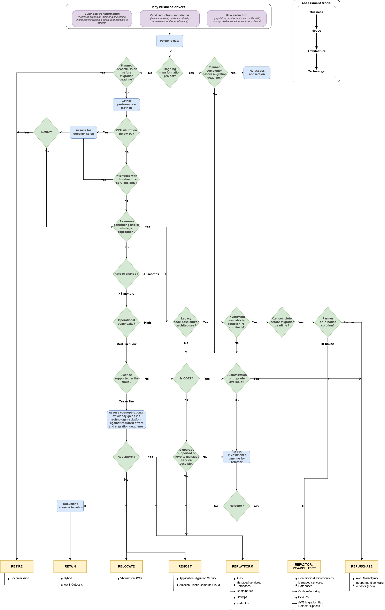

<!-- START doctoc generated TOC please keep comment here to allow auto update -->
<!-- DON'T EDIT THIS SECTION, INSTEAD RE-RUN doctoc TO UPDATE -->
**Table of Contents**

- [AWS migration strategies](#aws-migration-strategies)
  - [7 Rs:](#a-name7rsa7-rs)
  - [Important information](#a-nameimportantaimportant-information)
  - [1. Retire](#a-nameretirea1-retire)
  - [2. Retain](#a-nameretaina2-retain)
  - [3. Rehost](#a-namerehosta3-rehost)
  - [4. Relocate](#a-namerelocatea4-relocate)
  - [5. Repurchase](#a-namerepurchasea5-repurchase)
  - [6. Replatform](#a-namereplatforma6-replatform)
  - [7. Refactor or re-architect](#a-namerefactora7-refactor-or-re-architect)

<!-- END doctoc generated TOC please keep comment here to allow auto update -->

# AWS migration strategies
Link to source: <a href=https://docs.aws.amazon.com/prescriptive-guidance/latest/large-migration-guide/migration-strategies.html target="_blank" rel="noopener">AWS migration strategies</a>

 

A migration strategy is the approach used to migrate a workload into the AWS Cloud.  
There are seven migration strategies for moving applications to the cloud, known as the 7 Rs.

 

## 7 Rs:
* [Retire](#retire)
* [Retain](#retain)
* [Rehost](#rehost)
* [Relocate](#relocate)
* [Repurchase](#repurchase)
* [Replatform](#replatform)
* [Refactor](#refactor) or re-architect

 

## Important information
* Zombie applications: average CPU and memory usage below 5 %
* Idle applications: average CPU and memory usage between 5 and 20 % over a period of 90 days
* Cloud optimization can save time and money
* Advantages to on-premises:
  - accessibility from anywhere
  - no infrastructure to maintain
  - pay-as-you-go pricing models
* Common strategies for large migrations include rehost, replatform, relocate, and retire.  
  Refactor is not recommended for large migrations because it involves modernizing the application during the migration.

 

## 1. Retire
* For decommissioning or archiving applications
* Use cases:
  - no business value in retaining or moving to cloud
  - eliminate costs
  - reduce security risks
  - zombie or idle applications (low performance)
  - no inbound connection for the last 90 days

 

## 2. Retain
* For keeping in source environment, not ready to migrate
* Use cases:
  - remain in compliance with data residency requirements
  - high risk
  - dependencies / migrate other apps first
  - recent upgrade --> postpone migration
  - no business value
  - plans to migrate to (and having to wait for) SaaS (vendor-based apps)
  - unresolved physical dependencies (e.g. hardware that does not have a cloud equivalent)
  - mainframe, mid-range or non-x86 Unix apps
  - performance (e.g. keep zombie or idle apps)

 

## 3. Rehost
* **Lift and shift**  
  --> move apps from source environment/on-premises to AWS cloud without changes
* Possible to migrate a large number of machines from multiple source platforms (physical, virtual, cloud)
* Helps to scale apps
* Apps are easier to optimize or re-architect
* Automate rehosting with:
  - AWS Application Migration Service
  - AWS Cloud Migration Factory Solution
  - VM Import/Export
* app continues to serve users while the workloads are being migrated, which minimizes disruption and downtime. Downtime depends on cutover strategy.

 

## 4. Relocate
* Transfer a large number of servers from on-premises to cloud
* Move instances or objects to a different virtual private cloud (VPC), AWS region or account
* Quickest way to migrate - no impact on overall architecture of app
* app continues to serve users, which minimizes disruption and downtime

 

## 5. Repurchase
* **Drop and shop**  
  --> replace app with different version or product
* Use cases:
  - moving from traditional license to SaaS (no managing and maintaining infrastructure + reduce licensing issues)
  - version upgrades or third-party equivalents
  - replacing a custom-app

 

## 6. Replatform
* **lift, tinker, and shift**  
  or: **lift and reshape**  
  --> move app to cloud with some optimization  
  --> for operating app efficiently, reduce costs, use cloud capabilities
* Keeps legacy apps running
* Reduces costs + improves performance by migrating to a managed or serverless service, moving VMs to containers + avoiding licensing expenses
* Use cases:
  - save time and reduces costs
  - improve security and compliance stance - upgrade OS (use End-of-Support Migration Program (EMP) for Windows Server)
  - reduce costs (use AWS Gravion Processors; move from Windows to Linux using Porting Assistant for .NET)
  - improve performance by migrating VMs into containers (use AWS App2Container migration tool)

 

## 7. Refactor or re-architect
* Move app to cloud + modify its architecture, improve agility, performance + scalability
* The most complex of the migration strategies  
  It can be complicated to manage for a large number of applications  
  --> Not recommended for large migrations because it involves modernizing the application during the migration
* Use cases:
  - legacy mainframe app has limitations or is expensive to maintain
  - monolith app
  - nobody knows how to maintain legacy app or cource code is unavailable
  - app is difficult to test
  - security and compliance: when moving a database to the cloud, maybe need to extract some tables with sensitive data and retain those tables on premises

 

