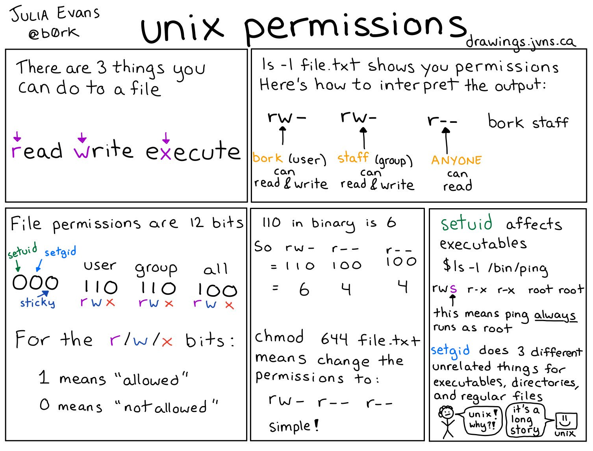

# BASH COMMANDS

A shell is a computer program that takes commands, interprets them, and passes them to the operating system to process. So, it’s an interface between the user and the operating system, through which a user can interact with the computer.  
Bash = Bourne Again Shell. Bash is a superset of `sh`. It's a command language processor and a shell.


## BASIC COMMANDS

### Search command history

`Ctrl+R`

### Rerun last command

`!!`, e.g. `sudo !!`

### Fix last command

`fc`

### Find out which binary is being used

`which <command>`, e.g. `which ls`

### Beginning of line

`Ctrl+a`

### End of line

`Ctrl+e`

### Clear screen

`Ctrl+l`

### Suspend running program

`Ctrl+z`

### Start suspended program in background

`bg`

### Bring suspended/backgrounded program to the foreground

`fg`

### Run file

`bash <script>` or  
`./<script>`

### `source`

`source <script>` is a Bash shell built-in command that executes the content of the file passed as an argument in the current shell. It has a synonym in `. <script>` (`. <script>` == `source script`).

Note: `./` and `source` are not quite the same (`./<script>`!= `. <script>`). `./<script>` runs the script as an executable file, launching a new shell to run it.
`source <script>` reads and executes commands from the file in the current shell environment.

### Find out type

`type ...`, e.g. `type time`, `type ping`  
Some commands are 'builtins': functions inside the bash program, e.g. `type`, `alias`, `read`, `source`, `declare`, `printf`, `echo`, `cd`

## DIRECTORIES

### Create directory

`mkdir <name>`

### Delete directory

`rmdir <name>`

## FILES

### List files in temporary folder

`ls /tmp`

### Edit file

`nano <file>`

### Create file

`touch <file>`  
`touch file-$(date -I).txt` // file-2024-07-15.txt

### File permissions

- r = read  
  w = write  
  x = execute
- bork = user  
  staff = group  
  anyone
- File permissions are 12 bits  
  0 = not allowed  
  1 = allowed
- 0 = 000 = ---  
  1 = 001 = --x  
  2 = 010 = -w-  
  3 = 011 = -wx  
  4 = 100 = r--  
  5 = 101 = r-x  
  6 = 110 = rw-  
  7 = 111 = rwx



## Scripting in general

### Make script executable

`chmod +x <script>`  
To execute script after that: `<script>`

### Make script-dir executable (Linux)

Just do this once: `nano ~/.bashrc`  
Add at the very end: `export PATH="$HOME/<path_to_script_dir>:$PATH"`  
Then: `source ~/.bashrc)`

### Shebang (1st line in script)

`#!/bin/bash`  
POSIX is a family of standards defined by IEEE for vendors to make operating systems compatible.. Thus, it helps us develop cross-platform software for multiple operating systems by following a set of guidelines. On most Linux systems, sh is a symlink to the actual implementation of Bourne Shell. The script will be executed by whatever the `#!/bin/bash` line points to

### `set`

The `set` command enables options within the script.  
`set -o posix`  
Runs the script in POSIX mode.

## Commands
* `pwd`: print working directory, write path
* Move in directory: `pushd`
* Move out of directory: `popd`

    

## VARIABLES / ARGUMENTS

Shell scripts have 2 kind of variables:

1. environment variables
2. shell variables

You access both of these in the very same way: `$VAR`

Always quote variables! `"$1"`

### Print all variables

`env`

### Set environment variable

`export ANIMAL=panda`  
Child processes inherit environment variables (this is why the variables set in your `.bashrc` work in all programs you start from your terminal).  
You can set environment variables when starting a program: `env VAR=panda ./myprogram`

### Set shell variable

`ANIMAL=panda`  
Shell variables aren't inherited.

### Turn a shell variable into an environment variable

```
ANIMAL=panda
export ANIMAL
```

### User input

`read -p "Enter a number: " number`

### Running a script with arguments

`./script.sh panda banana`  
--> `$1` in script is `panda`, `$2` is `banana`

### Get all arguments

`${@}`, e.g. `ls --color "${@}"`

### Loop over all arguments

```bash
for i in "${@}"  // or: ${name_of_array[@]}
do
  <something>
done`
```

### Print date:

`$(date)` // Mo, 15. Jul 2024 17:37:53  
`$(date -I)` // 2024-07-15


## DATA TYPES

### Array

`name_of_array=(item1 item2 item3)`


## WORK WITH TEXT

### Wordcount
` | wc`

### Replace text in file

`sed -i 's/<origin_text>/<new_text>/g' <path_to_file>`  
e.g. `sed -i 's/World/Andy/g' ./hello.txt` // replace `World` with `Andy`

### if-else

```
if <statement>; then
    <something>
else
    <something-else>
fi
```

Statement in `[]` or `[[]]` evaluates to true (= 1) or false (= 0).

## LOOPS

### For loops

```
for i in *.png
do
    convert $i $i.jpg
done
```

### `{}`

e.g. `convert file.{jpg, png}` expands to `convert file.jpg file png`  
`{1..5}` expands to `1 2 3 4 5`

### While loops

```bash
while true; do
  <do_stuff>
done
```

## PROCESSES

### Process substitution (alternative to pipes)

`<(COMMAND)`, e.g. `diff <(ls) <(ls -a)`

### Kill

`kill -SIGNAL PID`, `SIGNAL` is name or number, e.g. `kill -7`  
`pgrep` prints PIDs of matching running programs.  
`pgrep fire` matches `firefox` and `firebird`, but not `bash firefox.sh`  
To search the whole command line (e.g. `bash firefox.sh`) use `pgrep -f`

### killall

`killall -SIGNAL NAME`, e.g. `killall firefox`  
flag `-w` waits for all signaled processes to die.  
flag `-i` ask before signalling.  
`pkill`, e.g. `pkill -f firefox`

## BRACKETS

### Run command in subshell

`(cd ~/-music; pwd)`

### Group commands (runs in same process)

`{cd ~/-music; pwd; }`

### Arithmetic

`x=$((2+2))`

### Evaluate statements

`if [ ... ]`  
`if [[ ... ]]` (is bash syntax, is more powerful than `[]`)

### Brace expansion

`a{.png, .svg}` --> expands to `a.png a.svg`

## Arithmetics

### Calculator
`bc -l`

### Calculate

Use double brackets: `x=$((2+2))`

### Remainder

`% <number>`

### even-odd

```
if (( number % 2 == 0 )); then
echo "${number} is even"
else
    echo "${number} is odd"
fi
```

## Debugging

### Print every line of script (2nd line in script)

`set -x`  
`bash -x <script>` does the same when running the script

### Stop before every line

`trap read DEBUG` (put this before the line(s) you want to debug)

### Confirm every line before it runs

Put this at beginning of script:  
`trap '(read -p "[$BASH_SOURCE:$LINENO] $BASH_COMMAND")' DEBUG`  
`read -p`: prints a message, press `Enter` to continue  
`$BASH_SOURCE`: script filename  
`$LINENO`: line number  
`$BASH_COMMAND`: next command to run

### Print better error messages

```
die() {               // definition of die()-function
    echo $1 >&2       // print first argument
                      // >&2 redirects output to standard error (stderr) instead of the standard output (stdout)
    exit 1            // terminates script immediately with exit status 1
}

if [ ! -f "/some/important/file" ]; then
    die "Error: The important file is missing!"
fi
```

## OTHER USEFUL STUFF

### Alias

Set up shorthand commands with `alias`: `alias gc="git commit"` in `~/.bashrc` (runs when bash starts).

### Source

`bash script.sh` runs `script.sh` in a subprocess, so you can't use its variables and functions.  
`source script.sh` is like pasting the contents of `script.sh`.

## Specific examples

### Prompt for yes or no:
```bash
function yes_or_no {
  while true; do
    read -p "$* [y/n]: " yn
    case $yn in
      [Yy]*) return 0  ;;
      [Nn]*) echo "Aborted" ; return  1 ;;
    esac
  done
}
```

### Compare 2 files:
```bash
if cmp --silent ${USECASE_PURPOSE_MAPPING_JSON_FILE_NAME} ~/erd-uc-purpose-dist/${USECASE_PURPOSE_MAPPING_JSON_FILE_NAME}
```
If the files are identical --> status `0`  
If the files are different --> status `1`
