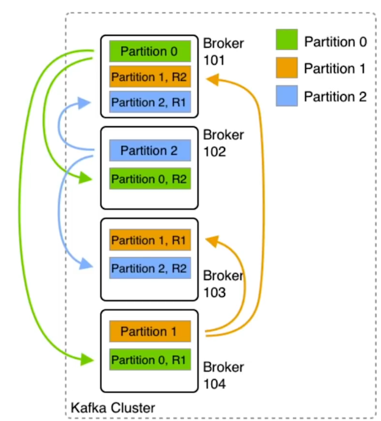
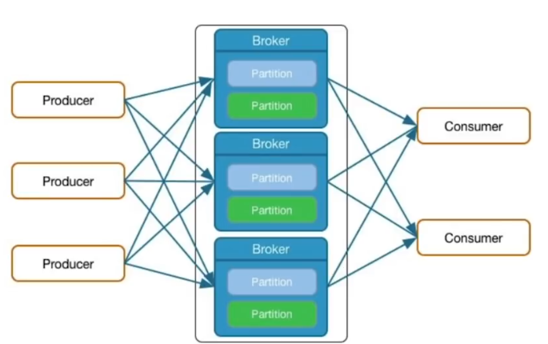
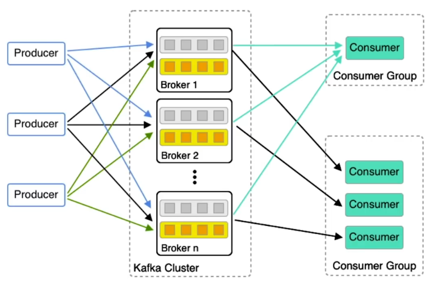
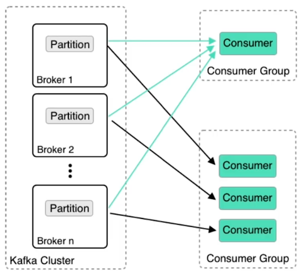
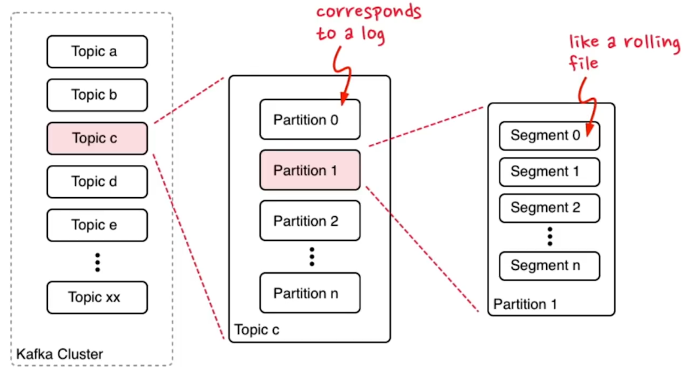
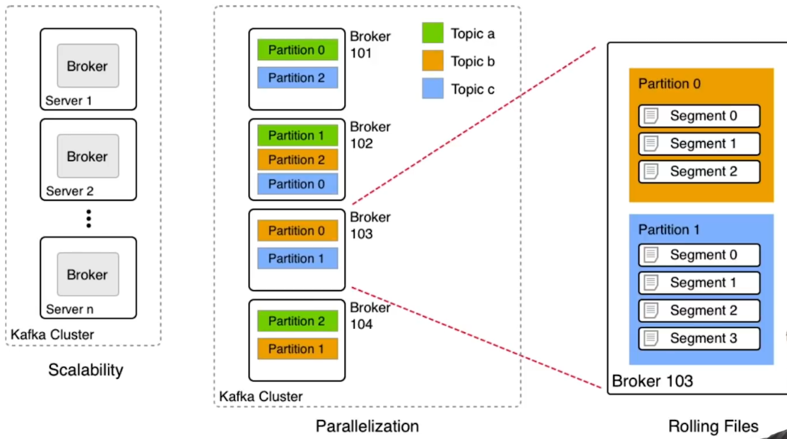
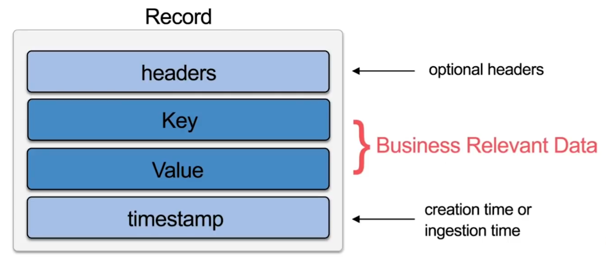

# Kafka

## Cluster

- A Kafka Cluster is made up of Brokers.
- To get data/events into a Kafka Cluster you need a Producer (app that needs to be written).

## Brokers

- A Broker can be compared to an individual server. There is a Kafka process running on each one, each has its own disks / local storage. They network together.
- Basic function: manage Partitions. Each Broker handles many Partitions. Manage log files, takes inputs from Producers, update Partitions, takes requests from Consumers, writes them out.

## Producers

- Producers write data as messages
- Can be written in any language (native: Java)
- Use a partitioning strategy to assign each message to a Partition. Two purposes:
  - Load balancing
  - Semantic partitioning
- Partitioning strategy specified by Producer:
  - Default strategy: hash(key) % number_of_partitions
  - No key: Round Robin
  - Possible to write custom Partitioner

## Producers & Consumers

- Producers and Consumers are decoupled from each other.
- Data is produced to a Topic. It is not produced for a Consumer.
- Slow Consumers do not affect Producers.
- Adding Consumers does not affect Producers

## Consumers

- Reading data is done with a Consumer.  
  They do not destroy --> multiple Consumers can read from the same Topic
- Pull messages from 1...n Topics. New inflowing messages are automatically retrieved.
- Consumer offset
  - keeps track of the last message read
  - is stored in special Topic (CONSUMER OFFSET)
- Every Consumer is a Consumer Group --> I can add additional instances of a Consumer
- Failure of Consumers does not affect system.

## Topics

- Stream of related messages in Kafka / sequence
  - Logical representation
  - Categorizes messages intro Groups
- In the stream are events
- Developers define Topics
- Producer <--> Topic: N to N relation
- Unlimited number of topics
- Is broken into pieces: Partitions
  Messages of Topic spread across Partitions
- Can have multiple Consumers

## Partitions

- Is like a log
- Spread across Brokers
- Topic is broken into partitions, and those partitions are allocated to different Brokers in the Cluster --> That's how Kafka scales
- Messages are always put at the end of the Partition, there is a clear order
- Is represented by multiple log Segments (= individual files on disk of that Broker)
- Each partition has replicas (3 is typical), one is the "leader", the others are the "followers"

## Structure of a Kafka message

- Kafka data model for every message:
  - Key
  - Value
- Timestamp
- (optional): Headers (String key-value pairs) (metadata)

