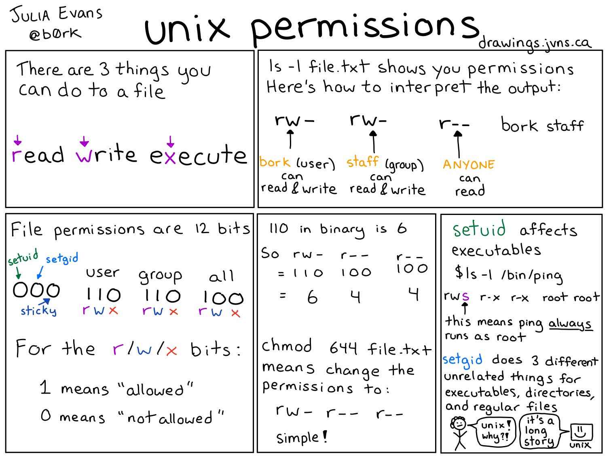

# CLI Commands

## BASIC COMMANDS

### Search command history

`Ctrl+R`

### Rerun last command

`!!`, e.g. `sudo !!`

### Fix last command

`fc`

### Find out type

`type ...`, e.g. `type time`, `type ping`  
Some commands are 'builtins': funcions inside the bash program, e.g. `type`, `alias`, `read`, `source`, `declare`, `printf`, `echo`, `cd`

### Find out which binary is being used

`which <command>`, e.g. `which ls`

### Beginning of line

`Ctrl+a`

### End of line

`Ctrl+e`

### Clear screen

`Ctrl+l`

### Suspend running program

`Ctrl+z`

### Start suspended program in background

`bg`

### Bring suspended/backgrounded program to the foreground

`fg`

## NAVIGATING

### Change to last dir

`cd -`

## DIRECTORIES

### Create directory

`mkdir <name>`

### Delete directory

`rmdir <name>`

## FILES

### Create file

`touch <file>`  
`touch file-$(date -I).txt` // file-2024-07-15.txt

## PERMISSIONS

### File permissions

- r = read  
  w = write  
  x = execute
- bork = user  
  staff = group  
  anyone
- File permissions are 12 bits  
  0 = not allowed  
  1 = allowed
- 0 = 000 = ---  
  1 = 001 = --x  
  2 = 010 = -w-  
  3 = 011 = -wx  
  4 = 100 = r--  
  5 = 101 = r-x  
  6 = 110 = rw-  
  7 = 111 = rwx

